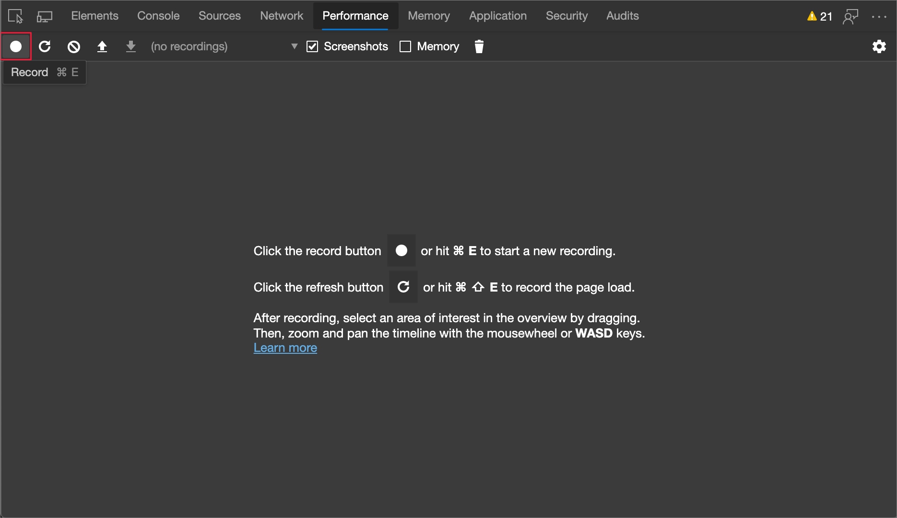

# Unminify performance profiles

To see more meaningful original function names in the call stack profile in the **Performance** tool, instead of the transformed and minified function names, use the **Unminify** button.

The minified call stack in the performance profile, with hard-to-read function names:


The unminified call stack in the performance profile, with some more meaningful function names restored:


When recording a performance profile in the **Performance** tool, the **Main** section of the profile displays detailed call stacks of JavaScript functions that were called during the recording.  

Ideally, in this call stack view, you want to see the meaningful function names that are shown in your original source code.  However, if your production code is compiled, minified, or bundled, the **Performance** tool initially displays the function names that are extracted from your transformed, _production_ code.  These production function names might be obscure and might not easily map to function names in your original source code.

<!-- todo: review all mentions of "source mapping" in this article - what is the relation between these 3 features/technologies?
*  source mapping and its UX/benefits
*  unminification and its UX/benefits
*  ADO secure server (for source maps) and its UX/benefits
-->
Source mapping is used in DevTools to keep your client-side code readable and debuggable.  By clicking the **Unminify** button in the Performance tool, you can use source maps to create an unminified version of the performance profile you recorded.


<!-- ====================================================================== -->
## How to unminify a performance profile

To unminify a performance profile, so that some more meaningful function names are shown in addition to the minified identifiers:

   **Set up source maps:**

1. Set up source maps, to host your source maps side-by-side with your production code.  (Or, if you are just trying out this feature, you can go to a browser-based Outlook mailbox: `https://outlook.office.com`, because this web app produces minified function names on the call stack.)  Host your source maps as well as your production code, where the **Performance** tool can find your source maps.<!-- Can you use ado server for secure hosting of source maps?-->  For details, see [Map the processed code to your original source code, for debugging](/microsoft-edge/devtools-guide-chromium/javascript/source-maps).

   In the following example, the source maps are served from the same server directory as the production code:

   
<!-- this was the best way I could come up with to describe the folder structure. https://docs.microsoft.com/en-us/dotnet/core/porting/project-structure is an example that went in a different direction but if you like it, please replace this image with a diagram -->

   <!-- a text-based format that could replace the Sources > Page tab screenshot:
   ```
   hooks.ts
   index.js
   index.ts
   isLoki
   ```
   -->

   **Record a performance profile:**

1. In the **Performance** tool, click the **Record* button, to record a performance profile for the page you want to analyze.  (If you are just quickly trying out the feature, you can record a performance profile while you scroll through a couple of emails and click them at your inbox at the Outlook web app.)  For details, see [Record runtime performance](/microsoft-edge/devtools-guide-chromium/evaluate-performance/reference).

   

   A performance profile is recorded, in the **Performance** tool.

1. In the **Performance** tool, click in the main area (the call stack), and use the mouse wheel to zoom in.  Click and drag left and right.  Look at the function names in the call stack.  Select a small section of the profile and look at the call stack.  Note the timestamp, such as 1380ms-1400ms.

   The minified call stack in the **Performance** tool shows function names as **b**, **O**, **Xt**, **bn**, **n**, **i**, or **Yn**.

   

   **Unminify the code:**

1. Click the **Unminify** button:
   

   In DevTools, a popup briefly appears, reading: **Status: creating unminfied file**.  Then the **Save As** dialog box opens.  The default filename is a pattern starting with date and time like `yymmddThhmmss`, such as: `Profile-20220307T164948-unminified.json`.  The default directory is the **Downloads** directory.

1. Select a filename and directory and then click the **Save** button.

   The **Performance** tool creates an unminified version of the recorded performance profile.  In the unminified version of the performance profile, some of the minified function names in the call stack are prepended by more meaningful function names from your source maps, where possible.  Some of the minified production function names might not be decorated with more meaningful, source-mapped names.

1. In the **Performance** tool, click the **Load profile** () icon button.  Or, right-click a blank area of the **Performance** tool, and then select **Load profile**.

1.  In the **Open** dialog box, select the unminified performance profile `.json` file that you just downloaded.  If needed, for details, see [Load a recording](/microsoft-edge/devtools-guide-chromium/evaluate-performance/reference#load-a-recording) in _Performance features reference_, and then continue below.

   

1. Select the same section of the profile you looked at in the first image, such as 1380ms-1400ms.

   Some function names are now unminified.  The unminified call stack in the **Performance** tool now shows those functions labeled with meaningful names: **invokeFunc (b)**, **executeAction (O)**, **endBatch (Xt)**, **runReactions (bn)**, or **finalDispatch (i)**.  For example, compare the minified call stack and the unminified call stack of a recorded performance profile in the following images.  Some of the production function names have been replaced with (prepended by) source-mapped function names:

   


<!-- ====================================================================== -->
## See also

* [Get started analyzing runtime performance](index.md) - An introduction to analyzing runtime performance in DevTools.
* [Performance features reference](reference.md), - A reference for many of the features offered in the Performance tool.
