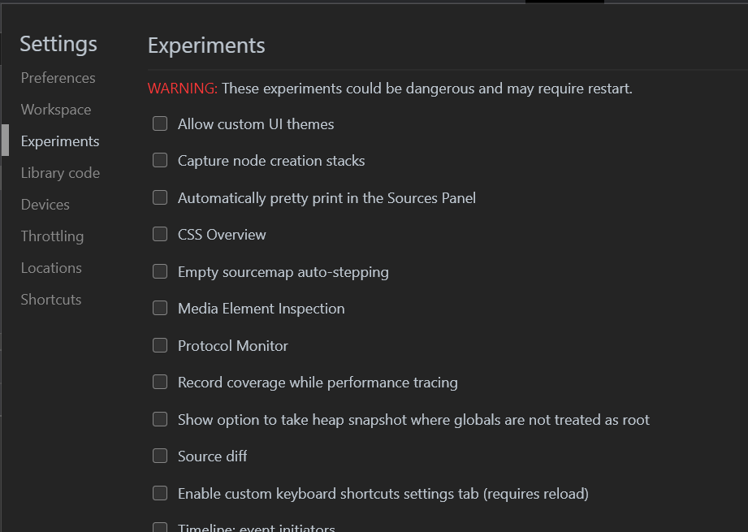

# Experimental features

The Edge DevTools periodically offers experimental features that are released while still in development. By enabling an experiment, you are able to test and provide early feedback on these features before they are released broadly.

Experiments are available in all channels of Edge. Use the Edge Canary channel to get the very latest experiments.

## How to enable experiments

To enable an experiment, open DevTools by pressing `Control+Shift+I` (Windows) or `Command+Option+I` (macOS). Then, open Settings by clicking the gear icon at the top right of DevTools or by pressing `F1`.

On the left side of the Settings panel, there is a tab called "Experiments." Click this tab to see all available experiments. Select the checkboxes next to experiments you would like to try, then close and reopen the DevTools.

Note that some experimental features are unstable and may cause performance issues. You can remove an experiment by unchecking the box next to that experiment and reloading the DevTools as before.

## Current experimental features

The following sections outline some of the experimental features available in Edge now.

### CSS grid debugging: Edge 85+

### Move tools between top and bottom panels: Edge 85+

### webhint: Edge 84+