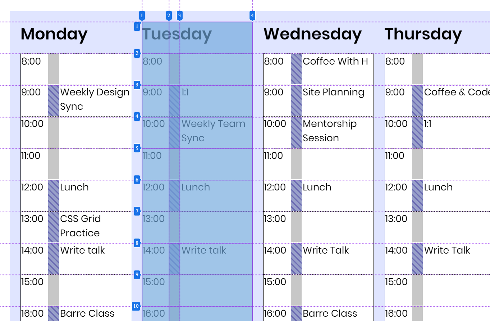

# Experimental features

The Edge DevTools periodically offers experimental features that are released while still in development. By enabling an experiment, you are able to test and [provide early feedback]() on these features before they are released broadly.

Experiments are available in all channels of Edge. Use the Edge Canary channel to get the very latest experiments.

## How to enable experiments

To enable an experiment, open DevTools by pressing `Control+Shift+I` (Windows) or `Command+Option+I` (macOS). Then, open Settings by clicking the gear icon at the top right of DevTools or by pressing `F1`.

On the left side of the Settings panel, there is a tab called "Experiments." Click this tab to see all available experiments. Select the checkboxes next to experiments you would like to try, then close and reopen the DevTools.

Note that some experimental features are works in progress and may cause performance issues. You can remove an experiment by unchecking the box next to that experiment and reloading the DevTools as before.

## Current experimental features

The following sections outline some of the experimental features available in Edge now.

### "Enable new CSS grid debugging features"

This feature offers improved on-page visualizations for websites using CSS grid layouts.

This experiment is available in Edge 85 and later.

### "Enable support to move tabs between panels"

Normally, tools such as Elements and Network can only be open in the main (top) panel of DevTools. Likewise, tools such as 3D View and Issues can only be open in the drawer (bottom) panel of DevTools. However, when this experiment is enabled, you are able to move tools between the top and bottoms panels by right-clicking the tab and choosing "Move to top" or "Move to bottom." This allows you to better customize your DevTools layout.

The bottom panel can be hidden and shown by pressing ``Ctrl + ` ``.

This experiment is available in Edge 85 and later.

### "Enable webhint"

[webhint](https://webhint.io) is an open-source tool that surfaces real-time feedback on a website's accessibility, cross-browser compatibility, security, performance, PWAs, and other common web development issues. Enabling this experiment brings webhint feedback directly into DevTools via the [Issues panel](./Issues).

Click the issue to see documentation on how to fix the issue as well as a list of affected resources. Clicking on a resource link will open the relevant Network, Sources, or Elements pane in DevTools. 

This experiment is available in Edge 85 and later.

## Previous experimental features

 - [3D View](3D View), now on by default as of Edge 83.

## Providing feedback on experimental features

To provide feedback on Edge DevTools experiments, or anything else related to DevTools:

  - Send your feedback using the Feedback icon in the DevTools
  - Tweet at [@EdgeDevTools](https://www.twitter.com/EdgeDevTools)
