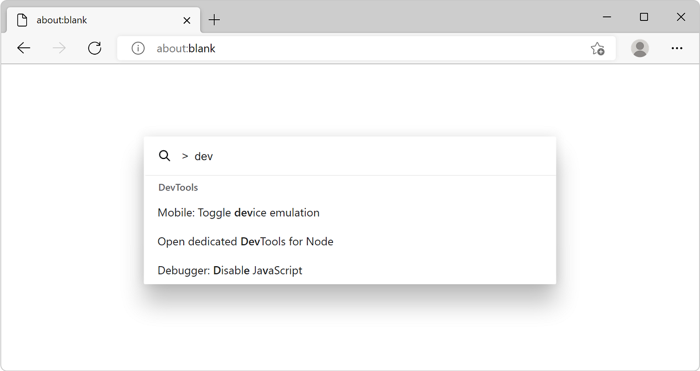
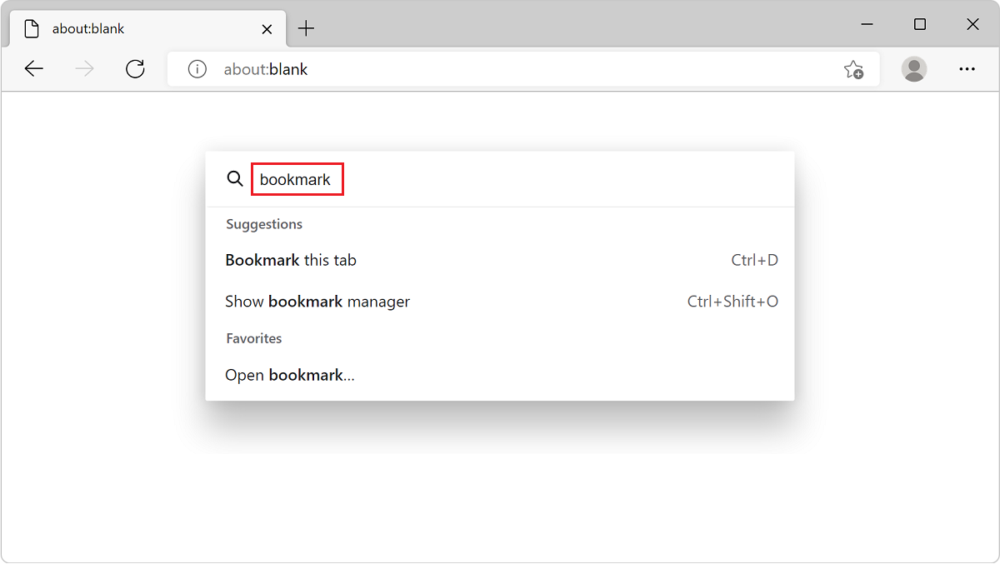

# Run commands via keyboard with Command Palette

Use Command Palette to quickly access various Microsoft Edge browser commands and DevTools commands from the keyboard.

Using Command Palette, you can directly access productivity and developer features that normally require clicking through several menus or using a series of keyboard shortcuts.

<!-- ====================================================================== -->
## Enable Command Palette

By default, Command Palette isn't enabled. To enable the Command Palette experiment:

1. In Microsoft Edge, go to `edge://version`, and make sure you're using Microsoft Edge 105 or later.  To get the latest preview channels of Microsoft Edge, see [Microsoft Edge Insider Channels](https://www.microsoftedgeinsider.com/en-us/download/).

1. Go to `edge://flags`.

1. In the **Search flags** text field, type **Command Palette**.

1. In the **Command Palette** dropdown menu, select **Enabled**.

1. Click the **Restart** button which appears in the lower right:

   

The flags page for Microsoft Edge 108 or later shows the shortcut `Ctrl+Q`.  Versions 105 through most versions of 107 show `Ctrl`+`Shift`+`Space` instead.

<!-- ====================================================================== -->
## Open Command Palette

Command Palette provides access to Microsoft Edge commands, including various DevTools commands. This means you can use DevTools features without having to open DevTools first.

To open Command Palette:

1. In Microsoft Edge 108 or later, press `Ctrl`+`Q`.  Or, in Microsoft Edge 105-107, press `Ctrl`+`Shift`+`Space`. Command Palette opens.

1. Start typing in the input box. For example:
   * Type **tabs** to display commands about tabs management.
   * Type **bookmark** to display commands about bookmarks (shown below).
   * Press `>` to list the available DevTools commands.

   

1. Press `Down Arrow` or `Up Arrow` to select a command, or use the mouse wheel, and then press `Enter`.

Examples of several useful commands are shown below.

<!-- ====================================================================== -->
## Open the Device Emulation tool

Use the DevTools [**Device Emulation**](../device-mode/index.md) tool to approximate how your page looks and responds on a mobile device.

To open the DevTools Device Emulation tool by using Command Palette:

1. In Microsoft Edge 108 or later, press `Ctrl`+`Q`. Or, in Microsoft Edge 105-107, press `Ctrl`+`Shift`+`Space`. Command Palette opens.

1. Press `>`.

1. Type **device**, press `Down Arrow` to select **Mobile: Toggle device emulation**, and then press `Enter`.

<!-- ====================================================================== -->
## Create and access snippets

The DevTools [**Snippets**](../javascript/snippets.md) tool allows you to save JavaScript code and execute it on any webpage. If you run the same code repeatedly on webpages, create a snippet for that code, and then use Command Palette to quickly access your code snippet.

To open the DevTools **Snippets** tab by using Command Palette:

1. In Microsoft Edge 108 or later, press `Ctrl`+`Q`. Or, in Microsoft Edge 105-107, press `Ctrl`+`Shift`+`Space`. Command Palette opens.

1. Press `>`.

1. Type **snippets**, press `Down Arrow` to select **Sources: Show Snippets**, and then press `Enter`.

<!-- ====================================================================== -->
## Manage browser tabs

Many useful tab-related commands are available in Command Palette, such as:
*  **Bookmark all tabs**
*  **Move tab forward**
*  **Open recently closed tab**
*  **Search tabs**

1. In Microsoft Edge 108 or later, press `Ctrl`+`Q`. Or, in Microsoft Edge 105-107, press `Ctrl`+`Shift`+`Space`. Command Palette opens.

1. Type the word **tab**, press `Down Arrow` or `Up Arrow` to select a command, and then press `Enter`.

<!-- ====================================================================== -->
## Provide feedback

The Microsoft Edge DevTools team welcomes your feedback about this feature.  If you noticed a bug with Command Palette or have an idea for improving it, please add a comment at: [Feedback for the Command Palette experiment](https://github.com/MicrosoftEdge/DevTools/issues/73).
