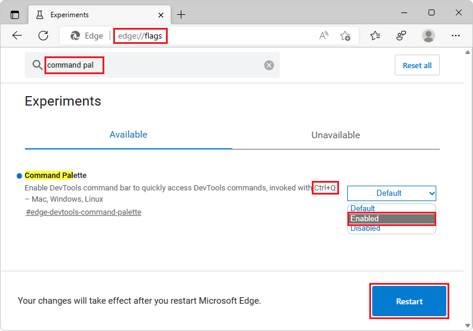

# Streamline your workflows with Edge Command Palette

Edge Command Palette is a Microsoft Edge experiment that makes it possible to access helpful browser and DevTools commands from the keyboard.

Using Edge Command Palette, it is easy to access productivity and developer features that normally require clicking through several menus or learning multiple keyboard shortcuts.

<!-- ====================================================================== -->
## Enable Edge Command Palette

Edge Command Palette is not enabled in Microsoft Edge by default. To enable Edge Command Palette:

1. In Microsoft Edge, go to `edge://version`, and make sure you're using Microsoft Edge 105 or later.  If you want to get the latest preview channels of Microsoft Edge, see [Microsoft Edge Insider Channels](https://www.microsoftedgeinsider.com/en-us/download/).

1. In Microsoft Edge, go to `edge://flags`.

<!-- DevTools Toaster is in the process of being changed in Edge to match the feature's name -->
1. Type "DevTools Toaster" in the **Search flags** text field.

1. Click the **Default** button, and then select **Enabled**:

   

1. Click the **Restart** button.

<!-- ====================================================================== -->
## Open Edge Command Palette

To open Edge Command Palette:

1. In Microsoft Edge, press `Ctrl`+`Shift`+`Space`.

1. Start typing in the input box. For example, type **tabs** to display commands about tabs management, or type **bookmark** to display commands about bookmarks.

1. Press the Up or Down arrow keys to select the command you want to execute, and then press `Enter`.

Edge Command Palette also provides access to several DevTools commands. This means you can use DevTools features without having to open DevTools first.

To list all DevTools commands that are available in Edge Command Palette, press `>`.

Examples of several useful commands are below.

<!-- ====================================================================== -->
## Enable the Device Emulation tool

Use the DevTools [**Device Emulation**](../device-mode/index.md) tool to approximate how your page looks and responds on a mobile device:

1. In Microsoft Edge, press `Ctrl`+`Shift`+`Space`.

1. Press `>`.

1. Type **device**, press the Down arrow key to select **Mobile: Toggle device emulation**, and then press `Enter`.

<!-- ====================================================================== -->
## Create and access snippets

The [**Snippets**](../javascript/snippets.md) panel allows you to save JavaScript code and execute it on any webpage. If you run code repeatedly on webpages, create a snippet for it and use Edge Command Palette to access it quickly.

1. In Microsoft Edge, press `Ctrl`+`Shift`+`Space`.

1. Press `>`.

1. Type **snippets**, press the Down arrow key to select **Sources: Shows Snippets**, and then press `Enter`.
  

<!-- ====================================================================== -->
## Manage browser tabs

When using many tabs in Microsoft Edge, several useful tab-related commands are available.

1. In Microsoft Edge, press `Ctrl`+`Shift`+`Space`.

1. Type **tab**, and then use the Down and Up arrow keys to select a tab-related command; for example:
   *  **Open recently closed tab**
   *  **Bookmark all tabs**
   *  **Search tabs**

<!-- ====================================================================== -->
## Provide feedback

<!-- TODO: change the issue number when we have it. -->
The Microsoft Edge DevTools team welcomes your feedback about this feature.  If you noticed a bug with Edge Command Palette or have an idea for improving it, please add a comment at: [Feedback for the Edge Command Palette experiment](https://github.com/MicrosoftEdge/DevTools/issues/73).
