# Simplify DevTools using Focus Mode

Focus Mode is a new user interface for DevTools.  Focus Mode is designed to simplify and streamline the DevTools UI, without compromising its feature set.

Focus Mode replaces the main row of tabs with an **Activity Bar**, which is a compact toolbar with distinctive icons.  The **Activity Bar** makes it possible to pin, rearrange, and open your favorite tools, for quick access.  The **Activity Bar** also provides access to user settings, help, and other features.

Focus Mode also provides a **Quick View** list, to open a second tool alongside the tool that's already selected in the **Activity Bar**.

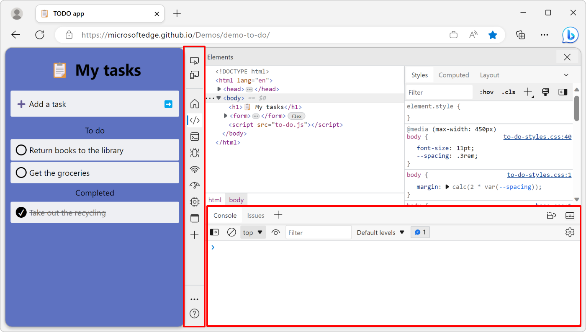

<!-- ====================================================================== -->
## Enable Focus Mode

The Microsoft Edge team is enabling Focus Mode to a subset of users to collect early feedback. Some users will have Focus Mode enabled by default, while others need to enable it first.

To check if you have Focus Mode enabled already, or to enable or disable it:

1. To open DevTools, right-click the webpage, and then select **Inspect**.  Or, press `Ctrl`+`Shift`+`I` (Windows, Linux) or `Command`+`Option`+`I` (macOS).  DevTools opens.

1. Press `F1` to open **Settings**.

1. Click **Experiments** and scroll down to the **Focus Mode** checkbox.

   If the **Focus Mode** checkbox is selected, Focus Mode is already enabled. Select or clear the checkbox to enable or disable Focus Mode:

   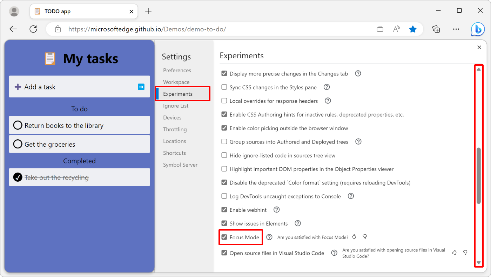

1. Close the **Settings** page. If you changed the Focus Mode experiment state, click the **Reload DevTools** button for the change to take effect.

<!-- ====================================================================== -->
## Main differences from the default user interface

Here are the main differences between the DevTools default user interface and Focus Mode.

### Activity Bar

The **Activity Bar** is the most visible difference from the default user interface. Use it to open tools, help features, and settings.

By default, the position of the **Activity Bar** adapts to the location of the DevTools window:

* If DevTools is undocked or docked to the bottom of the browser, the **Activity Bar** will be horizontal.
* If DevTools is docked to the side of the browser, the **Activity Bar** will be vertical, and tool names will not be visible. This enables quicker tool access when screen width is limited.

The **Activity Bar** left-aligned in Focus Mode, with DevTools docked to the side:

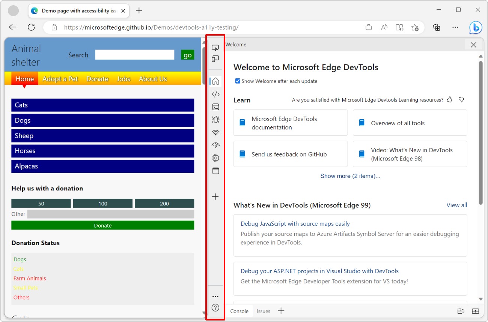

The **Activity Bar** top-aligned in Focus Mode, with DevTools popped out in a separate window:

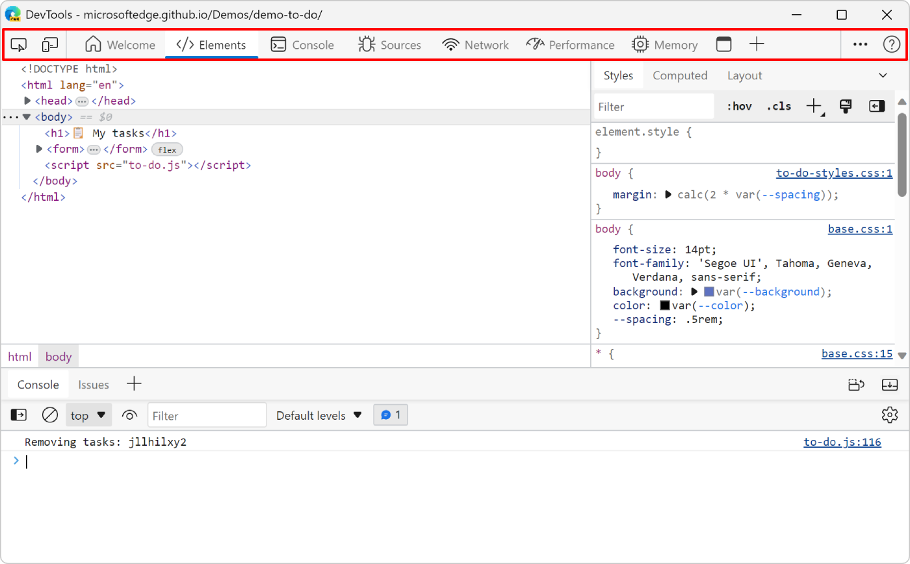

### Warning and error indicators

In the default DevTools user interface, a counter appears in the main toolbar showing the number of messages such as **Issues** recommendations and **Console** warnings. The counter could grow large when many messages ae generated, taking up valuable space in DevTools.

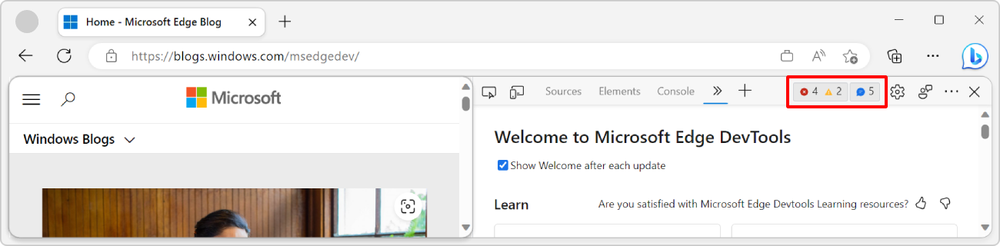

In Focus Mode, this counter has been removed. Instead, small indicators overlay **Issues** and **Console** to display whether messages have been reported by the respective tools:

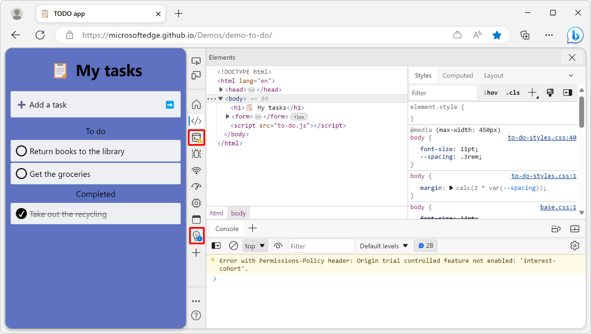

### Quick View

The **Quick View** list contains all tools that can be displayed alongside the one already selected from the **Activity Bar**.

**Quick View** replaces the drawer toolbar from the default user interface:

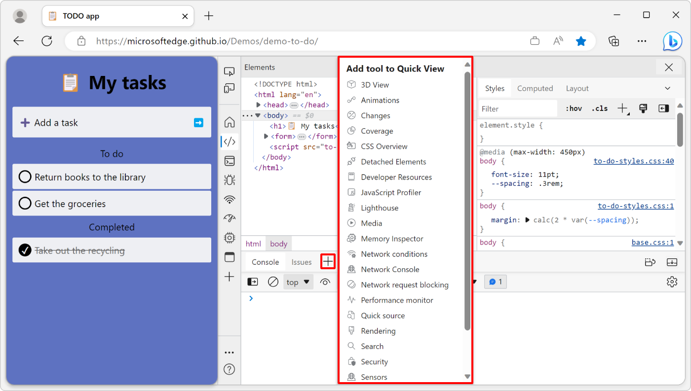

### DevTools customization and settings

Several customization features and the DevTools settings are now grouped together under a single menu available from the **Customize and control DevTools** (**...**) button in the **Activity Bar**. These features and settings appear in multiple locations in the default user interface.

* **Dock location** lets you change the placement of DevTools in the browser window.
* **Activity Bar location** lets you change the placement of the **Activity Bar** within DevTools.
* **Themes** lets you change the color theme.
* **Settings** provides access to the DevTools settings.
* **Keyboard shortcuts** lets you review and change keyboard shortcuts.

### Help links

The **Help** menu contains links to the DevTools documentation and release notes and a button to send feedback to the team:

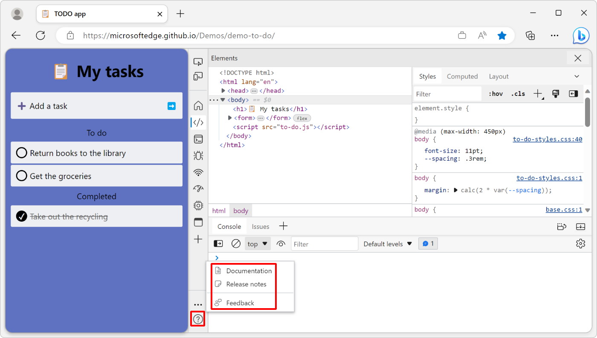

These links and buttons were previously nested under **Customize and control DevTools** > **Help** in the default user interface.

<!-- ====================================================================== -->
## Open tools from the Activity Bar

By default, the **Activity Bar** contains the following modes and tools:

*  **Inspect** mode () toggle button.

*  **Device Emulation** mode () button.

*  **Welcome** tool ().

*  **Elements** tool ().

*  **Console** tool ().

*  **Sources** tool ().

*  **Network** tool ().

*  **Issues** tool ().

*  **Performance** tool ().

*  **Memory** tool ().

*  **Application** tool ().

<!-- ====================================================================== -->
## Pin and rearrange tools in the Activity Bar

You can choose which tools appear in the **Activity Bar** by pinning or unpinning tools. This allows you to customize DevTools to your preferred workflow.

Click **More tools** (**+**) to list all the available tools. Selecting a tool will pin it to the **Activity Bar**. It will be shown by default every time DevTools is opened.

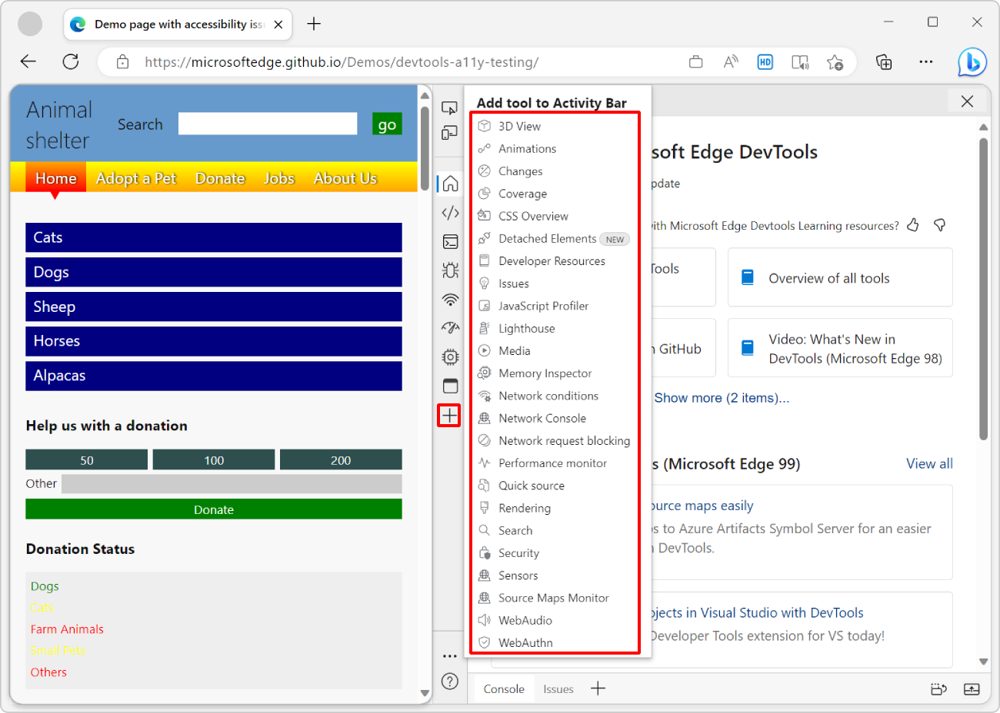

If there isn't enough space in the **Activity Bar** to display all pinned tools, some tools may overflow into the **More tools** menu:

To unpin a tool from the **Activity Bar**, right-click the tool and select **Remove from Activity Bar**:

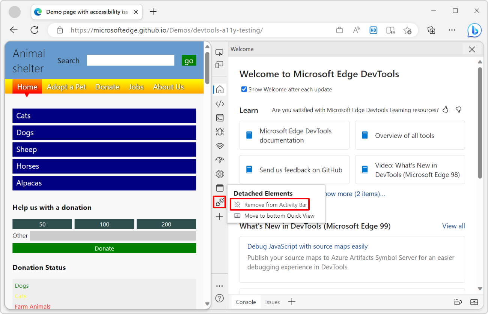

Currently, the following tools cannot be unpinned from the **Activity Bar**:

* **Elements** tool
* **Console** tool
* **Sources** tool

<!-- ====================================================================== -->
## Open tools from Quick View

Use **Quick View** to open a second tool next to the one already selected from the **Activity Bar**:

1. Select a tool from the **Activity Bar**.

1. In the **Quick View** toolbar, click **More tools** (**+**), and then select a different tool from the list.

The following screenshot shows the **Network** tool and the **Console** tool side-by-side:

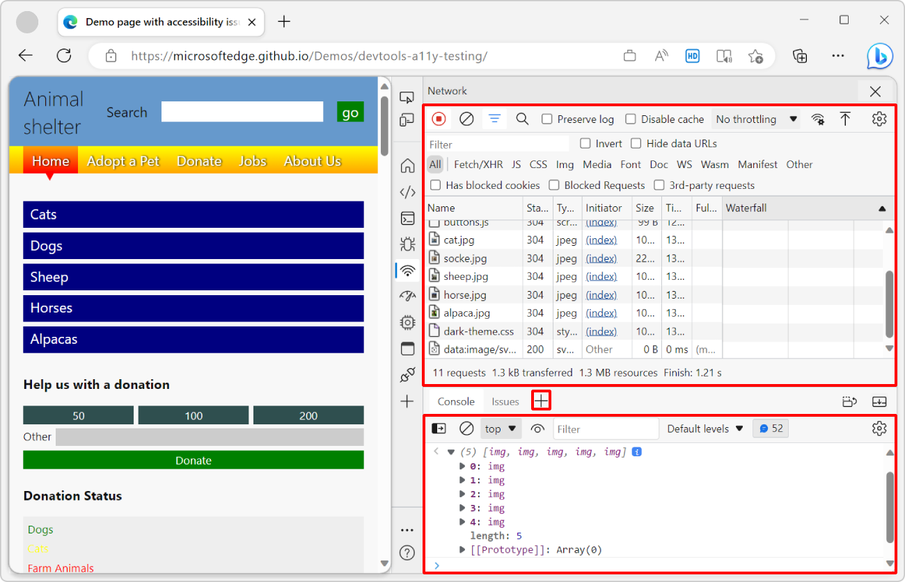

To hide or expand **Quick View**, click **Collapse Quick View** () or **Expand Quick View** (), or press the **Escape** key.

<!-- ====================================================================== -->
## Customize Focus Mode

The **Activity Bar** can be oriented vertically or horizontally to maximize usable screen space in a variety of DevTools window locations.

To change the location of the **Activity Bar**, click **Customize and control DevTools**, then select one of the locations next to **Activity Bar location**:

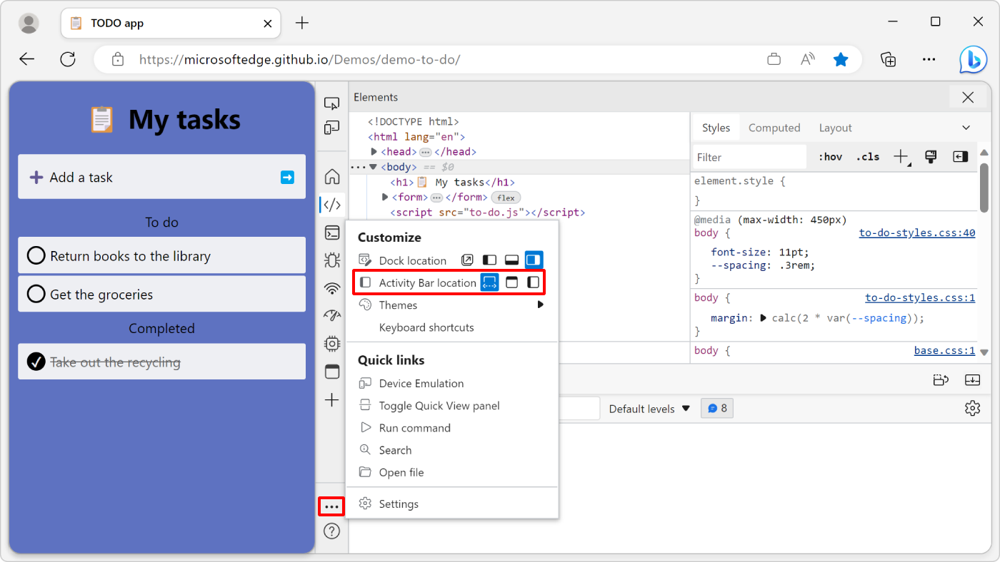

* **Adapt to dock location** (default): The **Activity Bar** will be in a horizontal or vertical orientation depending on where DevTools is docked.

  * If DevTools is docked to the left or right side of the browser window, the **Activity Bar** will be vertical.

  * If DevTools is docked to the bottom side of the browser window, or undocked in its own window, the **Activity Bar** will be horizontal.

* **Top**: The **Activity Bar** will always be horizontal.

* **Left side**: The **Activity Bar** will always be vertical.

When the **Activity Bar** is horizontal, tool names appear next to tool icons if there is enough space to display them.

If there isn't enough space to display all tool names, the horizontal **Activity Bar** shows some tabs with tool icons and names, and some tabs with icons only:

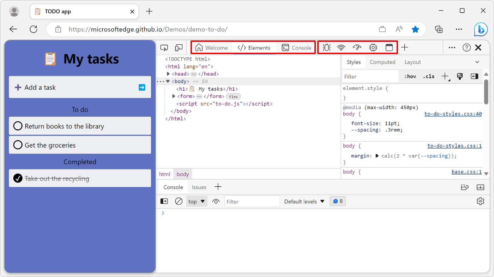

<!-- ====================================================================== -->
## See also

* [DevTools: Focus Mode UI](https://github.com/MicrosoftEdge/DevTools/blob/main/explainers/FocusMode/explainer.md) is the initial explainer for this experimental feature, in the Microsoft Edge DevTools repo.
