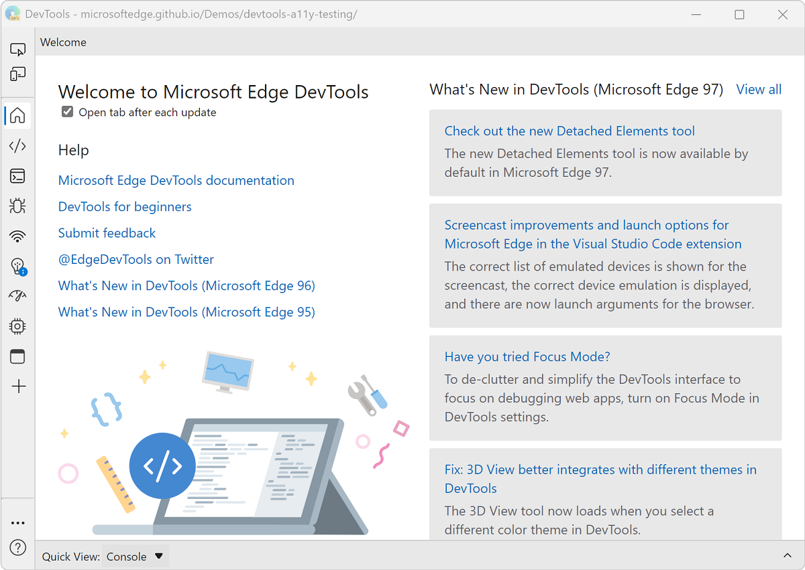
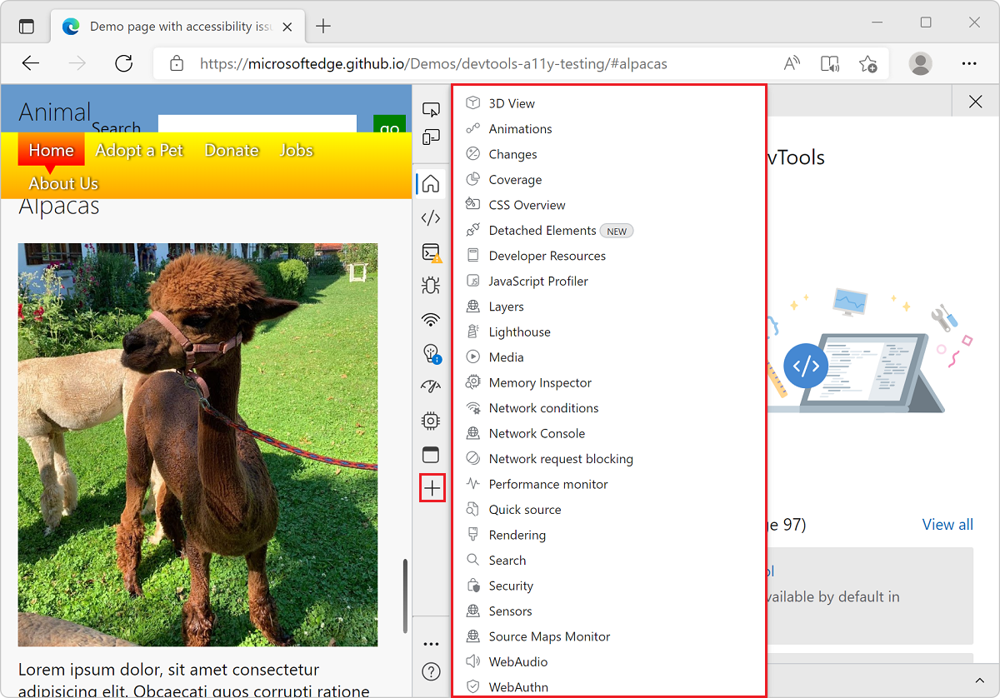
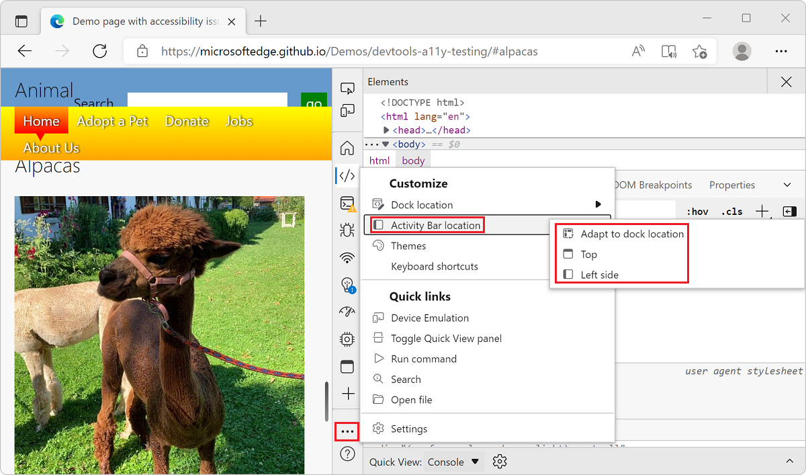

# Reduce the complexity of DevTools with Focus Mode

DevTools has over 30 different tools and many toolbar icons. The current DevTools user interface consists of:

* A main toolbar containing icons such as the **Inspect** and **Device Emulation** tools, and a set of tabbed tools including the **Elements** and **Sources** tools.

* A drawer toolbar containing more tabbed tools and icons.

The overall experience can be visually and conceptually overwhelming.

Focus Mode is a new experimental user interface for DevTools. It is designed to lower the learning curve for new users and reduce the complexity of DevTools without compromising its feature set.

Focus Mode replaces the main toolbar with an **Activity Bar**, which is a compact horizontal or vertical toolbar. The **Activity Bar** contains small icons and corresponding tooltips. The **Activity Bar** makes it possible to open tools, change user settings, and access additional features from one location.

Focus Mode also provides a **Quick View** list to open a second tool alongside the tool already selected in the **Activity Bar**.

Focus Mode does not change how the tools work and what they look like. Focus Mode only changes the way tools and other customization features of DevTools can be accessed.

<!-- ====================================================================== -->
## Enable Focus Mode

The Microsoft Edge team is currently experimenting with Focus Mode. Some users already have access to the feature while others need to enable it first.

To check if you have Focus Mode enabled already, or to enable or disable it:

1. Press `F1` to open **Settings**.

1. Click **Experiments** and scroll down to the **Focus Mode** checkbox.

   If the checkbox is selected, Focus Mode is already enabled. Select or clear it to enable or disable Focus Mode.

    

1. Close the **Settings** page. If you changed the Focus Mode experiment state, click the **Reload DevTools** button for the change to take effect.

<!-- ====================================================================== -->
## Main differences from the default user interface

Here are the main differences between the DevTools default user interface and Focus Mode.

### Activity Bar

  The **Activity Bar** is the most visible difference from the default user interface. Initially, it appears as a vertical sidebar to the left of the DevTools window. The **Activity Bar** contains icons used to open tools and access help and settings.

  It replaces the main toolbar from the default user interface.

  

### Quick View

  The **Quick View** list contains all tools and can be used to display a tool alongside the one already selected from the **Activity Bar**.

  **Quick View** replaces the drawer toolbar from the default user interface.

  

### DevTools customization and settings

  Several customization features and the DevTools settings are now grouped together under a single menu available from the **Customize and control DevTools** (**...**) button in the **Activity Bar**. These features and settings appear in multiple locations in the default user interface.

  * **Dock location** lets you change the placement of DevTools in the browser window.
  * **Activity Bar location** lets you change the placement of the **Activity Bar** within DevTools.
  * **Themes** lets you change the color theme.
  * **Settings** provides access to the DevTools settings.
  * **Keyboard shortcuts** lets you review and change keyboard shortcuts.

  

### Help links

  The **Help** menu contains links to the DevTools documentation and release notes and a button to send feedback to the team. These links and buttons were previously nested under **Customize and control DevTools** > **Help** in the default user interface.

  

<!-- ====================================================================== -->
## Open tools from the Activity Bar

By default, the **Activity Bar** contains the following tools:

* Icon tools:
   *  **Inspect** tool () toggle button.
   *  **Device Emulation** () button.

* Tool tabs:
   *  **Welcome** tool ().
   *  **Elements** tool ().
   *  **Console** tool ().
   *  **Sources** tool ().
   *  **Network** tool ().
   *  **Issues** tool ().
   *  **Performance** tool ().
   *  **Memory** tool ().
   *  **Application** tool ().

Click one of the icons in the **Activity Bar** to open the corresponding tool.

<!-- ====================================================================== -->
## Add and remove tools from the Activity Bar

If the tool you want to open does not appear in the **Activity Bar** by default, click **More tools** (**+**) to list all the available tools.

Opening a new tool from the **More tools** menu adds its icon to the **Activity Bar**. If there isn't enough space in the **Activity Bar** to display the new icons, the icons appear in the **More tools** menu.

To remove icons from the **Activity Bar** right-click the icon and click **Remove from activity bar**.

The following tools are permanent and can't be removed from the **Activity Bar**:

* **Elements** tool
* **Console** tool
* **Sources** tool

<!-- ====================================================================== -->
## Open tools from Quick View

Use the **Quick View** list to open a second tool next to the one already selected from the **Activity Bar**.

1. Choose a tool from the **Activity Bar**.

1. Click the **Quick View** list and select a different tool from the list.

The following screenshot shows the **Network** tool and the **Console** tool side by side.

When you finish using the second tool, close **Quick View** by clicking **Collapse Quick View** ().

<!-- ====================================================================== -->
## Customize Focus Mode

The **Activity Bar** can be displayed vertically, or horizontally, or automatically depending on where DevTools is docked.

To change the location of the **Activity Bar** click **Customize and control DevTools**, then **Activity bar location**, and then choose one of the locations.

* **Adapt to dock location**: The **Activity Bar** will automatically be placed depending on where DevTools is docked.

  * If DevTools is docked to the left or right side of the browser window, the **Activity Bar** will be vertical.
  * If DevTools is docked to the bottom side of the browser window, or undocked in its own window, the **Activity Bar** will be horizontal.

* **Top**: The **Activity Bar** will always be horizontal.

* **Left side**: The **Activity Bar** will always be vertical.

When the **Activity Bar** is horizontal, tool names appear next to tool icons if there is enough space to display them.

The following screenshot shows DevTools undocked in its own window, with the horizontal **Activity Bar** showing some tabs with tool icons and names, and some with icons only.

<!-- ====================================================================== -->
## See also

* [DevTools: Focus Mode UI](https://github.com/MicrosoftEdge/DevTools/blob/main/explainers/FocusMode/explainer.md) is the initial explainer for this experimental feature, in the Microsoft Edge DevTools repo.
