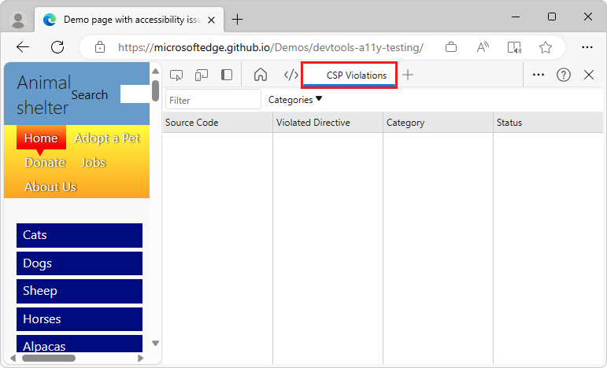
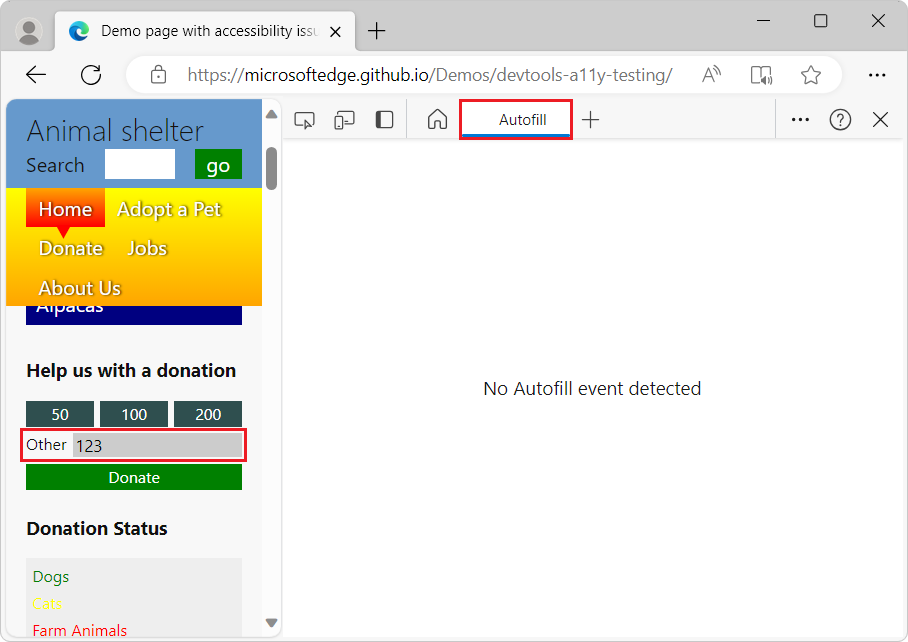

# Experimental features in Microsoft Edge DevTools

<!-- 
Policies to keep this page comprehensive and maintainable: 
*  Favor Canary over Stable re: sequencing.
*  Include a visible h2 section for every checkbox that's in public-facing Microsoft Edge DevTools > Experiments page.  If no info, write a tautology as a starting point.  Add as needed, each month.
*  Keep h2 sections in same order as DevTools > Settings > Experiments.
*  In the heading and UI steps, keep the checkbox label UI string as it appears in the UI; do not revise or "fix" it.
*  Don't change h2 text, that might break a link from UI.
*  When a checkbox is removed from all the channels, delete its section.

Steps to maintain this page monthly: For latest Canary, and for latest Stable:
1. Go to edge://settings/help, update if needed.
1. In DevTools, select Settings > Preferences > Restore Defaults > Reload DevTools.
1. In DevTools, go to Settings > Experiments.
1. In the "Experiments which are turned on by default" section below, update the Edge Canary list & Edge Stable list at top.
   *  In that section, link down to the h2; do not link to a different article.
1. Make sure the article has an h2 for each checkbox.
1. In each h2 section, update the presence or absence of "not", and update the version #:
This checkbox is|is not present in Microsoft Edge Canary 123.
This checkbox is|is not present in Microsoft Edge Stable 123.
-->

Microsoft Edge DevTools provide access to experimental features that are still in development.  This article lists and describes the experimental features that are in either:
*  The latest version of the Canary preview channel of Microsoft Edge.
*  The latest version of the Stable release of Microsoft Edge.

All [channels of Microsoft Edge](/deployedge/microsoft-edge-channels) have experimental features. You can get the latest experimental features by using the [Microsoft Edge Canary channel](https://www.microsoft.com/edge/download/insider). To view the full list of experiments that are available in your version of Microsoft Edge, see the **Settings** > **Experiments** page in DevTools.

<!-- no Warning formatting, because UI already contains red "WARNING" at top -->
These experiments could be unstable or unreliable and may require you to restart DevTools.

<!-- ====================================================================== -->
## Experiments which are turned on by default

The following experimental features are turned on by default. You can use these features right away, without changing any settings. You can turn off these default experimental features, if needed.

<!-- listed in order of the Settings > Experiments pane -->

**Turned on by default in Microsoft Edge Canary 122:**
* [Resolve variable names in expressions using source maps](#resolve-variable-names-in-expressions-using-source-maps)
* [Set all breakpoints eagerly at startup](#set-all-breakpoints-eagerly-at-startup)
* [Enable background page selector (e.g. for prerendering debugging)](#enable-background-page-selector-eg-for-prerendering-debugging)
* [Show warning about Self-XSS when pasting code](#show-warning-about-self-xss-when-pasting-code)
* [Enable webhint](#enable-webhint)
* [Show issues in Elements](#show-issues-in-elements)
* [Open source files in Visual Studio Code](#open-source-files-in-visual-studio-code)
* [View console.profile() results in the Performance panel for Node.js](#view-consoleprofile-results-in-the-performance-panel-for-nodejs)
* [Enable Speculative Loads Panel in Application panel](#enable-speculative-loads-panel-in-application-panel)

**Turned on by default in Microsoft Edge Stable 120:**
* [Automatically pretty print minified sources](#automatically-pretty-print-minified-sources)
* [Source order viewer](#source-order-viewer)
* [WebAssembly Debugging: Enable DWARF support](#webassembly-debugging-enable-dwarf-support)
* [Set all breakpoints eagerly at startup](#set-all-breakpoints-eagerly-at-startup)
* [Display more precise changes in the Changes tab](#display-more-precise-changes-in-the-changes-tab)
* [Local overrides for response headers](#local-overrides-for-response-headers)
* [Enable color picking outside the browser window](#enable-color-picking-outside-the-browser-window)
* [Enable background page selector (e.g. for prerendering debugging)](#enable-background-page-selector-eg-for-prerendering-debugging)
* [Show warning about Self-XSS when pasting code](#show-warning-about-self-xss-when-pasting-code)
* [Enable webhint](#enable-webhint)
* [Show issues in Elements](#show-issues-in-elements)
* [Open source files in Visual Studio Code](#open-source-files-in-visual-studio-code)
* [View console.profile() results in the Performance panel for Node.js](#view-consoleprofile-results-in-the-performance-panel-for-nodejs)
* [Enable Speculative Loads Panel in Application panel](#enable-speculative-loads-panel-in-application-panel)

<!-- ====================================================================== -->
## Turning an experiment on or off

Experimental features are constantly being updated and might cause performance issues.  This is one reason you might want to turn off an experiment.

To turn an experiment on or off in Microsoft Edge:

1. To open DevTools, right-click the webpage, and then select **Inspect**.  Or, press **Ctrl+Shift+I** (Windows, Linux) or **Command+Option+I** (macOS).  DevTools opens.

1. In DevTools, on the main toolbar, click the **Customize and control DevTools** () button, and then click the **Settings** () button.  Or, press **Shift+?**.

1. On the left side of the **Settings** panel, select the **Experiments** page:

   

1. Select or clear the checkbox for an experiment. Some experiments are selected by default.

1. Click **Close** () in the upper right of DevTools **Settings**.

1. Click the **Reload DevTools** button.

<!-- ====================================================================== -->
## Restoring defaults for which experiments are selected

To restore the default settings for which experimental features are turned on:

1. To open DevTools, right-click the webpage, and then select **Inspect**.  Or, press **Ctrl+Shift+I** (Windows, Linux) or **Command+Option+I** (macOS).  DevTools opens.

1. In DevTools, on the main toolbar, click the **Settings** () button.  Or, press **Shift+?**.  The **Settings** panel opens, with the **Preferences** page selected.

1. At the bottom of the **Preferences** page, click the **Restore defaults and refresh** button, and then click **Close** ().

<!-- For more information about customizing settings, see [Settings](../customize/index.md#settings) in _Customize Microsoft Edge DevTools_. -->

<!-- ====================================================================== -->
## Filtering the experiments

You can filter the experimental features by text included in the title.

1. To open DevTools, right-click the webpage, and then select **Inspect**.  Or, press **Ctrl+Shift+I** (Windows, Linux) or **Command+Option+I** (macOS).  DevTools opens.

1. In DevTools, on the main toolbar, click the **Settings** () button.  Or, press **Shift+?**.  The **Settings** panel opens, with the **Preferences** page selected.

1. On the left side of the **Settings** panel, select the **Experiments** page.

1. Click in the **Filter** text box and enter text, such as **timeline**.  As you type, only the matching checkboxes are shown in the **Experiments** page.

1. To end filtering, clear the **Filter** text box.

<!-- ====================================================================== -->
## Providing feedback about the experiments

We're eager to hear your feedback about experimental features.  To share feedback with us, [Contact the Microsoft Edge DevTools team](../contact.md).

<!-- ====================================================================== -->
## List of experiments

The experiments checkboxes that appear in the latest version of the Canary preview channel of Microsoft Edge are listed below.  The Stable release is also noted, following behind the addition or removal of checkboxes in Canary.

<!-- ============================================================================================================================================ -->
<!-- top of list of checkboxes -->
<!-- ============================================================================================================================================ -->

<!-- ====================================================================== -->
## Allow extensions to load custom stylesheets
<!-- checkbox has a (?) link to this anchor wording -->

Some Microsoft Edge Add-ons can define custom color themes for DevTools. If you install an add-on with a theme, you need to enable the **Allow extensions to load custom stylesheets** experiment to view the add-on themes.

Status:
* This checkbox is present in Microsoft Edge Canary 122.
* This checkbox is present in Microsoft Edge Stable 120.

<!-- ====================================================================== -->
## Capture node creation stacks
<!-- checkbox has a (?) link to this anchor wording -->

To capture JavaScript stack traces when DOM nodes are added to the DOM at runtime, enable this experiment. The captured stack traces are displayed in the **Stack Trace** pane of the **Elements** panel.

Status:
* This checkbox is present in Microsoft Edge Canary 122.
* This checkbox is present in Microsoft Edge Stable 120.

<!-- ====================================================================== -->
## Automatically pretty print minified sources
<!-- no (?) link -->

<!-- as of 115, not 114-, checkbox label is now:
Automatically pretty print minified sources
instead of:
Automatically pretty print in the Sources Panel
-->

When this experiment is turned on, when you display a minified file in the Sources panel, the file is opened in a single tab in the Sources panel, pretty-printed.

When this experiment is turned off, a UI prompt with a button asks you whether to pretty-print the file.  The file is opened in an additional tab which has an appended suffix of **:formatted**.

*  A _minified_ file is concatenated into a single long line.
*  In contrast, _pretty print_ presents the contents of a file in an indented, more human-readable format.

Status:
* This checkbox is not present in Microsoft Edge Canary 122.
* This checkbox is present in Microsoft Edge Stable 120.

<!-- ====================================================================== -->
## Protocol Monitor
<!-- checkbox has a (?) link to this anchor wording -->

DevTools communicates with the inspected page using the DevTools protocol.

To monitor the messages sent and received by DevTools to debug the inspected page:

1. To open DevTools, right-click the webpage, and then select **Inspect**.  Or, press **Ctrl+Shift+I** (Windows, Linux) or **Command+Option+I** (macOS).  DevTools opens.

1. In DevTools, on the main toolbar, click the **Settings** () button.  Or, press **Shift+?**.  The **Settings** panel opens, with the **Preferences** page selected.

1. On the left side of the **Settings** panel, select the **Experiments** page.

1. Select the **Protocol Monitor** checkbox, and then click **Close** () to close **Settings**.

1. Open the **Command Menu**, such as by pressing **Ctrl+Shift+P** (Windows/Linux) or **Command+Shift+P** (macOS), and then type **protocol** in the text box.

1. Select **Show Protocol monitor**.  The message appears: "One or more settings have changed which requires a reload to take effect."

1. Click the **Reload DevTools** button that appears next to the message.

1. The **Protocol monitor** tool is displayed in the **Quick View** panel at the bottom of DevTools.

Status:
* This checkbox is present in Microsoft Edge Canary 122.
* This checkbox is present in Microsoft Edge Stable 120.

<!-- ====================================================================== -->
## Show CSP Violations view
<!-- checkbox has a (?) link to this anchor wording -->

Adds the **CSP Violations** tool, which displays any Content Security Policy (CSP) violations that are detected on the inspected webpage.

Status:
* This checkbox is not present in Microsoft Edge Canary 122.
* This checkbox is present in Microsoft Edge Stable 120.

<!-- ====================================================================== -->
## Show option to expose internals in heap snapshots
<!-- no (?) link -->

_new as of Microsoft Edge 105_

Whether to display a checkbox to expose internals in heap snapshots in the **Memory** tool.
<!-- todo old: need text -->

See also:
* [Record heap snapshots using the Memory tool](../memory-problems/heap-snapshots.md)

Status:
* This checkbox is present in Microsoft Edge Canary 122.
* This checkbox is present in Microsoft Edge Stable 120.

<!-- ====================================================================== -->
## Source order viewer
<!-- no (?) link -->

This checkbox is being removed.  The Source Order Viewer is now a regular feature, not an experiment.  Whether the checkbox is checked or unchecked makes no difference; the Source Order Viewer feature appears in DevTools either way.

See also:
* [Test keyboard support using the Source Order Viewer](../accessibility/test-tab-key-source-order-viewer.md)

Status:
* This checkbox is not present in Microsoft Edge Canary 122.
* This checkbox is present in Microsoft Edge Stable 120.

<!-- ====================================================================== -->
## Timeline: event initiators
<!-- checkbox has a (?) link to this anchor wording -->

Whether to include event initiators in the Timeline.
<!-- todo old: need text -->

Status:
* This checkbox is present in Microsoft Edge Canary 122.
* This checkbox is present in Microsoft Edge Stable 120.

<!-- ====================================================================== -->
## Enable JavaScript Profiler temporarily
<!-- no (?) link -->

_new as of Microsoft Edge 114_

Temporarily enables the **JavaScript Profiler** tool (tab) in DevTools.  The **JavaScript Profiler** tool will be deprecated.  To record JavaScript CPU profiles, use the **Performance** tool instead.

See also:
* [Introduction to the Performance tool](../evaluate-performance/index.md)

Status:
* This checkbox is present in Microsoft Edge Canary 122.
* This checkbox is present in Microsoft Edge Stable 120.

<!-- ====================================================================== -->
## Disable Indentation Markers temporarily
<!-- no (?) link -->

_new as of Microsoft Edge 122_

Temporarily disables the indentation markers in the **Sources** tool. The indentation markers are the vertical lines that indicate the indentation level of the code:

<!-- See also:
* 
-->

Status:
* This checkbox is present in Microsoft Edge Canary 122.
* This checkbox is not present in Microsoft Edge Stable 120.

<!-- ====================================================================== -->
## WebAssembly Debugging: Enable DWARF support
<!-- checkbox has a (?) link to this anchor wording -->

Enables DWARF support for WebAssembly debugging.  See [Improved WebAssembly debugging](../whats-new/2019/12/devtools.md#improved-webassembly-debugging) in _What's New in DevTools (Microsoft Edge 80)_.
<!-- todo old: need text -->

Status:
* This checkbox is not present in Microsoft Edge Canary 122.
* This checkbox is present in Microsoft Edge Stable 120.

<!-- ====================================================================== -->
## Resolve variable names in expressions using source maps
<!-- no (?) link -->

Uses source maps to automatically map original variable names to minified variable names when evaluating expressions.

This checkbox affects the **Console**, and the **Watch** sidebar tab in the **Sources** tool.

See also:
* [Map the processed code to your original source code, for debugging](../javascript/source-maps.md)
* [Mapping minified code to your source code to show readable code](../sources/index.md#mapping-minified-code-to-your-source-code-to-show-readable-code) in _Sources tool overview_.

Status:
* This checkbox is present in Microsoft Edge Canary 122.
* This checkbox is present in Microsoft Edge Stable 120.

<!-- ====================================================================== -->
## Set all breakpoints eagerly at startup
<!-- no (?) link -->

Sets all possible defined breakpoints at startup.

See also:
* [Pause code with breakpoints](../javascript/breakpoints.md)

Status:
* This checkbox is present in Microsoft Edge Canary 122.
* This checkbox is present in Microsoft Edge Stable 120.

<!-- ====================================================================== -->
## Enable new Advanced Perceptual Contrast Algorithm (APCA) replacing previous contrast ratio and AA/AAA guidelines
<!-- checkbox has a (?) link to this anchor wording -->

The [Advanced Perceptual Contrast Algorithm (APCA)](https://w3c.github.io/silver/guidelines/methods/Method-font-characteristic-contrast.html) replaces the [AA](https://www.w3.org/WAI/WCAG21/quickref#contrast-minimum)/[AAA](https://www.w3.org/WAI/WCAG21/quickref#contrast-enhanced) guidelines contrast ratio in the Color Picker.  The Color Picker is used in the **Styles** tab in the **Elements** tool.

APCA is a new way to compute contrast.  It is based on modern research on color perception.  Compared to AA/AAA guidelines, APCA is more context-dependent.  The contrast is calculated based on the following spatial properties of the text, color, and context.

*  Spatial properties of text that include font weight and size.
*  Spatial properties of color that include perceived contrast between text and background.
*  Spatial properties of context that include ambient light, surroundings, and intended purpose.

See also:
* [New color contrast calculation - Advanced Perceptual Contrast Algorithm (APCA)](../whats-new/2021/01/devtools.md#new-color-contrast-calculation---advanced-perceptual-contrast-algorithm-apca) in _What's New in DevTools (Microsoft Edge 89)_.
* [Change colors with the Color Picker](../css/reference.md#change-colors-with-the-color-picker) in _CSS features reference_.
* [Test text-color contrast using the Color Picker](../accessibility/color-picker.md)

Status:
* This checkbox is present in Microsoft Edge Canary 122.
* This checkbox is present in Microsoft Edge Stable 120.

<!-- ====================================================================== -->
## Enable full accessibility tree view in the Elements panel
<!-- checkbox has a (?) link to this anchor wording -->

Adds a button in the **Elements** tool which toggles between the DOM tree and the accessibility tree.

Status:
* This checkbox is present in Microsoft Edge Canary 122.
* This checkbox is present in Microsoft Edge Stable 120.

<!-- ====================================================================== -->
## Enable new Font Editor tool within the Styles pane.
<!-- checkbox has this exact label -->

See [Enable the Font Editor tool within the Styles pane](#enable-the-font-editor-tool-within-the-styles-pane) below.

## Enable the Font Editor tool within the Styles pane
<!-- checkbox has a (?) link to this anchor wording-->

You can use the visual [Font Editor](../inspect-styles/edit-fonts.md) to edit fonts.  Use it define fonts and font characteristics.  The visual **Font Editor** helps you do the following:

*  Switch between units for different font properties
*  Switch between keywords for different font properties
*  Convert units
*  Generate accurate CSS code

To use the visual **Font Editor**:

1. To open DevTools, right-click the webpage, and then select **Inspect**.  Or, press **Ctrl+Shift+I** (Windows, Linux) or **Command+Option+I** (macOS).  DevTools opens.

1. In DevTools, on the main toolbar, select the **Elements** tab.  If the **Elements** tab isn't visible, click the **More tabs** () button, or else the **More Tools** () button.

1. In the **Styles** tab, select the **Font Editor** icon.

   

Some browser channels have the checkbox label **Enable new Font Editor tool within the Styles pane.**

See also:
* [Edit CSS font styles and settings in the Styles pane](../inspect-styles/edit-fonts.md)

Status:
* This checkbox is present in Microsoft Edge Canary 122.
* This checkbox is present in Microsoft Edge Stable 120.

<!-- ====================================================================== -->
## Enable automatic contrast issue reporting via the Issues panel
<!-- checkbox has a (?) link to this anchor wording -->

Enables automatic contrast issue reporting in the **Issues** tool.
<!-- todo old: need text -->

Status:
* This checkbox is present in Microsoft Edge Canary 122.
* This checkbox is present in Microsoft Edge Stable 120.

<!-- ====================================================================== -->
## Enable experimental cookie features
<!-- checkbox has a (?) link to this anchor wording -->

Enables experimental cookie features.
<!-- todo old: need text -->

Status:
* This checkbox is present in Microsoft Edge Canary 122.
* This checkbox is present in Microsoft Edge Stable 120.

<!-- ====================================================================== -->
## Display more precise changes in the Changes tab
<!-- checkbox has a (?) link to this anchor wording -->

See [More precise changes in the Changes tab](https://developer.chrome.com/blog/new-in-devtools-98/#changes).

Status:
* This checkbox is not present in Microsoft Edge Canary 122.
* This checkbox is present in Microsoft Edge Stable 120.

<!-- ====================================================================== -->
## Sync CSS changes in the Styles pane
<!-- checkbox has a (?) link to this anchor wording -->

Whether to sync CSS changes in the **Styles** tab in the **Elements** tool.
<!-- todo old: need text -->

Status:
* This checkbox is present in Microsoft Edge Canary 122.
* This checkbox is present in Microsoft Edge Stable 120.

<!-- ====================================================================== -->
## Highlights a violating node or attribute in the Elements panel DOM tree
<!-- no (?) link -->

_new as of Microsoft Edge 106_
<!-- todo old: need text -->

Status:
* This checkbox is present in Microsoft Edge Canary 122.
* This checkbox is present in Microsoft Edge Stable 120.

<!-- ====================================================================== -->
## Local overrides for response headers
<!-- checkbox has a (?) link to this anchor wording -->

Whether to use local overrides for response headers.
<!-- todo old: need text -->

Status:
* This checkbox is not present in Microsoft Edge Canary 122.
* This checkbox is present in Microsoft Edge Stable 120.

<!-- ====================================================================== -->
## Enable color picking outside the browser window
<!-- no (?) link -->

Allows you to move the mouse cursor when it's an eyedropper tool, over anywhere on your screen, not just within the Microsoft Edge window.

In the **Elements** tool, in the **Styles** tab, click on any color preview.  The Color Picker opens.  Click the **Toggle color picker** () button.  The mouse cursor becomes an eyedropper.  Click anywhere on your monitor to select a color.

<!-- https://developer.chrome.com/blog/new-in-devtools-102/#color-picker -->

See also:
* [Change colors with the Color Picker](../css/reference.md#change-colors-with-the-color-picker) in _CSS features reference_

Status:
* This checkbox is not present in Microsoft Edge Canary 122.
* This checkbox is present in Microsoft Edge Stable 120.

<!-- ====================================================================== -->
## Group sources into Authored and Deployed trees
<!-- checkbox has a (?) link to this anchor wording -->

_new as of Microsoft Edge 104_
<!-- This experiment was shown in the What's New 104 video [Microsoft Edge | What's New in DevTools 104](https://www.youtube.com/watch?v=0_ZprFX8x0I&t=129s) at 2:09. -->

Controls whether to group resources into separate **Authored** and **Deployed** trees in the **Page** tab of the **Sources** tool.  This feature in the **Sources** tool allows you to group source files in two folders depending on whether these are:
*  Original source files (authored, that is, files with your local edits).
*  Production files (deployed files that are on the web server after compiling and bundling the source files).

Status:
* This checkbox is present in Microsoft Edge Canary 122.
* This checkbox is present in Microsoft Edge Stable 120.

<!-- ====================================================================== -->
## Hide ignore-listed code in sources tree view
<!-- no (?) link -->

_new as of Microsoft Edge 106_

Status:
* This checkbox is present in Microsoft Edge Canary 122.
* This checkbox is present in Microsoft Edge Stable 120.

<!-- ====================================================================== -->
## Highlight important DOM properties in the Object Properties viewer
<!-- no (?) link -->

_new as of Microsoft Edge 105_

Selecting this checkbox causes important DOM properties to be highlighted in the **Properties** tab in tools such as the **Elements** tool, for the DOM tree element that's currently selected.  This new experiment makes major properties easier to see.  Some properties appear in bold, and others appear in bold and have a star icon next to them.

This highlighting is useful because in JavaScript, objects inherit from parent objects, which themselves inherit from other ancestors, sometimes amounting to hundreds of properties.  This experiment helps you find the main properties.

The Object Properties viewer is in several tools, including **Elements**, **Sources**, **Console**, and **Network**.  It provides a tree view of properties of objects.

#### In the Elements tool

To see the Object Properties viewer in the **Elements** tool:

1. Right-click an item in a webpage and then select **Inspect**.  DevTools opens, with the page element selected in the DOM tree of the **Elements** tool.

1. In the **Elements** tool, select the **Properties** tab, which is grouped with the **Styles** tab.

   The **Properties** tab contains the list of properties for the selected element.

#### In the Sources tool

To see the Object Properties viewer in the **Sources** tool:

1. Open a `.js` file.

1. Set a breakpoint on a line of code in the `.js` file.

1. Pause the debugger at that line by running the code on the webpage.

   Object properties are displayed in the **Scope** section in the right-hand sidebar.  See [View and edit properties and variables](../javascript/reference.md#view-and-edit-properties-and-variables) in _JavaScript debugging features_.

Status:
* This checkbox is present in Microsoft Edge Canary 122.
* This checkbox is present in Microsoft Edge Stable 120.

<!-- ====================================================================== -->
## Enable background page selector (e.g. for prerendering debugging)
<!-- no (?) link -->

_new as of Microsoft Edge 114_

Enables the background page selector, such as for prerendering debugging.
<!-- todo old: need text -->

See also:
* [Overview and timelines for migrating to Manifest V3](../../extensions-chromium/developer-guide/manifest-v3.md) - service workers instead of background pages, for Microsoft Edge extensions.
* [chrome.runtime](https://developer.chrome.com/docs/extensions/reference/api/runtime) - retrieves the background page.

Status:
* This checkbox is present in Microsoft Edge Canary 122.
* This checkbox is present in Microsoft Edge Stable 120.

<!-- ====================================================================== -->
## Show warning about Self-XSS when pasting code
<!-- no (?) link -->

_new as of Microsoft Edge 117_

Displays a warning about self cross-site scripting when code is pasted into the Console.  If this checkbox is enabled, when you initially try to paste code into the Console tool, a warning message is displayed:

"Warning: Do not paste code you do not understand or have not checked yourself into the DevTools console. This could allow attackers to steal your identity or take control of your computer. Please type 'allow pasting' below to allow pasting."

After you enter `allow pasting` in the Console, you can paste code, in the current DevTools session and in future sessions.

See also:
* [Self-XSS](https://wikipedia.org/wiki/Self-XSS) at Wikipedia.

Status:
* This checkbox is present in Microsoft Edge Canary 122.
* This checkbox is present in Microsoft Edge Stable 120.

<!-- ====================================================================== -->
## Redesign of the filter bar in the Network Panel
<!-- no (?) link -->

_new as of Microsoft Edge 120_

In the **Network** tool, the filter bar has been redesigned:
* The buttons are replaced by a **Request types** dropdown list.
* The checkboxes are replaced by a **More filters** dropdown list.

Filter bar with this checkbox cleared:

Filter bar with this checkbox selected:

See also:
* [Filter resources](../network/index.md#filter-resources) in _Inspect network activity_.
* [Filter requests](../network/reference.md#filter-requests) in _Network features reference_.

Status:
* This checkbox is present in Microsoft Edge Canary 122.
* This checkbox is present in Microsoft Edge Stable 120.

<!-- ====================================================================== -->
## Enable breadcrumbs in the Performance Panel
<!-- no (?) link -->

_new as of Microsoft Edge 121_

Adds the ability to zoom in on time ranges of a recording in the **Application** tool. Also adds a timing-breadcrumbs path to go back to previous ranges.

To zoom in on a time range:

1. To create a time range, drag your mouse in the **Overview** section.
1. Hover over the selected time range, and then click the magnifier icon that appears on hover. A new item is added to the timing-breadcrumbs path.

To zoom out to a previous time range, click the item in the timing-breadcrumbs path.

See also:
* [Introduction to the Performance tool](../evaluate-performance/index.md)

Status:
* This checkbox is present in Microsoft Edge Canary 122.
* This checkbox is present in Microsoft Edge Stable 120.

<!-- ====================================================================== -->
## Enable Autofill view
<!-- no (?) link -->

_new as of Microsoft Edge 121_

Adds an **Autofill** tool to DevTools, to record various events that the browser triggers when a user is filling in a form by using the browser's autofill feature.  For example, when the browser remembers your address and autofills it in an address field.

See also:
* [Autofill](../../privacy-whitepaper/index.md#autofill) in _Microsoft Edge Privacy Whitepaper_.
* [Autofill](../../webview2/concepts/overview-features-apis.md?tabs=dotnetcsharp#autofill) in _Overview of WebView2 features and APIs_.

Status:
* This checkbox is present in Microsoft Edge Canary 122.
* This checkbox is not present in Microsoft Edge Stable 120.

<!-- ====================================================================== -->
## Log DevTools uncaught exceptions to Console
<!-- checkbox has a (?) link to this anchor wording -->

Controls whether to log DevTools uncaught exceptions in the **Console** tool.
<!-- todo old: need text -->

Status:
* This checkbox is present in Microsoft Edge Canary 122.
* This checkbox is present in Microsoft Edge Stable 120.

<!-- ====================================================================== -->
## Enable webhint
<!-- checkbox has a (?) link to this anchor wording -->

[webhint](https://webhint.io) is an open-source tool that provides real-time feedback for websites and local webpages.  The type of feedback provided by [webhint](https://webhint.io) includes:

*  Accessibility
*  Cross-browser compatibility
*  Security
*  Performance
*  Progressive Web Apps (PWAs)
*  Other common web development issues

The [webhint](https://webhint.io) experiment displays the webhint feedback in the [Issues](../issues/index.md) panel.  Select an issue to display documentation about the solution and a list of the affected resources on your website.  Select a resource link to open the relevant tool, such as **Network**, **Sources**, or **Elements**:

Status:
* This checkbox is present in Microsoft Edge Canary 122.
* This checkbox is present in Microsoft Edge Stable 120.

<!-- ====================================================================== -->
## Show issues in Elements
<!-- checkbox has a (?) link to this anchor wording -->

Enable this experiment to view syntax errors under HTML in the **DOM** view of the **Elements** tool. For more information, see [Wavy underlines highlight code issues and improvements in Elements tool](../whats-new/2021/04/devtools.md#wavy-underlines-highlight-code-issues-and-improvements-in-elements-tool).

Status:
* This checkbox is present in Microsoft Edge Canary 122.
* This checkbox is present in Microsoft Edge Stable 120.

<!-- ====================================================================== -->
## Open source files in Visual Studio Code
<!-- checkbox has a (?) link to this anchor wording -->

The **Open source files in Visual Studio Code** experiment replaces the code editor of the Sources tool with Visual Studio Code, for editing local files. When you turn on this experiment, Developer Tools detects when you edit a local file, and prompts you to select a folder to use as your Workspace.

When you select a folder to use as your Workspace, selecting any link to a file in DevTools opens the file in Visual Studio Code.  In previous versions of Microsoft Edge, this action opened the file in the code editor of the Sources tool in DevTools.

Any edits that you make in DevTools now change the file on the hard drive and sync live with Visual Studio Code. You can read about setting up your workspace in [Opening source files in Visual Studio Code](../sources/opening-sources-in-vscode.md).

Status:
* This checkbox is present in Microsoft Edge Canary 122.
* This checkbox is present in Microsoft Edge Stable 120.

<!-- ======================================================================
## Emulate Microsoft-recommended hardware and network performance presets
internal only

checkbox has a (?) link to this anchor wording

_new as of Microsoft Edge 114_

Emulates Microsoft-recommended hardware and network performance presets.

See also:
* [Troubleshooting common performance issues](../rendering-tools/index.md)

Status:
* This checkbox is present in Microsoft Edge Canary 122.
* This checkbox is present in Microsoft Edge Stable 120.
-->

<!-- ====================================================================== -->
## Enable Crash Analyzer
<!-- checkbox has a (?) link to this anchor wording -->

_new as of Microsoft Edge 114_

Enables the **Crash Analyzer** tool.
<!-- todo old: need text -->

See also:
* [Debug JavaScript error stack traces by using the Crash Analyzer tool](../whats-new/2023/05/devtools-113.md#debug-javascript-error-stack-traces-by-using-the-crash-analyzer-tool) in _What's New in DevTools (Microsoft Edge 113)_.

Status:
* This checkbox is present in Microsoft Edge Canary 122.
* This checkbox is present in Microsoft Edge Stable 120.

<!-- ====================================================================== -->
## Enable Adaptive CPU throttling
<!-- no (?) link -->

_new as of Microsoft Edge 114_

Enables Adaptive CPU throttling.
<!-- todo old: need text -->

See also:
*  [Throttle the CPU while recording](../evaluate-performance/reference.md#throttle-the-cpu-while-recording) in _Performance features reference_.

Status:
* This checkbox is present in Microsoft Edge Canary 122.
* This checkbox is present in Microsoft Edge Stable 120.

<!-- ======================================================================
## internal-only Console checkbox -->

<!-- ============================================================================================================================================ -->
<!-- >> [!WARNING]
> These experiments are particularly unstable. Enable at your own risk. -->

<!-- ====================================================================== -->
## Ignore List for JavaScript frames on Timeline
<!-- checkbox has a (?) link to this anchor wording -->

Whether to include the Ignore list for JavaScript frames on the Timeline.
<!-- todo old: need text -->

Status:
* This checkbox is present in Microsoft Edge Canary 122.
* This checkbox is present in Microsoft Edge Stable 120.

<!-- ====================================================================== -->
## Live heap profile
<!-- checkbox has a (?) link to this anchor wording -->

Controls whether to live-update the heap profile.
<!-- todo old: need text -->

See also:
* [Record heap snapshots using the Memory tool](../memory-problems/heap-snapshots.md)

Status:
* This checkbox is present in Microsoft Edge Canary 122.
* This checkbox is present in Microsoft Edge Stable 120.

<!-- ====================================================================== -->
## Sampling heap profiler timeline
<!-- checkbox has a (?) link to this anchor wording -->

Controls whether to show the Sampling heap profiler timeline.
<!-- todo old: need text -->

See also:
* [Record heap snapshots using the Memory tool](../memory-problems/heap-snapshots.md)

Status:
* This checkbox is present in Microsoft Edge Canary 122.
* This checkbox is present in Microsoft Edge Stable 120.

<!-- ====================================================================== -->
## Timeline: invalidation tracking
<!-- checkbox has a (?) link to this anchor wording -->

Controls whether to show invalidation tracking on the Timeline.

Status:
* This checkbox is present in Microsoft Edge Canary 122.
* This checkbox is present in Microsoft Edge Stable 120.

<!-- ====================================================================== -->
## Timeline: show all events
<!-- checkbox has a (?) link to this anchor wording -->

Controls whether to show all events on the Timeline.

Status:
* This checkbox is present in Microsoft Edge Canary 122.
* This checkbox is present in Microsoft Edge Stable 120.

<!-- ====================================================================== -->
## Timeline: V8 Runtime Call Stats on Timeline
<!-- checkbox has a (?) link to this anchor wording -->

Controls whether to show v8 runtime call stats on the Timeline.

Status:
* This checkbox is present in Microsoft Edge Canary 122.
* This checkbox is present in Microsoft Edge Stable 120.

<!-- ====================================================================== -->
## View console.profile() results in the Performance panel for Node.js
<!-- no (?) link -->

_new as of Microsoft Edge 109_

Displays `console.profile()` results in the **Performance** tool for Node.js.

`console.profile()` can be used in the DevTools **Console** (or in your code) to start a JavaScript profile, and then you can use `console.profileEnd()` to terminate it.  Once done, you can see your profile recording in the **JavaScript Profiler** tool.

This is a programmatic way to record JavaScript execution, which can be useful in certain performance debugging situations.

When DevTools is used to debug processes that are running in Node.js, this experiment makes whatever `console.profile` generates available to the **Performance** Tool.

Status:
* This checkbox is present in Microsoft Edge Canary 122.
* This checkbox is present in Microsoft Edge Stable 120.

See also:
* [JavaScript Profiler tool](../javascript-profiler/javascript-profiler-tool.md)

<!-- ====================================================================== -->
## Enable instrumentation breakpoints
<!-- no (?) link -->

Whether to halt at test breakpoints.  This experiment makes breakpoints more reliable.

See also:
* [Enable synchronization on instrumentation breakpoints](https://chromium-review.googlesource.com/c/devtools/devtools-frontend/+/3470237)
* [The first time source files are loaded, breakpoints might not trigger](https://bugs.chromium.org/p/chromium/issues/detail?id=1133307&q=%22instrumentation%20breakpoints%22&can=2)

Status:
* This checkbox is present in Microsoft Edge Canary 122.
* This checkbox is present in Microsoft Edge Stable 120.

<!-- ====================================================================== -->
## Use scope information from source maps
<!-- no (?) link -->

_new as of Microsoft Edge 118_

Whether to use scope information from source maps.
<!-- todo old: need text -->

See also:
* [Map the processed code to your original source code, for debugging](../javascript/source-maps.md)
* [Mapping minified code to your source code to show readable code](../sources/index.md#mapping-minified-code-to-your-source-code-to-show-readable-code) in _Sources tool overview_.

Status:
* This checkbox is present in Microsoft Edge Canary 122.
* This checkbox is present in Microsoft Edge Stable 120.

<!-- ====================================================================== -->
## Enable Speculative Loads Panel in Application panel
<!-- no (?) link -->

_new as of Microsoft Edge 121_

Adds a **Speculative loads** page within the **Background services** section of the **Application** tool, including a **Rules** page and a **Speculations** page:

The Speculation Rules API can be used to programmatically tell Microsoft Edge to pre-render certain pages.  This is useful because pre-rendered pages are almost instantaneous to navigate to.  The browser pre-renders, in a hidden way, the next pages that a user is likely to navigate to, while the user is still on the current page.

The **Speculative loads** page lists the speculation rules that the web author has defined in the webpage.  The page provides debugging information that shows whether a rule was actually used, showing whether a particular page was pre-rendered.

The **Rules** page has columns:
* **Rule set**
* **Status**

The **Speculations** page has columns:
* **URL**
* **Action**
* **Rule set**
* **Status**

Status:
* This checkbox is present in Microsoft Edge Canary 122.
* This checkbox is present in Microsoft Edge Stable 120.

<!-- ====================================================================== -->
## Enable Storage Buckets Tree in Application panel
<!-- no (?) link -->

_new as of Microsoft Edge 118_

Whether to enable the Storage Buckets Tree in the **Application** tool.
<!-- todo old: need text -->

<!-- 
See also:
*  -->

Status:
* This checkbox is present in Microsoft Edge Canary 122.
* This checkbox is present in Microsoft Edge Stable 120.

<!-- ====================================================================== -->
## Enable context menu that allows to modify trees in the Flame Chart
<!-- no (?) link -->

_new as of Microsoft Edge 121_

Adds a right-click menu that allows modifying trees in the flame chart in the **Performance** tool.  With this experiment enabled, you can right-click events in the flame chart of the **Performance** tool, and modify the chart at that location:

The right-click menu potentially has the following menuitems, depending on context:
* **Merge function**
* **Collapse function**
* **Collapse repeating descendants**
* **Undo collapse function**
* **Undo collapse repeating descendants**
* **Undo all actions**
* **Load profile**
* **Save profile**

See also:
* [Find the bottleneck](../evaluate-performance/index.md#find-the-bottleneck) in _Introduction to the Performance tool_.
* [View main thread activity](../evaluate-performance/reference.md#view-main-thread-activity) in _Performance features reference_.

Status:
* This checkbox is present in Microsoft Edge Canary 122.
* This checkbox is present in Microsoft Edge Stable 120.
