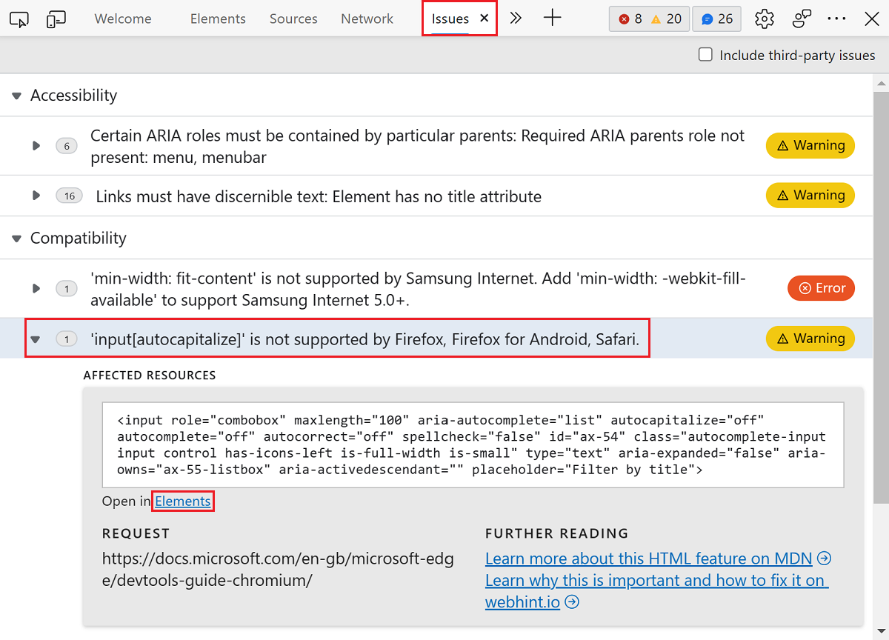
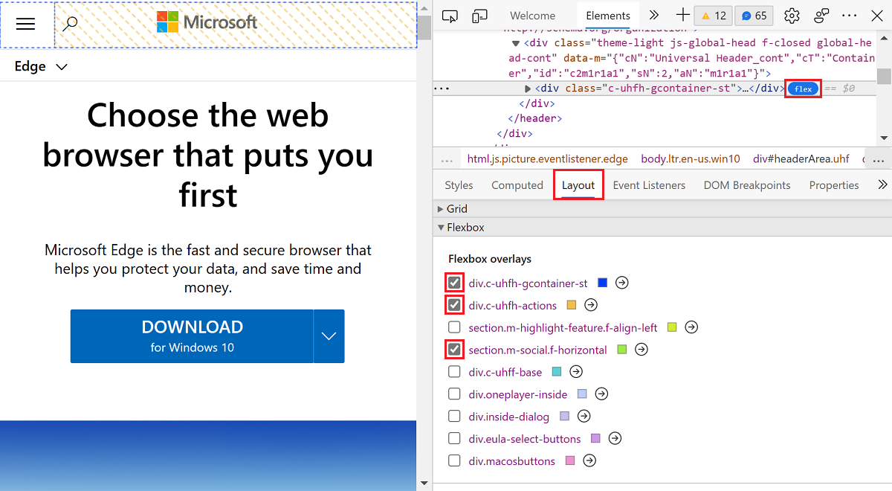

# Experimental features

<!-- 
Policies for maintaining this page:

Cover the latest Canary version and the latest Stable version.  Address both extremes (Stable v[n] and Canary v[n+3]) explicitly, in visible text - this is required, for maintainability of this maximally volatile info.

Keep h2 sections in same order as Microsoft Edge DevTools > Experiments page.
In the heading and UI steps, keep the checkbox label UI string as-is (don't revise or "fix" it).
Include a visible h2 section for every checkbox that's in public-facing Microsoft Edge DevTools > Experiments page.  If no info, write a tautology as a starting point.
When a checkbox is removed from all the preview channels, move its section down to "Previously Experimental features which are now regular features" and comment it out.  Same w/ any "on by default" list item.

Do the following, monthly:

1. Open Edge Stable > Settings > Experiments, go to edge://settings/help, update if needed, make sure the article has an h2 for each checkbox.
2. In each h2 section, write visibly & explicitly:
This checkbox is|is not present in Microsoft Edge Stable v123.
1. Update the Edge Stable list at top, re: On By Default checkboxes. Link down to the h2, do not link to other page, here.

4. Open Edge Canary > Settings > Experiments, go to edge://settings/help, update if needed, make sure the article has an h2 for each checkbox.
5. In each h2 section, write visibly & explicitly:
This checkbox is|is not present in Microsoft Edge Canary v123.
1. Update the Edge Canary list at top, re: On By Default checkboxes. Link down to the h2, do not link to other page, here.
-->

Microsoft Edge DevTools provide access to experimental features that are still in development.  This article lists and describes the experimental features which are in either:
*  The latest version of the Canary preview channel of Microsoft Edge.
*  The latest version of the Stable version of Microsoft Edge.

All [channels of Microsoft Edge](/deployedge/microsoft-edge-channels) have experimental features. You can get the latest experimental features by using the [Microsoft Edge Canary channel](https://www.microsoftedgeinsider.com/welcome?channel=canary). To view the full list available in your version of Microsoft Edge, see the **Settings** > **Experiments** page in DevTools.

<!-- no Warning formatting, because UI already contains red "WARNING" at top -->
These experiments could be unstable or unreliable and may require you to restart DevTools.

<!-- ====================================================================== -->
## Experiments which are turned on by default

The following experimental features are turned on by default. You can use these features right away, without changing any settings. You can turn off these default experimental features, if needed.

<!-- listed in order of the Settings > Experiments pane -->

**Turned on by default in Microsoft Edge Stable v98:**
* [Source order viewer](#source-order-viewer)
* [Emulation: Support dual screen mode](#emulation-support-dual-screen-mode)
* [Enable webhint](#enable-webhint)
* [Show issues in Elements](#show-issues-in-elements)
* [Enable Composited Layers in 3D View](#enable-composited-layers-in-3d-view)
* [DevTools Tooltips](#devtools-tooltips)
* [Detached Elements](#detached-elements)
* [VS Code themes for the DevTools](#vs-code-themes-for-the-devtools)<!-- preserve literal UI string, including "VS" & "the" -->
* [Open source files in Visual Studio Code](#open-source-files-in-visual-studio-code)
* [Enable keyboard shortcut editor](#enable-keyboard-shortcut-editor)

**Turned on by default in Microsoft Edge Canary v100:**
* [Enable Reporting API panel in the Application panel](#enable-reporting-api-panel-in-the-application-panel)
* [Display more precise changes in the Changes tab](#display-more-precise-changes-in-the-changes-tab)
* [Enable webhint](#enable-webhint)
* [Show issues in Elements](#show-issues-in-elements)
* [Open source files in Visual Studio Code](#open-source-files-in-visual-studio-code)
* [Automatically pretty print in the Microsoft Edge Sources Panel](#automatically-pretty-print-in-the-microsoft-edge-sources-panel)

<!-- don't place a comment line between list item lines, above; that would create a gap -->

<!-- ====================================================================== -->
## Turning an experiment on or off

Experimental features are constantly being updated and might cause performance issues.  This is one reason you might want to turn off an experiment.

To turn an experiment on or off in Microsoft Edge:

1. To open DevTools, right-click the webpage, and then select **Inspect**.  Or, press `Ctrl`+`Shift`+`I` (Windows, Linux) or `Command`+`Option`+`I` (macOS).  DevTools opens.

1. In DevTools, on the main toolbar, click the **Settings** () button.  Or, press `Shift`+`?`.

1. On the left side of the **Settings** panel, select the **Experiments** page.

   

1. On the **Experiments** page, select or clear the checkbox for an experiment. Some experiments are turned on (selected) by default.

1. Click **Close** () in the upper right to close DevTools **Settings**.

1. Click the **Reload DevTools** button.

<!-- ====================================================================== -->
## Restoring defaults for which experiments are selected

To restore the default settings for which experimental features are turned on:

1. To open DevTools, right-click the webpage, and then select **Inspect**.  Or, press `Ctrl`+`Shift`+`I` (Windows, Linux) or `Command`+`Option`+`I` (macOS).  DevTools opens.

1. In DevTools, on the main toolbar, click the **Settings** () button.  Or, press `Shift`+`?`.  The **Settings** panel opens, with the **Preferences** page selected.

1. At the bottom of the **Preferences** page, click the **Restore defaults and refresh** button, and then click **Close** ().

<!-- For more information about customizing settings, see [Settings](../customize/index.md#settings) in _Customize Microsoft Edge DevTools_. -->

<!-- ====================================================================== -->
## Filtering the experiments

You can filter the experimental features by text included in the title.

1. To open DevTools, right-click the webpage, and then select **Inspect**.  Or, press `Ctrl`+`Shift`+`I` (Windows, Linux) or `Command`+`Option`+`I` (macOS).  DevTools opens.

1. In DevTools, on the main toolbar, click the **Settings** () button.  Or, press `Shift`+`?`.  The **Settings** panel opens, with the **Preferences** page selected.

1. On the left side of the **Settings** panel, select the **Experiments** page.

1. Click in the **Filter** text box and enter text, such as **timeline**.  As you type, only the matching checkboxes are shown in the **Experiments** page.

1. To end filtering, clear the **Filter** text box.

<!-- ====================================================================== -->
## Providing feedback about the experiments

We're eager to hear your feedback about experimental features.

* Send us your feedback by tweeting [@EdgeDevTools](https://twitter.com/edgedevtools).

* [Contact the Microsoft Edge DevTools team](../contact.md).

* With the **Focus Mode** experiment turned on, at the bottom of the **Activity Bar**, select **Help** () > **Feedback**, to show the **Send feedback** window.

<!-- ====================================================================== -->
## List of experiments

Most of the experiments that appear in the latest version of the Canary preview channel of Microsoft Edge are listed below.

<!-- ====================================================================== -->
## Allow extensions to load custom stylesheets

Some Microsoft Edge Add-ons can define custom color themes for DevTools. If you install an add-on with a theme, you need to enable the **Allow extensions to load custom stylesheets** experiment to view the add-on themes.

*  This checkbox is present in Microsoft Edge Stable v98.
*  This checkbox is present in Microsoft Edge Canary v100.

<!-- ====================================================================== -->
## Capture node creation stacks

To capture JavaScript stack traces when DOM nodes are added to the DOM at runtime, enable this experiment. The captured stack traces are displayed in the **Stack Trace** pane of the **Elements** panel.

*  This checkbox is present in Microsoft Edge Stable v98.
*  This checkbox is present in Microsoft Edge Canary v100.

<!-- ====================================================================== -->
## Protocol Monitor

DevTools communicates with the inspected page using the DevTools protocol.

To monitor the messages sent and received by DevTools to debug the inspected page:

1. To open DevTools, right-click the webpage, and then select **Inspect**.  Or, press `Ctrl`+`Shift`+`I` (Windows, Linux) or `Command`+`Option`+`I` (macOS).  DevTools opens.

1. In DevTools, on the main toolbar, click the **Settings** () button.  Or, press `Shift`+`?`.  The **Settings** panel opens, with the **Preferences** page selected.

1. On the left side of the **Settings** panel, select the **Experiments** page.

1. Select the **Protocol Monitor** checkbox, and then click **Close** () to close **Settings**.

1. Open the **Command Menu** (`Ctrl`+`Shift`+`P`), and then type **protocol** in the text box.

1. Select **Show Protocol monitor**.  The message appears: "One or more settings have changed which requires a reload to take effect."

1. Click the **Reload DevTools** button that appears next to the message.

1. The **Protocol monitor** tool is displayed in the **Drawer** at the bottom of DevTools.

*  This checkbox is present in Microsoft Edge Stable v98.
*  This checkbox is present in Microsoft Edge Canary v100.

<!-- ====================================================================== -->
## Show CSP Violations view

Shows Content Security Policy (CSP) violations.
<!-- needs content, 0 hits in fts in this repo - retry "csp" Find. -->

See [Content Security Policy (CSP)](../../extensions-chromium/store-policies/csp.md).

*  This checkbox is present in Microsoft Edge Stable v98.
*  This checkbox is present in Microsoft Edge Canary v100.

<!-- ====================================================================== -->
## Record coverage while performance tracing

Records coverage while performance tracing.
<!-- needs content, 0 hits in fts in this repo -->

*  This checkbox is present in Microsoft Edge Stable v98.
*  This checkbox is present in Microsoft Edge Canary v100.

<!-- ====================================================================== -->
## Show option to take heap snapshot where globals are treated as root

Shows the option to take a heap snapshot where globals are treated as root.
<!-- needs content -->

*  This checkbox is present in Microsoft Edge Stable v98.
*  This checkbox is present in Microsoft Edge Canary v100.

<!-- ====================================================================== -->
## Show back/forward cache blocking reasons in the frame tree structure view

Whether to show back/forward cache blocking reasons in the frame tree structure view.
<!-- needs content -->

*  This checkbox is not present in Microsoft Edge Stable v98.
*  This checkbox is present in Microsoft Edge Canary v100.

<!-- ====================================================================== -->
## Source order viewer

**Source Order Viewer** is an experiment that displays the order of elements in the webpage source. The on-screen display order can differ from the order of the source, which confuses screen reader and keyboard users. Use the **Source Order Viewer** experiment to find the differences between on-screen display order and the order of the source.

To use the **Source Order Viewer**:

1. To open DevTools, right-click the webpage, and then select **Inspect**.  Or, press `Ctrl`+`Shift`+`I` (Windows, Linux) or `Command`+`Option`+`I` (macOS).  DevTools opens.

1. In DevTools, on the main toolbar, select the **Elements** tab.  If the **Elements** tab isn't visible, click the **More tabs** () button, or else the **More Tools** () button.

1. To the right of the **Styles** tab, click the **Accessibility** tab.  If the **Accessibility** tab isn't visible, click the **More tabs** () button.

1. Under the **Source Order Viewer** section, select the **Show Source Order** checkbox.

1. Highlight any HTML element to display an overlay of the order in the webpage source.

   

For more information, see [Test keyboard support using the Source Order Viewer](../accessibility/test-tab-key-source-order-viewer.md)

*  This checkbox is present in Microsoft Edge Stable v98.
*  This checkbox is not present in Microsoft Edge Canary v100.

<!-- ====================================================================== -->
## Timeline: event initiators

Whether to include event initiators in the Timeline.
<!-- needs content -->

*  This checkbox is present in Microsoft Edge Stable v98.
*  This checkbox is present in Microsoft Edge Canary v100.

<!-- ====================================================================== -->
## Timeline: WebGL-based flamechart

Whether to use a WebGL-based flamechart in the Timeline.
<!-- needs content -->

*  This checkbox is present in Microsoft Edge Stable v98.
*  This checkbox is present in Microsoft Edge Canary v100.

<!-- ====================================================================== -->
## WebAssembly Debugging: Enable DWARF support

Enables DWARF support for WebAssembly debugging.  See [Improved WebAssembly debugging](../whats-new/2019/12/devtools.md#improved-webassembly-debugging) in _What's new in DevTools (Microsoft Edge 80)_.
<!-- Needs content. -->

*  This checkbox is present in Microsoft Edge Stable v98.
*  This checkbox is present in Microsoft Edge Canary v100.

<!-- ====================================================================== -->
## Emulation: Support dual screen mode

See [Emulation: Support dual screen mode](../device-mode/dual-screen-and-foldables.md).

*  This checkbox is present in Microsoft Edge Stable v98.
*  This checkbox is not present in Microsoft Edge Canary v100.

<!-- ====================================================================== -->
## Enable new Advanced Perceptual Contrast Algorithm (APCA) replacing previous contrast ratio and AA/AAA guidelines

Enables the new Advanced Perceptual Contrast Algorithm (APCA), replacing previous contrast ratio and AA/AAA guidelines.
<!-- Needs content. -->

*  This checkbox is present in Microsoft Edge Stable v98.
*  This checkbox is present in Microsoft Edge Canary v100.

<!-- ====================================================================== -->
## Enable full accessibility tree view in the Elements panel

Enables the full accessibility tree view in the **Elements** tool.
<!-- Needs content. -->

*  This checkbox is present in Microsoft Edge Stable v98.
*  This checkbox is present in Microsoft Edge Canary v100.

<!-- ====================================================================== -->
## Enable the Font Editor tool within the Styles pane

You can use the visual [Font Editor](../inspect-styles/edit-fonts.md) to edit fonts.  Use it define fonts and font characteristics.  The visual **Font Editor** helps you do the following:

*  Switch between units for different font properties
*  Switch between keywords for different font properties
*  Convert units
*  Generate accurate CSS code

To use the visual **Font Editor**:

1. To open DevTools, right-click the webpage, and then select **Inspect**.  Or, press `Ctrl`+`Shift`+`I` (Windows, Linux) or `Command`+`Option`+`I` (macOS).  DevTools opens.

1. In DevTools, on the main toolbar, select the **Elements** tab.  If the **Elements** tab isn't visible, click the **More tabs** () button, or else the **More Tools** () button.

1. In the **Styles** tab, select the **Font Editor** icon.

   

For more information about the visual **Font Editor**, see [Edit CSS font styles and settings in the Styles pane](../inspect-styles/edit-fonts.md).

For more information, see [Edit CSS font styles and settings in the Styles pane](../inspect-styles/edit-fonts.md).

*  This checkbox is present in Microsoft Edge Stable v98.
*  This checkbox is present in Microsoft Edge Canary v100.

<!-- ====================================================================== -->
## Enable automatic contrast issue reporting via the Issues Panel

Enables automatic contrast issue reporting in the **Issues** tool.
<!-- Needs content. -->

*  This checkbox is present in Microsoft Edge Stable v98.
*  This checkbox is present in Microsoft Edge Canary v100.

<!-- ====================================================================== -->
## Enable experimental cookie features

Enables experimental cookie features.
<!-- Needs content. -->

*  This checkbox is present in Microsoft Edge Stable v98.
*  This checkbox is present in Microsoft Edge Canary v100.

<!-- ====================================================================== -->
## Enable Reporting API panel in the Application panel

Use the Reporting API to catch certain errors such as security violations or deprecated API calls. These errors happen when users visit your site and are sent to a server endpoint. Enable this experiment to add the **Reporting API** section in the **Application** panel, which lists all of the reports sent to the endpoint.

*  This checkbox is present in Microsoft Edge Stable v98.
*  This checkbox is present in Microsoft Edge Canary v100.

<!-- ====================================================================== -->
## Display more precise changes in the Changes tab

See [More precise changes in the Changes tab](https://developer.chrome.com/blog/new-in-devtools-98/#changes).

*  This checkbox is present in Microsoft Edge Stable v98.
*  This checkbox is present in Microsoft Edge Canary v100.

<!-- ====================================================================== -->
## Sync CSS changes in the Styles pane

Whether to sync CSS changes in the **Styles** tab in the **Elements** tool.
<!-- Needs content. -->

*  This checkbox is not present in Microsoft Edge Stable v98.
*  This checkbox is present in Microsoft Edge Canary v100.

<!-- ====================================================================== -->
## Local overrides for response headers

Whether to use local overrides for response headers.
<!-- Needs content. -->

*  This checkbox is not present in Microsoft Edge Stable v98.
*  This checkbox is present in Microsoft Edge Canary v100.

<!-- ====================================================================== -->
## Log DevTools uncaught exceptions to Console

Controls whether to log DevTools uncaught exceptions in the **Console** tool.
<!-- Needs content. -->

*  This checkbox is present in Microsoft Edge Stable v98.
*  This checkbox is present in Microsoft Edge Canary v100.

<!-- ====================================================================== -->
## Enable webhint

[webhint](https://webhint.io) is an open-source tool that provides real-time feedback for websites and local webpages.  The type of feedback provided by [webhint](https://webhint.io) includes:

*  Accessibility
*  Cross-browser compatibility
*  Security
*  Performance
*  Progressive Web Apps (PWAs)
*  Other common web development issues

The [webhint](https://webhint.io) experiment displays the webhint feedback in the [Issues](../issues/index.md) panel.  Select an issue to display documentation about the solution and a list of the affected resources on your website.  Select a resource link to open the relevant **Network**, **Sources**, or **Elements** pane in DevTools.

*  This checkbox is present in Microsoft Edge Stable v98.
*  This checkbox is present in Microsoft Edge Canary v100.

<!-- ====================================================================== -->
## Show issues in Elements

Enable this experiment to view syntax errors under HTML in the **DOM** view of the **Elements** tool. For more information, see [Wavy underlines highlight code issues and improvements in Elements tool](../whats-new/2021/04/devtools.md#wavy-underlines-highlight-code-issues-and-improvements-in-elements-tool).

*  This checkbox is present in Microsoft Edge Stable v98.
*  This checkbox is present in Microsoft Edge Canary v100.

<!-- ====================================================================== -->
## Enable Composited Layers in 3D View

You can visualize Layers alongside z-indexes and the Document Object Model (DOM). For a comprehensive visual debugging experience, the 3D View and Composited Layers are now combined.

This feature helps you debug without switching contexts as often. Reducing context-switching resolves a major pain point for developers. This feature makes it clear how the code you write affects your web app.

To use **Composited Layers**:

1. To open DevTools, right-click the webpage, and then select **Inspect**.  Or, press `Ctrl`+`Shift`+`I` (Windows, Linux) or `Command`+`Option`+`I` (macOS).  DevTools opens.

1. Press `Esc` to display the **Drawer**.

1. On the **Drawer**, select the **3D View** tool.

1. Open the **Composited Layers** pane.

1. All of the painted layers of the app are displayed.  Try this feature with your own web apps.

   

See also [Navigate z-index, DOM, and layers using the 3D View tool](../3d-view/index.md).

*  This checkbox is present in Microsoft Edge Stable v98.
*  This checkbox is not present in Microsoft Edge Canary v100.

<!-- ====================================================================== -->
## Enable Network Console

**Network Console** is the working title of an experiment to make synthetic network requests over HTTP.  You can use the **Network Console** experiment to send web API requests.

To use the **Network Console**:

1. To open DevTools, right-click the webpage, and then select **Inspect**.  Or, press `Ctrl`+`Shift`+`I` (Windows, Linux) or `Command`+`Option`+`I` (macOS).  DevTools opens.

1. In DevTools, on the main toolbar, select the **Network** tab.  If that tab isn't visible, click the **More tabs** () button, or else the **More Tools** () button.

1. Right-click the network request that you want to change and resend, and then select **Edit and Replay**.

1. In the **Network Console**, edit the network request information.

1. Click **Send**.

   

See [Compose and send web API requests using the Network Console tool](../network-console/network-console-tool.md).

*  This checkbox is present in Microsoft Edge Stable v98.
*  This checkbox is not present in Microsoft Edge Canary v100.

<!-- ====================================================================== -->
## Focus Mode

The Focus Mode experiment provides an **Activity Bar**, which is a compact horizontal or vertical toolbar that works well in a smaller window.  The activity bar contains small icons instead of tabs with text labels, and it replaces the main toolbar.

*  The **Activity Bar** is a compact replacement for the main toolbar.
*  The **Quick View** list is a replacement for the tabs on the Drawer toolbar.

To add a tool to the activity bar, open the tool.

To remove a tool from the Activity Bar:

*  Right-click its icon and then select **Remove from activity bar**.

The following tools are always present on the **Activity Bar**, and cannot be removed:

*  The **Inspect** tool and Device Emulation.
*  The **Elements**, **Console**, and **Sources** tools.

To switch to Focus Mode to show the Activity Bar instead of the main toolbar:

1. In DevTools, select **Settings** () > **Experiments**.

1. Select the **Focus Mode** checkbox.

1. Click the **Close** (**X**) button in the upper right, and then click the **Reload DevTools** button.

   The Activity Bar appears on the left.  The main toolbar goes away.

   The Drawer toolbar is replaced by a **Quick View** list of the tools, instead of tabs.  All of the tab tools are available in the **Quick View** list (including **Elements**, **Console**, and **Sources**).  Drag the Drawer up to expand it.

See also:

* [About the list of tools](../about-tools.md).
* [DevTools: Focus Mode UI](https://github.com/MicrosoftEdge/MSEdgeExplainers/blob/main/DevTools/FocusMode/explainer.md) - draft documentation of this experimental feature, in the Explainers repo.

*  This checkbox is present in Microsoft Edge Stable v98.
*  This checkbox is present in Microsoft Edge Canary v100.

<!-- ====================================================================== -->
## DevTools Tooltips

Enable this experiment to view tooltips for all the different tools and panes in DevTools. For more information, see [Learn about DevTools with informative tooltips](../whats-new/2021/04/devtools.md#learn-about-devtools-with-informative-tooltips).

*  This checkbox is present in Microsoft Edge Stable v98.
*  This checkbox is not present in Microsoft Edge Canary v100.

<!-- ====================================================================== -->
## Detached Elements
<!-- PM: "The Detached Elements checkbox is visible to all Edge users since Edge 93.
The experiment was turned on by default in Edge 93 for all internal (so has a microsoft.com account in Edge) DevTools customers.
Starting with Edge 97, the experiment will be turned on by default for all Edge users" -->

Memory leaks in web applications can be difficult to locate and repair.

The new **Detached Elements** panel in Microsoft Edge DevTools helps investigate and resolve a common source of memory leaks.

Memory leaks occur when the JavaScript code of the application retains an increasing number of objects in memory. The JavaScript code should release these objects so that the memory space can be reused by the browser.

For more information, see [Debug DOM memory leaks with the Detached Elements tool](../memory-problems/dom-leaks.md)

*  This checkbox is present in Microsoft Edge Stable v98.
*  This checkbox is not present in Microsoft Edge Canary v100.

<!-- ====================================================================== -->
## VS Code themes for the DevTools
<!-- preserve literal UI string, including "VS" & "the" -->

To use Visual Studio themes in DevTools, enable the **VS Code themes for the DevTools** experiment. For more information, see [Apply color themes to DevTools](../customize/theme.md).

*  This checkbox is present in Microsoft Edge Stable v98.
*  This checkbox is not present in Microsoft Edge Canary v100.

<!-- ====================================================================== -->
## Open source files in Visual Studio Code

The **Open source files in Visual Studio Code** experiment replaces the code editor of the Sources tool with Visual Studio Code, for editing local files. When you turn on this experiment, Developer Tools detects when you edit a local file, and prompts you to select a folder to use as your Workspace.

When you select a folder to use as your Workspace, selecting any link to a file in DevTools opens the file in Visual Studio Code.  In previous versions of Microsoft Edge, this action opened the file in the code editor of the Sources tool in DevTools.

Any edits that you make in DevTools now change the file on the hard drive and sync live with Visual Studio Code. You can read about setting up your workspace in [Opening source files in Visual Studio Code](../sources/opening-sources-in-vscode.md).

*  This checkbox is present in Microsoft Edge Stable v98.
*  This checkbox is present in Microsoft Edge Canary v100.

<!-- ====================================================================== -->
## Automatically pretty print in the Microsoft Edge Sources Panel

When this experiment is turned on, when you display a minified file in the Sources panel, the file is opened in a single tab in the Sources panel, pretty-printed.

When this experiment is turned off, a UI prompt with a button asks you whether to pretty-print the file.  The file is opened in an additional tab which has an appended suffix of **:formatted**.

*  A _minified_ file is concatenated into a single long line.
*  In contrast, _pretty print_ presents the contents of a file in an indented, more human-readable format.

*  This checkbox is present in Microsoft Edge Stable v98.
*  This checkbox is present in Microsoft Edge Canary v100.

<!-- ====================================================================== -->
<!-- >> [!WARNING]
> These experiments are particularly unstable. Enable at your own risk. -->

<!-- ====================================================================== -->
## Ignore List for JavaScript frames on Timeline

Whether to include the Ignore list for JavaScript frames on the Timeline.
<!-- Needs content. -->

*  This checkbox is present in Microsoft Edge Stable v98.
*  This checkbox is present in Microsoft Edge Canary v100.

<!-- ====================================================================== -->
## Input events on Timeline overview

Controls whether to include Input events on the Timeline overview.
<!-- Needs content. -->

*  This checkbox is present in Microsoft Edge Stable v98.
*  This checkbox is present in Microsoft Edge Canary v100.

<!-- ====================================================================== -->
## Live heap profile

Controls whether to live-update the heap profile.
<!-- Needs content. -->

*  This checkbox is present in Microsoft Edge Stable v98.
*  This checkbox is present in Microsoft Edge Canary v100.

<!-- ====================================================================== -->
## Sampling heap profiler timeline

Controls whether to show the Sampling heap profiler timeline.
<!-- Needs content. -->

*  This checkbox is present in Microsoft Edge Stable v98.
*  This checkbox is present in Microsoft Edge Canary v100.

<!-- ====================================================================== -->
## Enable keyboard shortcut editor

See [Edit the keyboard shortcut for a DevTools action](../customize/shortcuts.md#edit-the-keyboard-shortcut-for-a-devtools-action) in _Customize keyboard shortcuts_.

*  This checkbox is present in Microsoft Edge Stable v98.
*  This checkbox is not present in Microsoft Edge Canary v100.

<!-- ====================================================================== -->
## Timeline: Invalidation tracking

Controls whether to show invalidation tracking on the Timeline.

*  This checkbox is present in Microsoft Edge Stable v98.
*  This checkbox is present in Microsoft Edge Canary v100.

<!-- ====================================================================== -->
## Timeline: Show all events

Controls whether to show all events on the Timeline.

*  This checkbox is present in Microsoft Edge Stable v98.
*  This checkbox is present in Microsoft Edge Canary v100.

<!-- ====================================================================== -->
## Timeline: V8 Runtime Call Stats on Timeline

Controls whether to show v8 runtime call stats on the Timeline.

*  This checkbox is present in Microsoft Edge Stable v98.
*  This checkbox is present in Microsoft Edge Canary v100.

<!-- ====================================================================== -->
## Timeline: Replay input events

Controls whether to replay input events on the Timeline.

*  This checkbox is present in Microsoft Edge Stable v98.
*  This checkbox is present in Microsoft Edge Canary v100.

<!-- /end of checkboxes -->

<!-- ====================================================================== -->
<!-- todo: move these sections into regular articles
## Previously Experimental features which are now regular features

These features have been promoted from experimental to regular features, and have been removed from **Settings** > **Experiments**. -->

<!-- ====================================================================== -->
<!-- ## Enable experimental hide issues menu

Enables the experimental **Hide issues** menu.

*  This checkbox is not present in Microsoft Edge Stable v98.
*  This checkbox is not present in Microsoft Edge Canary v100. -->

<!--
no such, as of v98:
*  [Enable back-forward cache debugging support](#Enable back-forward cache debugging support).

no such, as of v98:
*  Enable experimental hide issues menu.

======================================================================
## Enable dynamic Welcome content
present in 96, 98 - no, not present in 98 anymore

======================================================================
## Enable back-forward cache debugging support
present in 96, 98

Back-forward cache, or *bfcache*. Makes navigating through your browsing history faster by saving snapshots of visited web pages in memory.

Certain web pages can't be cached. Enable this experiment to add the **Back-forward Cache** section to the **Application** panel.  Enabling back-forward cache debugging provides information about web pages that can't be stored in `bfcache`.

======================================================================

*  [Turn on new CSS grid debugging features](../css/grid.md) - removed from experimental status starting with Microsoft Edge 89.

*  [Match keyboard shortcuts from Microsoft Visual Studio Code](../customize/shortcuts.md#match-keyboard-shortcuts-from-visual-studio-code) - removed from experimental status starting with Microsoft Edge 86.

*  [Turn on support to move tabs between panels](../customize/index.md) - removed from experimental status starting with Microsoft Edge 85.

*  [Navigate z-index, DOM, and layers using the 3D View tool](../3d-view/index.md) - removed from experimental status starting with Microsoft Edge 83.

*  The items in the following subsections.

### Enable + button tab menus to open more tools

This experiment started with Microsoft Edge version 89, and is a regular feature as of version 94.

You can now open more tools using the new **More Tools** () icon.  After you turn on the **Enable + button tab menus to open more tools** experiment and reload DevTools, a plus sign () appears to the right of the tab group at the top of DevTools.  To display a list of other tools that you can add to the tab bar, click the **More Tools** () icon.

### Enable Welcome tab

The Welcome tab was an experiment starting with Microsoft Edge version 89.  It's a regular feature as of version 94.

This experiment replaces the **What's New** tool with the new **Welcome** tool.  It displays a refreshed design for the following content.

*  Links to developer docs
*  Latest features
*  Release notes
*  Option to contact the Microsoft Edge DevTools team

The **Welcome** tool opens automatically after each update to Microsoft Edge.  To prevent the display of the **Welcome** tool after each update, clear the checkbox next to **Open tab after each update** under the **Welcome** tool title.

### Enable new CSS Flexbox debugging features

This was an experiment starting with Microsoft Edge version 89, and is a regular feature as of version 94.

This feature provides many new visualizations to help you debug CSS Flexbox layouts.

#### Displaying persistent overlays on Flexbox layouts with the Inspect tool

The **Inspect** tool provides a quick way to identify and visualize CSS Flexbox layouts in a website by hovering on them with the mouse.  Select the **Inspect** () icon in the top-left corner of DevTools.  Then, while debugging the website, hover on a flex container to display outlines around the flex container.

#### Displaying persistent overlays on Flexbox layouts

In Microsoft Edge version 89 or later, the CSS Flexbox feature offers the option to turn on persistent overlays on Flexbox layouts.  Persistent overlays provide the following benefits:
*  Persistent overlays remain visible on the webpage as you scroll, move your mouse, and use other features of DevTools.
*  Multiple persistent overlays can be used at the same time, to allow you to review several Flexbox layouts at once.
*  Persistent overlays offer color configuration options.

To toggle persistent overlays on Flexbox layout, do either of the following:
*  Select the **Flexbox** oval icon next to any Flexbox container displayed in the DOM tree of the **Elements** tool.
*  Open the new **Layout** panel located in the **Elements** tool, and select the checkbox next to each Flexbox container you want to highlight.

#### Configuring persistent overlays

To configure options for persistent overlays for CSS grids or Flexbox layouts, use the **Layout** pane.  The **Layout** pane is located in the **Elements** tool next to the **Styles** and **Computed** panes.

-->
