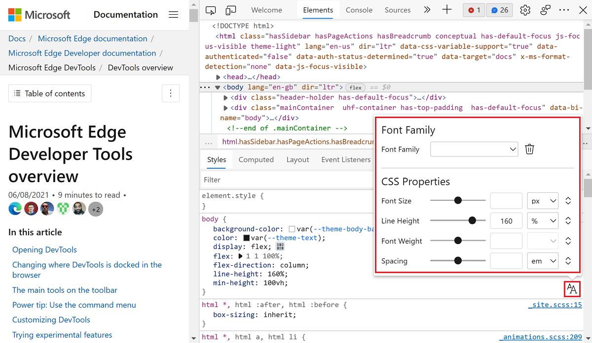

# Experimental features

<!-- 
Policies to keep this page comprehensive and maintainable: 

*  Include a visible h2 section for every checkbox that's in public-facing Microsoft Edge DevTools > Experiments page.  If no info, write a tautology as a starting point.  Add as needed, each month.

*  Keep h2 sections in same order as DevTools > Settings > Experiments.

*  In the heading and UI steps, keep the checkbox label UI string as it appears in the UI; do not revise or "fix" it.

*  Don't change h2 text, that might break a link from UI.

*  When a checkbox is removed from all the channels, delete its section.

Steps to maintain this page monthly: For latest Stable, and for latest Canary:

1. Go to edge://settings/help, update if needed.

1. In Settings > Preferences, Restore Defaults.

1. Open Edge Stable > Settings > Experiments.

1. In the "Experiments which are turned on by default" section, update the Edge Stable & Edge Canary list at top.
   *  Link down to the h2; do not link to some other page, here.

1. Make sure the article has an h2 for each checkbox.

1. In each h2 section, update the presence or absence of "not", and update the version #:

This checkbox is|is not present in Microsoft Edge Stable v123.
This checkbox is|is not present in Microsoft Edge Canary v123.
-->

Microsoft Edge DevTools provide access to experimental features that are still in development.  This article lists and describes the experimental features which are in either:
*  The latest version of the Canary preview channel of Microsoft Edge.
*  The latest version of the Stable version of Microsoft Edge.

All [channels of Microsoft Edge](/deployedge/microsoft-edge-channels) have experimental features. You can get the latest experimental features by using the [Microsoft Edge Canary channel](https://www.microsoftedgeinsider.com/welcome?channel=canary). To view the full list available in your version of Microsoft Edge, see the **Settings** > **Experiments** page in DevTools.

<!-- no Warning formatting, because UI already contains red "WARNING" at top -->
These experiments could be unstable or unreliable and may require you to restart DevTools.

<!-- ====================================================================== -->
## Experiments which are turned on by default

The following experimental features are turned on by default. You can use these features right away, without changing any settings. You can turn off these default experimental features, if needed.

<!-- listed in order of the Settings > Experiments pane -->

**Turned on by default in Microsoft Edge Stable v100:**
* [Enable Reporting API panel in the Application panel](#enable-reporting-api-panel-in-the-application-panel)
* [Display more precise changes in the Changes tab](#display-more-precise-changes-in-the-changes-tab)
* [Enable webhint](#enable-webhint)
* [Show issues in Elements](#show-issues-in-elements)
* [Open source files in Visual Studio Code](#open-source-files-in-visual-studio-code)

**Turned on by default in Microsoft Edge Canary v102:**
* [Enable Reporting API panel in the Application panel](#enable-reporting-api-panel-in-the-application-panel)
* [Display more precise changes in the Changes tab](#display-more-precise-changes-in-the-changes-tab)
* [Tooling for CSS layers in the Styles pane](#tooling-for-css-layers-in-the-styles-pane)
* [Enable webhint](#enable-webhint)
* [Show issues in Elements](#show-issues-in-elements)
* [Open source files in Visual Studio Code](#open-source-files-in-visual-studio-code)
* [Automatically pretty print in the Microsoft Edge Sources Panel](#automatically-pretty-print-in-the-microsoft-edge-sources-panel)

<!-- don't place a comment line between list item lines, above; that would create a gap -->

<!-- ====================================================================== -->
## Turning an experiment on or off

Experimental features are constantly being updated and might cause performance issues.  This is one reason you might want to turn off an experiment.

To turn an experiment on or off in Microsoft Edge:

1. To open DevTools, right-click the webpage, and then select **Inspect**.  Or, press `Ctrl`+`Shift`+`I` (Windows, Linux) or `Command`+`Option`+`I` (macOS).  DevTools opens.

1. In DevTools, on the main toolbar, click the **Settings** () button.  Or, press `Shift`+`?`.

1. On the left side of the **Settings** panel, select the **Experiments** page.

   

1. On the **Experiments** page, select or clear the checkbox for an experiment. Some experiments are turned on (selected) by default.

1. Click **Close** () in the upper right to close DevTools **Settings**.

1. Click the **Reload DevTools** button.

<!-- ====================================================================== -->
## Restoring defaults for which experiments are selected

To restore the default settings for which experimental features are turned on:

1. To open DevTools, right-click the webpage, and then select **Inspect**.  Or, press `Ctrl`+`Shift`+`I` (Windows, Linux) or `Command`+`Option`+`I` (macOS).  DevTools opens.

1. In DevTools, on the main toolbar, click the **Settings** () button.  Or, press `Shift`+`?`.  The **Settings** panel opens, with the **Preferences** page selected.

1. At the bottom of the **Preferences** page, click the **Restore defaults and refresh** button, and then click **Close** ().

<!-- For more information about customizing settings, see [Settings](../customize/index.md#settings) in _Customize Microsoft Edge DevTools_. -->

<!-- ====================================================================== -->
## Filtering the experiments

You can filter the experimental features by text included in the title.

1. To open DevTools, right-click the webpage, and then select **Inspect**.  Or, press `Ctrl`+`Shift`+`I` (Windows, Linux) or `Command`+`Option`+`I` (macOS).  DevTools opens.

1. In DevTools, on the main toolbar, click the **Settings** () button.  Or, press `Shift`+`?`.  The **Settings** panel opens, with the **Preferences** page selected.

1. On the left side of the **Settings** panel, select the **Experiments** page.

1. Click in the **Filter** text box and enter text, such as **timeline**.  As you type, only the matching checkboxes are shown in the **Experiments** page.

1. To end filtering, clear the **Filter** text box.

<!-- ====================================================================== -->
## Providing feedback about the experiments

We're eager to hear your feedback about experimental features.  To share feedback with us, [Contact the Microsoft Edge DevTools team](../contact.md).

One of the UI experiments adds a new way to provide feedback: when the **Focus Mode** experiment is turned on, at the bottom of the **Activity Bar**, select **Help** () > **Feedback**.

<!-- ====================================================================== -->
## List of experiments

Most of the experiments that appear in the latest version of the Canary preview channel of Microsoft Edge are listed below.

<!-- ============================================================================================================================================ -->

<!-- top of list of checkboxes -->

<!-- ====================================================================== -->
## Allow extensions to load custom stylesheets

Some Microsoft Edge Add-ons can define custom color themes for DevTools. If you install an add-on with a theme, you need to enable the **Allow extensions to load custom stylesheets** experiment to view the add-on themes.

*  This checkbox is present in Microsoft Edge Stable v100.
*  This checkbox is present in Microsoft Edge Canary v102.

<!-- ====================================================================== -->
## Capture node creation stacks

To capture JavaScript stack traces when DOM nodes are added to the DOM at runtime, enable this experiment. The captured stack traces are displayed in the **Stack Trace** pane of the **Elements** panel.

*  This checkbox is present in Microsoft Edge Stable v100.
*  This checkbox is present in Microsoft Edge Canary v102.

<!-- ====================================================================== -->
## Protocol Monitor

DevTools communicates with the inspected page using the DevTools protocol.

To monitor the messages sent and received by DevTools to debug the inspected page:

1. To open DevTools, right-click the webpage, and then select **Inspect**.  Or, press `Ctrl`+`Shift`+`I` (Windows, Linux) or `Command`+`Option`+`I` (macOS).  DevTools opens.

1. In DevTools, on the main toolbar, click the **Settings** () button.  Or, press `Shift`+`?`.  The **Settings** panel opens, with the **Preferences** page selected.

1. On the left side of the **Settings** panel, select the **Experiments** page.

1. Select the **Protocol Monitor** checkbox, and then click **Close** () to close **Settings**.

1. Open the **Command Menu** (`Ctrl`+`Shift`+`P`), and then type **protocol** in the text box.

1. Select **Show Protocol monitor**.  The message appears: "One or more settings have changed which requires a reload to take effect."

1. Click the **Reload DevTools** button that appears next to the message.

1. The **Protocol monitor** tool is displayed in the **Drawer** at the bottom of DevTools.

*  This checkbox is present in Microsoft Edge Stable v100.
*  This checkbox is present in Microsoft Edge Canary v102.

<!-- ====================================================================== -->
## Show CSP Violations view

Shows Content Security Policy (CSP) violations.
<!-- needs content, 0 hits in fts in this repo - retry "csp" Find. -->

See [Content Security Policy (CSP)](../../extensions-chromium/store-policies/csp.md).

*  This checkbox is present in Microsoft Edge Stable v100.
*  This checkbox is present in Microsoft Edge Canary v102.

<!-- ====================================================================== -->
## Record coverage while performance tracing

Records coverage while performance tracing.
<!-- needs content, 0 hits in fts in this repo -->

*  This checkbox is present in Microsoft Edge Stable v100.
*  This checkbox is present in Microsoft Edge Canary v102.

<!-- ====================================================================== -->
## Show option to take heap snapshot where globals are treated as root

Shows the option to take a heap snapshot where globals are treated as root.
<!-- needs content -->

*  This checkbox is present in Microsoft Edge Stable v100.
*  This checkbox is present in Microsoft Edge Canary v102.

<!-- ====================================================================== -->
## Show back/forward cache blocking reasons in the frame tree structure view

Whether to show back/forward cache blocking reasons in the frame tree structure view.
<!-- needs content -->

*  This checkbox is present in Microsoft Edge Stable v100.
*  This checkbox is present in Microsoft Edge Canary v102.

<!-- ====================================================================== -->
## Timeline: event initiators

Whether to include event initiators in the Timeline.
<!-- needs content -->

*  This checkbox is present in Microsoft Edge Stable v100.
*  This checkbox is present in Microsoft Edge Canary v102.

<!-- ====================================================================== -->
## Timeline: WebGL-based flamechart

Whether to use a WebGL-based flamechart in the Timeline.
<!-- needs content -->

*  This checkbox is present in Microsoft Edge Stable v100.
*  This checkbox is present in Microsoft Edge Canary v102.

<!-- ====================================================================== -->
## WebAssembly Debugging: Enable DWARF support

Enables DWARF support for WebAssembly debugging.  See [Improved WebAssembly debugging](../whats-new/2019/12/devtools.md#improved-webassembly-debugging) in _What's new in DevTools (Microsoft Edge 80)_.
<!-- Needs content. -->

*  This checkbox is present in Microsoft Edge Stable v100.
*  This checkbox is present in Microsoft Edge Canary v102.

<!-- ====================================================================== -->
## Console: Resolve variable names in expressions using source maps

See [Map the processed code to your original source code, for debugging](../javascript/source-maps.md).

*  This checkbox is present in Microsoft Edge Stable v100.
*  This checkbox is present in Microsoft Edge Canary v102.

<!-- ====================================================================== -->
## Enable new Advanced Perceptual Contrast Algorithm (APCA) replacing previous contrast ratio and AA/AAA guidelines

Enables the new Advanced Perceptual Contrast Algorithm (APCA), replacing previous contrast ratio and AA/AAA guidelines.
<!-- Needs content. -->

*  This checkbox is present in Microsoft Edge Stable v100.
*  This checkbox is present in Microsoft Edge Canary v102.

<!-- ====================================================================== -->
## Enable full accessibility tree view in the Elements panel

Enables the full accessibility tree view in the **Elements** tool.
<!-- Needs content. -->

*  This checkbox is present in Microsoft Edge Stable v100.
*  This checkbox is present in Microsoft Edge Canary v102.

<!-- ====================================================================== -->
## Enable the Font Editor tool within the Styles pane

You can use the visual [Font Editor](../inspect-styles/edit-fonts.md) to edit fonts.  Use it define fonts and font characteristics.  The visual **Font Editor** helps you do the following:

*  Switch between units for different font properties
*  Switch between keywords for different font properties
*  Convert units
*  Generate accurate CSS code

To use the visual **Font Editor**:

1. To open DevTools, right-click the webpage, and then select **Inspect**.  Or, press `Ctrl`+`Shift`+`I` (Windows, Linux) or `Command`+`Option`+`I` (macOS).  DevTools opens.

1. In DevTools, on the main toolbar, select the **Elements** tab.  If the **Elements** tab isn't visible, click the **More tabs** () button, or else the **More Tools** () button.

1. In the **Styles** tab, select the **Font Editor** icon.

   

For more information about the visual **Font Editor**, see [Edit CSS font styles and settings in the Styles pane](../inspect-styles/edit-fonts.md).

For more information, see [Edit CSS font styles and settings in the Styles pane](../inspect-styles/edit-fonts.md).

*  This checkbox is present in Microsoft Edge Stable v100.
*  This checkbox is present in Microsoft Edge Canary v102.

<!-- ====================================================================== -->
## Enable automatic contrast issue reporting via the Issues Panel

Enables automatic contrast issue reporting in the **Issues** tool.
<!-- Needs content. -->

*  This checkbox is present in Microsoft Edge Stable v100.
*  This checkbox is present in Microsoft Edge Canary v102.

<!-- ====================================================================== -->
## Enable experimental cookie features

Enables experimental cookie features.
<!-- Needs content. -->

*  This checkbox is present in Microsoft Edge Stable v100.
*  This checkbox is present in Microsoft Edge Canary v102.

<!-- ====================================================================== -->
## Enable Reporting API panel in the Application panel

Use the Reporting API to catch certain errors such as security violations or deprecated API calls. These errors happen when users visit your site and are sent to a server endpoint. Enable this experiment to add the **Reporting API** section in the **Application** panel, which lists all of the reports sent to the endpoint.

*  This checkbox is present in Microsoft Edge Stable v100.
*  This checkbox is present in Microsoft Edge Canary v102.

<!-- ====================================================================== -->
## Display more precise changes in the Changes tab

See [More precise changes in the Changes tab](https://developer.chrome.com/blog/new-in-devtools-98/#changes).

*  This checkbox is present in Microsoft Edge Stable v100.
*  This checkbox is present in Microsoft Edge Canary v102.

<!-- ====================================================================== -->
## Sync CSS changes in the Styles pane

Whether to sync CSS changes in the **Styles** tab in the **Elements** tool.
<!-- Needs content. -->

*  This checkbox is present in Microsoft Edge Stable v100.
*  This checkbox is present in Microsoft Edge Canary v102.

<!-- ====================================================================== -->
## Local overrides for response headers

Whether to use local overrides for response headers.
<!-- Needs content. -->

*  This checkbox is present in Microsoft Edge Stable v100.
*  This checkbox is present in Microsoft Edge Canary v102.

<!-- ====================================================================== -->
## Use Lighthouse panel with timespan and snapshot modes

*  This checkbox is present in Microsoft Edge Stable v100.
*  This checkbox is present in Microsoft Edge Canary v102.

<!-- ====================================================================== -->
## Tooling for CSS layers in the Styles pane

*  This checkbox is not present in Microsoft Edge Stable v100.
*  This checkbox is present in Microsoft Edge Canary v102.

<!-- ====================================================================== -->
## Log DevTools uncaught exceptions to Console

Controls whether to log DevTools uncaught exceptions in the **Console** tool.
<!-- Needs content. -->

*  This checkbox is present in Microsoft Edge Stable v100.
*  This checkbox is present in Microsoft Edge Canary v102.

<!-- ====================================================================== -->
## Enable webhint

[webhint](https://webhint.io) is an open-source tool that provides real-time feedback for websites and local webpages.  The type of feedback provided by [webhint](https://webhint.io) includes:

*  Accessibility
*  Cross-browser compatibility
*  Security
*  Performance
*  Progressive Web Apps (PWAs)
*  Other common web development issues

The [webhint](https://webhint.io) experiment displays the webhint feedback in the [Issues](../issues/index.md) panel.  Select an issue to display documentation about the solution and a list of the affected resources on your website.  Select a resource link to open the relevant **Network**, **Sources**, or **Elements** pane in DevTools.

*  This checkbox is present in Microsoft Edge Stable v100.
*  This checkbox is present in Microsoft Edge Canary v102.

<!-- ====================================================================== -->
## Show issues in Elements

Enable this experiment to view syntax errors under HTML in the **DOM** view of the **Elements** tool. For more information, see [Wavy underlines highlight code issues and improvements in Elements tool](../whats-new/2021/04/devtools.md#wavy-underlines-highlight-code-issues-and-improvements-in-elements-tool).

*  This checkbox is present in Microsoft Edge Stable v100.
*  This checkbox is present in Microsoft Edge Canary v102.

<!-- ====================================================================== -->
## Focus Mode

Focus Mode is a new user interface for DevTools.  Focus Mode is designed to simplify and streamline the DevTools UI, without compromising its feature set.

Focus Mode replaces the main row of tabs with an **Activity Bar**, which is a compact toolbar with distinctive icons.  The **Activity Bar** makes it possible to pin, rearrange, and open your favorite tools, for quick access.  The **Activity Bar** also provides access to user settings, help, and other features.

Focus Mode also provides a **Quick View** list, to open a second tool alongside the tool that's already selected in the **Activity Bar**.

See [Reduce the complexity of DevTools with Focus Mode](focus-mode.md).

*  This checkbox is present in Microsoft Edge Stable v100.
*  This checkbox is present in Microsoft Edge Canary v102.

<!-- ====================================================================== -->
## Open source files in Visual Studio Code

The **Open source files in Visual Studio Code** experiment replaces the code editor of the Sources tool with Visual Studio Code, for editing local files. When you turn on this experiment, Developer Tools detects when you edit a local file, and prompts you to select a folder to use as your Workspace.

When you select a folder to use as your Workspace, selecting any link to a file in DevTools opens the file in Visual Studio Code.  In previous versions of Microsoft Edge, this action opened the file in the code editor of the Sources tool in DevTools.

Any edits that you make in DevTools now change the file on the hard drive and sync live with Visual Studio Code. You can read about setting up your workspace in [Opening source files in Visual Studio Code](../sources/opening-sources-in-vscode.md).

*  This checkbox is present in Microsoft Edge Stable v100.
*  This checkbox is present in Microsoft Edge Canary v102.

<!-- ====================================================================== -->
## Automatically pretty print in the Microsoft Edge Sources Panel

When this experiment is turned on, when you display a minified file in the Sources panel, the file is opened in a single tab in the Sources panel, pretty-printed.

When this experiment is turned off, a UI prompt with a button asks you whether to pretty-print the file.  The file is opened in an additional tab which has an appended suffix of **:formatted**.

*  A _minified_ file is concatenated into a single long line.
*  In contrast, _pretty print_ presents the contents of a file in an indented, more human-readable format.

*  This checkbox is present in Microsoft Edge Stable v100.
*  This checkbox is present in Microsoft Edge Canary v102.

<!-- ============================================================================================================================================ -->
<!-- >> [!WARNING]
> These experiments are particularly unstable. Enable at your own risk. -->

<!-- ====================================================================== -->
## Ignore List for JavaScript frames on Timeline

Whether to include the Ignore list for JavaScript frames on the Timeline.
<!-- Needs content. -->

*  This checkbox is present in Microsoft Edge Stable v100.
*  This checkbox is present in Microsoft Edge Canary v102.

<!-- ====================================================================== -->
## Input events on Timeline overview

Controls whether to include Input events on the Timeline overview.
<!-- Needs content. -->

*  This checkbox is present in Microsoft Edge Stable v100.
*  This checkbox is present in Microsoft Edge Canary v102.

<!-- ====================================================================== -->
## Live heap profile

Controls whether to live-update the heap profile.
<!-- Needs content. -->

*  This checkbox is present in Microsoft Edge Stable v100.
*  This checkbox is present in Microsoft Edge Canary v102.

<!-- ====================================================================== -->
## Sampling heap profiler timeline

Controls whether to show the Sampling heap profiler timeline.
<!-- Needs content. -->

*  This checkbox is present in Microsoft Edge Stable v100.
*  This checkbox is present in Microsoft Edge Canary v102.

<!-- ====================================================================== -->
## Timeline: invalidation tracking

Controls whether to show invalidation tracking on the Timeline.

*  This checkbox is present in Microsoft Edge Stable v100.
*  This checkbox is present in Microsoft Edge Canary v102.

<!-- ====================================================================== -->
## Timeline: show all events

Controls whether to show all events on the Timeline.

*  This checkbox is present in Microsoft Edge Stable v100.
*  This checkbox is present in Microsoft Edge Canary v102.

<!-- ====================================================================== -->
## Timeline: V8 Runtime Call Stats on Timeline

Controls whether to show v8 runtime call stats on the Timeline.

*  This checkbox is present in Microsoft Edge Stable v100.
*  This checkbox is present in Microsoft Edge Canary v102.

<!-- ====================================================================== -->
## Timeline: Replay input events

Controls whether to replay input events on the Timeline.

*  This checkbox is present in Microsoft Edge Stable v100.
*  This checkbox is present in Microsoft Edge Canary v102.
