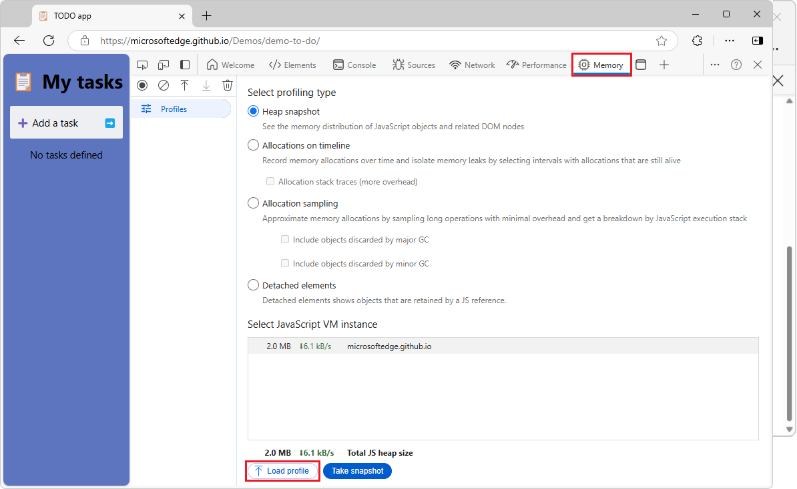

# Share enhanced performance and memory traces

The **Performance** and **Memory** tools record runtime data about your webpage. Exploring the recorded data makes it possible to improve your webpage's memory usage or runtime performance.

Additionally, the recorded data can be exported to files on disk. The exported files are called _traces_.

Exporting performance and memory traces is useful when you want to share these files with other people to get help with investigating issues. An exported trace is a `.json`, `.heapsnapshot`, `.heapprofile`, or `.heaptimeline` file which can be imported in DevTools at any time.

By default, traces contain minimal information about the runtime data from the traced webpage, but traces can also be exported as _enhanced traces_, as an experimental feature. An enhanced trace is a `.devtools` file which contains much more runtime data from the traced webpage.  Enhanced traces make it easier to resolve performance and memory issues, by recreating the environment in which the trace was recorded, and by providing original source files.

Using enhanced traces makes it possible to reliably resolve source code references found in imported traces to the actual runtime code in the **Sources** tool. Additionally, if source maps were present when a trace was recorded, or if they are stored on the [Azure Artifacts Symbol Server](../javascript/consume-source-maps-from-azure.md), it will also be possible to resolve code references to their original source code.

<!-- ====================================================================== -->
## Differences between normal and enhanced traces

#### Normal traces

A normal trace only contains some of the information that's present in a webpage. Much of the original code is lost and only the recorded performance or memory data of the webpage is preserved in the trace. For example, when importing a `.heapsnapshot` memory trace that was recorded during another DevTools session or on another computer, there's no way to go from an object in the **Memory** tool to its constructor in the **Sources** tool.

Similarly, in the **Performance** tool, when you import a performance trace recorded earlier:

*  The trace needs to have been recorded on the same site and same configuration to be able to map from the performance report to the JavaScript that was running in the browser.
*  If file or function names have changed since the recording was taken, the mapping is prone to errors.

#### Enhanced traces

An enhanced trace retains much more information about the webpage where the recording took place. For example, an enhanced trace contains the execution context and the list of parsed scripts, and can optionally contain console messages, script sources, and a snapshot of the DOM tree.

When an enhanced trace is imported in DevTools, a new DevTools window appears. This new window isn't connected to the webpage that's running in your browser, and instead re-creates part of the environment in which the trace was originally recorded.

For example, if a snapshot of the DOM was recorded in the enhanced trace, the **Elements** tool displays this snapshot. If console messages were recorded, the **Console** tool prints these messages. The **Sources** tool displays the scripts that were present during the recording.

Enhanced traces can only be imported in Microsoft Edge, while normal traces are compatible with other browsers based on the Chromium engine.

<!-- ====================================================================== -->
## Set the default trace type

By default, the **Performance** and **Memory** tools export data as normal traces, but you can set the default trace type to `enhanced`.

To change the trace type:

1. Open DevTools by pressing **Ctrl+Shift+I** (Windows, Linux) or **Command+Option+I** (macOS).

1. In DevTools, in the upper right, click **Settings** ().  **Settings** opens, with the **Preferences** page selected.

1. In the **Persistence** section of the **Preferences** page, select the **Export enhanced performance and memory traces** checkbox:

   

1. Enhanced traces can also optionally include console messages, script sources, and DOM elements.  To control what to include in enhanced traces, use these checkboxes:

   * **Include console message in enhanced traces**.
   * **Include script sources in enhanced traces**.
   * **Include DOM snapshots in enhanced traces (experimental)**.

   

<!-- ====================================================================== -->
## Export a trace from the Performance tool

To export a performance recording from the **Performance** tool:

1. Open the **Performance** tool.

1. Click **Record** and run the scenario you want to investigate the performance of by interacting with the webpage, and then click **Stop**.

1. When the performance profile appears, click **Save profile** ():

   

1. Choose a location to save the trace file on your disk:

   

   The trace is a `.json` file if you set the default trace type to normal, and it is a `.devtools` file if you set the default trace type to enhanced.

<!-- ====================================================================== -->
## Export a trace from the Memory tool

To export memory information from the **Memory** tool:

1. Open the **Memory** tool.

1. Choose the type of memory recording you're interested in, such as **Heap Snapshot**. The following instructions are similar if you choose a different memory recording type. To learn more about the different memory recording types, see [Fix memory problems](../memory-problems/index.md).

1. Click **Take Snapshot**.

1. When the snapshot is recorded, click the **Save** button in the **Memory** tool sidebar:

   

1. Choose a location to save the trace file on your disk:

   

   The trace is a `.heapsnapshot`, `.heapprofile`, or `.heaptimeline` file if you set the default trace type to normal, and it is a `.devtools` file if you set the default trace type to enhanced.

<!-- ====================================================================== -->
## Choose a trace type when exporting

Traces are exported as normal or enhanced traces, depending on the **Export Enhanced Performance and Memory Traces** option. To change the default trace type, see [Set the default trace type](#set-the-default-trace-type). You can also choose the type of trace you want when exporting.

To choose a different trace type when exporting:

1. Right-click (or hold the **Ctrl** key and click) the **Save profile** () in the **Performance** tool or the **Save** button in the **Memory** tool.

1. Click either **.devtools (enhanced format for Microsoft Edge)** if you want to export an enhanced trace, or click **.json (works with Microsoft Edge and Chromium browsers)** if you want a normal trace.

   

<!-- ====================================================================== -->
## Import a trace in the Performance tool

To import a trace in the **Performance** tool:

1. Open the **Performance** tool.

1. Click **Load profile** ():

   

1. Locate the trace file on your disk. It's either a `.devtools` file (for enhanced traces) or a `.json` file (for normal traces):

   

1. Open the file.

   If the file is an enhanced trace, a new DevTools window appears, showing the performance profile and the extra runtime information that was recorded displayed in the **Sources**, **Console**, and **Elements** tools.

   If the file is a normal trace, the performance profile appears in the **Performance** tool, and the rest of the DevTools tabs continue to show information related to the current webpage.

<!-- ====================================================================== -->
## Import a trace in the Memory tool

To import a trace in the **Memory** tool:

1. Open the **Memory** tool.

1. Click **Load**.

   

1. Locate the trace file on your disk. It's either a `.devtools` file (for enhanced traces) or a `.heapsnapshot`, `.heaptimeline`, or `.heapprofile` file (for normal traces).

   

1. Open the file.

   If the file is an enhanced trace, a new DevTools window appears, showing the memory information and the extra runtime information that was recorded displayed in the **Sources**, **Console**, and **Elements** tools.

   If the file is a normal trace, the memory information appears in the **Memory** tool, and the rest of the DevTools tabs continue to show information related to the current webpage.

<!-- ====================================================================== -->
## Share feedback about enhanced traces

Enhanced traces is an experimental feature which hopefully makes it easier to collaborate on resolving performance and memory issues by seeing unminified code.

The Microsoft Edge DevTools team welcomes any feedback you may have about enhanced traces. If you've tried this new feature, please feel free to report any problems or ideas about it on our [GitHub repository](https://github.com/MicrosoftEdge/DevTools/issues/122).
