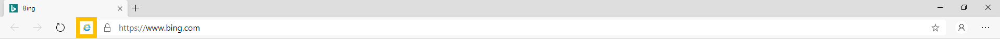
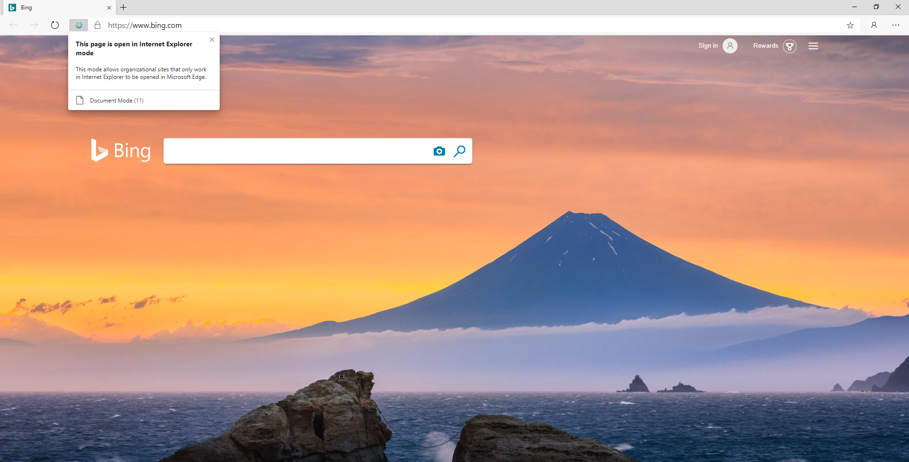

# Internet Explorer mode and the DevTools

This document describes how Internet Explorer mode (IE mode) integrates with the Microsoft Edge (Chromium) DevTools.

## Understanding IE mode

IE mode is a mechanism by which enterprises may specify a set of web sites that, until now, only worked in Internet Explorer 11. When these web sites are viewed in Microsoft Edge (Chromium), a full instance of Internet Explorer 11 is running and rendered within the tab. This allows enterprises to manage compatibility for IE document modes, ActiveX controls, and other legacy components that are currently not compatible with any modern web browsers.

Within IE mode, the rendering process is entirely based in Internet Explorer 11. The Microsoft Edge (Chromium) manager process manages the lifetime of the rendering process, but it is constrained to the tab's lifetime on a given site or application. When a tab is rendering in IE mode, a badge appears in the address bar for the given tab:

IE mode is currently available on Windows 10 Version 1903 (May 2019 Update) but is coming soon to all supported Windows platforms.

## Launching the DevTools on a tab in IE mode

If you are trying to view the document mode of a web site in IE mode, you can click on the badge in the address bar.

While on a tab in IE mode, the DevTools will not work. Pressing `F12` or `Ctrl`+`Shift`+`I` will only launch a blank instance of the Microsoft Edge (Chromium) DevTools with a message that reads: "Developer Tools are not available in Internet Explorer mode. To debug the page, open it in Internet Explorer 11." **View Source** will launch Notepad and **Inspect Element** will not be visible in the context menu in IE mode.

This is because a number of components in the DevTools (like the Network and Performance tools) would break when the rendering engine switches from Chromium to Internet Explorer 11 in IE mode. To give us feedback, click the `:)` icon.

If you are developing or maintaining an Internet Explorer 11-based web site or application, we recommend navigating to the same page in Internet Explorer 11. On Windows 10, you can find the shortcut for Internet Explorer 11 on the Start Menu underneath Windows Accessories. On Windows 7, you can find Internet Explorer 11 on the main Start Menu. You can then launch the Internet Explorer DevTools by pressing `F12` or clicking **Inspect element** in the context menu. To learn more about how to use those tools, click [here](/previous-versions/windows/internet-explorer/ie-developer/samples/bg182326(v%3dvs.85)).

## Remote debugging and IE mode

You can launch Microsoft Edge (Chromium) with remote debugging enabled, which is typically how tools like Visual Studio or VS Code launch Edge, from the command line:

`start msedge --remote-debugging-port=9222`

When Microsoft Edge (Chromium) is launched with this command line argument, IE mode will be unavailable. You can still navigate to web sites or applications that would otherwise be in IE mode but the content will render via Chromium, not Internet Explorer 11. You can expect that the parts of those pages that rely on IE11, like ActiveX controls, will not render correctly. The IE mode badge will no longer appear in the address bar.

IE mode will remain unavailable until you completely close Microsoft Edge (Chromium).