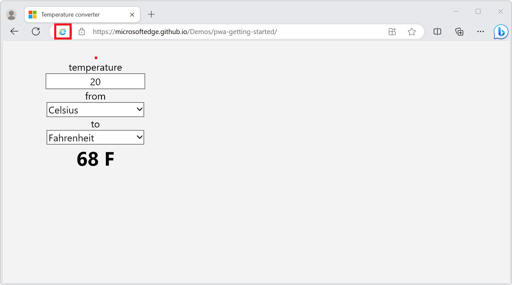
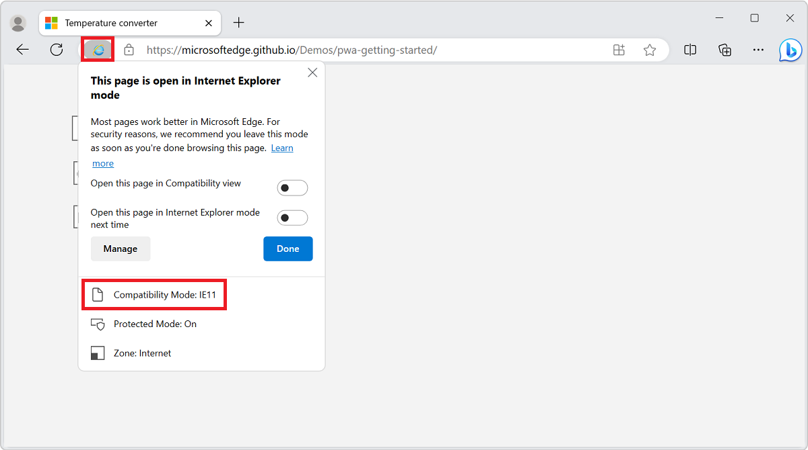
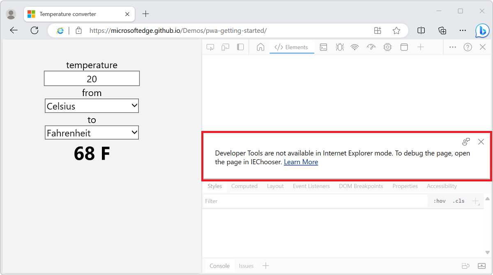

# Use DevTools in Internet Explorer mode (IE mode)

Internet Explorer mode (IE mode) integrates with Microsoft Edge DevTools.   IE mode allows enterprises to specify a list of websites that only work in Internet Explorer 11. When you navigate to these websites in Microsoft Edge, an instance of Internet Explorer 11 runs and renders the site in a tab.

IE mode allows enterprises to manage compatibility with technologies that are currently not compatible with any modern web browsers.

Support for the following technologies is included in IE mode:
*  IE document modes.
*  ActiveX controls.
*  Other legacy components.

In IE mode, the rendering process is based on Internet Explorer 11. The Microsoft Edge process manager handles the lifetime of the rendering process.  The rendering process is constrained to the lifetime of the tab for a specific site (or app).  When a tab renders in IE mode, the IE mode indicator icon appears in the address bar for the specific tab.



IE mode is available on Windows 10 Version 1903 (May 2019 Update), and is coming to all supported Windows platforms.


<!-- ====================================================================== -->
## Open DevTools on a tab in IE mode

The IE mode indicator icon appears in the address bar if the Enterprise admin has configured the website to appear in IE mode.  To view the compatibility mode of a website in IE mode, click the IE mode indicator icon in the address bar:



If a tab uses IE mode, the tab has the following limitations:

*  **Inspect Element** isn't visible on the right-click menu.

*  Right-clicking and then selecting **View Source** launches Notepad.

*  Pressing **F12** or **Ctrl+Shift+I** opens a blank instance of the Microsoft Edge DevTools and displays the following message: **Developer Tools are not available in Internet Explorer mode.  To debug the page, open the page in IEChoose.**



To debug the content of an IE mode tab, use IEChooser to open Internet Explorer DevTools, as follows:

1. In Windows, open the **Run** dialog.  For example, press **Windows logo key + R**.

1. Enter `%systemroot%\system32\f12\IEChooser.exe`, and then click **OK**.

1. In IEChooser, select the entry for the IE mode tab.


<!-- ====================================================================== -->
## Remote debugging in IE mode

Launch Microsoft Edge with remote debugging turned on from the command-line interface.  Microsoft Visual Studio, Microsoft Visual Studio Code, and other development tools typically run a command to launch Microsoft Edge.  The following command launches Microsoft Edge with the remote debugging port set to `9222`.

```shell
start msedge --remote-debugging-port=9222
```

After you launch Microsoft Edge using a command-line argument, IE mode is unavailable.  You can still navigate to websites (or apps) that are otherwise displayed in IE mode.  The website (or app) content renders using Chromium, not Internet Explorer 11. Parts of the webpages that rely on Internet Explorer 11, such as ActiveX controls, might not render correctly.  The IE mode indicator icon doesn't appear in the address bar.

IE mode remains unavailable until you close and restart Microsoft Edge.


<!-- ====================================================================== -->
## Replace Internet Explorer automation

If you have an existing application that uses the [InternetExplorer](/previous-versions/windows/internet-explorer/ie-developer/platform-apis/aa752084(v=vs.85)) object to automate Internet Explorer 11, but the Internet Explorer 11 desktop application isn't available, your application won't work.  Internet Explorer 11 will be retired on June 15, 2022.  See [The future of Internet Explorer on Windows 10 is in Microsoft Edge](https://blogs.windows.com/windowsexperience/2021/05/19/the-future-of-internet-explorer-on-windows-10-is-in-microsoft-edge/).

Microsoft Edge doesn't support automating IE mode through the `InternetExplorer` object, so applications that rely on this object will need to be updated, by using one of the recommended alternatives below.  Applications that use the [WebBrowser](/previous-versions/windows/internet-explorer/ie-developer/platform-apis/aa752040(v=vs.85)) control will continue to work, and won't be affected by the removal of Internet Explorer 11.

If your automation application doesn't require IE mode for the website (or app) content to function correctly, we recommend updating your application to use Microsoft Edge instead of Internet Explorer 11. Many available automation tools support Microsoft Edge, including WebDriver and Playwright.

*  To learn more about automating Microsoft Edge using WebDriver, see [Use WebDriver to automate Microsoft Edge](../../webdriver-chromium/index.md).
*  To learn more about using Playwright, see [Use Playwright to automate and test in Microsoft Edge](../../playwright/index.md).

Applications that require IE mode for the website (or app) content to function correctly should use the `WebBrowser` control.  The `WebBrowser` control uses the Internet Explorer platform (MSHTML/Trident) to render web content, and will work even if the Internet Explorer 11 desktop application isn't available.


<!-- ====================================================================== -->
## See also

*  [What is Internet Explorer (IE) mode?](/deployedge/edge-ie-mode)
*  [Configure IE mode policies](/deployedge/edge-ie-mode-policies)
*  [Fix web compatibility issues using document modes and the Enterprise Mode site list](/internet-explorer/ie11-deploy-guide/fix-compat-issues-with-doc-modes-and-enterprise-mode-site-list)
