# Overview of DevTools

<!-- be careful merging PRs; preserve page structure per PR 1700 (misc-fixes branch) -->

<!--
icon tagging to maintain here & propagate:
click the **Inspect tool** () button.
click the **Device Emulation** () button.
click the **More tabs** () button.
click the **More Tools** () button.
click the **JavaScript errors counter** () button.
click the **Issues counter** () button.
click the **Settings** () button.
click the **Send Feedback** () button.
click the **Customize and control DevTools** () menu button.
click the **Close** DevTools () button.
-->

Microsoft Edge DevTools is a set of web development tools that appears next to a rendered webpage in the Microsoft Edge Browser.

When you install Microsoft Edge, you not only get a browser, you also get Developer Tools, which provide a powerful way to inspect, debug, and even create web projects.  These developer tools are partly based on the tools in the Chromium open-source project.  The Microsoft Edge Developer Tools are also called _Microsoft Edge DevTools_, or simply _DevTools_.

With DevTools, you can do the following:

*  Inspect and change the current webpage, live in the browser.

*  Emulate how your product behaves on different devices and simulate a mobile environment, complete with different network conditions.

*  Inspect, tweak, and change the styles of elements in the webpage using live tools with a visual interface.

*  Debug your JavaScript, using breakpoint debugging and with a live Console that evaluates JavaScript expressions as you type.

*  Find accessibility, performance, compatibility, and security issues in your products, and learn how to use DevTools to fix the accessibility issues that are found.

*  Inspect the network traffic, and see where network delays are located.

*  Inspect where the browser stored content, in various formats, that make up the current webpage.

*  Evaluate the performance of your product, to find memory problems and rendering issues.

*  Use a development environment to synchronize file changes in DevTools, sync'ing changes between the local file system and files from the web.

<!-- ====================================================================== -->
## Opening DevTools

To open DevTools, right-click any item on a webpage and then select **Inspect**.  DevTools opens, with the **Elements** tool selected.

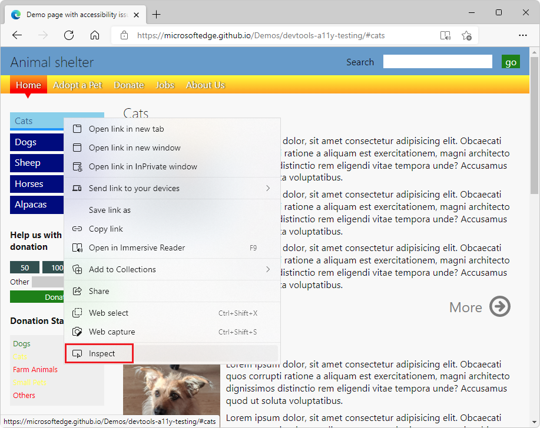

DevTools opens, with the right-clicked element highlighted in the **Elements** tool:

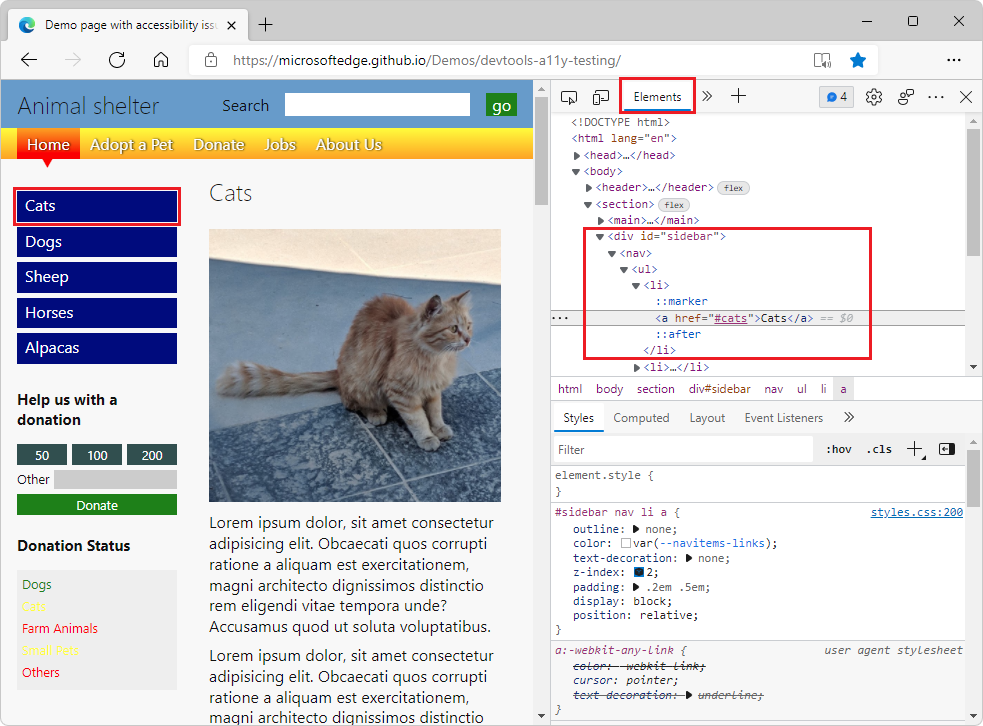

Or, press `F12`.  DevTools opens, with the **Welcome** tool or the last-used tool selected.

Or, press `Ctrl`+`Shift`+`I` (on Windows/Linux) or `Command`+`Option`+`I` (on macOS).  DevTools opens, with the **Welcome** tool or the last-used tool selected.

See also [Open DevTools](./open/index.md).

<!-- ====================================================================== -->

## Keyboard support

You can interact with DevTools using the mouse or keyboard.  Keyboard shortcuts provide a quick way to access functionality, and are needed for accessibility.  Various tools are increasingly accessible through the keyboard and assistive technologies such as screen readers.  See [Keyboard shortcuts](./shortcuts/index.md) and [Navigate DevTools with assistive technology](accessibility/navigation.md).

<!-- ====================================================================== -->
## Changing where DevTools is docked in the browser

To change where DevTools is placed within the browser window:

*  Click the **Customize and control DevTools** () menu button, and then in the **Dock side** section, select a layout option.

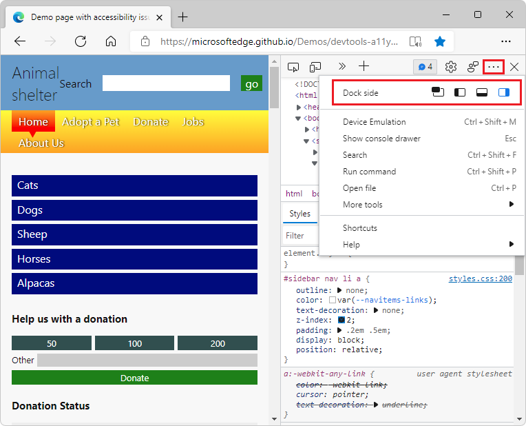

**Dock to left** or **Dock to right** keeps DevTools side-by-side with your web product, and is excellent when you [Emulate mobile devices (Device Emulation)](device-mode/index.md).  The **Dock to left** and **Dock to right** options work best with high-resolution displays.

**Dock to right** is the default placement of DevTools:

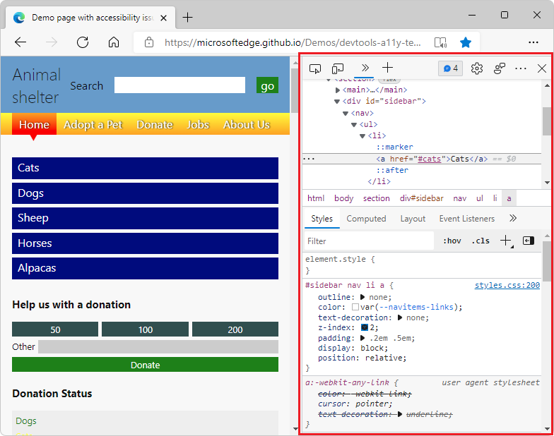

**Dock to left** is another side-by-side option:

**Dock to bottom** helps you when you don't have enough horizontal display space, or you want to debug long text in the DOM or **Console**:

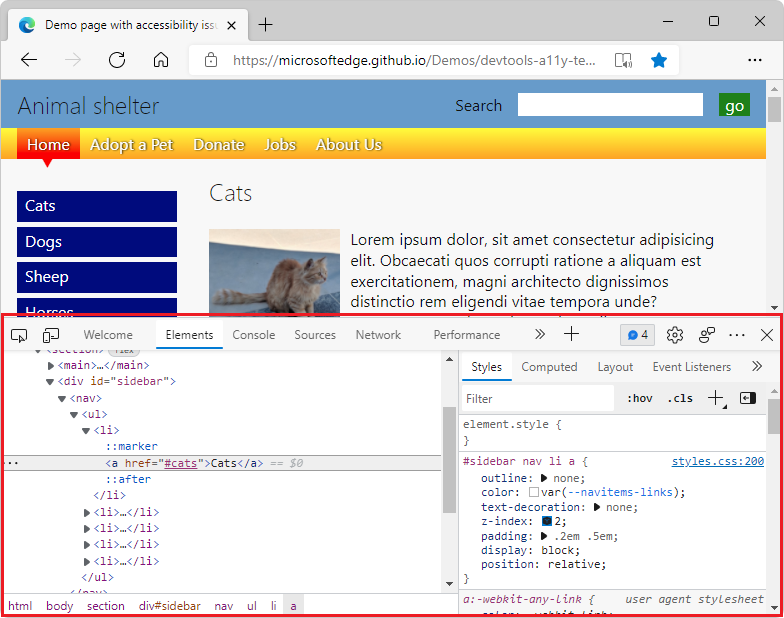

**Undock into separate window** helps you work with several monitors or if you need to work on a full-screen app:

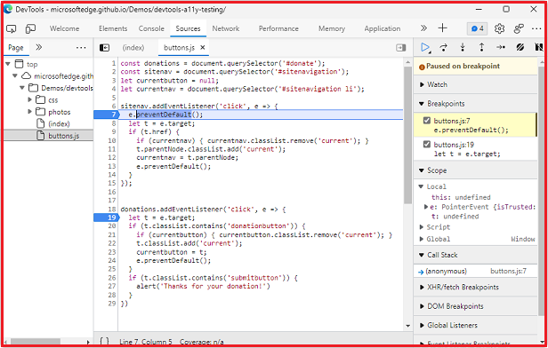

See also [Change DevTools placement (Undock, Dock to bottom, Dock to left)](customize/placement.md).

<!-- ====================================================================== -->
## Features of the main toolbar

DevTools gives you an amazing amount of power to inspect, debug, and change the web product currently displayed in the browser.  Most of the tools display the changes live.  Live updates make the tools incredibly useful to refine the appearance and navigation or functionality of a web project without the need to refresh or build it.

<!-- clarify: DevTools also allows you to change web-based third-party products on your computer. -->

There are two toolbars: the main toolbar at the top of DevTools, and the **Drawer** at the bottom when you press `Esc`.

By default, the main toolbar contains the following features:

* Icon tools
   *  **Inspect tool** () toggle button.
   *  **Device Emulation** () button.
* Tool tabs
   *  **Welcome** tool.
   *  **Elements** tool.  Always present.
   *  **Console** tool.  Always present.
   *  **Sources** tool.  Always present.
   *  **Network** tool.
   *  **Performance** tool.
   *  **Memory** tool.
   *  **Application** tool.
   *  **Security** tool.
   *  **Lighthouse** tool.
   *  **CSS Overview** tool.
* Icons
   *  **More tabs** () button.
   *  **More Tools** () button.
   *  **JavaScript errors counter** () button.
   *  **Issues counter** () button.
   *  **Settings** () button.
   *  **Send Feedback** () button.
   *  **Customize and control DevTools** () menu button.
   *  **Close** DevTools () button.

The toolbar features are described below.

### Inspect tool

When you click the **Inspect tool** () button, you can select an element on the current webpage.  While the **Inspect** tool is active, you can move your mouse over different parts of the webpage to get detailed information about page elements, along with a multi-color overlay that shows the layout dimensions, padding, and margin of the page element.

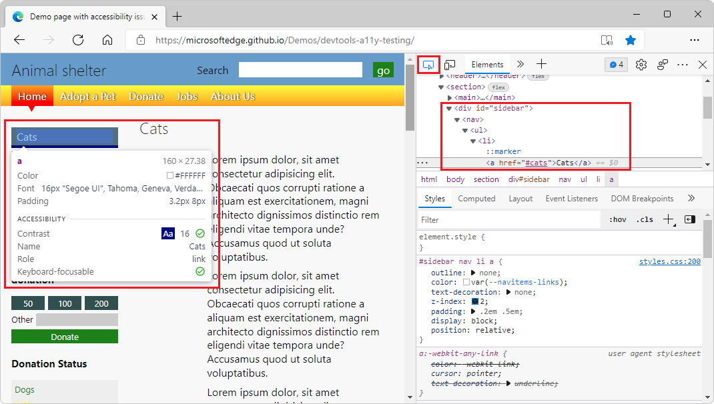

### Device Emulation

Click the **Device Emulation** () button to display the current web product in an emulated device mode.  The **Device Emulation** tool allows you to run and test how your product reacts when you resize the browser.  It also gives you an estimation of the layout and behavior on a mobile device.

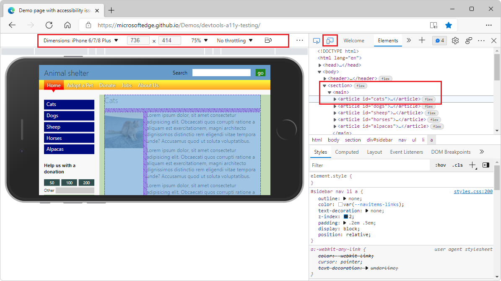

See [Emulate mobile devices (Device Emulation)](device-mode\index.md).

### Welcome tool

Includes information about the new features of DevTools, how to contact the team, and provides information about certain features.

### Elements tool

Allows you to edit or inspect HTML and CSS.  You can edit in the tool while displaying the changes live in the browser.

The **Elements** tool is always present on the main toolbar.

### Console tool

The [Console](console/index.md) allows you to display and filter log messages.  Log messages are automated logs of the browser like network requests and developer-generated logs.  You can also run JavaScript directly in the **Console** in the context of the current window or frame.

The **Console** tool is always present on the main toolbar.

### Sources tool

The [Sources](./sources/index.md) tool is a code editor and JavaScript debugger.  You can edit projects, maintain snippets, and debug your current project.

The **Sources** tool is always present on the main toolbar.

### Network tool

The **Network** tool allows you to monitor and inspect requests or responses from the network and browser cache.  You can filter requests and responses to fit your needs and simulate different network conditions.

See [Inspect network activity](./network/index.md).

### Performance tool

See [Get started analyzing runtime performance](evaluate-performance/index.md).

### Memory tool

See [Fix memory problems](memory-problems/index.md).

### Application tool

See [View, edit, and delete cookies](storage/cookies.md).

### Security tool

See [Understand security issues using the Security tool](security/index.md).

### Lighthouse tool

See [Lighthouse tool](lighthouse/lighthouse-tool.md).

### CSS Overview tool

Identify potential CSS improvements.  Article pending. <!-- (issues/index.md) -->

### More tabs button

To display a tool that's open but hidden because the window is too narrow, click the **More tabs** () button.

### More Tools button

To add a tool to the toolbar, click the **More Tools** () button.

### JavaScript errors counter

The **JavaScript errors counter** () button displays the following:

*  A red circle containing an `X`, followed by the number of JavaScript errors that were automatically detected on the current webpage.

*  A yellow triangle containing an exclamation mark, followed by the number of JavaScript warnings that were automatically detected on the current webpage.

The tooltip for the **JavaScript counter** button is **Open Console to view # errors, # warnings**.

Click the JavaScript errors counter to open the [Console](console/index.md) and learn about the error.

### Issues counter

The **Issues counter** () button shows the number of HTML or CSS issues that are automatically found on the current webpage.

The tooltip for the **Issues counter** is **Open Issues to view # issues**.  The button's icon is a blue speech bubble icon followed by the number of HTML or CSS issues.

Click the **Issues counter** to open the [Issues](./issues/index.md) tool.

### Settings button

To open the DevTools **Settings** webpage, click the **Settings** () button.  The **Settings** page contains the following sub-pages:

*  Preferences
*  Workspace
*  Experiments
*  Library Code
*  Devices
*  Throttling
*  Locations
*  Shortcuts
*  Symbol Server

See [Settings](customize/index.md#settings) in _Customize DevTools_.

### Send Feedback button

To open the **Send Feedback** dialog, click the **Send Feedback** () button.  The **Send Feedback** dialog opens.  Enter information to describe what happened and automatically includes a screenshot.  Use **Send Feedback** to connect with DevTools team to report problems, issues, or suggest ideas.

See [Contact the Microsoft Edge DevTools team](contact.md).

### Customize and control DevTools menu

The **Customize and control DevTools** () button opens a dropdown menu that enables you to define where to dock DevTools, search, open different tools, and more.

### Close DevTools button

<!-- todo: add icon -->
Click the **Close** DevTools () button in the upper right corner of DevTools to close DevTools and use the entire window to display the current webpage.

<!-- ====================================================================== -->
## List of all tools

DevTools includes the following tools.
<!-- add Desc column -->

| Tool | Article |
| --- | --- |
| **3D View** tool | [Navigate z-index, DOM, and layers using the 3D View tool](3d-view/index.md) |
| **Animations** tool | [Inspect animations](inspect-styles/animations.md) |
| **Application** tool | [View, edit, and delete cookies](storage/cookies.md) |
| **Changes** tool | [Track changes to files using the Changes tool](changes/changes-tool.md) |
| **Console** tool | [Console overview](console/index.md) |
| **Coverage** tool | [Find unused JavaScript and CSS code with the Coverage tool](coverage/index.md) |
| **CSS Overview** tool | Identify potential CSS improvements. <!-- (issues/index.md) --> |
| **Detached Elements** tool | [Debug DOM memory leaks with the Detached Elements tool](memory-problems/dom-leaks.md) |
| **Developer Resources** tool |  |
| **Device Emulation** | [Emulate mobile devices (Device Emulation)](device-mode/index.md) |
| **Elements** tool | [CSS features reference](css/reference.md) |
| **Inspect** tool | [Analyze pages using the Inspect tool](css/inspect.md) |
| **Issues** tool | [Find and fix problems using the Issues tool](issues/index.md) |
| **JavaScript Profiler** tool | Deprecated. |
| **Layers** tool |  |
| **Lighthouse** tool | [Lighthouse tool](lighthouse/lighthouse-tool.md) |
| **Media** tool | [View and debug media players information](media-panel/index.md) |
| **Memory** tool | [Fix memory problems](memory-problems/index.md) |
| **Memory Inspector** tool | Inspect JavaScript ArrayBuffer with the Memory Inspector. <!-- (memory-inspector/index.md) --> |
| **Network** tool | [Inspect network activity](network/index.md) |
| **Network conditions** tool | [Network conditions tool](network-conditions/network-conditions-tool.md) |
| **Network request blocking** tool |  |
| **Performance** tool | [Get started analyzing runtime performance](evaluate-performance/index.md) |
| **Performance monitor** tool | [Measure runtime performance of a page using the Performance monitor tool](performance-monitor/performance-monitor-tool.md) |
| **Quick source** tool | [Display or edit source files using the Quick source tool](quick-source/quick-source-tool.md) |
| **Rendering** tool | [Emulate dark or light schemes in the rendered page](accessibility/preferred-color-scheme-simulation.md) |
| **Search** tool | [Find source files for a page using the Search tool](search/search-tool.md) |
| **Security** tool | [Understand security issues using the Security tool](security/index.md) |
| **Sensors** tool | [Simulate device orientation with the Sensors tool](device-mode/orientation.md) |
| **Sources** tool | [Sources tool overview](sources/index.md) |
| **WebAudio** tool |  |
| **WebAuthn** tool | [Emulate authenticators and debug WebAuthn](webauthn/index.md) |
| **Welcome** tool |  |

<!-- | **Recorder** tool | Record, replay and measure user flows. | (recorder/recorder-tool.md) | -->

<!-- ====================================================================== -->
## Tool, tab, or panel

Often the words "tool", "tab", or "panel" are used interchangeably.  In the Command Menu, the tools are called _panels_; for example, the **Elements** tool is called the **Elements** panel.  To switch to the **Elements** tool, you select the **Elements** tab.  There's a **More Tools** (**+**) button and list, and there's a **More tabs** button on the toolbar, both of which are used to select tools, which are also called _panels_.

You can customize each of the tools, and the content of a tool can change based on the context.       

<!-- ====================================================================== -->
## About Panel and Drawer tools

The tools that are listed in the **More Tools** (**+**) can be displayed either as a Panel tool (on the main toolbar) or a Drawer tool (on the Drawer toolbar).  In the **Command Menu**, each of these tools is labelled as either a **Panel** tool or as a **Drawer** tool.  But you can add them to either the main toolbar or the Drawer toolbar, and you can use any of the following methods to open them or move them between the two toolbars.

Use the **More Tools** (**+**) menu to select any of the Panel tools or Drawer tools.  A **More Tools** menu appears in multiple places:

*  In the upper right of DevTools, on the main toolbar, click the **Customize and control DevTools** () button, hover over the **More tools** command, and then select a tool.

*  On the main toolbar at the top of DevTools (where _Panel_ tools usually go).

*  On the **Drawer** toolbar (where _Drawer_ tools usually go).

| Task | Steps |
| --- | --- |
| Open a tool on the main toolbar at the top of DevTools | On the main toolbar at the top of DevTools, click **More Tools** (**+**) and then select a tool. |
| Open a tool on the Drawer toolbar | When DevTools has focus, press **Esc** to show the Drawer.  On the Drawer toolbar, click **More Tools** (**+**) and then select a tool. |
| Move a tool from the Drawer toolbar to the main Toolbar | When DevTools has focus, press **Esc** to show the Drawer.  On the Drawer toolbar, right-click the tool's tab, and then select **Move to top**. |
| Move a tool from the main toolbar to the drawer Toolbar | On the main toolbar, right-click the tool's tab, and then select **Move to bottom**. |
| Open a tool in its default toolbar | When DevTools has focus, open the **Command Menu** by pressing `Control`+`Shift`+`P` (Windows, Linux) or `Command`+`Shift`+`P` (macOS).  Type the name of the tool, and then select the tool. |

For an overview of Panel tools, Drawer tools, and a few other tools such as the Inspect tool and Device Emulator, see [Overview of DevTools](index.md).

In addition to Panel tools and Drawer tools, DevTools includes the following tools:
*  The **Inspect** tool.  See [Use the Inspect tool to detect accessibility issues by hovering over the webpage](accessibility/test-inspect-tool.md).
*  The **Device Emulator**.  See [Emulate mobile devices (Device Emulation)](device-mode/index.md).
*  The **Command Menu**.  See [Run commands with the Microsoft Edge DevTools Command Menu](command-menu/index.md).

### See also

* [About the list of tools](about-tools.md)

<!-- ====================================================================== -->
## Power tip: Use the Command Menu

DevTools provides lots of features and functionality to use with your web product.  You can access the different parts of DevTools in many ways, but often a fast way is to use the Command Menu.

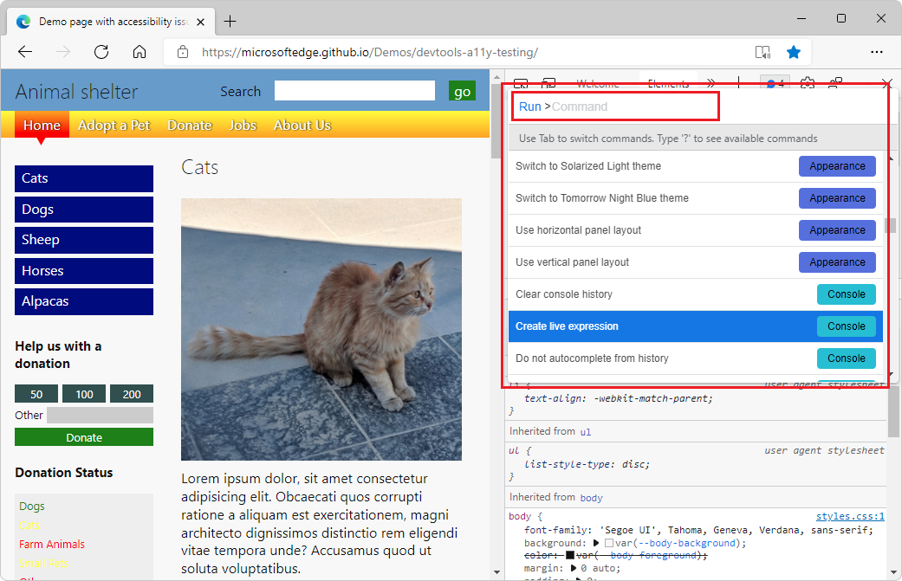

In the Command Menu, the tools are called "panels"; for example, the **Elements** tool is called the **Elements** panel.  To switch to the **Elements** tool, you select the **Elements** tab.

To open the Command Menu, do either of the following:

*  Click the **Customize and control DevTools** () button, and then select **Run command**.

*  Press `Control`+`Shift`+`P` (Windows, Linux) or `Command`+`Shift`+`P` (macOS).

The Command Menu allows you to type commands to display, hide, or run features in DevTools.  With the Command Menu open, enter the word **changes**, and then select **Drawer: Show Changes**.

The **Changes** tool opens, which is useful when you edit CSS.  In this case, the Command Menu provides a fast alternative to selecting **More Tools** (...) and then selecting **Changes**, or editing a `.js` file in the **Sources** tool, then right-clicking and selecting **Local modifications**.

After you type `changes`, the Command Menu displays the options:

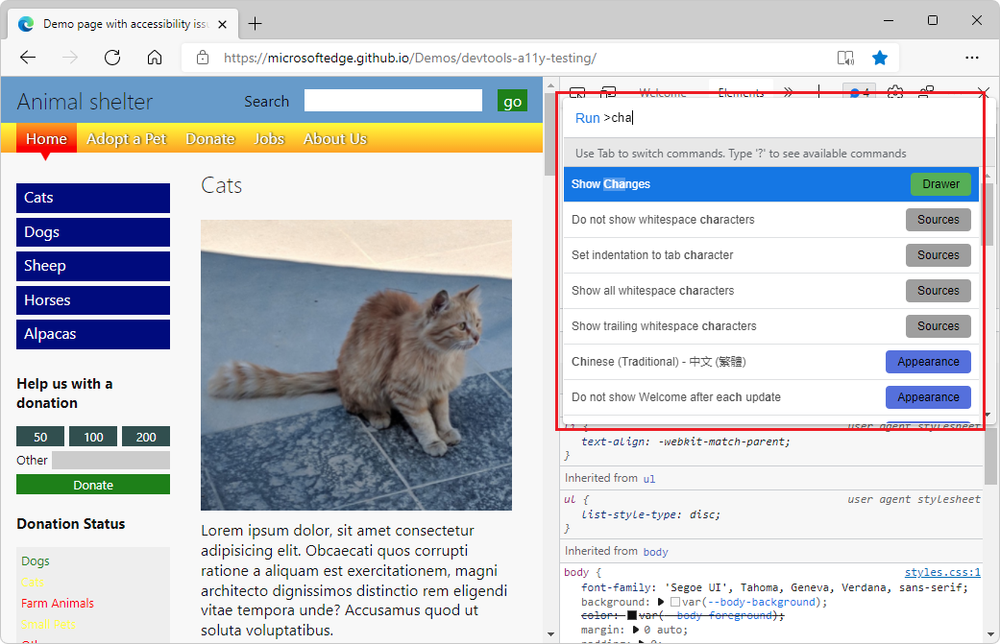

The **Changes** tool opens:

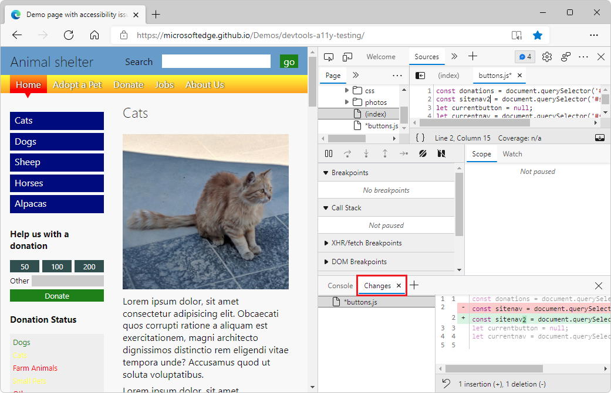

See also [Run commands with the Microsoft Edge DevTools Command menu](command-menu/index.md).

<!-- ====================================================================== -->
## Customizing DevTools

<!-- todo: add icon -->
You can customize DevTools to meet your needs for the way you work.  To change settings, click **Settings** (the gear icon on the top right), or press `F1`.

In the **Settings** > **Preferences** page, you can change several parts of DevTools.  For example, you can use the **Match the browser language** setting to use the same language in DevTools that is used in your browser.  For another example, use the **Theme** setting to change the color theme of DevTools.

You can also change the settings of advanced features, such as:
*  Add local files to a [Workspace](./workspaces/index.md).
*  Filter library code with the **Ignore List**.
*  Define the **Devices** you want to include in the device simulation and test mode.  For more information, see [Emulate mobile devices (Device Emulation)](device-mode/index.md).
*  Select a network **Throttling** profile.
*  Define simulated **Locations**.
*  Customize keyboard **Shortcuts**.  For example, to use the same shortcuts in DevTools as in Visual Studio Code, select **Match shortcuts from preset** > **Visual Studio Code**.

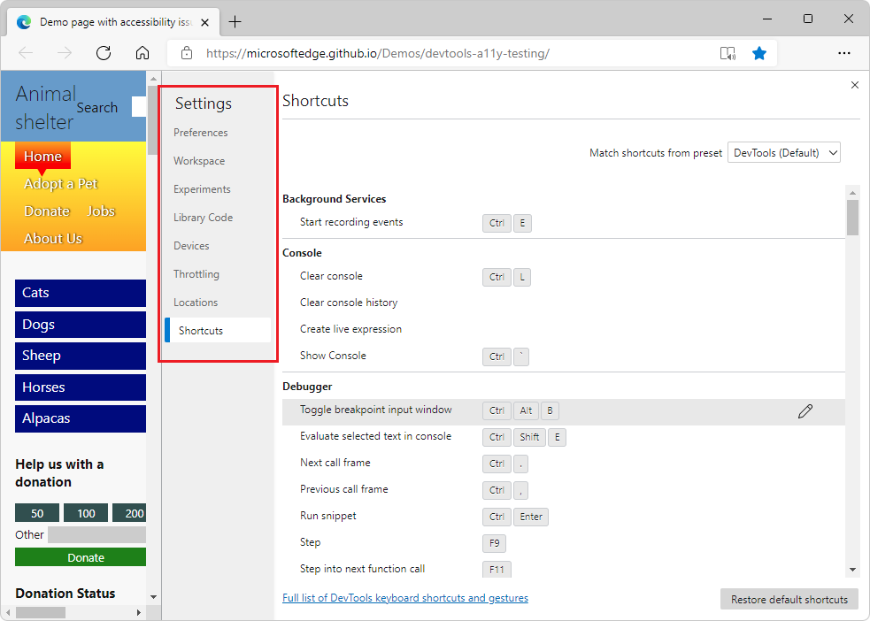

<!-- ====================================================================== -->
## Trying experimental features

The DevTools team provides new features as _experiments_ in DevTools.  You can turn each of the experiments on or off.  To see the full list of [Experimental features](experimental-features/index.md), in DevTools, select **Settings** (the gear icon), and then select **Experiments**.

To preview the [latest features coming to DevTools](./whats-new/2021/02/devtools.md), download [Microsoft Edge Canary](https://www.microsoftedgeinsider.com/download), which builds nightly.

<!-- ====================================================================== -->
## See also

* [About the list of tools](about-tools.md)
* [Get started with HTML and the DOM](beginners/html.md)
* [Inspect and change the current webpage](dom/index.md)
* [Emulate how your product behaves on different devices](device-mode/index.md)
* [Inspect, tweak, and change the styles of elements](./inspect-styles/edit-fonts.md)
* [Debug your JavaScript](./javascript/index.md)
* [Live console](console/index.md)
* [Accessibility, performance, compatibility, and security issues](./issues/index.md)
* [Inspect the network traffic](./network/index.md)
* [Inspect where the browser stored content](./storage/sessionstorage.md)
* [Evaluate the performance](evaluate-performance/index.md)
* [Memory problems](memory-problems/index.md)
* [Rendering issues](./rendering-tools/index.md)
* [Use a development environment](./sources/index.md)
* [Sync changes in DevTools with the file system](./workspaces/index.md)
* [Override files from the web](./javascript/overrides.md)
