<!-- Copyright Kayce Basques

   Licensed under the Apache License, Version 2.0 (the "License");
   you may not use this file except in compliance with the License.
   You may obtain a copy of the License at

       https://www.apache.org/licenses/LICENSE-2.0

   Unless required by applicable law or agreed to in writing, software
   distributed under the License is distributed on an "AS IS" BASIS,
   WITHOUT WARRANTIES OR CONDITIONS OF ANY KIND, either express or implied.
   See the License for the specific language governing permissions and
   limitations under the License.  -->
# Inspect and modify CSS animation effects
<!-- orig title: # Inspect animations -->

Inspect and modify CSS animation effects by using the **Animation Inspector** in the **Animations** tool.

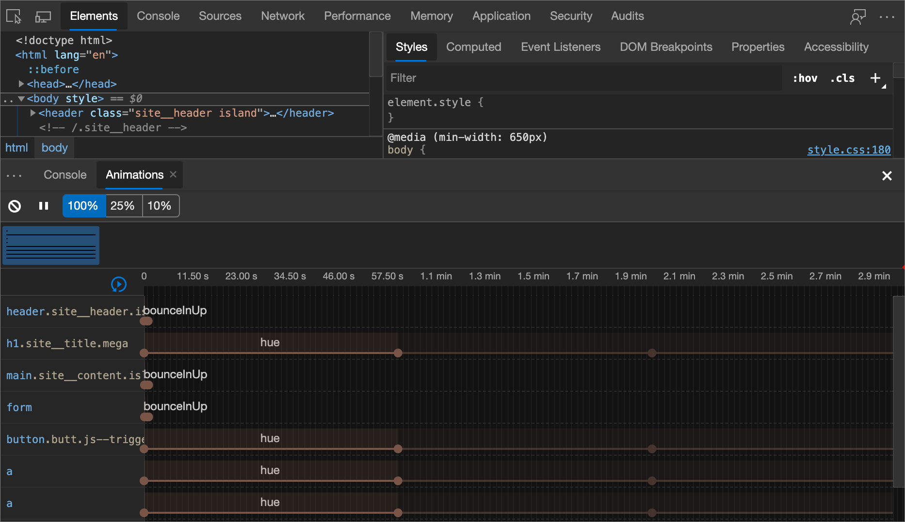

### Summary

*  Capture animations by opening the **Animations** tool.  The **Animations** tool automatically detects and sorts animations into groups.

*  Inspect animations by slowing down each one, replaying each one, or viewing the source code.

*  Modify animations by changing the timing, delay, duration, or keyframe offsets.

<!-- ====================================================================== -->
## Overview

The **Animations** tool has two main purposes:

*  Inspecting animations.  You can slow down, replay, or inspect the source code for an Animation Group.

*  Modifying animations.  You want to modify the timing, delay, duration, or keyframe offsets of an Animation Group.  Bezier editing and keyframe editing are currently not supported.

The Animation Inspector supports CSS animations, CSS transitions, and web animations.  `requestAnimationFrame` animations are currently not supported.

### What's an Animation Group?

An _Animation Group_ is a group of animations that may be related to each other.  Currently, the web has no real concept of a group animation, so motion designers and developers have to compose and time individual animations so that the animations render as one coherent visual effect.  The Animation Inspector predicts which animations are related based on start time (excluding delays, and so on).  The Animation Inspector also groups the animations side-by-side.

In other words, a set of animations that are all triggered in the same script block are grouped together.  If an animation is asynchronous, it is placed in a separate group.

<!-- ====================================================================== -->
## Get started

To open the Animation Inspector, use any of these approaches, in DevTools:

*  From the **main toolbar** or on the **Drawer**: click the **More Tools** () button, and then select **Animations**.

   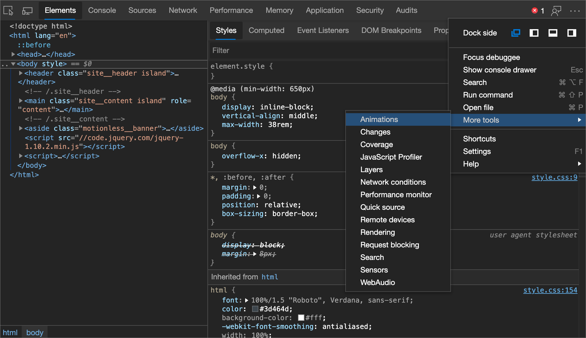

*  From the **Customize** menu: Click the **Customize and control DevTools** () menu button, point to the **More tools** sub-menu, and then select **Animations**.

*  From the **Command Menu**:  When DevTools has focus, press **Ctrl+Shift+P** (Windows/Linux) or **Command+Shift+P** (macOS) to open the **Command Menu**, start typing `animations`, and then select **Drawer: Show Animations**.

By default, the **Animations** tool opens in the **Drawer**, next to the **Console** tool.  By using the **Animations** tool on the **Drawer**, you can use it at the same time as using another tools on the main toolbar.

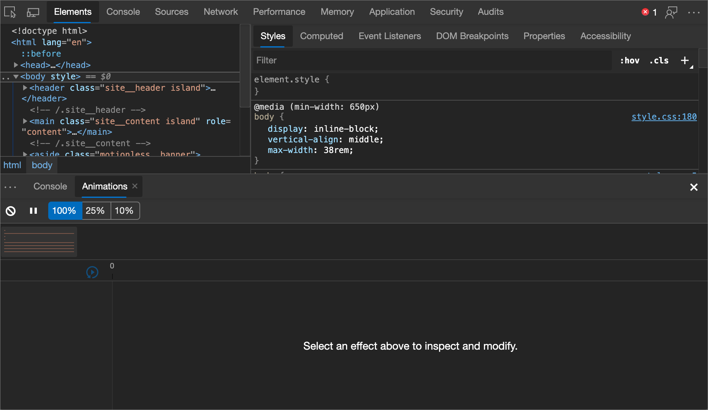

The Animation Inspector is grouped into four main sections (or panes).  This guide refers to each pane as follows:

| Index | Pane | Description |
|:--- |:--- |:--- |
| 1 | **Controls** | From here you can clear all currently captured Animation Groups, or change the speed of the currently selected Animation Group. |
| 2 | **Overview** | Select an Animation Group here to inspect and modify it in the **Details** pane. |
| 3 | **Timeline** | Pause and start an animation from here, or jump to a specific point in the animation. |
| 4 | **Details** | Inspect and modify the currently selected Animation Group. |

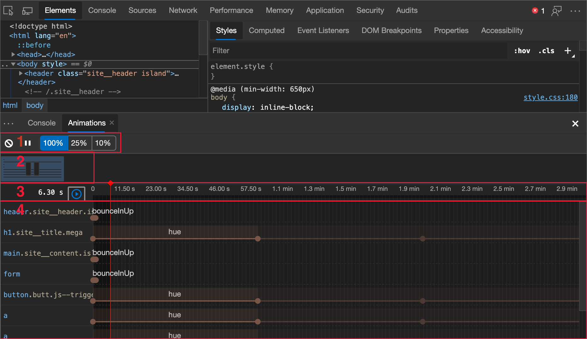

To capture an animation, just perform the interaction that triggers the animation while the Animation Inspector is open.  If an animation is triggered on page load, refresh the page with the Animation Inspector open to detect the animation.

<!--  old link: <video src="animations/capture-animations.mp4" autoplay loop muted controls></video>  -->

<!--  import the video to ACOM using https://review.learn.microsoft.com/help/contribute/contribute-video-publish  -->

<!--  > [!VIDEO animations/capture-animations.mp4]  -->

<!-- ====================================================================== -->
## Inspect animations

After you capture an animation, there are a few ways to replay it:

*  Hover on the thumbnail in the **Overview** pane to view a preview of it.
*  Select the Animation Group from the **Overview** pane (so that it is displayed in the **Details** pane), and then click the **replay** () icon.  The animation is replayed in the viewport.  Click the **animation speed** () icons to change the preview speed of the currently selected Animation Group.  You can use the red vertical bar to change your current position.
*  Click and drag the red vertical bar to scrub the viewport animation.

### View animation details

After you capture an Animation Group, click on it from the **Overview** pane to view the details.  In the **Details** pane, each individual animation is assigned to a row.

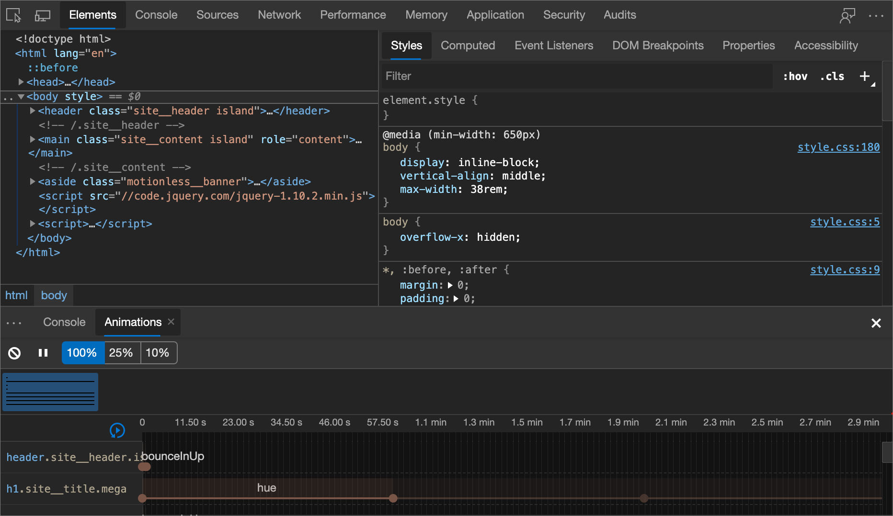

Hover on an animation to highlight it in the viewport.  Click on the animation to select it in the **Elements** tool.

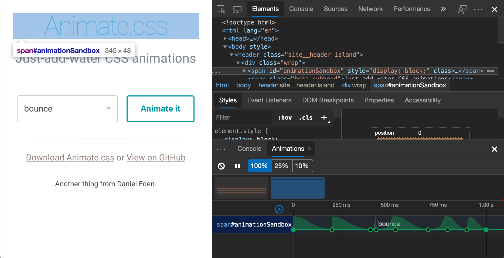

The leftmost, darker section of an animation is its definition.  The right, more faded section represents iterations.  For example, in the following figure, sections two and three represent iterations of section one:

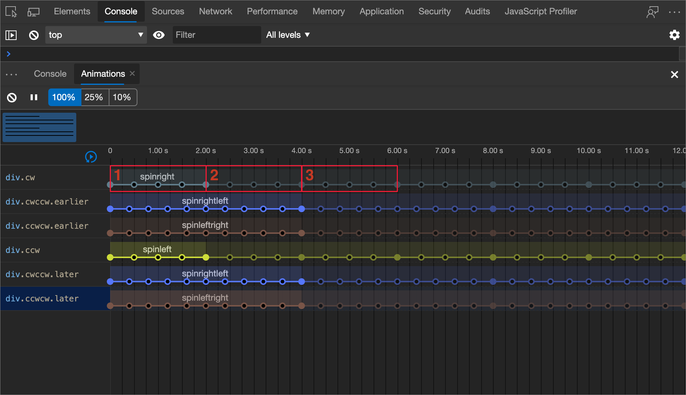

If two elements have the same animation applied to them, the Animation Inspector assigns the same color to the elements.  The color is random and has no significance.  For example, in the following figure, the two elements `div.cwccw.earlier` and `div.cwccw.later` have the same animation (`spinrightleft`) applied, as do the `div.ccwcw.earlier` and `div.ccwcw.later` elements.

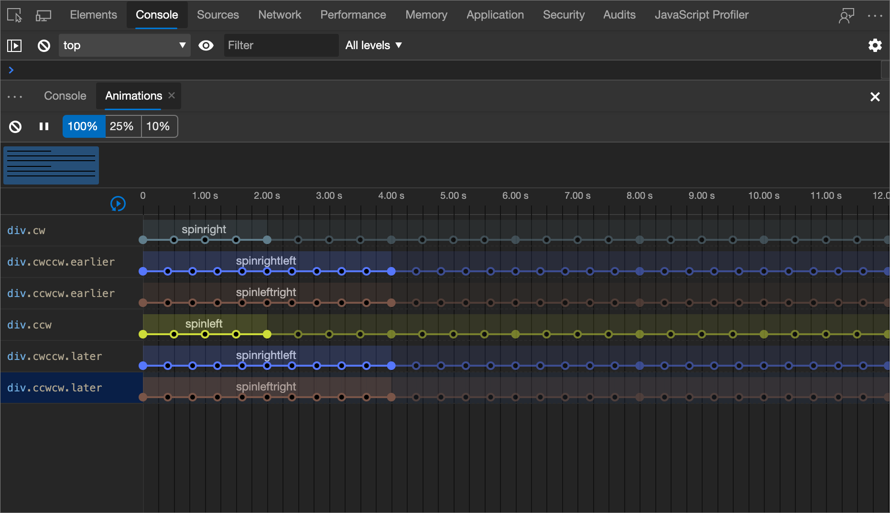

<!-- ====================================================================== -->
## Modify animations

There are three ways you can modify an animation with the Animation Inspector:

*  Animation duration.
*  Keyframe timings.
*  Start time delay.

For this section, suppose that the screenshot below represents the original animation:

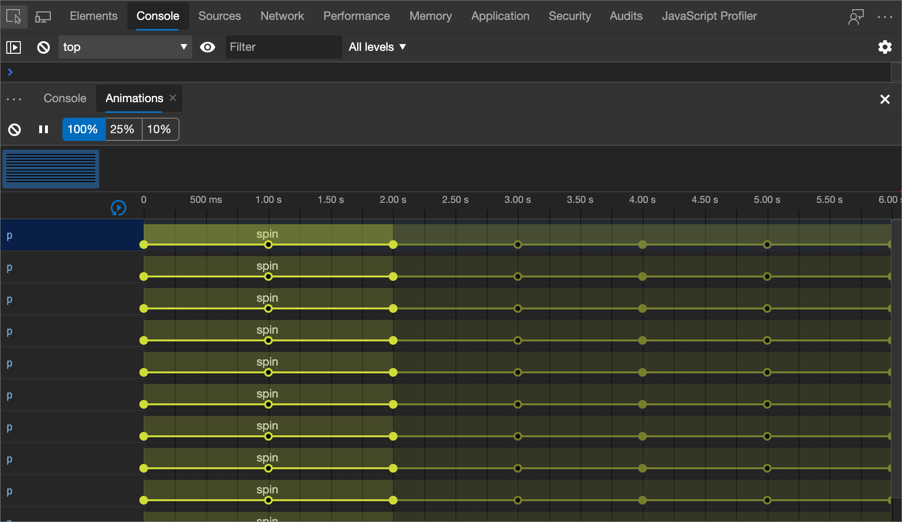

To change the duration of an animation, click and drag the first or last circle.

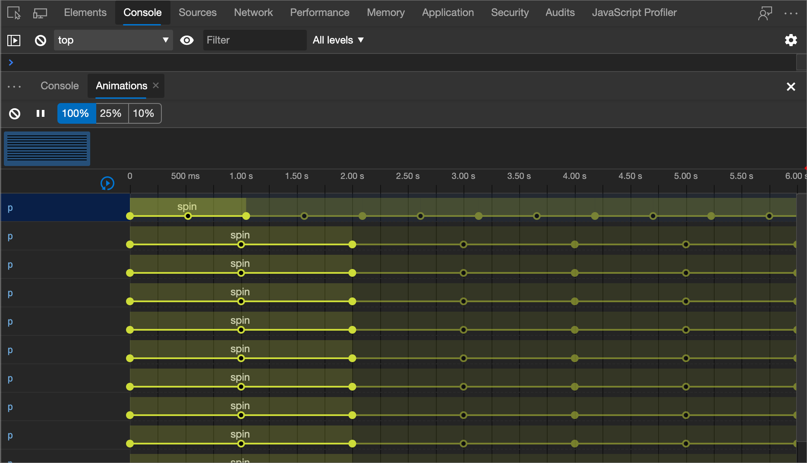

If the animation defines any keyframe rules, then these are represented as white-filled inner circles.  Click and drag a white-filled inner circle to change the timing of the keyframe:

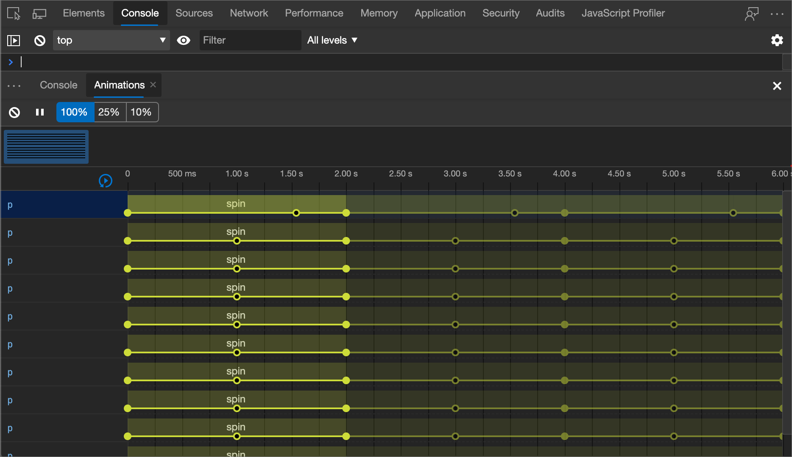

To add a delay to an animation, click the animation anywhere except the circles, and drag it:

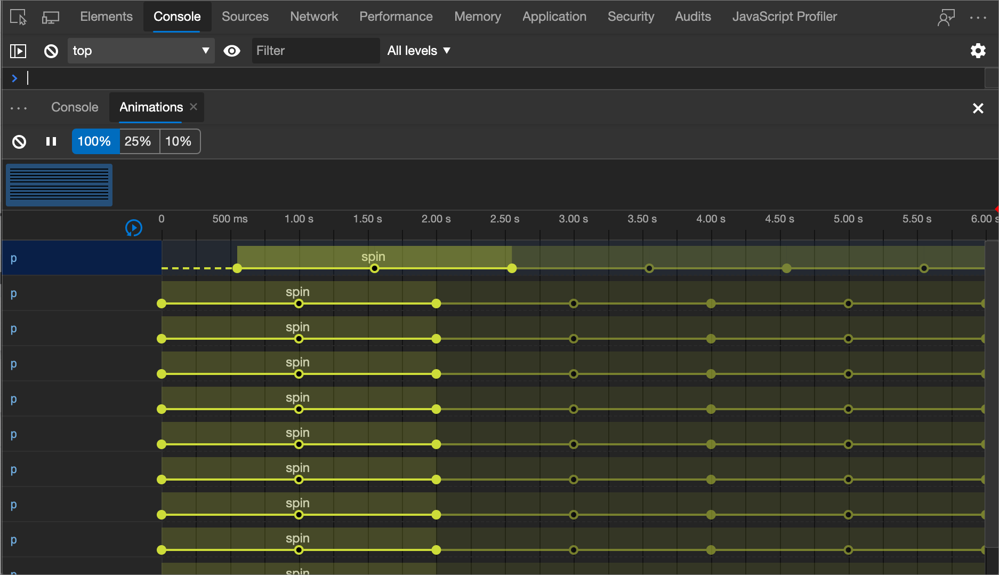

<!-- ====================================================================== -->
> [!NOTE]
> Portions of this page are modifications based on work created and [shared by Google](https://developers.google.com/terms/site-policies) and used according to terms described in the [Creative Commons Attribution 4.0 International License](https://creativecommons.org/licenses/by/4.0).
> The original page is found [here](https://developer.chrome.com/docs/devtools/css/animations/) and is authored by [Kayce Basques](https://developers.google.com/web/resources/contributors#kayce-basques) (Technical Writer, Chrome DevTools \& Lighthouse).

This work is licensed under a [Creative Commons Attribution 4.0 International License](https://creativecommons.org/licenses/by/4.0).
