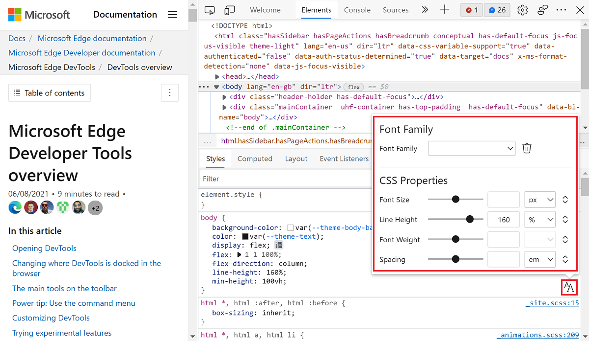
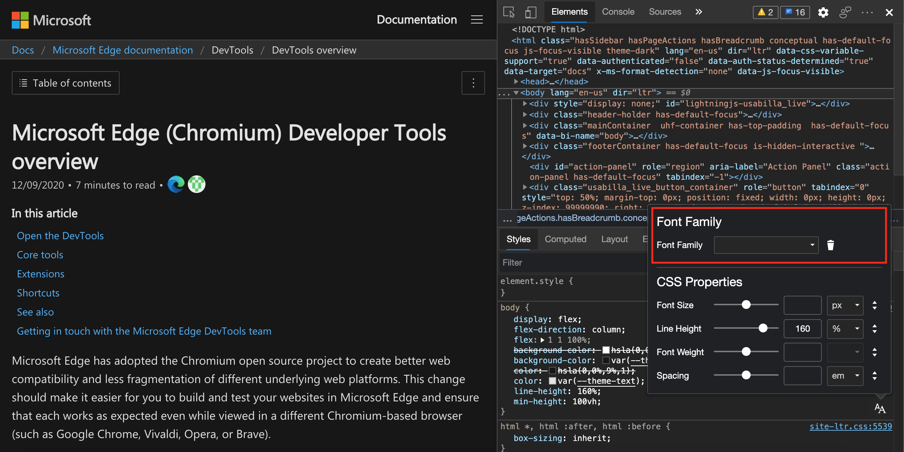
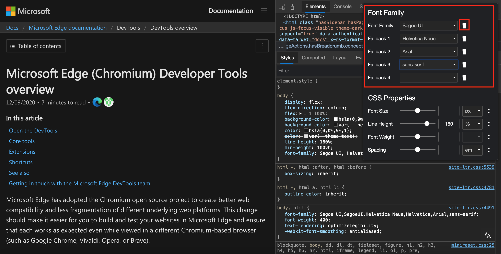
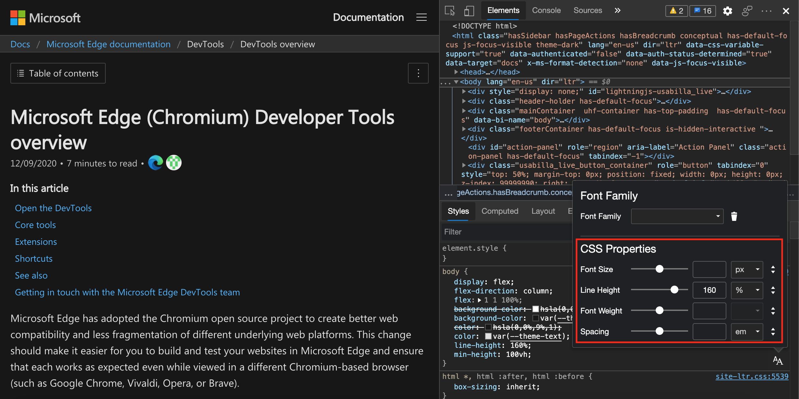
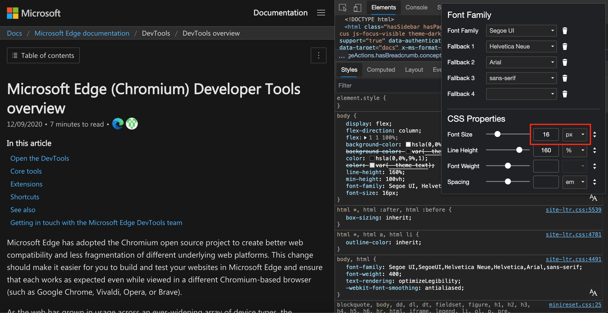
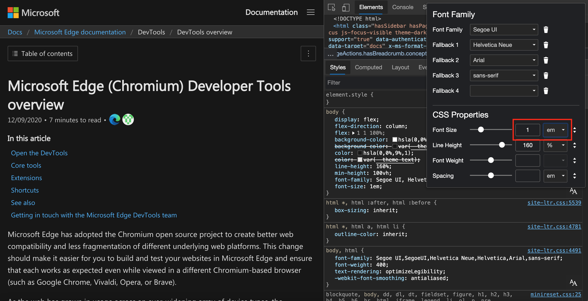
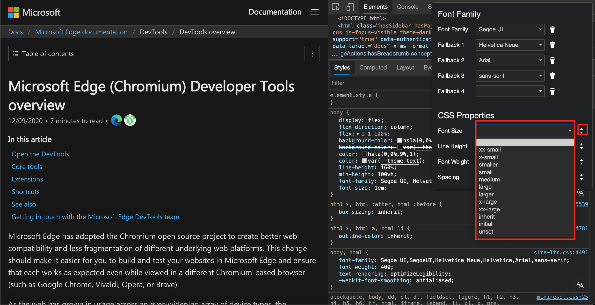

# Edit CSS font styles and settings in the Styles pane

To make it easier when working with typography, a visual **Font Editor** is now available in the **Styles** pane.  Using the **Font Editor**, you can change your font settings, and the changes are rendered immediately in the browser - all without in-depth knowledge of CSS.  The **Elements** tool > **Styles** tab > **Font Editor** icon opens the **Font Editor**, which consists of two parts:

*  The **Font Family** selector.
*  The **CSS Properties** editor.

Typography on the web is an important part of the user experience.  You want to ensure that fonts follow corporate brand guidelines, and that your content is displayed as expected on various devices.  Text must be easy to read using size and line-height.  Users can resize fonts to meet individual needs.

For situations when specific fonts aren't available on a user device, you should provide fallback font options.

CSS provides better support for typography in recent years.  Dozens of different CSS units are available to define the size of text.  Several CSS properties are available to control the font size, spacing, line height, and other typographical features.

Currently the [Enable new Font Editor tool within the Styles pane](../experimental-features/index.md#enable-the-font-editor-tool-within-the-styles-pane) feature is experimental, and you need to [turn it on for Microsoft Edge Developer Tools](../experimental-features/index.md#turning-an-experiment-on-or-off).

Any CSS in the **Styles** pane, either font definitions or inline styles, has a **Font Editor** icon.  To open the visual **Font Editor**, click the **Font Editor** icon.

The **Font Editor** opens on top of the **Styles** pane:

All fields in the visual **Font Editor** are populated from the values in the CSS in the **Styles** pane.  For example, the `line-height` definition is set to `160%` in the **Styles** pane, so the line height text field displays `160`, and the unit dropdown list displays `%`.  Also, the slider is automatically set to match the values of the text field.

<!-- ====================================================================== -->
## The Font Family selector

The Font Family selector is the upper part of the visual **Font Editor**.  To select the fonts of the CSS rule, in the CSS editor, use the **Font Family** selector.  You can select main and fallback fonts for each CSS rule.

The **Font Editor** open on top of the **Styles** pane with the **Font Family** selector highlighted:

Use the **Font Family** dropdown list to select a font.  Fonts are organized into four groups:

*  **Computed fonts**, which are the fonts available in the stylesheet in the **Styles** pane.
*  **System fonts**, which are the fonts that are available on the current operating system.
*  **Generic font families**, such as `serif` or `sans-serif`.
*  **Global values**, such as `inherit`, `initial`, and `unset`.

The **Font Editor** open on top of the **Styles** pane with the **Font Family** selector highlighted:

After you select a font, another dropdown menu is displayed for you to select fallback fonts.  You can select up to eight fallback fonts.  To remove a font, click the **Delete Font Family** icon.

<!---->

> [!NOTE]
> If you select a global value for font family, you don't get another dropdown menu, since there is no fallback for it in CSS.

<!-- ====================================================================== -->
## The CSS Properties editor

You can change CSS font properties in the lower part of the visual **Font Editor**.  You can change the font size, line height, font weight, and letter spacing using any of the UI controls.  Your changes are applied immediately in the browser.

The **Font Editor** opens on top of the **Styles** pane, with the CSS properties highlighted:

You can also convert CSS units using the visual **Font Editor**.  For example, you can use the tool on a CSS rule where the **Font Size** slider is initially set to `16 pixels`.  Now, use the unit dropdown list and select the value `em`.  The `1 em` displayed is equal to `16 pixels`.

Changing the font size to `16 pixels`:

Opening the unit dropdown list to convert to `em`:

The unit dropdown list provides all the numeric CSS units that are available.  Font size, line height, font weight, and spacing all use different units.  When the text boxes have focus, you can press the `arrow up` and `arrow down` keys to fine-tune your settings.  To use the sliders with a keyboard, press the `arrow left` and `arrow down` keys.

The CSS Properties editor also includes preset keywords.  To use the preset keywords, on the right-hand side, click the `Toggle Input Type` icon.  The UI changes, and a dropdown list of preset keywords are displayed.  To return to the UI with the slider and other UI controls, click the `Toggle Input Type` icon again.

Opening the preset keyword interface:

