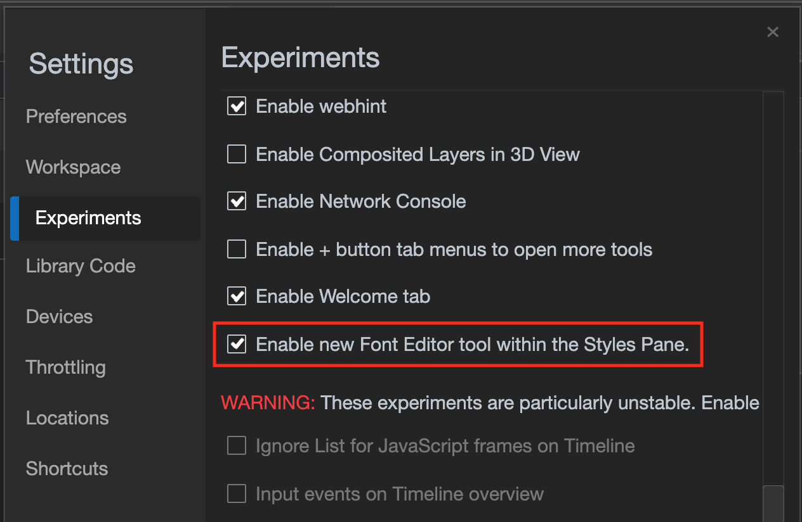

# Editing CSS font settings in the styles pane (experimental) 

Typography on the web is an important part of the user experience. CSS has evolved in this space a lot in the recent years. The biggest trick is to make sure you allow for flexibility. You want to ensure that text is readable and can be zoomed and you shouldn't rely on certain fonts to be available but instead use fallback options to display when your favorite font isn't available.

CSS allows you to define fonts as font families and there are dozens of different CSS units available to define the size of text. You also have several CSS properties that affect font-size, spacing, line height and other typographic features. This can become hard to grasp which is why there is now a font editor in the styles pane. It allows you to tweak typography and see the changes live in the browser. This allows you to fine-tune your font settings without in-depth knowledge of the necessary CSS.

> [!WARNING]
> Currently this is an experimental feature and you need to enable it for developer tools. 
Click the cog icon top right in the developer tools and enable on the "Enable new Font Editor tool within the Styles Pane" setting. Once you restart developer tools, the functionality will be available.  

Any CSS section of the styles pane that has font definitions and the inline styles section shows a font icon that allows you to open the font editor.

:::image type="complex" source="../media/font-editor-icon.msft.png" alt-text="The icon in the styles pane indicating that you can edit font settings" lightbox="../media/font-editor-icon.msft.png":::
The icon in the styles pane indicating that you can edit font settings
:::image-end:::  

Once you click on the font icon, you get the font editor. 

:::image type="complex" source="../media/font-editor-open.msft.png" alt-text="The font editor open on top of the styles pane" lightbox="../media/font-editor-open.msft.png":::
The font editor open on top of the styles pane
:::image-end:::  

All the form fields in the editor are populated by the settings in that block of CSS. In this case, there is a `line-height` definition of `160%`, which means the text field shows `160`, the unit dropdown is at `%` and the slider at the appropriate place. The sliders and text fields are synced, which means that when you change either, the other will reflect that value.

The editor consists of two parts: the Font Family Selector and the CSS properties editor.

## The Font Family Selector

The Font Family Selector is the lower part of the font editor. Here you select the font family of this CSS selector. 

:::image type="complex" source="../media/font-editor-font-family.msft.png" alt-text="The font editor open on top of the styles pane with the family selector highlighted" lightbox="../media/font-editor-css-properties.msft.png":::
The font editor open on top of the styles pane with the family selector highlighted:::image-end:::

You can select a font and up to nine fallback fonts.

:::image type="complex" source="../media/font-editor-font-family-list.msft.png" alt-text="The font editor open on top of the styles pane with the family selector highlighted" lightbox="../media/font-editor-css-properties.msft.png":::
The font editor open on top of the styles pane with the family selector highlighted:::image-end:::

The fonts are organized in three different groups: 
1. Computed fonts - the ones currently available in the style sheet
1. System fonts - fonts that are available on the current operating system
1. Generic font families - like `serif` or `sans-serif`
1. Global values - `inherit`, `initial` and `unset` 

Once you selected a font, you get another drodown menu. You remove a font by clicking the waste basket icon.

:::image type="complex" source="../media/font-editor-defining-fonts.msft.png" alt-text="The font editor with a defined list of fonts and fallback fonts" lightbox="../media/font-editor-defining-fonts.msft.png":::
The font editor with a defined list of fonts and fallback fonts
highlighted:::image-end:::

:::image type="complex" source="../media/font-editor-deleting-fonts.msft.png" alt-text="Deleting a font from the list by clicking the waste basket icon" lightbox="../media/font-editor-deleting-fonts.msft.png":::
Deleting a font from the list by clicking the waste basket icon
:::image-end:::

> [!NOTE] 
> If you chose a global value for font family you do not get another dropdown as there is no fallback for those in CSS.

## The CSS properties editor

You can tweak CSS font properties in the lower part of the font editor.

Here you can change the font size, line height, font weight and letter spacing using sliders and see the changes live in the browser window.

:::image type="complex" source="../media/font-editor-css-properties.msft.png" alt-text="The font editor open on top of the styles pane with the CSS properties highlighted" lightbox="../media/font-editor-font-family.msft.png":::
The font editor open on top of the styles pane with the CSS properties highlighted
:::image-end:::

An extra feature of this editor is that you can use it to convert CSS units with it. 

For example, you can use the tool on this web site, and you use the slider to `16 pixels`. 

:::image type="complex" source="../media/font-editor-setting-to-16px.msft.png" alt-text="Setting the font size to 16 pixels" lightbox="../media/font-editor-setting-to-16px.msft.png":::
Setting the font size to 16 pixels
:::image-end:::

If you now use the unit dropdown and select "em" as the value, you will get the result that 16 pixels in this case is the equivalent of `1em`.

:::image type="complex" source="../media/font-editor-converted-to-em.msft.png" alt-text="Using the unit dropdown to convert to em" lightbox="../media/font-editor-converted-to-em.msft.png":::
Using the unit dropdown to convert to em
:::image-end:::

By default, the unit dropdown will offer you all the commonly used numeric CSS units to choose from for font size, line height, font weight and spacing. This also allows you to not use the sliders but arrow up and down to fine-tune your settings. 

As these CSS properties also come with preset keywords, you can switch to them by clicking the double arrow icon on the right hand. For example, for font size these are `xx-small` to `xx-large` as well as `inherit`, `initial` and `unset`.

:::image type="complex" source="../media/font-editor-preset-font-sizes.msft.png" alt-text="Switching to the preset keyword interface" lightbox="../media/font-editor-preset-font-sizes.msft.png":::
Switching to the preset keyword interface
:::image-end:::

Clicking the double arrow again will get you back to the slider and numeric unit interface.

## What are you missing?

We keep iterating on this feature to make it better for you and would love to learn more about your issues with CSS typography. Please get in contact and tell us what would make this tool even more useful.

<!-- links -->  

[DevtoolsIndex]: ../index.md "Microsoft Edge (Chromium) Developer Tools | Microsoft Docs"  
[DevtoolsExperiments]: ../experimental-features/index.md "Microsoft Edge (Chromium) Developer Tools Experimental Features| Microsoft Docs"  
