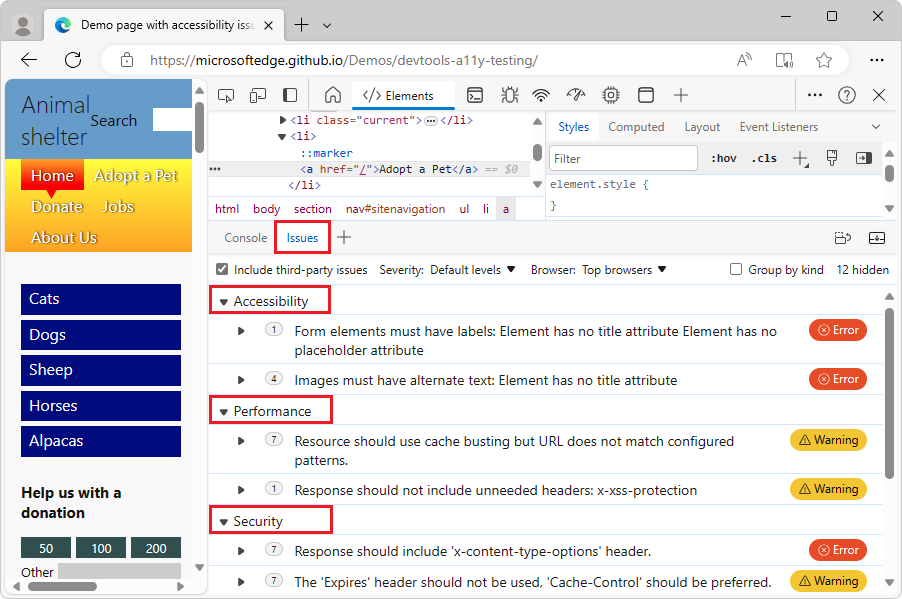
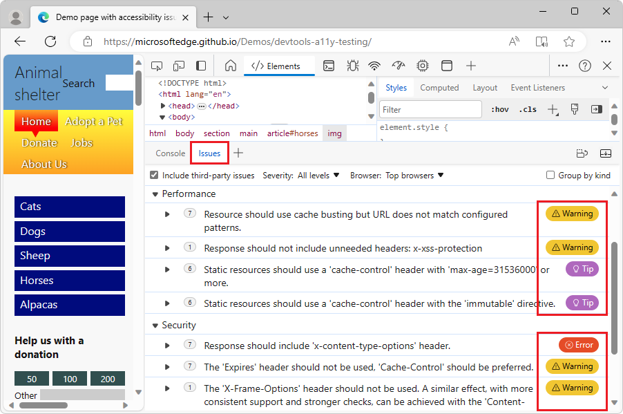
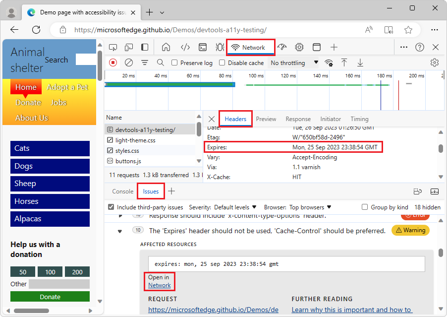
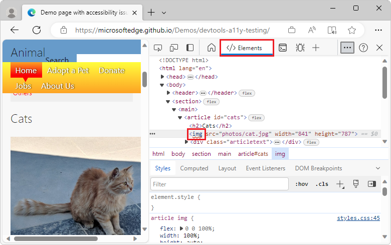
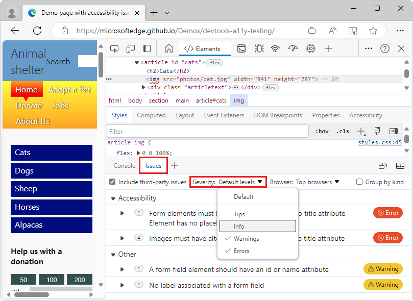
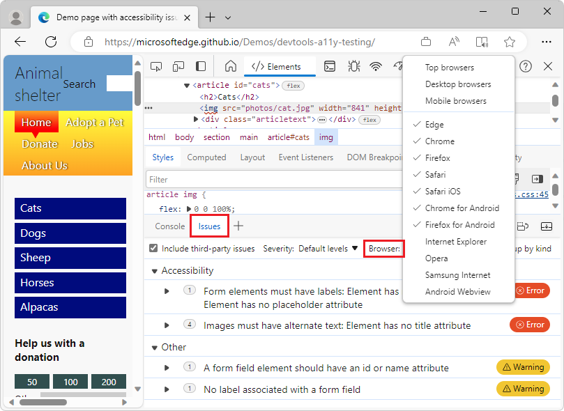

<!-- Copyright Sam Dutton

   Licensed under the Apache License, Version 2.0 (the "License");
   you may not use this file except in compliance with the License.
   You may obtain a copy of the License at

       https://www.apache.org/licenses/LICENSE-2.0

   Unless required by applicable law or agreed to in writing, software
   distributed under the License is distributed on an "AS IS" BASIS,
   WITHOUT WARRANTIES OR CONDITIONS OF ANY KIND, either express or implied.
   See the License for the specific language governing permissions and
   limitations under the License.  -->
# Find and fix problems using the Issues tool

The **Issues** tool automatically analyzes the current webpage, reports issues grouped by type, and provides documentation to help explain and resolve the issues.

The **Issues** tool provides feedback in the following categories:
*  Accessibility.
*  Compatibility across browsers.
*  Performance.
*  Progressive Web Apps.
*  Security.
*  Other.

Feedback in the **Issues** tool is provided by several sources, including the Chromium platform, Deque axe, MDN browser compatibility data, and webhint.  For information about these sources of feedback that populate the **Issues** tool, see:
*  [axe Tools Overview](https://www.deque.com/axe)
*  [browser-compat-data repo](https://github.com/mdn/browser-compat-data)
*  [webhint](https://webhint.io)

<!-- ====================================================================== -->
## Opening the Issues tool

1. Go to a webpage that contains issues to fix.  For example, open the [accessibility-testing demo page](https://microsoftedge.github.io/Demos/devtools-a11y-testing/) in a new tab or window.

1. Right-click the webpage and then select **Inspect**.  DevTools opens.

   <!--After a few seconds, the **Issues counter** () appears in the upper right corner of DevTools.
   1. Refresh the page, because some issues are reported based on network requests.  Notice the updated count in the **Issues counter**.-->

1. In the **Quick View** toolbar at the bottom of DevTools, select the **Issues** tab, which is present by default.

   If the **Quick View** panel isn't displayed, select **Customize and control DevTools** (**...**), and then select **Toggle Quick View panel** (**Esc**).  If the **Quick View** toolbar doesn't have the **Issues** tab, in the **Quick View** toolbar, click the **More tools** (**+**) button, and then select **Issues**.

   The **Issues** tool groups issues into categories, such as **Accessibility**, **Performance**, **Security**, and **Other**:

   

<!-- ------------------------------ -->
#### Other ways to open the Issues tool

*  In the **Activity Bar** or in the **Quick View** toolbar, click the **More tools** (**+**) button, and then select **Issues**.

*  In the **Elements** tool, in the DOM tree, find a wavy-underlined element name, and then press and hold **Shift** and then click the element.  Or, right-click a wavy-underlined element, and then select **View issues**.  See [Open issues from the DOM tree](#open-issues-from-the-dom-tree), below.

<!-- ------------------------------ -->
#### Placement of Issues tool: Quick View or Activity Bar

By default, such as from the Command Menu, the **Issues** tool opens in the **Quick View** panel.  You can instead open it in the **Activity Bar**, or move it to the **Activity Bar**: 

*  In the **Quick View** toolbar, right-click the **Inspect** tab and then select **Move to top Activity Bar** or **Move to left Activity Bar**.

<!-- legacy ui
*  Select **Customize and control DevTools** > **More tools** > **Issues**.
-->

<!-- ------------------------------ -->
#### Issues are automatically ordered by severity

Within each category of issues, first the errors are listed, then warnings, and then tips:

The **Severity** dropdown list controls whether Warnings, Errors, Tips, and Info items are listed.  See [Filter issues by severity](#filter-issues-by-severity) below.

<!-- ====================================================================== -->
## Expand entries in the Issues tool

The **Issues** tool presents additional documentation and recommended fixes to apply to each issue.  To expand an issue to get this additional information:

1. Open a webpage and the **Issues** tool, as described above.

   <!-- legacy ui
   1. Open the **Issues** tool by selecting the **Issues counter** ().
   -->

1. Select an issue.  The issue expands to show details:

   

Each displayed issue has the following components:

*  A headline describing the issue.

*  A description providing more context and proposed solutions.

*  An **AFFECTED RESOURCES** section that links to resources in DevTools, such as the **Elements**, **Sources**, or **Network** tool.

*  Links to further documentation.

<!-- ====================================================================== -->
## View issues in context of an associated tool

An issue in the **Issues** tool may include one or more links that open different tools, such as the **Elements**, **Sources**, or **Network** tool. You can open one of these tools to perform additional troubleshooting steps.

To open a linked tool from an entry in the **Issues** tool:

1. As described above, open a webpage, open DevTools, select the **Issues** tool, and then expand an issue.

   <!-- Elements link not present
   1. In **AFFECTED RESOURCES** > **Open in**, click the tool name, such as **Elements**:
   
   -->

1. In the **AFFECTED RESOURCES** section, in an **Open in** link, click the tool name, such as **Network**:

   

   The affected resource is displayed in the indicated tool.

<!-- ====================================================================== -->
## Open issues from the DOM tree

If an element has an associated issue, the DOM tree in the **Elements** tool shows a wavy underline under the element name.  Right-click the element and then select **View issues**.  Or, press and hold **Shift** and then click the element with the wavy underline.

To display an issue for elements with wavy underlines in the DOM tree:

1. Open a webpage.  For example, open the [accessibility-testing demo webpage](https://microsoftedge.github.io/Demos/devtools-a11y-testing/) in a new window or tab.

1. Right-click anywhere in the webpage and then select **Inspect**.  Or, press **F12**.  DevTools opens next to the webpage.

1. In DevTools, select the **Elements** () tab.

1. In the DOM tree, expand `<body>` > `<section>` > `<main>` > `<article id="cats">` > ``.  The `` element start-tag has a wavy underline:

   

1. Hover over the `` element start-tag.  A tooltip displays information about the issue.

1. Right-click the `` element, and then select **View issues**.  Or, press and hold **Shift** and then click the element.  The **Issues** tool opens and displays the issues that are associated with that element:

   

<!-- ====================================================================== -->
## Filter issues

To reduce the number of issues that are displayed in the **Issues** tool, you can filter the list by severity, browser, and origin.

<!-- ------------------------------ -->
#### Filter issues by severity

By default, only errors and warnings are displayed.  To display issues that have other severity levels:

* From the **Severity** dropdown list, select any number of severity levels: **Tips**, **Info**, **Warnings**, or **Errors**:

To revert back to showing only warnings and errors, select **Default levels**.

<!-- ------------------------------ -->
#### Filter issues by browser

Issues that belong to the **Compatibility** category can also be filtered by browser. By default, the following browsers are tested:

* Edge
* Chrome
* Firefox
* Safari
* Safari iOS
* Chrome for Android
* Firefox for Android

To change the list of browsers that are tested for compatibility issues:

* Click **Top browsers**.
* Select any of the browser category sets: **Top browsers**, **Desktop browsers**, **Mobile browsers**.
* Or select any number of individual browsers from the list.
* Click **Regenerate issues** to update the compatibility issues based on the selected browsers.

<!-- ------------------------------ -->
#### Filter issues by origin

By default, the **Issues** tool only lists issues that pertain to the current web page's code. To include issues that are caused by third-party libraries or frameworks loaded by the web page too, select the **Include third-party issues** checkbox:

<!-- ====================================================================== -->
## See also

*  [Automatically test a webpage for accessibility issues](../accessibility/test-issues-tool.md)

<!-- ====================================================================== -->
> [!NOTE]
> Portions of this page are modifications based on work created and [shared by Google](https://developers.google.com/terms/site-policies) and used according to terms described in the [Creative Commons Attribution 4.0 International License](https://creativecommons.org/licenses/by/4.0).
> The original page is found [here](https://developer.chrome.com/docs/devtools/issues/) and is authored by [Sam Dutton](https://developers.google.com/web/resources/contributors#sam-dutton) (Developer Advocate).

This work is licensed under a [Creative Commons Attribution 4.0 International License](https://creativecommons.org/licenses/by/4.0).
