<!-- Copyright Kayce Basques

   Licensed under the Apache License, Version 2.0 (the "License");
   you may not use this file except in compliance with the License.
   You may obtain a copy of the License at

       https://www.apache.org/licenses/LICENSE-2.0

   Unless required by applicable law or agreed to in writing, software
   distributed under the License is distributed on an "AS IS" BASIS,
   WITHOUT WARRANTIES OR CONDITIONS OF ANY KIND, either express or implied.
   See the License for the specific language governing permissions and
   limitations under the License.  -->
# Debug background services

The **Background Services** section of Microsoft Edge DevTools is a collection of tools for the Web APIs that enable your website to send and receive data even when a user doesn't use your website, and enable the browser to report production problems to your server.

Microsoft Edge DevTools considers each of the following APIs to be a background service:

*  [Background Fetch](#background-fetch)
*  [Background Sync](#background-sync)
*  [Notifications](#notifications)
*  [Payment Handler](#payment-handler)
*  [Periodic Background Sync](#periodic-background-sync)
*  [Push Messages](#push-messages)
*  [Reporting API](#reporting-api)
<!-- TODO: add a section about Payment Handler -->

The **Background Services** section logs API events, even when you're not using DevTools, to help you make sure that events are being sent and received as expected.

<!-- ====================================================================== -->
## Background Fetch

The **Background Fetch API** enables the **service worker** of a Progressive Web App to reliably download large resources, like movies or podcasts, as a background service.  To log Background Fetch events for 3 days, even when DevTools isn't open:

1. Open DevTools by right-clicking the webpage and selecting **Inspect**.  Or by pressing **Ctrl+Shift+I** (Windows, Linux) or **Command+Option+I** (macOS).

1. In DevTools, on the main toolbar, select the **Application** tab.  If that tab isn't visible, click the **More tabs** () button, or else the **More Tools** () button.

1. On the left, in the **Background Services** section, select **Background Fetch**.  The **Background Fetch** page opens.

   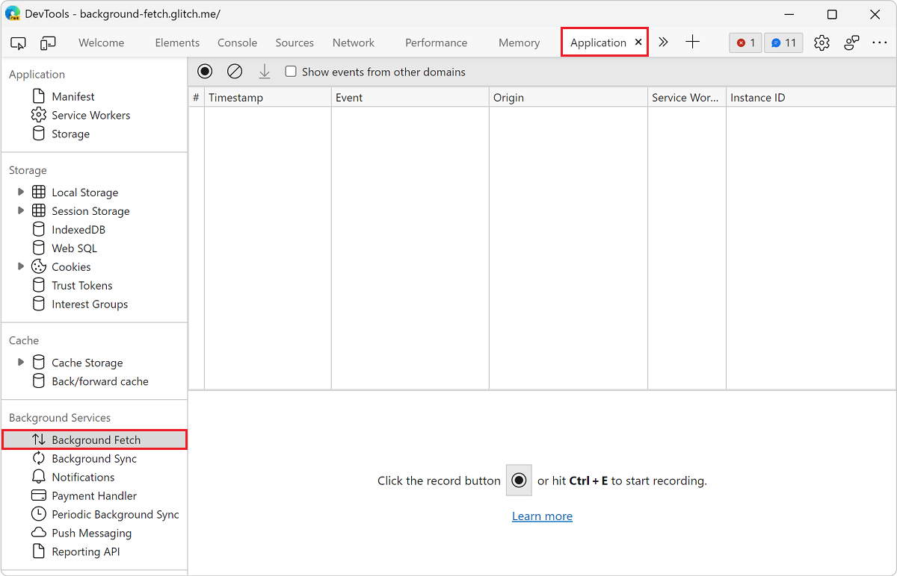

1. Click **Record** ().
   After triggering some Background Fetch activity, DevTools logs the events to the table.

   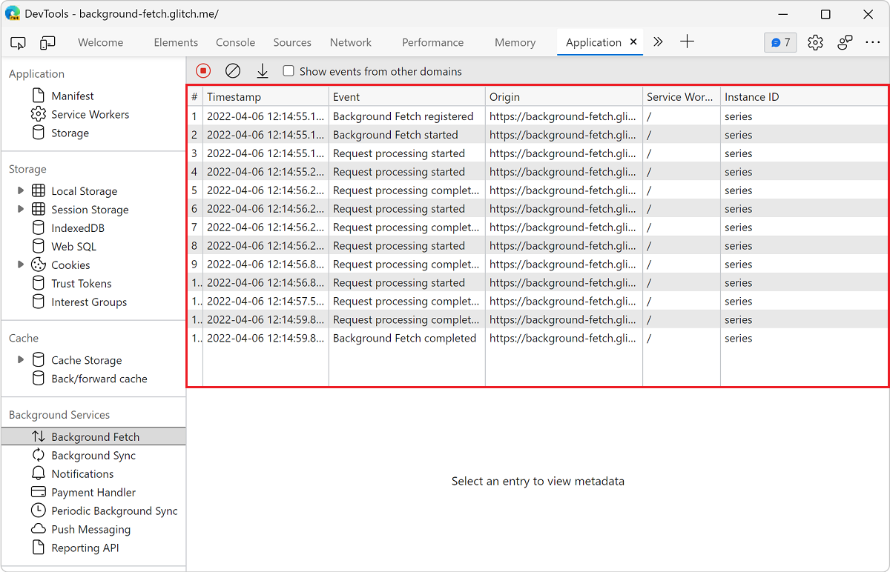

1. Click an event to view its details in the space below the table.

   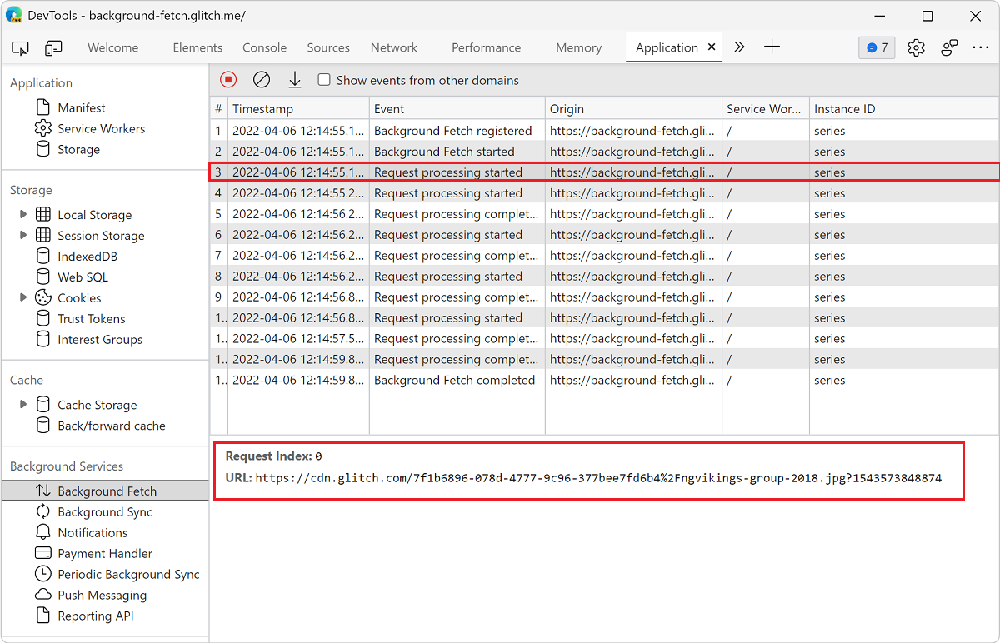

<!-- ====================================================================== -->
## Background Sync

The **Background Sync API** enables the offline **service worker** of a Progressive Web App to send data to a server once it has re-established a reliable internet connection.  To log Background Sync events for 3 days, even when DevTools isn't open:

1. Open DevTools by right-clicking the webpage and selecting **Inspect**.  Or by pressing **Ctrl+Shift+I** (Windows, Linux) or **Command+Option+I** (macOS).

1. In DevTools, on the main toolbar, select the **Application** tab.  If that tab isn't visible, click the **More tabs** () button, or else the **More Tools** () button.

1. On the left, in the **Background Services** section, select **Background Sync**.  The **Background Sync** page opens.

   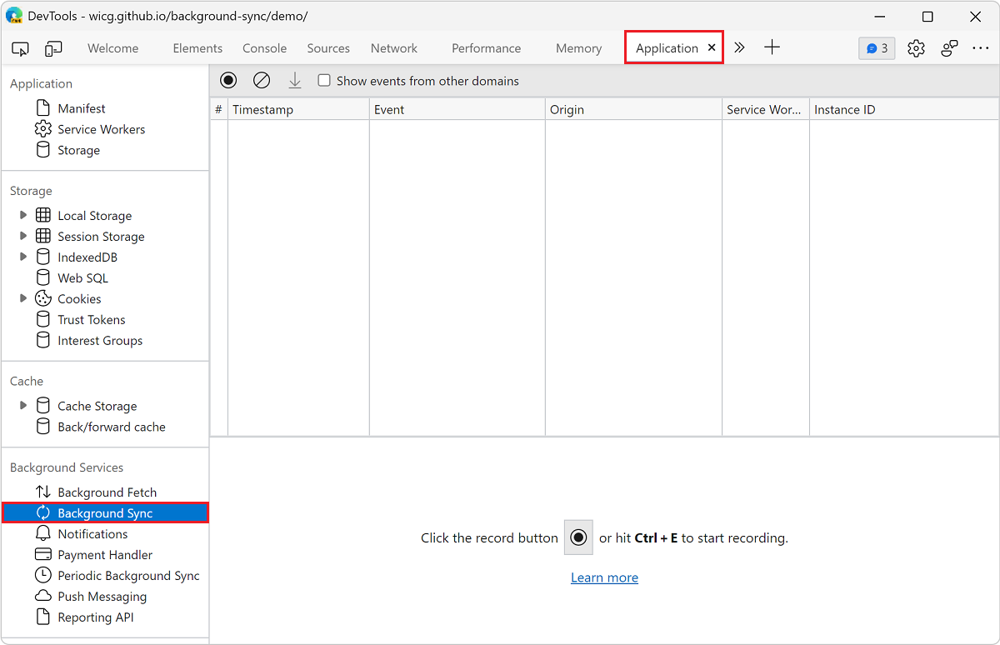

1. Click **Record** ().  After triggering some Background Sync activity, DevTools logs the events to the table.

   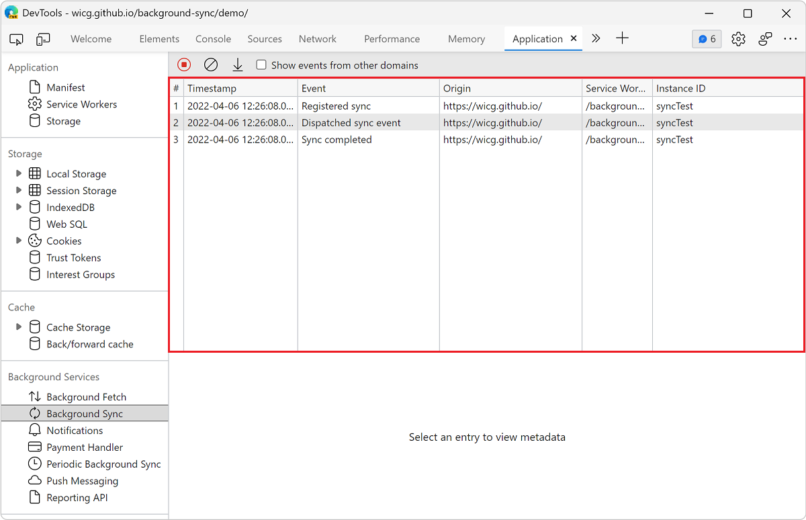

1. Select an event to view its details in the space below the table.

   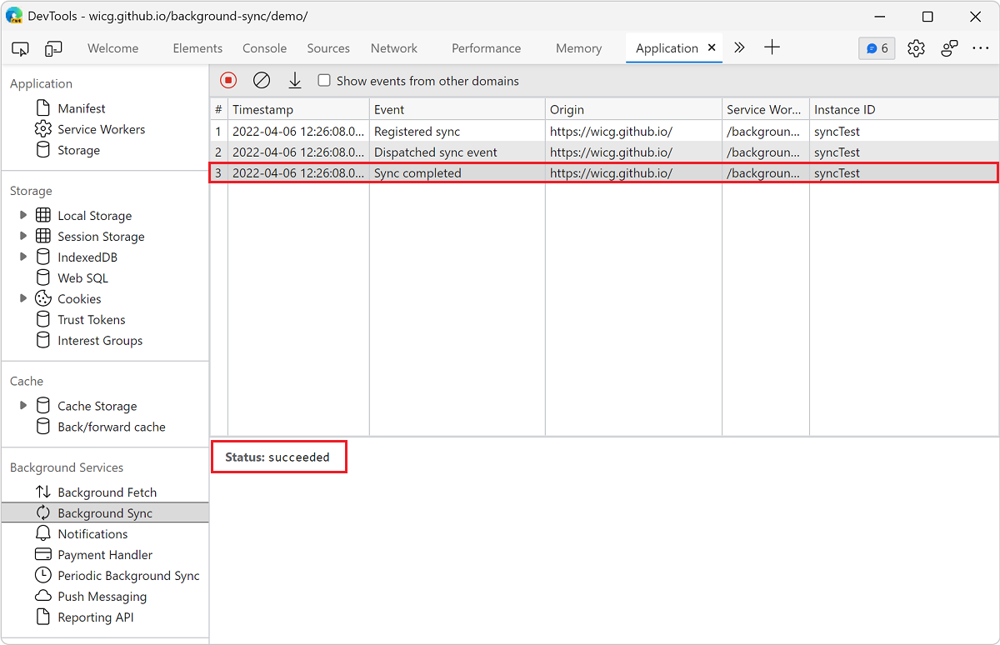

<!-- ====================================================================== -->
## Notifications

After a **service worker** has received a [Push Message](https://developer.mozilla.org/docs/Web/API/Push_API) from a server, the service worker uses the [Notifications API](https://developer.mozilla.org/docs/Web/API/Notifications_API) to display the data to a user.  To log Notifications for 3 days, even when DevTools isn't open:

1. Open DevTools by right-clicking the webpage and selecting **Inspect**.  Or by pressing **Ctrl+Shift+I** (Windows, Linux) or **Command+Option+I** (macOS).

1. In DevTools, on the main toolbar, select the **Application** tab.  If that tab isn't visible, click the **More tabs** () button, or else the **More Tools** () button.

1. On the left, in the **Background Services** section, select **Notifications**.  The **Notifications** page opens.

   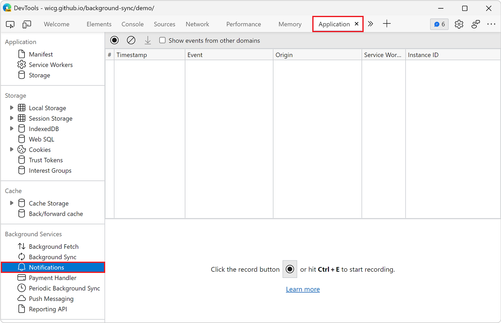

1. Click **Record** ().  After triggering some Notifications activity, DevTools logs the events to the table.

   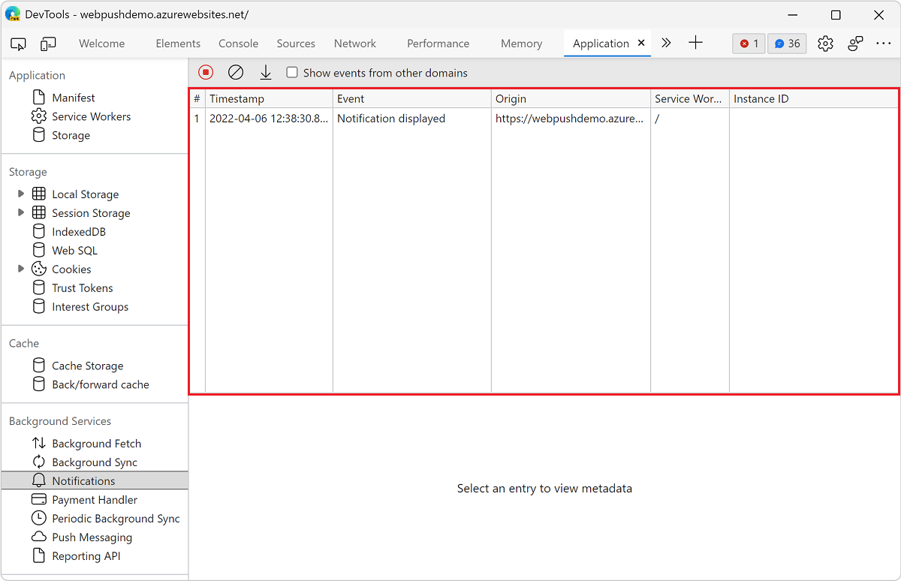

1. Click an event to view its details in the space below the table.

   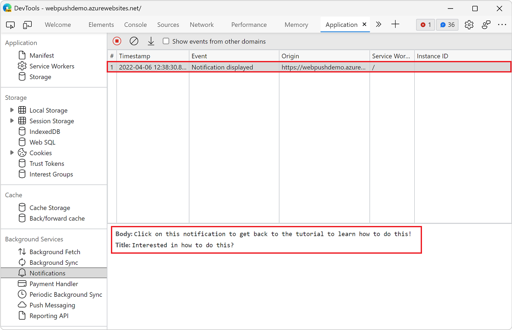

<!-- ====================================================================== -->
## Payment Handler

The [Payment Handler API](https://web.dev/web-based-payment-apps-overview/) allows web applications to handle payment requests on behalf of users. To log the payment request and response events for 3 days, even when DevTools isn't open:

1. Open DevTools by right-clicking the webpage and selecting **Inspect**.  Or by pressing **Ctrl+Shift+I** (Windows, Linux) or **Command+Option+I** (macOS).

1. In DevTools, on the main toolbar, select the **Application** tab.  If that tab isn't visible, click the **More tabs** () button, or else the **More Tools** () button.

1. On the left, in the **Background Services** section, select **Payment Handler**.  The **Payment Handler** page opens.

   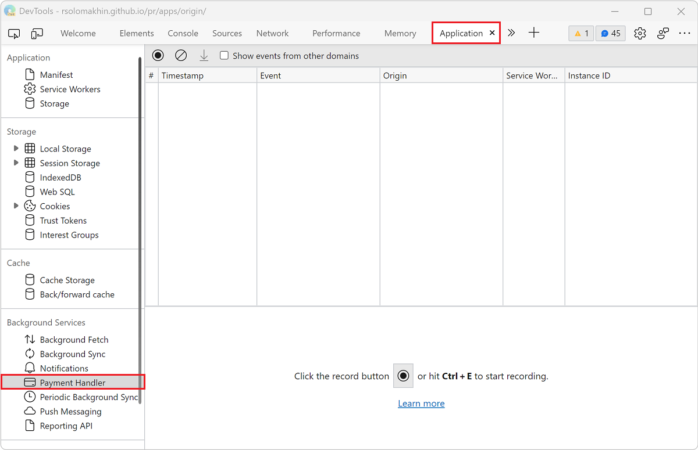

1. Click **Record** ().  After triggering some payment requests, DevTools logs the events to the table.

   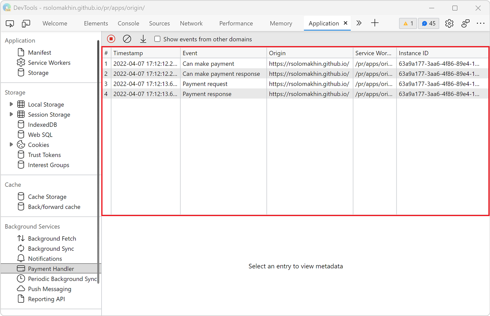

1. Click an event to view its details in the space below the table.

   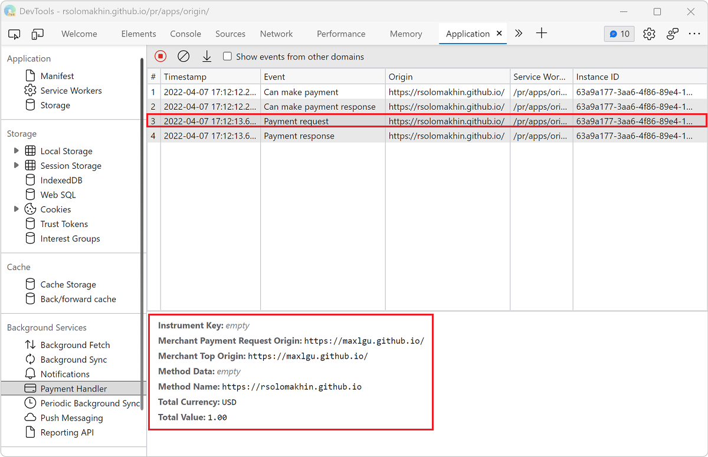

<!-- ====================================================================== -->
## Periodic Background Sync

The **Periodic Background Sync API** enables the **service worker** of a Progressive Web App to retrieve data from a server, periodically, even when the website isn't opened. To learn more about the **Periodic Background Sync API**, see [Use the Periodic Background Sync API to regularly get fresh content](/microsoft-edge/progressive-web-apps-chromium/how-to/background-syncs#use-the-periodic-background-sync-api-to-regularly-get-fresh-content).

To log Periodic Background Sync events for 3 days, even when DevTools isn't open:

1. Open DevTools by right-clicking the webpage and selecting **Inspect**.  Or by pressing **Ctrl+Shift+I** (Windows, Linux) or **Command+Option+I** (macOS).

1. In DevTools, on the main toolbar, select the **Application** tab.  If that tab isn't visible, click the **More tabs** () button, or else the **More Tools** () button.

1. On the left, in the **Background Services** section, select **Periodic Background Sync**.  The **Periodic Background Sync** page opens.

   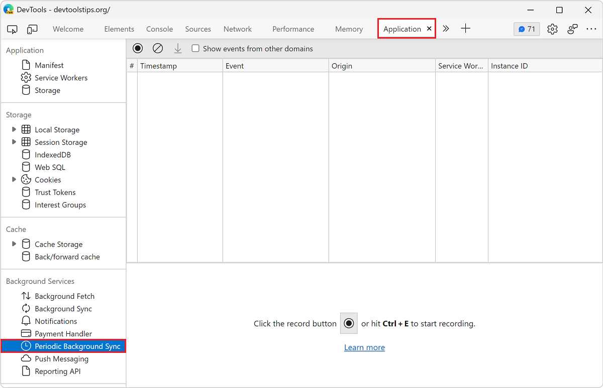

1. Click **Record** ().  After triggering some Periodic Background Sync activity, DevTools logs the events to the table.

   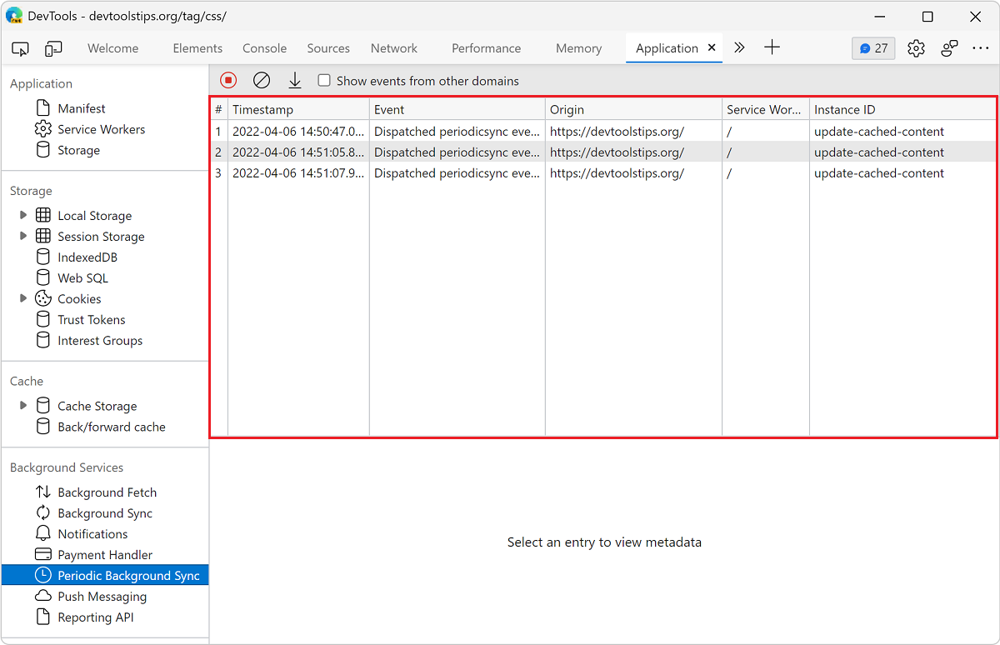

<!-- ====================================================================== -->
## Push Messages

To display a push notification to a user, the **service worker** of a Progressive Web App must first use the [Push Message API](https://developer.mozilla.org/docs/Web/API/Push_API) to receive data from a server.  When the service worker is ready to display the notification, it uses the [Notifications API](https://developer.mozilla.org/docs/Web/API/Notifications_API).  To log Push Messages for 3 days, even when DevTools isn't open:

1. Open DevTools by right-clicking the webpage and selecting **Inspect**.  Or by pressing **Ctrl+Shift+I** (Windows, Linux) or **Command+Option+I** (macOS).

1. In DevTools, on the main toolbar, select the **Application** tab.  If that tab isn't visible, click the **More tabs** () button, or else the **More Tools** () button.

1. On the left, in the **Background Services** section, select **Push Messaging**.  The **Push Messaging** page opens.

   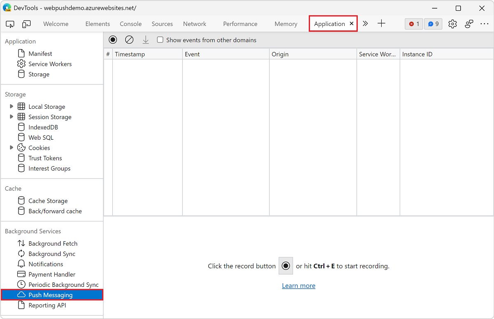

1. Click **Record** ().  After triggering some Push Message activity, DevTools logs the events to the table.

   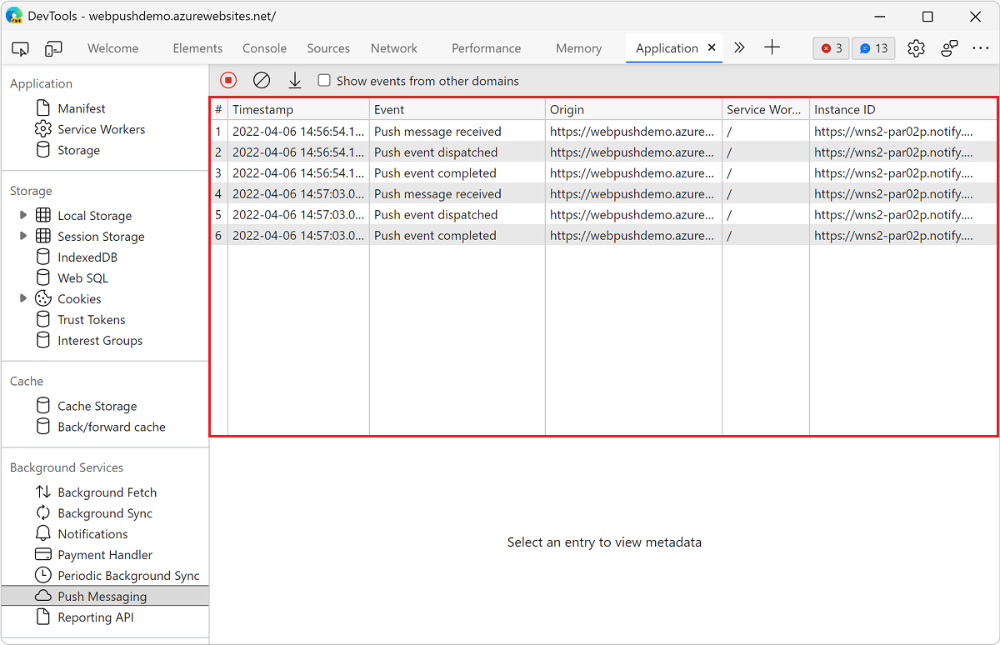

1. Click an event to view the details in the space below the table.

   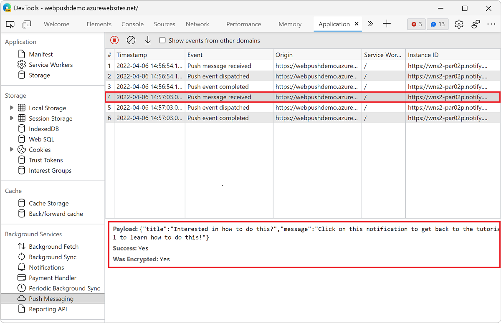

<!-- ====================================================================== -->
## Reporting API

The **Reporting API** enables web developers to receive reports of security violations, deprecated API calls, and others, from their production websites.

To see reports that have been sent by the browser using the **Reporting API**:

1. Open DevTools by right-clicking the webpage and selecting **Inspect**.  Or by pressing **Ctrl+Shift+I** (Windows, Linux) or **Command+Option+I** (macOS).

1. In DevTools, on the main toolbar, select the **Application** tab.  If that tab isn't visible, click the **More tabs** () button, or else the **More Tools** () button.

1. On the left, in the **Background Services** section, select **Reporting API**.  The **Reporting API** page opens.

   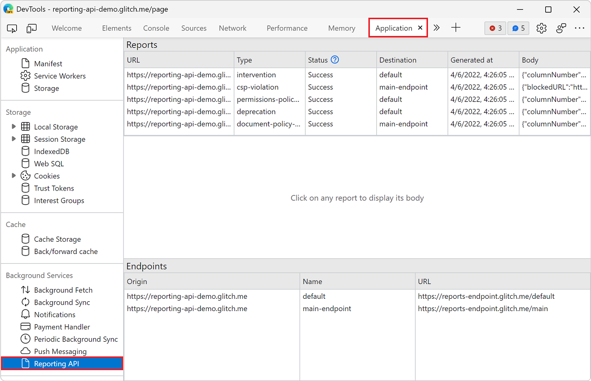

1. The **Reporting API** page displays the reports sent in the table at the top.

   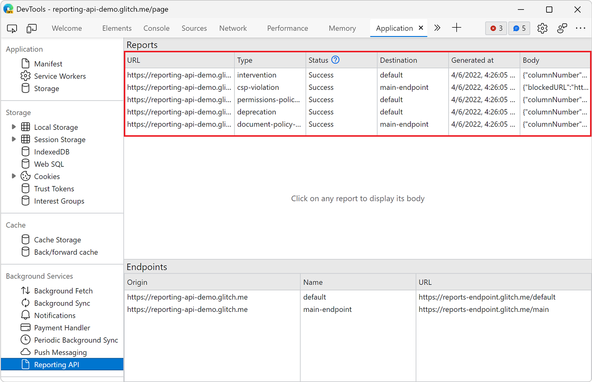

1. Click a report to view the details in the space below the table.

   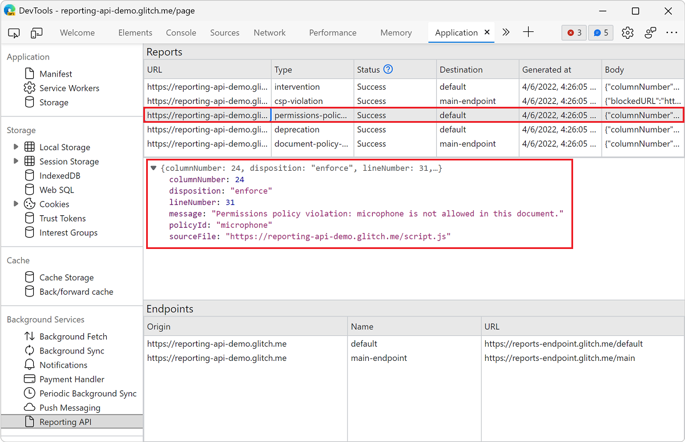

1. The **Reporting API** page also displays the list of reporting endpoints configured via the `Reporting-Endpoints` HTTP header in the table at the bottom.

   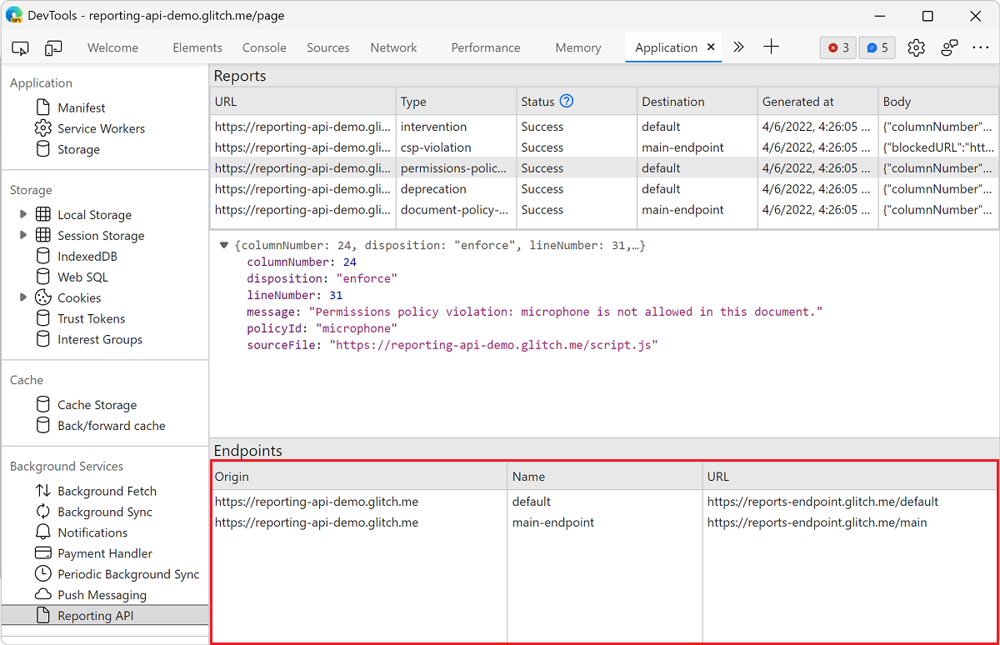

<!-- ====================================================================== -->
> [!NOTE]
> Portions of this page are modifications based on work created and [shared by Google](https://developers.google.com/terms/site-policies) and used according to terms described in the [Creative Commons Attribution 4.0 International License](https://creativecommons.org/licenses/by/4.0).
> The original page is found [here](https://developer.chrome.com/docs/devtools/javascript/background-services/) and is authored by [Kayce Basques](https://developers.google.com/web/resources/contributors#kayce-basques) (Technical Writer, Chrome DevTools \& Lighthouse).

This work is licensed under a [Creative Commons Attribution 4.0 International License](https://creativecommons.org/licenses/by/4.0).
