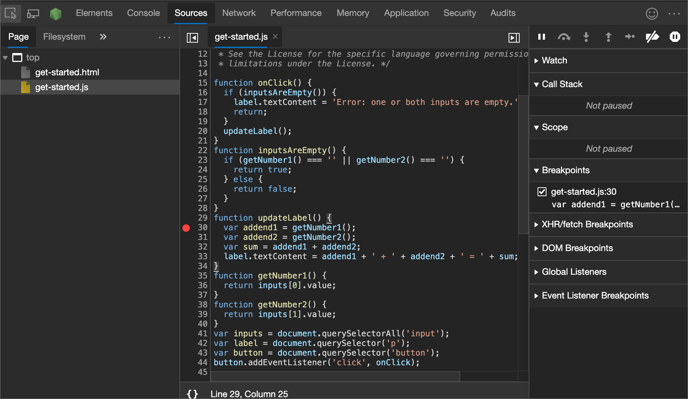
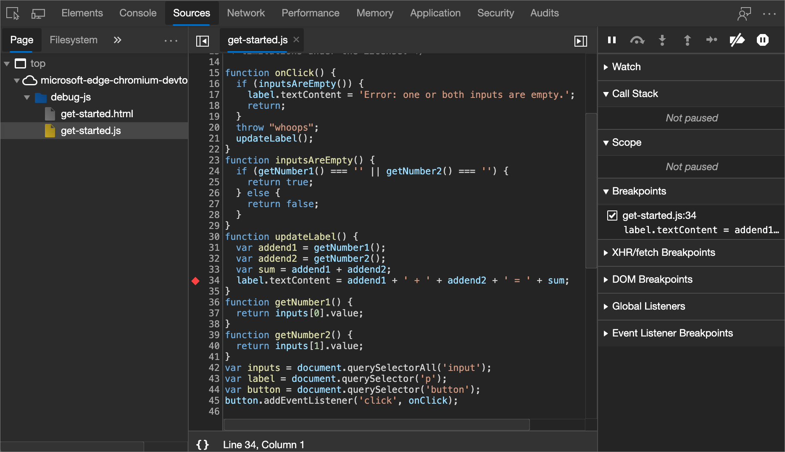
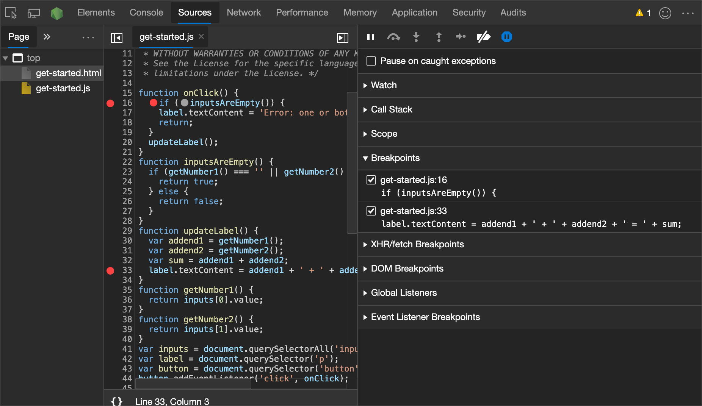
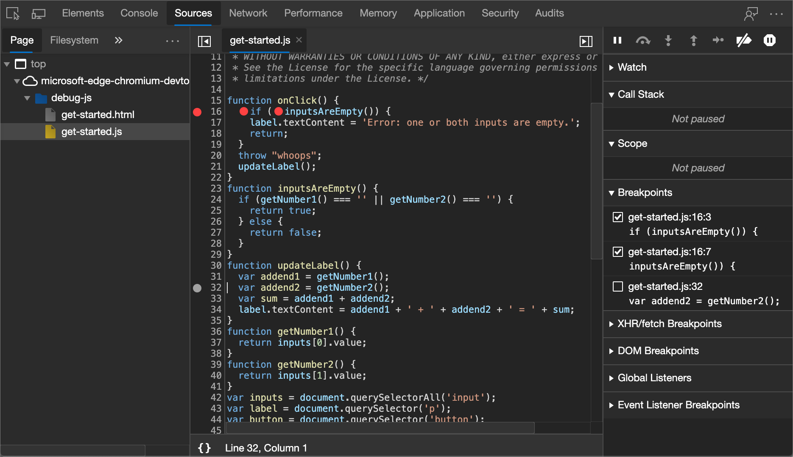
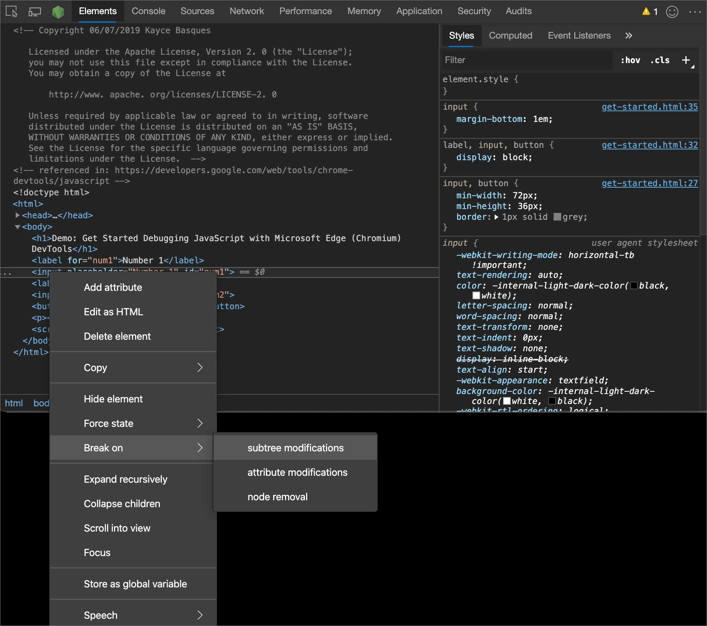
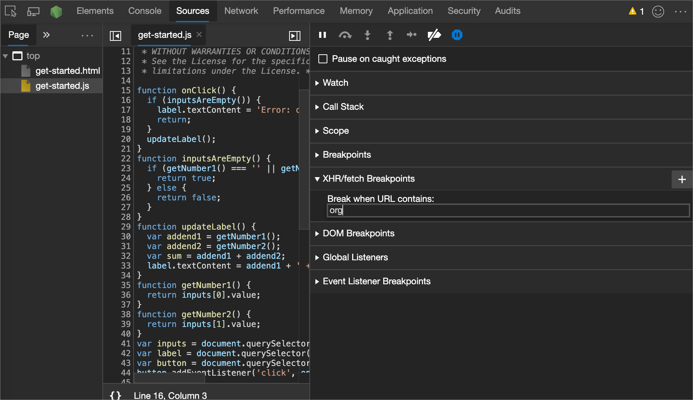
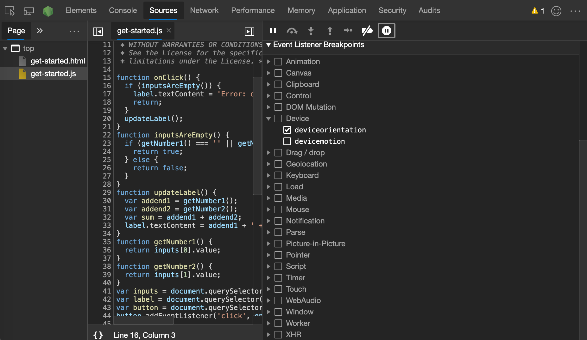
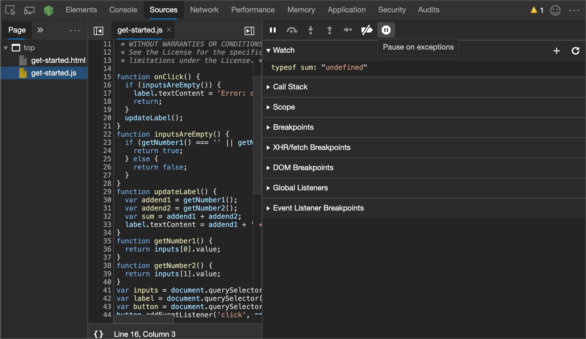
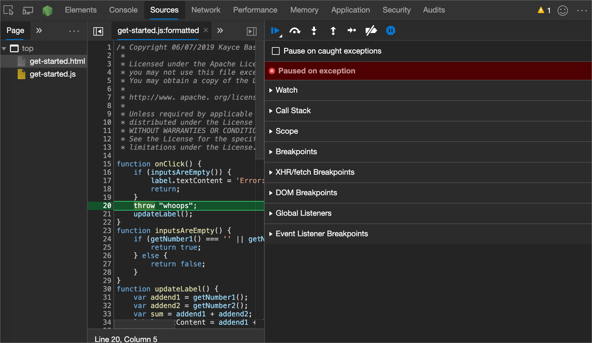

<!-- Copyright Kayce Basques

   Licensed under the Apache License, Version 2.0 (the "License");
   you may not use this file except in compliance with the License.
   You may obtain a copy of the License at

       https://www.apache.org/licenses/LICENSE-2.0

   Unless required by applicable law or agreed to in writing, software
   distributed under the License is distributed on an "AS IS" BASIS,
   WITHOUT WARRANTIES OR CONDITIONS OF ANY KIND, either express or implied.
   See the License for the specific language governing permissions and
   limitations under the License.  -->
# Pause code with breakpoints

Use breakpoints to pause your JavaScript code.  This article explains each type of breakpoint available in DevTools, as well as when to use and how to set each type.

For an introductory tutorial using an existing webpage, see [Get started debugging JavaScript](index.md).


<!-- ====================================================================== -->
## Overview of when to use each breakpoint type

The most well-known type of breakpoint is line-of-code.  But line-of-code breakpoints may be inefficient to set, especially if you don't know exactly where to look, or if you are working with a large codebase.  You can save yourself time when debugging by knowing how and when to use the other types of breakpoints.

| Breakpoint Type | Use This When You Want To Pause... |
|:--- |:--- |
| [Line-of-code](#line-of-code-breakpoints) | On an exact region of code.  |
| [Conditional line-of-code](#conditional-line-of-code-breakpoints) | On an exact region of code, but only when some other condition is true.  |
| [DOM](#dom-change-breakpoints) | On the code that changes or removes a specific DOM node, or the children.  |
| [XHR](#xhrfetch-breakpoints) | When an XHR URL contains a string pattern.  |
| [Event listener](#event-listener-breakpoints) | On the code that runs after an event, such as `click`, runs.  |
| [Exception](#exception-breakpoints) | On the line of code that is throwing a caught or uncaught exception.  |
| [Function](#function-breakpoints) | Whenever a specific command, function, or method is run.  |
| [Logpoints](#logpoints) | A variant that does not "break" into the debugger but instead logs a message to the console.  |


<!-- ====================================================================== -->
## Line-of-code breakpoints

Use a line-of-code breakpoint when you know the exact region of code that you need to investigate.  DevTools always pauses before this line of code is run.

To set a line-of-code breakpoint in DevTools:

1. Select the **Sources** tool.

1. Open the file that contains the line of code that you want to break on.

1. Go the line of code.

1. To the left of the line of code is the line number column.  Click it.  A red icon (or more recently, a blue rectangle arrow) appears next to the line number column:

   

### Line-of-code breakpoints in your code

Run the `debugger` method from your code to pause on that line.  This is equivalent to a [line-of-code breakpoint](#line-of-code-breakpoints), except that the breakpoint is set in your code, not in the DevTools UI.

```javascript
console.log('a');
console.log('b');
debugger;
console.log('c');
```

### Conditional line-of-code breakpoints

Use a conditional line-of-code breakpoint when you know the exact region of code that you need to investigate, but you want to pause only when some other condition is true.

To set a conditional line-of-code breakpoint:

1. Select the **Sources** tool.

1. Open the file that contains the line of code you want to break on.

1. Go to the line of code.

1. To the left of the line of code is the line number column.  Right-click it.

1. Select **Add conditional breakpoint**.  A dialog is displayed underneath the line of code.

1. Enter your condition in the dialog.

1. Press **Enter** to activate the breakpoint.  A red diamond (or more recently, an orange icon) appears on top of the line number column:

   

### Manage line-of-code breakpoints

Use the **Breakpoints** pane to disable or remove line-of-code breakpoints from a single location.



*  Select the checkbox next to an entry to disable that breakpoint.

*  Right-click an entry to remove that breakpoint.

*  Right-click anywhere in the **Breakpoints** pane to deactivate all breakpoints, disable all breakpoints, or remove all breakpoints.  Disabling all breakpoints is equivalent to unchecking each one.  Deactivating all breakpoints instructs DevTools to ignore all line-of-code breakpoints, but to also maintain the enabled state so that each are in the same state as before when you reactivate each one.




<!-- ====================================================================== -->
## DOM change breakpoints

Use a DOM change breakpoint when you want to pause on the code that changes a DOM node or the children.

To set a DOM change breakpoint:

1. Select the **Elements** tool.

1. Go the element on which you want to set the breakpoint.

1. Right-click the element, point to **Break on**, then select **Subtree modifications**, **Attribute modifications**, or **Node removal**.

   

### Types of DOM change breakpoints

*  **Subtree modifications**.  Triggered when a child of the currently selected node is removed or added, or the contents of a child are changed.  Not triggered on child node attribute changes, or on any changes to the currently selected node.

*  **Attributes modifications**: Triggered when an attribute is added or removed on the currently selected node, or when an attribute value changes.

*  **Node Removal**: Triggered when the currently selected node is removed.


<!-- ====================================================================== -->
## XHR/Fetch breakpoints

Use an XHR breakpoint when you want to break when the request URL of an XHR contains a specified string.  DevTools pauses on the line of code where the XHR runs the `send()` method.

> [!NOTE]
> This feature also works with [Fetch API](https://developer.mozilla.org/docs/Web/API/Fetch_API) requests.

One example of when this is helpful is when your webpage is requesting an incorrect URL, and you want to quickly find the AJAX or Fetch source code that is causing the incorrect request.

To set an XHR breakpoint:

1. Select the **Sources** tool.

1. Expand the **XHR Breakpoints** panel.

1. Click **Add breakpoint**.

1. Enter the string which you want to break on.  DevTools pauses when this string is present anywhere in an XHR request URL.

1. Press **Enter** to confirm.




<!-- ====================================================================== -->
## Event listener breakpoints

Use event listener breakpoints when you want to pause on the event listener code that runs after an event is fired.  You can select specific events, such as `click`, or categories of events, such as all mouse events.

1. Select the **Sources** tool.

1. Expand the **Event Listener Breakpoints** panel.  DevTools shows a list of event categories, such as **Animation**.

1. Check one of these categories to pause whenever any event from that category is fired, or expand the category and check a specific event.




<!-- ====================================================================== -->
## Exception breakpoints

Use exception breakpoints when you want to pause on the line of code that is throwing a caught or uncaught exception.

1. Select the **Sources** tool.

1. Click **Pause on exceptions** ().  The icon turns blue when enabled.

   

1. **Optional:** Check the **Pause On Caught Exceptions** checkbox if you also want to pause on caught exceptions, in addition to uncaught ones.

   


<!-- ====================================================================== -->
## Function breakpoints

Run the `debug(method)` method, where `method` is the command, function, or method you want to debug, when you want to pause whenever a specific function is run.  You can insert `debug()` into your code (such as a `console.log()` statement), or run the method from the DevTools Console.

`debug()` is equivalent to setting a [line-of-code breakpoint](#line-of-code-breakpoints) on the first line of the function.

```javascript
function sum(a, b) {
    let result = a + b; // DevTools pauses on this line.
    return result;
}
debug(sum); // Pass the function object, not a string.
sum();
```

### Make sure the target function is in scope

DevTools throws a `ReferenceError` if the function you want to debug isn't in scope.

```javascript
(function () {
    function hey() {
        console.log('hey');
    }
    function yo() {
        console.log('yo');
    }
    debug(yo); // This works.
    yo();
})();
debug(hey); // This doesn't work.  hey() is out of scope.
```

When you're calling `debug()` from the DevTools Console, here's a technique to ensure that the target function is in scope:

1. Set a [line-of-code breakpoint](#line-of-code-breakpoints) somewhere where the function is in scope.

1. Trigger the breakpoint.  Your code is paused at the breakpoint, and the variables for the current function are in scope.

1. Call `debug()` in the DevTools Console, while the code is still paused on your line-of-code breakpoint.


<!-- ====================================================================== -->
## Logpoints

A Logpoint is a breakpoint variant that does not "break" in the debugger, but instead logs a message directly to the console.  You insert a logpoint via DevTools the same way you would any other breakpoint. 

To set a logpoint:

1. Select the Sources tool.

1. Open the file that contains the line of code where you want to insert a logpoint.

1. Right-click on the left of the line of code, in the line number column.

1. Select **Add Logpoint**. A dialog is displayed underneath the line of code.

1. Enter a message or a JavaScript expression that will get evaluated when the logpoint is hit.

1. Press **Enter** to activate the logpoint. A red diamond (or more recently, an orange icon) appears on top of the line number column.

For more information, see [Log messages in the Console tool](/microsoft-edge/devtools-guide-chromium/console/console-log).

<!-- ====================================================================== -->
## See also

*  [JavaScript debugging features](reference.md) - Using the UI of the debugger in the **Sources** tool.
*  [Get started debugging JavaScript](index.md) - An introductory tutorial using an existing webpage.
*  [Sources tool overview](../sources/index.md) - The debugger is part of the **Sources** tool, which includes a JavaScript editor.


<!-- ====================================================================== -->
> [!NOTE]
> Portions of this page are modifications based on work created and [shared by Google](https://developers.google.com/terms/site-policies) and used according to terms described in the [Creative Commons Attribution 4.0 International License](https://creativecommons.org/licenses/by/4.0).
> The original page is found [here](https://developer.chrome.com/docs/devtools/javascript/breakpoints/) and is authored by [Kayce Basques](https://developers.google.com/web/resources/contributors#kayce-basques) (Technical Writer, Chrome DevTools \& Lighthouse).

[](https://creativecommons.org/licenses/by/4.0)
This work is licensed under a [Creative Commons Attribution 4.0 International License](https://creativecommons.org/licenses/by/4.0).
