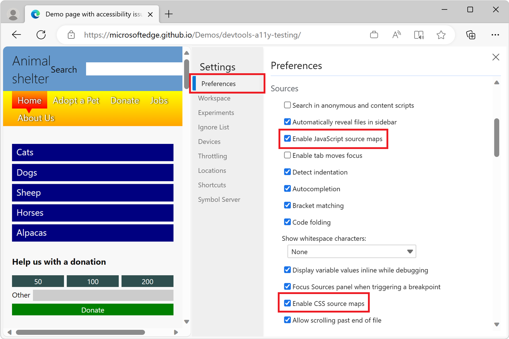
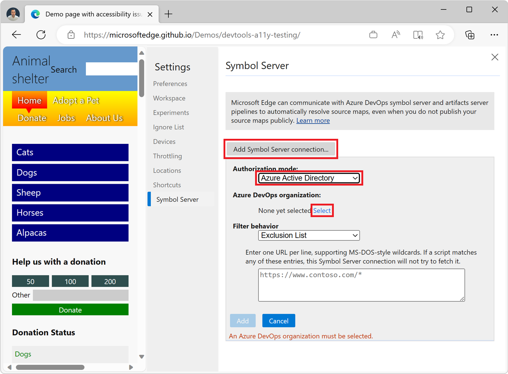
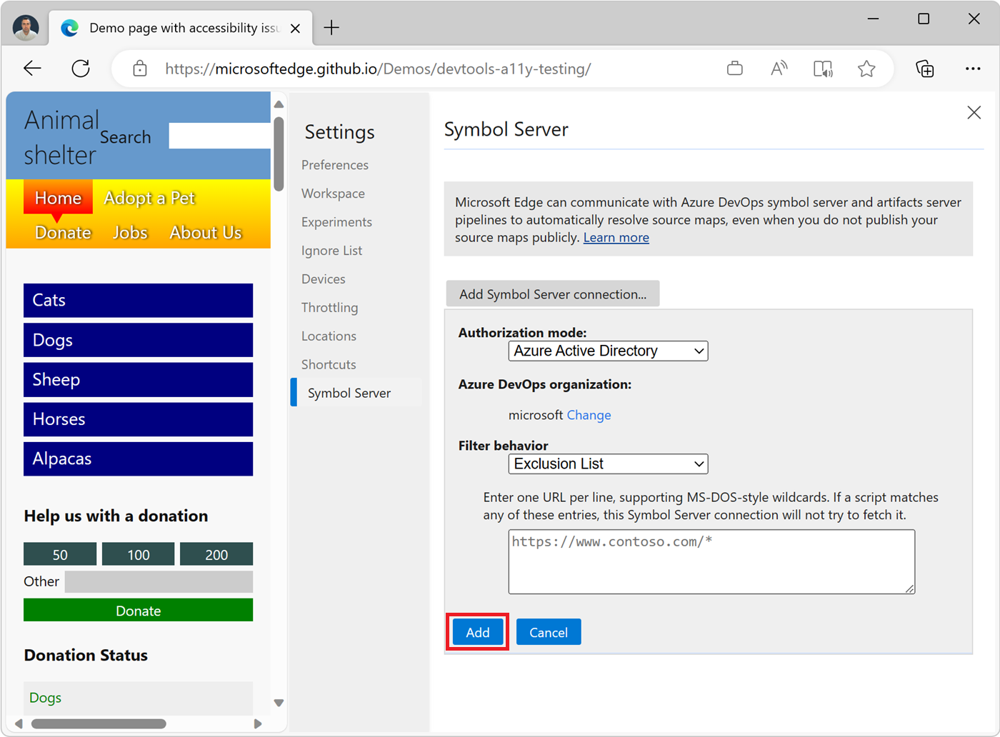
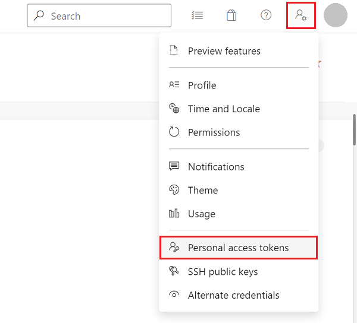
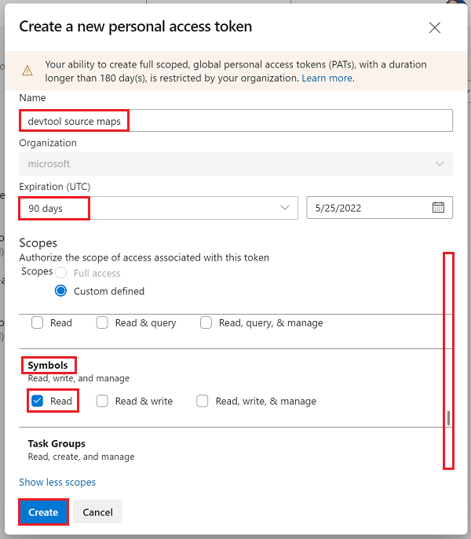
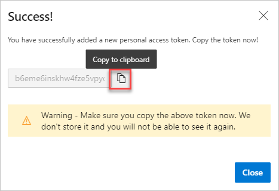
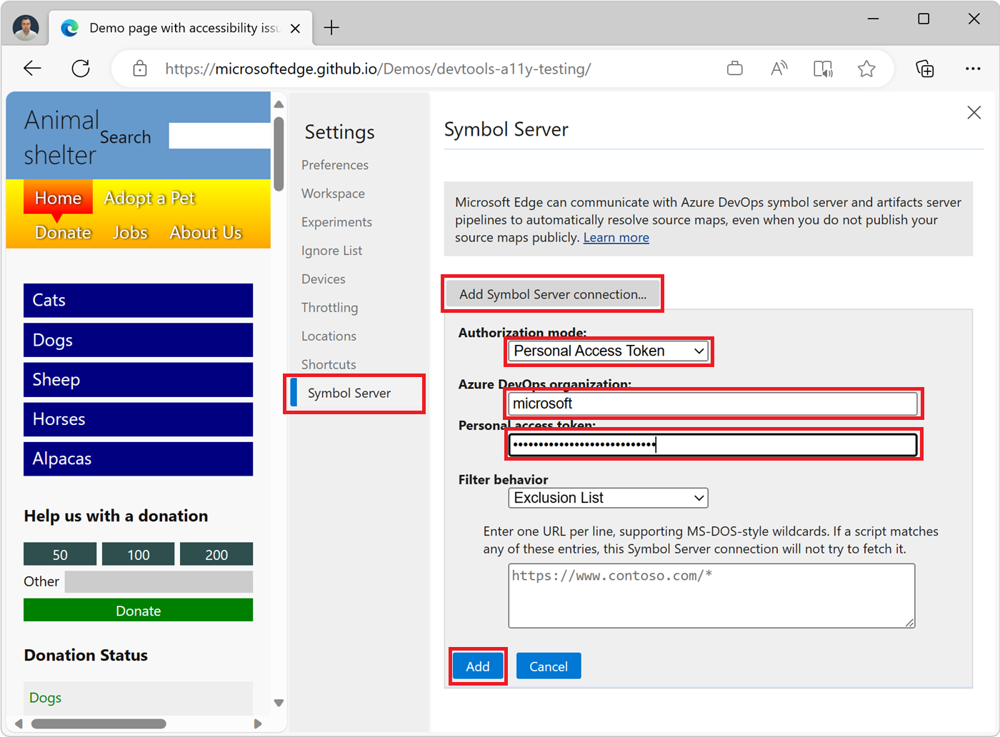
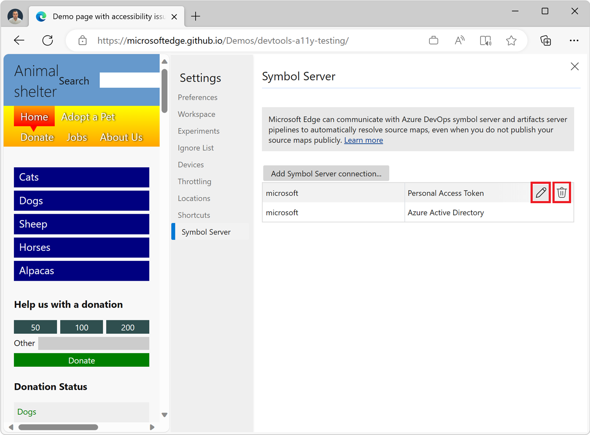
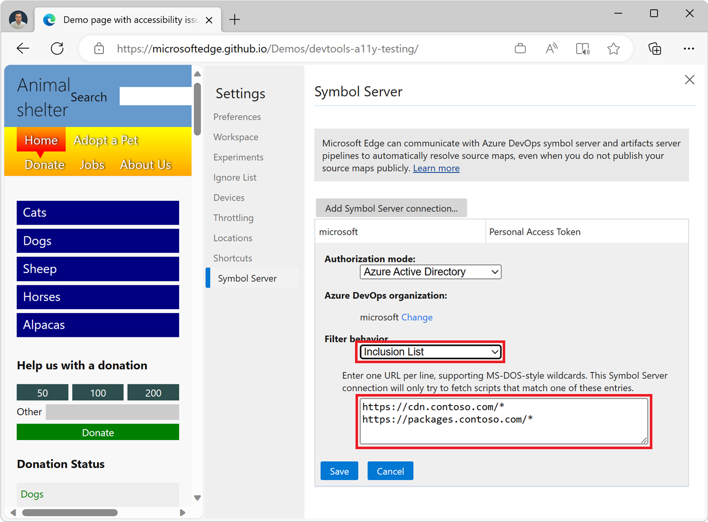

# Securely debug original code by using Azure Artifacts symbol server source maps

To securely see and work with your original development source code in DevTools rather than the compiled, minified, and bundled production code that's returned by the web server, you can use source maps published on the Azure Artifacts symbol server.

Source maps map your compiled production code to your original development source files. In DevTools, you can then see and work with your familiar development source files, instead of the compiled code. To learn more about source mapping and using source maps in DevTools, see [Map the processed code to your original source code, for debugging](source-maps.md).

Downloading your source maps from the Azure Artifacts symbol server makes it possible to debug your production website by retrieving your original development source code securely.


<!-- ====================================================================== -->
## Prerequisite: Publish source maps to the Azure Artifacts symbol server

To use source maps from the Azure Artifacts symbol server in DevTools, they need to be published to the server first.

To learn about how to publish source maps, see [Securely debug original code by publishing source maps to the Azure Artifacts symbol server](publish-source-maps-to-azure.md).


<!-- ====================================================================== -->
## Step 1: Enable source maps in DevTools

To make sure that source maps are enabled in DevTools:

1. To open DevTools, in Microsoft Edge, right-click a webpage, and then select **Inspect**.  Or, press **Ctrl+Shift+I** (Windows, Linux) or **Command+Option+I** (macOS).

1. In DevTools, click **Settings** () > **Preferences**.

1. Make sure the **Enable JavaScript source maps** checkbox and the **Enable CSS source maps** checkbox are selected:

    


<!-- ====================================================================== -->
## Step 2: Connect DevTools to the Azure Artifacts symbol server

DevTools needs to be configured to successfully retrieve the published source maps for your website.

To configure DevTools, you create an Azure Artifacts symbol server connection. There are two types of connections: **Microsoft Entra ID**, which is the easiest to use, and **Personal Access Token**.

#### Connect to the symbol server by using Microsoft Entra ID

1. In DevTools, click **Settings** () > **Symbol Server**.

1. Click **Add Symbol Server connection** to start creating a new connection.

1. In the **Authorization mode** dropdown list, select **Microsoft Entra ID**.

   If the **Microsoft Entra ID** option is disabled, sign in to Microsoft Edge. To learn more, see [Sign in to sync Microsoft Edge across devices](https://support.microsoft.com/microsoft-edge/sign-in-to-sync-microsoft-edge-across-devices-e6ffa79b-ed52-aa32-47e2-5d5597fe4674).

1. Under **Azure DevOps organization**, click **Select**.

   

   The list of DevOps organizations that you're a member of appears.

1. Double-click the organization that you want to connect to, or click it and then press **Enter**.

1. Click **Add** to create the connection.

   

1. Click the **Close** () button  in the upper right to close the **Settings** panel, and then click the **Reload DevTools** button.

#### Connect to the symbol server by using a Personal Access Token

To connect to the symbol server by using a Personal Access Token (PAT), first generate a new PAT in Azure DevOps, and then configure DevTools.

<!-- ---------- -->
###### Generate a new PAT in Azure DevOps

1. Sign in to your Azure DevOps organization by going to `https://dev.azure.com/{yourorganization}`.

1. In Azure DevOps, go to **User settings** > **Personal access tokens**:
    
   

   The **Personal Access Tokens** page appears:

   

1. Click **New Token**.  The **Create a new personal access token** dialog opens:

   

1. In the **Name** text box, enter a name for the PAT, such as "devtool source maps".

1. In the **Expiration** section, enter an expiration date for the PAT.

1. In the **Scopes** section, click **Show all scopes** to expand the section.

1. Scroll down to **Symbols**, and then select the **Read** checkbox.

1. Click the **Create** button.  The **Success!** dialog appears:

   

1. Click the **Copy to clipboard** button to copy the PAT.  Make sure to copy the token and store it in a secure location. For your security, it won't be shown again.

To learn more about PAT, see [Use personal access tokens](/azure/devops/organizations/accounts/use-personal-access-tokens-to-authenticate).

Your new PAT has now been generated.  Next, configure DevTools.

<!-- ---------- -->
###### Configure DevTools

1. In DevTools, click **Settings** () > **Symbol Server**.

1. Click **Add Symbol Server connection** to start creating a new connection.

1. In the **Authorization mode** dropdown list, select **Personal Access Token**.

1. In the **Azure DevOps organization** text box, enter the Azure DevOps organization where you created the PAT.

1. In the **Personal access token** text box, paste your personal access token (PAT):

   

1. Click the **Add** button. The connection is created.

1. Click the **Close** () button  in the upper right to close the **Settings** panel, and then click the **Reload DevTools** button.


<!-- ====================================================================== -->
## Step 3: Retrieve original code in DevTools

After doing the above setup steps, when you use DevTools to work on a build of your website for which symbols have been published, you can now see your original source code, instead of the transformed code.

*  In the **Console** tool, links from log messages to source files go to the original files, not the compiled files.

*  When stepping through code in the **Sources** tool, the original files are listed in the **Navigator** pane on the left.

*  In the **Sources** tool, the links to source files that appear in the **Call Stack** of the **Debugger** pane open the original source files.


<!-- ====================================================================== -->
## Connect to multiple Azure Artifacts symbol servers

To fetch sourcemaps from multiple Azure DevOps organizations, configure DevTools to connect to multiple Azure Artifacts symbol servers, as follows:

1. In DevTools, click **Settings** () > **Symbol Server**.

1. Click **Add Symbol Server connection** to create an additional connection.

1. Configure the new connection.  See [Connect to the symbol server by using Microsoft Entra ID](#connect-to-the-symbol-server-by-using-microsoft-entra-id) or [Connect to the symbol server with a Personal Access Token](#connect-to-the-symbol-server-by-using-a-personal-access-token).

To edit or remove an existing connection, hover over the connection, and then click the **Edit** () or **Remove** () button next to the connection on the **Symbol Server** settings page:




<!-- ====================================================================== -->
## Filter source maps by URL

To decide which source maps to download via the Azure Artifacts symbol server connection, use the **Filter behavior** feature.

1. In DevTools, click **Settings** () > **Symbol Server**.

1. Create a new connection or edit an existing connection.

1. In the **Filter behavior** dropdown list, select either **Exclusion List** to exclude specific source maps, or **Inclusion List** to only include specific source maps.

1. In the text box below the dropdown list, enter one URL per line for the source maps that you want to exclude or include:

   

1. Click the **Save** button.

   The following wildcards are supported:

   | Wildcard | Meaning |
   |---|---|
   | ? | Matches a single character. |
   | * | Matches one or more of any character. |

   If you select **Exclusion List**, DevTools attempts to look up any source maps for scripts except those that have a URL that matches one of the entries in the list.

   If you select **Inclusion List**, DevTools only attempts to look up source maps for scripts that have URLs that match one of the entries in the list.  For example, suppose you select **Inclusion List** in the **Filter behavior** dropdown list, and then enter the following in the **Filter behavior** text box:

   ```
   https://cdn.contoso.com/*
   https://packages.contoso.com/*
   ```

   In this example, DevTools only attempts to resolve source maps that match these two URL patterns, and doesn't attempt to load source maps for other scripts.


<!-- ====================================================================== -->
## Check the status of downloaded source maps

You can check the status of your source maps by using the **Source Maps Monitor** tool.

To learn more about the **Source Maps Monitor** tool and how it can help monitor which source files requested source maps, and whether those source maps were loaded, see [Source Maps Monitor tool](../source-maps-monitor/source-maps-monitor-tool.md).


<!-- ====================================================================== -->
## See also

* [Securely debug original code by publishing source maps to the Azure Artifacts symbol server](publish-source-maps-to-azure.md)
* [Map the processed code to your original source code, for debugging](source-maps.md)
* [Source Maps Monitor tool](../source-maps-monitor/source-maps-monitor-tool.md)
* [Improvements for connecting DevTools to Azure Artifacts symbol server](../whats-new/2023/07/devtools-115.md#improvements-for-connecting-devtools-to-azure-artifacts-symbol-server) in _What's New in DevTools (Microsoft Edge 115)_.
