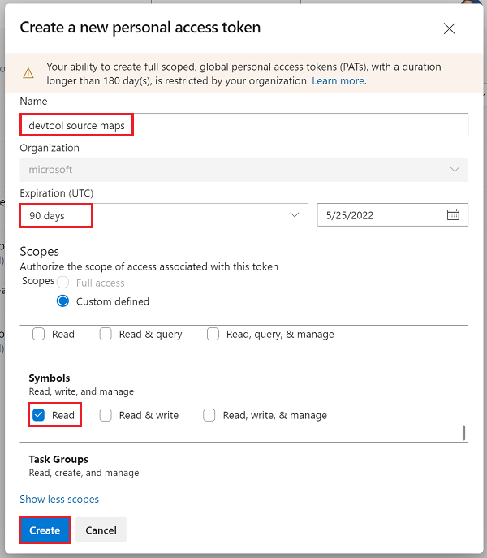
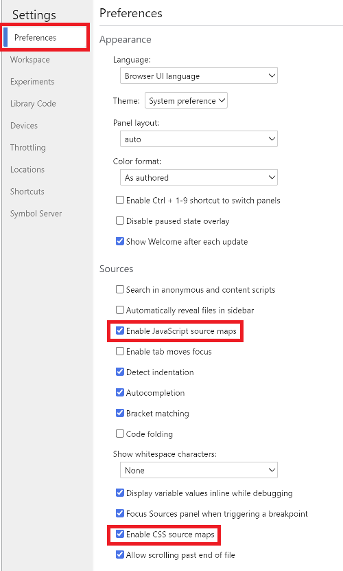
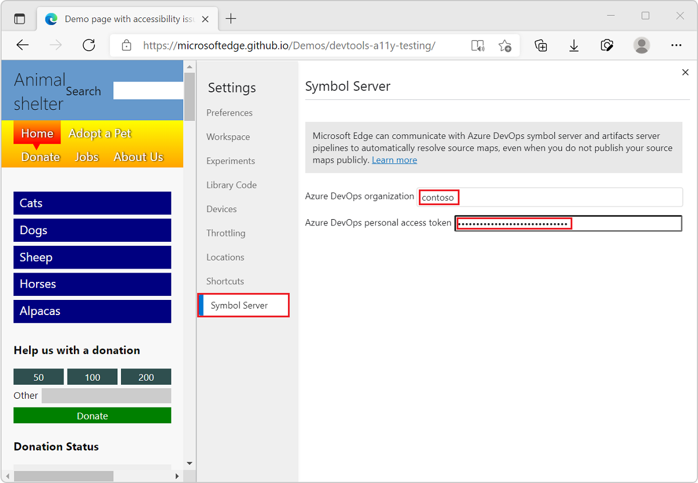

# Securely debug original code by using Azure Artifacts symbol server source maps

To securely see and work with your original development source code in DevTools rather than the compiled, minified, and bundled production code that's returned by the web server, you can use source maps published on the Azure Artifacts symbol server.

Source maps map your compiled production code to your original development source files. In DevTools, you can then see and work with your familiar development source files, instead of the compiled code. To learn more about source mapping and using source maps in DevTools, see [Map the processed code to your original source code, for debugging](source-maps.md).

Downloading your source maps from the Azure Artifacts symbol server makes it possible to debug your production website by retrieving your original development source code securely.

<!-- ====================================================================== -->
## Prerequisite: Publish source maps to the Azure Artifacts symbol server

To use source maps from the Azure Artifacts symbol server in DevTools, they need to be published to the server first.

To learn about how to publish source maps, see [Securely debug original code by publishing source maps to the Azure Artifacts symbol server](publish-source-maps-to-azure.md).

<!-- ====================================================================== -->
## Step 1: Generate a Personal Access Token for Azure DevOps

To obtain source maps from the Azure Artifacts symbol server, DevTools uses the fetch protocol to talk to Azure DevOps, which requires a valid Personal Access Token (PAT).

You need to generate a PAT even if you already generated one to publish source maps to the symbol server in [Securely debug original code by publishing source maps to the Azure Artifacts symbol server](publish-source-maps-to-azure.md).

To generate a PAT in Azure DevOps:

1. Sign in to your Azure DevOps organization by going to `https://dev.azure.com/{yourorganization}`.

1. In Azure DevOps, go to **User settings** > **Personal access tokens**:
    
   

   The **Personal Access Tokens** page appears:

   

1. Click **New Token**.  The **Create a new personal access token** dialog opens:

   

1. In the **Name** text box, enter a name for the PAT, such as "devtool source maps".

1. In the **Expiration** section, enter an expiration date for the PAT.

1. In the **Scopes** section, click **Show all scopes** to expand the section.

1. Scroll down to **Symbols**, and then select the **Read** checkbox.

1. Click the **Create** button.  The **Success!** dialog appears:

   

1. Click the **Copy to clipboard** button to copy the PAT.  Make sure to copy the token and store it in a secure location. For your security, it won't be shown again.

To learn more about PAT, see [Use personal access tokens](/azure/devops/organizations/accounts/use-personal-access-tokens-to-authenticate).

<!-- ====================================================================== -->
## Step 2: Configure DevTools

DevTools now needs to be configured with the personal access token (PAT) to successfully retrieve the source maps.

To configure DevTools:

1. To open DevTools, in Microsoft Edge, right-click a webpage, and then select **Inspect**.  Or, press `Ctrl`+`Shift`+`I` (Windows, Linux) or `Command`+`Option`+`I` (macOS).

1. In DevTools, click **Settings** () > **Preferences**.

1. Make sure the **Enable JavaScript source maps** checkbox and the **Enable CSS source maps** checkbox are selected:

    

1. In the sidebar of the **Settings** page, click **Symbol Server**.

1. In the **Azure DevOps organization** text box, enter the Azure DevOps organization where you created the PAT.

1. In the **Azure DevOps personal access token** text box, paste your personal access token (PAT).

   

1. Click **x** in the upper right to close the **Settings** panel, and then click the **Reload DevTools** button.

<!-- ====================================================================== -->
## Step 3: Retrieve original code in DevTools

After the above setup steps, when you use DevTools to work on a build of your web site for which symbols have been published, you can now see your original source code, instead of the transformed code.

*  In the **Console** tool, links from log messages to source files go to the original files, not the compiled files.

*  When stepping through code in the **Sources** tool, the original files are listed in the **Navigator** pane on the left.

*  In the **Sources** tool, the links to source files that appear in the **Call Stack** of the **Debugger** pane open the original source files.

<!-- ====================================================================== -->
## Check the status of downloaded source maps

You can check the status of your source maps by using the **Source Maps Monitor** tool.

To learn more about the **Source Maps Monitor** tool and how it can help monitor which source files requested source maps, and whether those source maps were loaded, see [Source Maps Monitor tool](../source-maps-monitor/source-maps-monitor-tool.md).

<!-- ====================================================================== -->
## See also

* [Securely debug original code by publishing source maps to the Azure Artifacts symbol server](publish-source-maps-to-azure.md)
* [Map the processed code to your original source code, for debugging](source-maps.md)
* [Source Maps Monitor tool](../source-maps-monitor/source-maps-monitor-tool.md)
