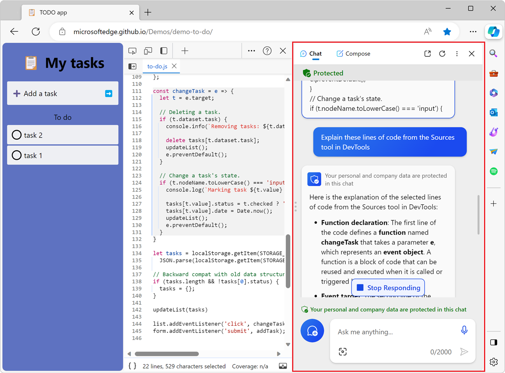
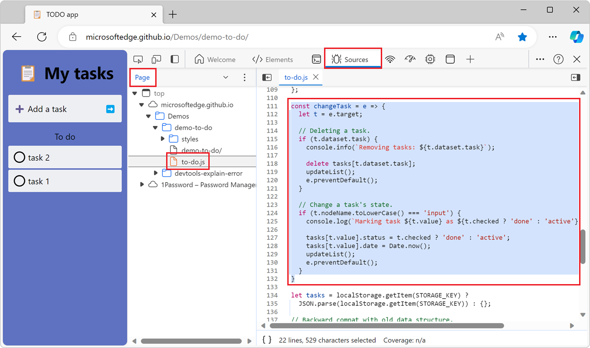

# Explain source code using Copilot in Edge

The **Sources** tool in Microsoft Edge DevTools integrate with Copilot in Microsoft Edge to help you understand source code.

When inspecting a webpage, you might want more information about the source code that's displayed in the **Sources** tool.  By using the **Explain these lines of code** feature, you get more information about the source code in Copilot in Edge:

<!-- ------------------------------ -->
#### Supported scenarios

This feature is for use in standard browser window, and is not available in the following scenarios:

* Browsing in an InPrivate window.  For information about InPrivate, see [Browse InPrivate in Microsoft Edge](https://support.microsoft.com/microsoft-edge/browse-inprivate-in-microsoft-edge-cd2c9a48-0bc4-b98e-5e46-ac40c84e27e2).
* Browsing with Kids Mode in Microsoft Edge.  For information about Kids Mode, see [Learn more about Kids Mode in Microsoft Edge](https://support.microsoft.com/microsoft-edge/learn-more-about-kids-mode-in-microsoft-edge-4bf0273c-1cbd-47a9-a8f3-895bc1f95bdd).
* Using DevTools with a Microsoft Edge WebView2 control.  For information about DevTools with WebView2 apps, see [Debug WebView2 apps with Microsoft Edge DevTools](../../webview2/how-to/debug-devtools.md).
* Using DevTools in a standalone Progressive Web App window.

<!-- ====================================================================== -->
## Enable Copilot in Edge

To use this explanation feature, enable Copilot in Edge:

1. Sign into Microsoft Edge. See [Sign in to sync Microsoft Edge across devices](https://support.microsoft.com/microsoft-edge/sign-in-to-sync-microsoft-edge-across-devices-e6ffa79b-ed52-aa32-47e2-5d5597fe4674).

1. Make sure the Copilot icon () is visible in the top-right corner of the browser toolbar. If it's not, in Microsoft Edge, select **Settings and more** (**...**) > **Settings** > **Sidebar** > **Copilot**, and then turn on the **Show Copilot** toggle.

<!-- ====================================================================== -->
## Explain source code

To use Copilot to explain code in the **Sources** tool:

1. Open a web page that contains the source code you want to explain. For example, open the [TODO app](https://microsoftedge.github.io/Demos/demo-to-do/) demo page in a new window or tab.

1. To open DevTools, right-click the webpage, and then select **Inspect**.  Or, press **Ctrl+Shift+I** (Windows, Linux) or **Command+Option+I** (macOS).  DevTools opens.

1. In DevTools, on the **Activity Bar**, select the **Sources** tab. If that tab isn't visible, click the **More tools** () button.

1. In the **Page** tab in the **Sources** tool, select the `to-do.js` file. The source code of that file appears in the Editor pane.

1. Select a few lines of code in the `to-do.js` file. For example, select the content of the `changeTask` function:

   

1. Right-click the code, and then select **Copilot: Explain these lines of code**.

   Copilot opens in the Microsoft Edge sidebar, showing the source code, an **Explain these lines of code from the Sources tool in DevTools** request message, and then a response explaining the source code:

   

1. To get more information about the source code, in Copilot, enter additional questions.

<!-- ====================================================================== -->
## Provide feedback

The responses that Copilot in Edge provides when you use the above feature are automatically generated, so surprises and mistakes are possible. We're constantly improving the level of quality and accuracy of the responses, but if you see an incorrect response, let us know by adding a comment at: [Feedback for the Explain errors and source code in Copilot in Edge experiment](https://github.com/MicrosoftEdge/DevTools/issues/203).

<!-- ====================================================================== -->
## See also

* [Explain Console errors and warnings using Copilot in Edge](../console/copilot-explain-console.md)
