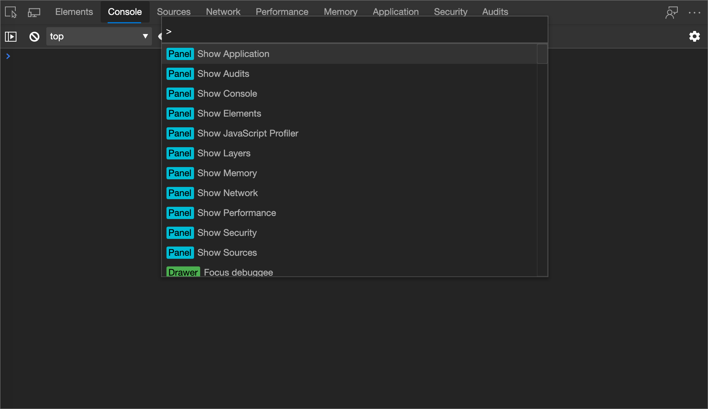

<!-- Copyright Kayce Basques 

   Licensed under the Apache License, Version 2.0 (the "License");
   you may not use this file except in compliance with the License.
   You may obtain a copy of the License at

       https://www.apache.org/licenses/LICENSE-2.0

   Unless required by applicable law or agreed to in writing, software
   distributed under the License is distributed on an "AS IS" BASIS,
   WITHOUT WARRANTIES OR CONDITIONS OF ANY KIND, either express or implied.
   See the License for the specific language governing permissions and
   limitations under the License.  -->

# Disable JavaScript With Microsoft Edge DevTools   

To see how a web page looks and behaves when JavaScript is disabled:  

1.  [Open Microsoft Edge DevTools][DevToolsOpen].  
1.  Press `Control`+`Shift`+`P` \(Windows\) or `Command`+`Shift`+`P` \(macOS\) to open the **Command Menu**.  
    
      
    
1.  Start typing `javascript`, select **Disable JavaScript**, and then press `Enter` to run the command.  JavaScript is now disabled.  
    
      
    
    The yellow warning icon next to **Sources** reminds you that JavaScript is disabled.  
    
      

JavaScript remains disabled in this tab for as long as you have DevTools open.  

You may want to reload the page to see if and how the page depends on JavaScript while loading.  

Complete the following actions to re-enable JavaScript.  

1.  Open the **Command Menu** again and run the `Enable JavaScript` command.  
1.  Close DevTools.  

## Getting in touch with the Microsoft Edge DevTools team

[!INCLUDE [contact DevTools team note](../includes/contact-devtools-team-note.md)]  
<!-- links -->  

[DevToolsOpen]: ../open.md "Open Microsoft Edge DevTools | Microsoft Docs"  

> [!NOTE]
> Portions of this page are modifications based on work created and [shared by Google][GoogleSitePolicies] and used according to terms described in the [Creative Commons Attribution 4.0 International License][CCA4IL].  
> The original page is found [here](https://developers.google.com/web/tools/chrome-devtools/javascript/disable) and is authored by [Kayce Basques][KayceBasques] \(Technical Writer, Chrome DevTools \& Lighthouse\).  

[![Creative Commons License][CCby4Image]][CCA4IL]  
This work is licensed under a [Creative Commons Attribution 4.0 International License][CCA4IL].  

[CCA4IL]: https://creativecommons.org/licenses/by/4.0  
[CCby4Image]: https://i.creativecommons.org/l/by/4.0/88x31.png  
[GoogleSitePolicies]: https://developers.google.com/terms/site-policies  
[KayceBasques]: https://developers.google.com/web/resources/contributors/kaycebasques  
