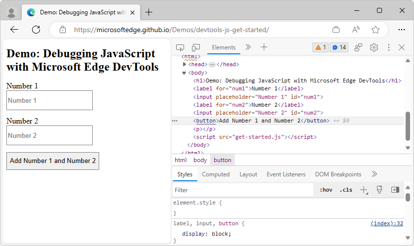
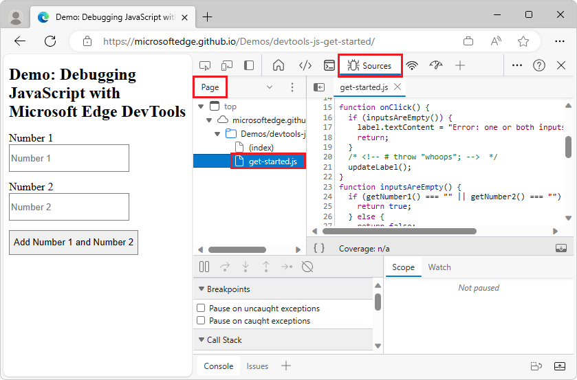
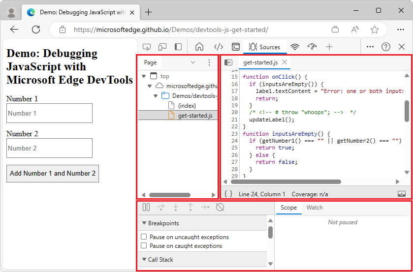
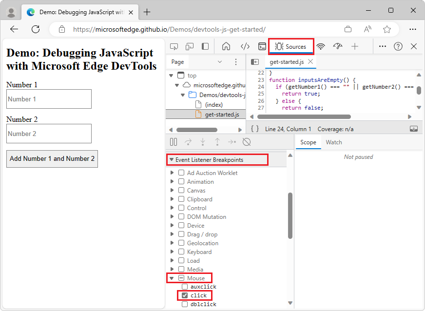
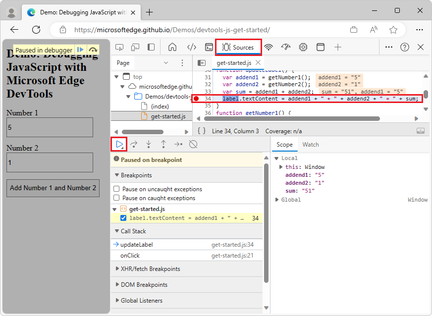
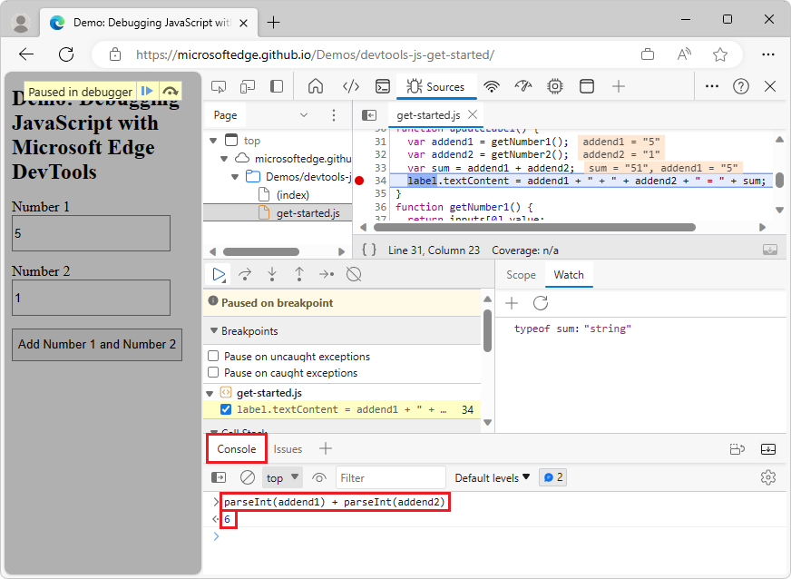

<!-- Copyright Kayce Basques

   Licensed under the Apache License, Version 2.0 (the "License");
   you may not use this file except in compliance with the License.
   You may obtain a copy of the License at

       https://www.apache.org/licenses/LICENSE-2.0

   Unless required by applicable law or agreed to in writing, software
   distributed under the License is distributed on an "AS IS" BASIS,
   WITHOUT WARRANTIES OR CONDITIONS OF ANY KIND, either express or implied.
   See the License for the specific language governing permissions and
   limitations under the License.  -->
# Get started debugging JavaScript

This article teaches you the basic workflow for debugging any JavaScript issue using DevTools.


<!-- ====================================================================== -->
## Step 1: Reproduce the bug

The first step in debugging is to find a sequence of actions that consistently reproduce a bug.

1. Open the demo webpage [Get Started Debugging JavaScript](https://microsoftedge.github.io/Demos/devtools-js-get-started/) in a new window or tab.  To open the webpage, right-click the link and select "Open link in new tab" or "Open link in new Window" on the popup window.  Alternatively you can press and hold **Ctrl** (for Windows, Linux) or **Command** (for macOS), and then click the link.

   Tip: Open Microsoft Edge in InPrivate Mode, to ensure that Microsoft Edge runs in a clean state. For more information, see [Browse InPrivate in Microsoft Edge](https://support.microsoft.com/microsoft-edge/browse-inprivate-in-microsoft-edge-cd2c9a48-0bc4-b98e-5e46-ac40c84e27e2)

   <!-- You can view the source files for the Debugging demo at the [MicrosoftEdge/Demos > devtools-js-get-started](https://github.com/MicrosoftEdge/Demos/tree/main/devtools-js-get-started) repo folder. -->

1. Enter **5** in the **Number 1** text box.

1. Enter **1** in the **Number 2** text box.

1. Click **Add Number 1 and Number 2**.  The label below the button says **5 + 1 = 51**, instead of the expected result of **6**:

   


<!-- ====================================================================== -->
## Step 2: Get familiar with the Sources tool UI

DevTools provides several tools for different tasks.  These tasks include changing CSS, profiling page-load performance, and monitoring network requests.  The **Sources** tool is where you debug JavaScript.

1. To open DevTools, right-click the webpage, and then select **Inspect**.  Or, press **Ctrl+Shift+I** (Windows, Linux) or **Command+Option+I** (macOS).  DevTools opens:

   

1. Select the **Sources** tool. Select the **Page** tab, and then select the JavaScript file, `get-started.js`:

   

The **Sources** tool UI has three parts:



* The **Navigator** pane (in the upper left corner).  Every file that the webpage requests is listed here.

* The **Editor** pane (in the upper right corner).  After you select a file in the **Navigator** pane, this pane displays the contents of the file.

* The **Debugger** pane (at the bottom).  This pane provides tools for inspecting the JavaScript for the webpage.  If your DevTools window is wide, this pane is displayed to the right of the **Editor** pane.


<!-- ====================================================================== -->
## Step 3: Pause the code with a breakpoint

A common method for debugging this type of problem is to insert several `console.log()` statements into the code and then to inspect values as the script runs.  For example:

```javascript
function updateLabel() {
    var addend1 = getNumber1();
    console.log('addend1:', addend1);
    var addend2 = getNumber2();
    console.log('addend2:', addend2);
    var sum = addend1 + addend2;
    console.log('sum:', sum);
    label.textContent = addend1 + ' + ' + addend2 + ' = ' + sum;
}
```

The `console.log()` method might get the job done, but **breakpoints** get it done faster.  A breakpoint allows you to pause your code in the middle of the runtime, and examine all values at that moment in time.  Breakpoints have the following advantages over the `console.log()` method.

*  With `console.log()`, you need to manually open the source code, find the relevant code, insert the `console.log()` statements, and then refresh the webpage to display the messages in the **Console**.  With breakpoints, you can pause on the relevant code without having to know how the code is structured.

*  In your `console.log()` statements, you need to explicitly specify each value that you want to inspect.  With breakpoints, DevTools shows you the values of all variables at that moment in time.  Sometimes variables that affect your code are hidden and obfuscated.

In short, breakpoints can help you find and fix bugs faster than the `console.log()` method.


<!-- ------------------------------ -->
#### Event listener breakpoints

If you step back and think about how the app works, you might make an educated guess that the incorrect sum (`5 + 1 = 51`) is computed in the `click` event listener associated with the **Add Number 1 and Number 2** button.  So, you probably want to pause the code around the time that the `click` listener runs.  **Event Listener Breakpoints** let you do that:

1. In the **Navigator pane**, `(index)` is selected by default. Click `get-started.js`.

1. In the **Debugger** pane, click **Event Listener Breakpoints** to expand the section.  DevTools reveals a list of event categories, such as **Animation** and **Clipboard**.

1. Click **Expand** () by the **Mouse** event open that category.  DevTools reveals a list of mouse events, such as **click** and **mousedown**.  Each event has a checkbox next to it.

1. Select the checkbox next to **click**:

   

   DevTools is now set up to automatically pause when any `click` event listener runs.

1. In the rendered demo webpage, click the **Add Number 1 and Number 2** button again.  DevTools pauses the demo and highlights a line of code in the **Sources** tool.  DevTools pauses on line 16 in `get-started.js`, shown in the next code snippet:

   ```javascript
   if (inputsAreEmpty()) {
   ```

   If you pause on a different line of code, click **Resume Script Execution** () until you pause on the correct line.

   > [!NOTE]
   > If you paused on a different line, you have a browser extension that registers a `click` event listener on every webpage that you visit.  You are paused in the `click` listener of the extension.  If you use InPrivate Mode to **browse in private**, which disables all extensions, you might see that you pause on the desired line of code every time.

<!--todo: add inprivate section when available in this repo [InPrivate](https://support.alphabet.com/alphabet-browser/answer/95464) -->

**Event Listener Breakpoints** are just one of many types of breakpoints available in DevTools.  Memorize all the different types to help you debug different scenarios as quickly as possible.  To learn when and how to use each type, see [Pause your code with breakpoints](breakpoints.md).


<!-- ====================================================================== -->
## Step 4: Step through the code

One common cause of bugs is when a script runs in the wrong order.  Stepping through your code allows you to walk through the runtime of your code.  You walk through one line at a time to help you figure out exactly where your code is running in a different order than you expect.  Try it now:

1. Click **Step over next function call** ().  DevTools runs the following code without stepping into it:

   ```javascript
   if (inputsAreEmpty()) {
   ```

   DevTools skips a few lines of code, because `inputsAreEmpty()` evaluates as `false`, so the block of code for the `if` statement doesn't run.

1. On the **Sources** tool of DevTools, click **Step into next function call** () to step through the runtime of the `updateLabel()` function, one line at a time.

That's the basic idea of stepping through code.  If you look at the code in `get-started.js`, you can see that the bug is probably somewhere in the `updateLabel()` function.  Rather than stepping through every line of code, you can use another type of breakpoint (a _line-of-code breakpoint_) to pause the code closer to the probable location of the bug.


<!-- ====================================================================== -->
## Step 5: Set a line-of-code breakpoint

Line-of-code breakpoints are the most common type of breakpoint.  When you get to the specific line of code you want to pause, use a line-of-code breakpoint.

1. Look at the last line of code in `updateLabel()`:

    ```javascript
    label.textContent = addend1 + ' + ' + addend2 + ' = ' + sum;
    ```

1. The line number for `label.textContent = addend1 + ' + ' + addend2 + ' = ' + sum;` is **34**. Click line **34**.  DevTools displays a red circle to the left of **34**.  The red circle indicates that a line-of-code breakpoint is on this line.  DevTools always pauses before this line of code is run.

1. Click the **Resume script execution** () button:

   

   The script continues to run until it reaches line 34.  On lines 31, 32, and 33, DevTools prints the values of each variable to the right of the semi-colon on each line. These values are:

   - `addend1` = "5"
   - `addend2` = "1"
   - `sum` = "51"


<!-- ====================================================================== -->
## Step 6: Check variable values

The values of `addend1`, `addend2`, and `sum` look suspicious.  These values are wrapped in quotes, which means each value is a string. This is a good clue to the cause of the bug.  The next step is to gather more information about these variable values.  DevTools provides various ways to examine variable values.


<!-- ------------------------------ -->
#### Examining variable values in the Scope pane

If you pause on a line of code, the **Scope** pane displays the local and global variables that are currently defined, along with the value of each variable:


The **Scope** pane also displays closure variables, as applicable.  If you want to edit a variable value, double-click the value in the **Scope** pane.  If you don't pause on a line of code, the **Scope** pane is empty.


<!-- ------------------------------ -->
#### Examining variable values via Watch expressions

The **Watch** pane allows you to monitor the values of variables (such as `sum`) or expressions (such as `typeof sum`).  You can store any valid JavaScript expression in a watch expression.

1. Select the **Watch** tab.

1. Click **Add watch expression** ().

1. Type the watch expression `typeof sum`, and then press **Enter**:


The **Watch** pane displays `typeof sum: "string"`.  The value to the right of the colon is the result of the watch expression.  The bug is due to `sum` being evaluated as a string, when it should be a number.

If your DevTools window is wide, the **Watch** pane is displayed within the **Debugger** pane, which then appears on the right.


<!-- ------------------------------ -->
#### Examining variable values via the Console

The **Console** allows you to view `console.log()` output.  You can also use the **Console** to evaluate arbitrary JavaScript statements while the debugger is paused at a code statement.  For debugging, you can use the **Console** to test potential fixes for bugs.

1. If the **Console** tool is closed, press **Esc** to open it.  The **Console** tool opens in the lower pane of the DevTools window.

1. In the **Console**, type the expression `parseInt(addend1) + parseInt(addend2)`.  The expression is evaluated for the current scope, given that the debugger is paused on a line of code where `addend1` and `addend2` are in scope.

1. Press **Enter**.  DevTools evaluates the statement and prints `6` in the **Console**, which is the correct result you expect the demo to produce:

   


<!-- ====================================================================== -->
## Step 7: Apply a fix to the returned code and then to your actual source code

We've identified a possible fix for the bug.  Next, edit the JavaScript code directly within the DevTools UI and then rerun the demo to test the fix, as follows:

1. Click **Resume script execution** ().

1. In the **Editor** pane, replace the line `var sum = addend1 + addend2` with `var sum = parseInt(addend1) + parseInt(addend2)`.

1. Press **Ctrl+S** (Windows, Linux) or **Command+S** (macOS) to save your change.

1. Click **Deactivate breakpoints** ().  The breakpoint's icon changes to gray to indicate that the breakpoint is inactive.  While **Deactivate breakpoints** is set, DevTools ignores any breakpoints you set.  The demo webpage now displays the correct value:

   

1. Try out the demo with different values.  The demo now calculates correctly.

1. When debugging your own project, after you identify the fix, you then fix your actual source code on the server, such as by editing your local source code and then re-deploying your fixed code to the server.  The previous steps only apply a fix to a temporary local copy of the code that's sent from the server.   


<!-- ====================================================================== -->
## Next steps

Congratulations!  You now know how to make the most of Microsoft Edge DevTools when debugging JavaScript.  The tools and methods you learned in this article may save you countless hours.

This article showed two ways to set breakpoints.  DevTools also provides ways to set breakpoints to pause your code when certain conditions are met, such as:

*  Conditional breakpoints that are only triggered when the condition that you provide is true.
*  Breakpoints on caught or uncaught exceptions.
*  XHR breakpoints that are triggered when the requested URL matches a substring that you provide.

For more information about when and how to use each type of breakpoint, see [Pause your code with breakpoints](./breakpoints.md).

For more information about the debugger buttons for stepping through code, see [Step over line of code](reference.md#step-through-code) in "JavaScript debugging features".


<!-- ====================================================================== -->
## See also

*  [JavaScript debugging features](reference.md) - Using the UI of the debugger in the Sources tool.
*  [Sources tool overview](../sources/index.md) - Introduces the JavaScript debugger and code editor.


<!-- ====================================================================== -->
> [!NOTE]
> Portions of this page are modifications based on work created and [shared by Google](https://developers.google.com/terms/site-policies) and used according to terms described in the [Creative Commons Attribution 4.0 International License](https://creativecommons.org/licenses/by/4.0).
> The original page is found [here](https://developer.chrome.com/docs/devtools/javascript/) and is authored by [Kayce Basques](https://developers.google.com/web/resources/contributors#kayce-basques) (Technical Writer, Chrome DevTools \& Lighthouse).

[](https://creativecommons.org/licenses/by/4.0)
This work is licensed under a [Creative Commons Attribution 4.0 International License](https://creativecommons.org/licenses/by/4.0).
