# Override webpage resources with local copies (Overrides tab)

Sometimes you need to try out some possible fixes for a webpage, but you don't have access to the source files, or changing the page requires a slow and complex build process.  You can debug and fix all kind of problems in DevTools.  But the changes don't persist; after you refresh the local file, all your work is gone.  The Overrides feature in the [Sources](../sources/index.md) tool helps you solve this problem.

You can now take a resource of the current webpage and store it locally.  When you refresh the webpage, the browser doesn't load the resource from the server.  Instead, the browser replaces the server resource with your local copy of the resource.


<!-- ====================================================================== -->
## Setting up your local folder to store Overrides

1. Navigate to the **Sources** tool.
1. In the **Navigator** pane (on the left), click the **Overrides** tab.  If the **Overrides** tab isn't displayed, click the <code>&#x0226B;</code><!--`≫`--> icon.

    The **Sources** tool with insufficient space to display the **Overrides** tab:

   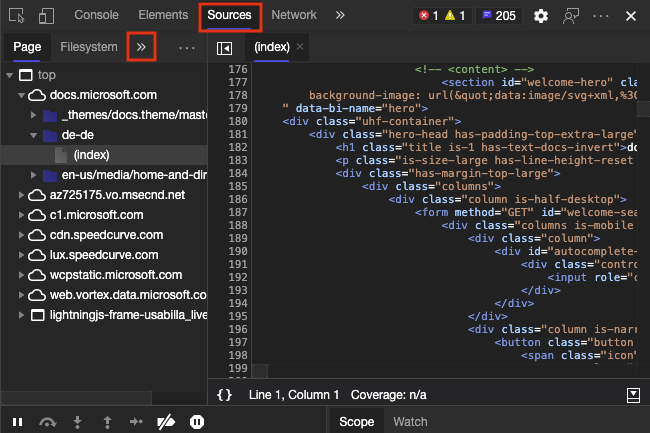

    Selecting the **Overrides** tab:

   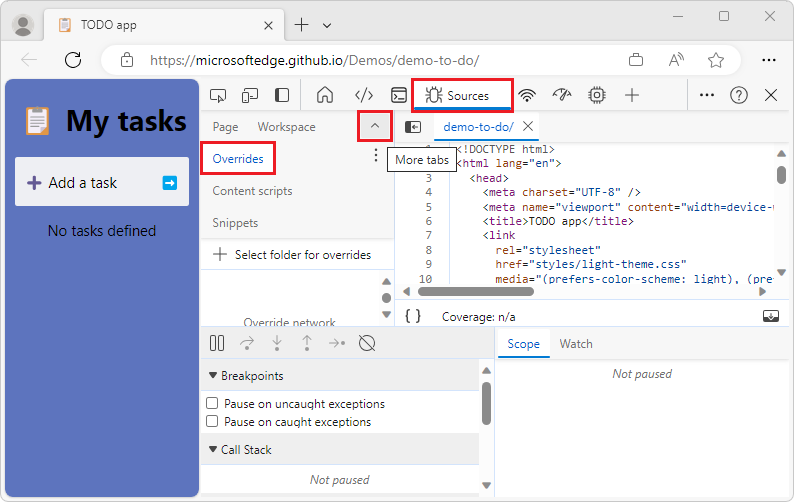

1. Select a folder on your local computer to store the resource files that you want to replace.  To search for a folder, click **+ Select folder for overrides**.

   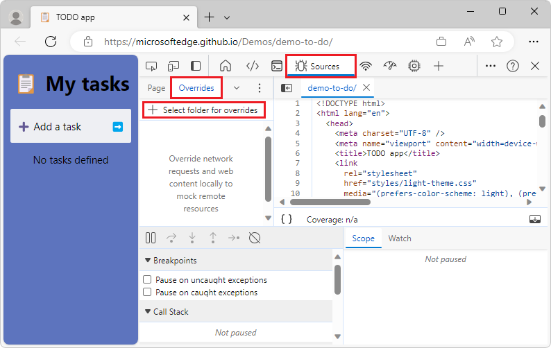

1. DevTools warns you that must have full access to the folder and that you should not reveal any sensitive information.  Select **Allow** to grant access.

   

1. In the **Overrides** tab, a checkbox is shown next to **Enable Local Overrides**.  To the right of **Enable Local Overrides** is a **Clear configuration** icon that allows you to delete your local overrides settings.  You are now done setting up your folder, and are ready to replace live resources with local resources.

   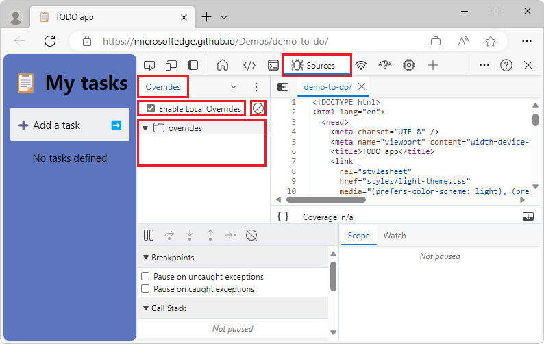


<!-- ====================================================================== -->
## Adding files to your Overrides folder

To add files to your overrides folder, open the **Elements** tool and inspect the webpage.  To edit, click the name of the CSS file in the **Styles** inspector.

Selecting a file in the **Styles** inspector:

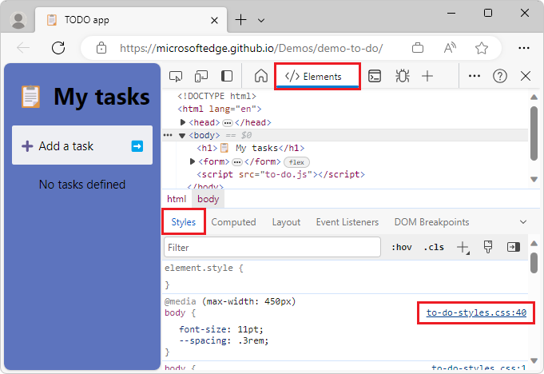

In the **Sources** editor, right-click the file name, and then click **Save for overrides**.

In the Sources editor, adding the name of the file to the overrides list:

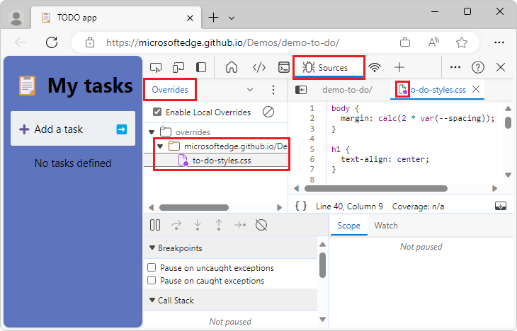

Right-click a file name and then select **Save for overrides**:

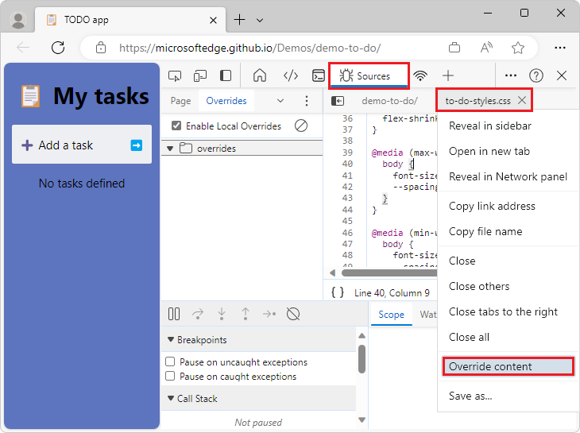

The file is stored in your overrides folder.  Verify that DevTools create a folder that is named using the URL of the file with the correct directory structure.  The file is stored inside.  The file name in the editor now also shows a purple dot that indicates that the file is local and not a live one.

Successfully stored the file in your overrides folder:

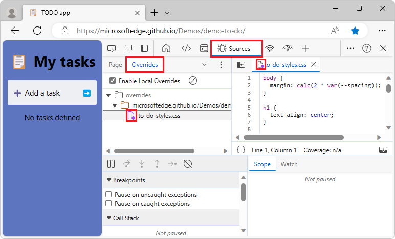

In the following example, you can now change the styles of the webpage.  To add a red border around the file, on the **Styles** editor, copy the following style, and add it to the body element.

```css
border: 10px solid firebrick
```

The file is automatically saved on your computer.  If you refresh the file, the border is displayed and none of your work is lost.

Changing the webpage styles persistently by editing a file in your overrides folder:

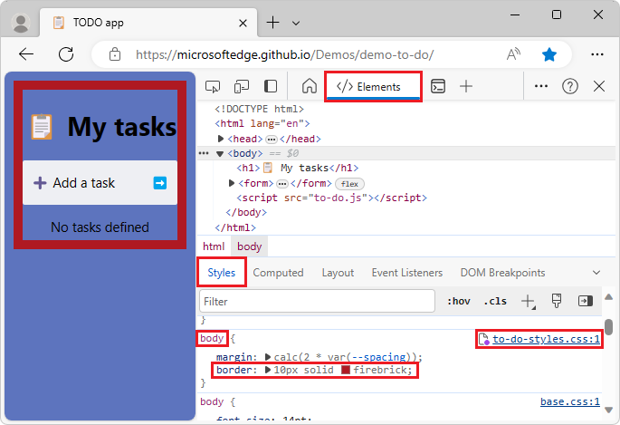

On the **Sources** tool, in the **Page** section, right-click a file and then add it to overrides.  Files that are already in your overrides folder have a purple dot on the icon.

Selecting a file from the **Sources** tool for overrides:

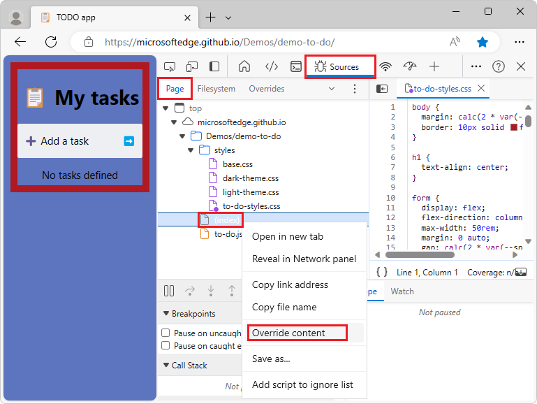

Alternatively, on the **Network** tool, right-click a file and then add it to overrides.  When overrides are in effect, files that are located on your computer and not from the live webpage.  When overrides are in effect, on the **Network** tool, locate a warning icon next to the file name.

Selecting a file from the **Network** tool for overrides:

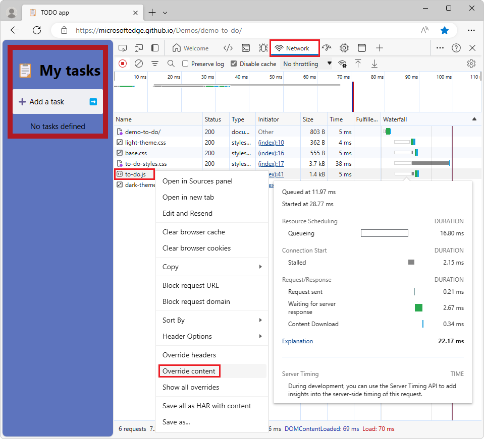


<!-- ====================================================================== -->
## Two-way interaction of overrides

Use the editor provided with the **Sources** tool of DevTools or any editor you want to change the files.  Changes are synced across all the products that access the files in the overrides folder.
