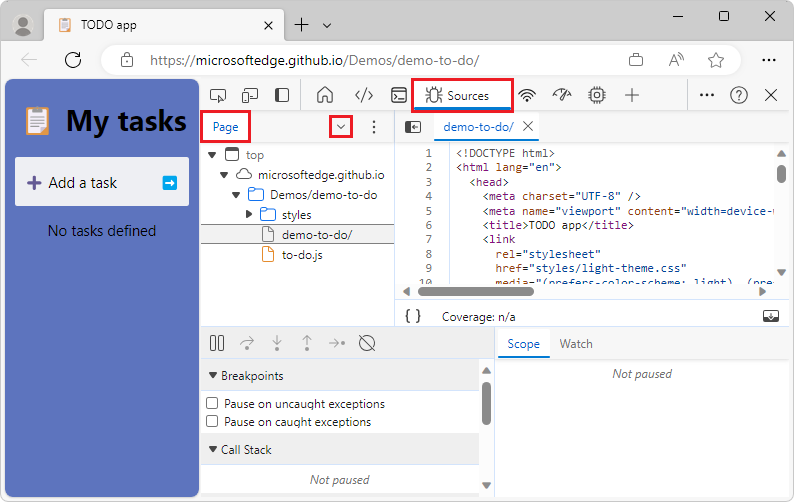
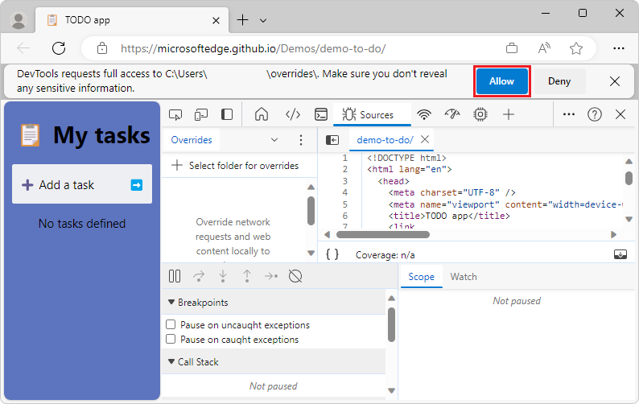

# Override webpage resources with local copies (Overrides tab)

Sometimes you need to try out some possible fixes for a webpage, but you don't have access to the source files, or changing the page requires a slow and complex build process.  You can debug and fix all kind of problems in DevTools.  But the changes don't persist; after you refresh the local file, all your work is gone.  The Overrides feature in the [Sources](../sources/index.md) tool helps you solve this problem.

You can now take a resource of the current webpage and store it locally.  When you refresh the webpage, the browser doesn't load the resource from the server.  Instead, the browser replaces the server resource with your local copy of the resource.


<!-- ====================================================================== -->
## Setting up your local folder to store Overrides

1. Right-click a webpage, such as https://microsoftedge.github.io/Demos/demo-to-do/ and then select **Inspect**.  DevTools opens.

1. Select the **Sources** tool.

1. In the **Navigator** pane (on the left), click the **Overrides** tab (grouped with the **Page** tab); if needed, click the **More tabs** (**v**) button:

   

1. Select the **Overrides** tab and then click the **More tabs** button again to collapse the tabs:

   

1. Click **+ Select folder for overrides**:

   

1. In the file navigation dialog, select a folder on your local computer to store the resource files that you want to replace, such as `C:\Users\myusername\overrides`, and then click the **Select Folder** button.

   DevTools warns you that must have full access to the folder and that you should not reveal any sensitive information:

   

1. Click the **Allow** button.

   In the **Overrides** tab, a checkbox is shown next to **Enable Local Overrides**.  To the right of **Enable Local Overrides** is a **Clear configuration** icon that allows you to delete your local overrides settings.  You are now done setting up your folder, and are ready to replace live resources with local resources:

   


<!-- ====================================================================== -->
## Adding files to your Overrides folder

Next, add files to your Overrides folder, as follows.  This example will add a CSS file.

1. Select the **Elements** tool, and then in the **Styles** tab, click the name of a CSS file, such as `to-do-styles.css`:

   

   The **Sources** tool opens, with the selected file opened in a tab in the editor pane.

1. In the editor pane, right-click the file's tab, such as **to-do-styles.css**, and then select **Override content**:

   

   In the file's tab, a page icon with a purple dot is added, and in the **Overrides** tab, the file is added:

   

   In this example, the file is listed as: `microsoftedge.github.io/Demos/demo-to-do//styles > to-do-styles.css`

   The file is stored in a new directory that's in your overrides folder (such as in `C:\Users\myusername\overrides`).
 
1. Verify that DevTools created a subfolder that is named using the URL of the file (such as **microsoftedge.github.io**) and contains the correct directory structure, such as `C:\Users\myusername\overrides\microsoftedge.github.io\Demos\demo-to-do\styles`.

   The overriding file is stored in this directory.  In DevTools > **Sources** tool > editor pane, the file name shows a purple dot, which indicates that the file is local file that overrides the file that's returned from the web server:

   <!-- todo: resume here -->
   


<!-- ====================================================================== -->
## Changing the style by using the override file

Continuing from above, you can now change the styles of the webpage by using your local override file:

1. To add a red border around the file, copy the following CSS style property, and then in the **Elements** tool, in the **Styles** tab, add the CSS property to the existing `body` element CSS rule:

   ```css
   border: 10px solid firebrick
   ```

   The modified CSS file is automatically saved on your computer.  If you refresh the webpage, the border is displayed and none of your work is lost, as it would have been if rendering the CSS file that's returned by the web server instead of using the local override file:

   

1. On the **Sources** tool, in the **Page** section, right-click a file and then add it to overrides.  Files that are already in your overrides folder have a purple dot on the icon.

   Selecting a file from the **Sources** tool for overrides:

   

   Alternatively, on the **Network** tool, right-click a file and then add it to overrides.  When overrides are in effect, files that are located on your computer and not from the live webpage.  When overrides are in effect, on the **Network** tool, locate a warning icon next to the file name.

   Selecting a file from the **Network** tool for overrides:

   


<!-- ====================================================================== -->
## Two-way interaction of overrides

Use the editor provided with the **Sources** tool of DevTools or any editor you want to change the files.  Changes are synced across all the products that access the files in the overrides folder.


<!-- ====================================================================== -->
<!-- ## See also -->
