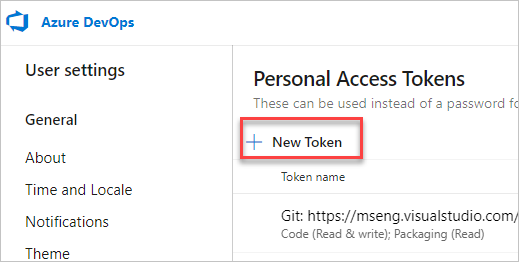

# Securely debug original code by publishing source maps to the Azure Artifacts symbol server

To securely<!-- add sentence to define "securely", what are we making not happen?  what's the UX/end-result motivation for "securely"? --> see and work with your original development source code in DevTools rather than the compiled, minified, and bundled production code that's returned by the web server, use source maps served by the Azure Artifacts symbol server.

Publishing your source maps directly to your web server would make your original source code publicly visible.  To avoid making your original source code publicly visible, publish your source maps to the Azure Artifacts symbol server.  This approach makes it possible to use your source maps in DevTools, when debugging your production website, without publishing the source maps to your web server.

Source maps map your compiled production code to your original development source files. In DevTools, you can then see and work with your familiar development source files, instead of the compiled code. To learn more about source mapping and using source maps in DevTools, see [Map the processed code to your original source code, for debugging](source-maps.md).


<!-- ====================================================================== -->
## Concepts

You must index your source maps on the Azure Artifacts symbol server, so that your source maps are available to DevTools when you debug your production website.

To do this, add the `x_microsoft_symbol_client_key` string property to your source maps at compilation time.  This property contains the lowercase hexadecimal value of the [256-bit SHA-2 hash](https://wikipedia.org/wiki/SHA-2) of your corresponding original source file.

DevTools is then able to compute this hash for each of your compiled files, and use the hash to retrieve the correct source map from the Azure Artifacts symbol server.  In order to securely retrieve your source maps, DevTools uses a Personal Access Token that you provide, to connect to the Azure Artifacts symbol server.


<!-- ====================================================================== -->
## Step 1: Generate a Personal Access Token for Azure DevOps

Publishing source maps to the Azure Artifacts symbol server requires a [Personal Access Token](/azure/devops/organizations/accounts/use-personal-access-tokens-to-authenticate) (or PAT). This PAT will be used by your build system when compiling code and publishing source maps.

To generate a PAT in Azure DevOps:

1. Sign in to your Azure DevOps organization by going to `https://dev.azure.com/{yourorganization}`.

1. In Azure DevOps, go to **User settings** > **Personal access tokens**:
    
   

   The **Personal Access Tokens** page appears:

   

1. Click **New Token**.  The **Create a new personal access token** dialog opens:

   

1. In the **Name** text box, enter a name for the PAT, such as "publish source maps".

1. In the **Expiration** section, enter an expiration date for the PAT.

1. In the **Scopes** section, click **Show all scopes** to expand the section.

1. Scroll down to the **Symbols** section, and then select the **Read & write** checkbox.

1. Click the **Create** button.  The **Success!** dialog appears:

   

1. Click the **Copy to clipboard** button to copy the PAT.  Make sure to copy the token and store it in a secure location. For your security, it won't be shown again.

To learn more about PAT, see [Use personal access tokens](/azure/devops/organizations/accounts/use-personal-access-tokens-to-authenticate).


<!-- ====================================================================== -->
## Step 2: Compute the SHA-256 hash of your script and append it to your source maps

At the final step of your application's build process, for every source map you want to publish, you should compute the SHA-256 hash of the JavaScript file to which the Source Map corresponds, and append it to the source map via the `x_microsoft_symbol_client_key` string property.

Build systems vary from application to application, so there isn't a clear single way to apply this. But here is a sample [Webpack 5 plugin](https://webpack.js.org/), which can be added to your Webpack configuration if you're using it:

```js
// file: webpack.plugin-symbols.js
// Copyright (C) Microsoft Corporation. All rights reserved.
// Licensed under the BSD 3-clause license.

const crypto = require('crypto');

module.exports = class PrepareSourceMapsForSymbolServerPlugin {
  /**
   * @param {import('webpack').Compiler} compiler
   * @returns {void}
   */
  apply(compiler) {
    compiler.hooks.emit.tap('PrepareSourceMapsForSymbolServerPlugin', (compilation) => {
      const files = Object.keys(compilation.assets);
      const sourceMaps = files.filter(v => v.endsWith('.map'));
      const sourceFilesAndMapsNames = sourceMaps.map(mapFileName => {
        const sourceFileName = mapFileName.substring(0, mapFileName.length - 4);
        return {
          sourceFileName,
          mapFileName,
        };
      });
      const sourceFiles = sourceFilesAndMapsNames.map(({ sourceFileName, mapFileName }) => {
        const sourceFile = compilation.assets[sourceFileName];
        const sourceFileBuffer = sourceFile.buffer();
        const hasher = crypto.createHash('sha256');
        hasher.write(sourceFileBuffer);
        const digest = hasher.digest();
        const sourceFileHash = digest.toString('hex');

        const sourceMapAsset = compilation.assets[mapFileName];
        const sourceMapSource = sourceMapAsset.source();
        const sourceMapContents = JSON.parse(sourceMapSource);
        sourceMapContents['x_microsoft_symbol_client_key'] = sourceFileHash;
        const rewrittenSourceMapContents = JSON.stringify(sourceMapContents);
        if (!sourceMapAsset.isBuffer()) {
          // Not a buffer -- write to the _value property
          sourceMapAsset._value = rewrittenSourceMapContents;
        } else {
          sourceMapAsset._valueAsBuffer = Buffer.from(rewrittenSourceMapContents, 'utf-8');
        }

        return {
          sourceFileName,
          mapFileName,
          sourceFileHash,
          sourceMapAsset,
        };
      });
    });
  }
};
```

You can then add the plugin to the `plugins` section in your `webpack.config.js` configuration file:

```js
const PrepareSourceMapsForSymbolServerPlugin = require('./webpack.plugin-symbols.js');

// ...

module.exports = (env, args) => {
  const mode = process.env.NODE_ENV || (env && env.NODE_ENV) || 'production';
  return {
    devtool: mode === 'production' ? 'hidden-source-map' : 'inline-source-map',
    resolve: {
      modules: [
        path.resolve('./node_modules'),
      ],
    },
    output: {
      publicPath: '/',
      filename: '[name].bundle.js',
      chunkFilename: '[name].chunk.js',
    },
    plugins: [
        // ... other plugins
        new PrepareSourceMapsForSymbolServerPlugin(),
    ]
  };
};
```


<!-- ====================================================================== -->
## Step 3: Publish source maps to the Azure Artifacts symbol server

Complete either one of the following options to publish source maps.

### Publish source maps using Azure DevOps Pipelines

Azure DevOps comes with the [`PublishSymbols@2`](/azure/devops/pipelines/tasks/build/index-sources-publish-symbols) pipeline build task. This task can be used to publish your source maps to the Azure Artifacts symbol server.

Make sure that you configure this task with the `indexableFileFormats` parameter set to either `All` or `SourceMap`.


### Publish source maps using `symbol.exe`

The Symbol Server team publishes a .NET Core application, `symbol.exe`, which [can be downloaded](/rest/api/azure/devops/symbol/client/get) automatically. After downloading `symbol.exe`, you can run a command to publish your source maps to the Azure Artifacts symbol server:

```cmd
symbol publish
        -d {root directory containing your source maps}
        -n {a unique name for this job}
        -s {service URL, such as https://artifacts.dev.azure.com/contoso}
        --patAuthEnvVar {name of environment variable containing a PAT}
        --indexableFileFormats SourceMap
```

Note here that the `-n` parameter must be unique. Repetition of job names, even failed job names, will be rejected.


<!-- ====================================================================== -->
## See also

* [Securely debug original code by using Azure Artifacts symbol server source maps](consume-source-maps-from-azure.md)
* [Map the processed code to your original source code, for debugging](source-maps.md)
* [Improvements for connecting DevTools to Azure Artifacts symbol server](../whats-new/2023/07/devtools-115.md#improvements-for-connecting-devtools-to-azure-artifacts-symbol-server) in _What's New in DevTools (Microsoft Edge 115)_.
