<!-- Copyright Kayce Basques

   Licensed under the Apache License, Version 2.0 (the "License");
   you may not use this file except in compliance with the License.
   You may obtain a copy of the License at

       https://www.apache.org/licenses/LICENSE-2.0

   Unless required by applicable law or agreed to in writing, software
   distributed under the License is distributed on an "AS IS" BASIS,
   WITHOUT WARRANTIES OR CONDITIONS OF ANY KIND, either express or implied.
   See the License for the specific language governing permissions and
   limitations under the License.  -->
# JavaScript debugging features

This article covers how to use the debugger in Microsoft Edge DevTools, including how to set a line-of-code breakpoint.  To set other types of breakpoints, see [Pause your code with breakpoints](breakpoints.md).

To learn the basics of debugging, see [Get started debugging JavaScript](index.md), which is a tutorial that uses an existing, form-based webpage.  The tutorial has screen captures, so you can skim it.  You can easily try out the debugger features by using the demo webpage.


<!-- ====================================================================== -->
## View and edit JavaScript code

When fixing a bug, you often want to try out some changes to your JavaScript code.  You don't need to make the changes in an external editor or IDE, re-upload the file to the server, and then refresh the page; instead, to test changes, you can edit your JavaScript code directly in DevTools and see the result immediately.

To view and edit a JavaScript file:

1. Select the **Sources** tool.

1. In the **Navigator** pane, select your file, to open it in the **Editor** pane.

1. In the **Editor** pane, edit your file.

1. Press **Ctrl+S** (Windows, Linux) or **Command+S** (macOS) to save.  DevTools then loads the JavaScript file into the JavaScript engine of Microsoft Edge.

   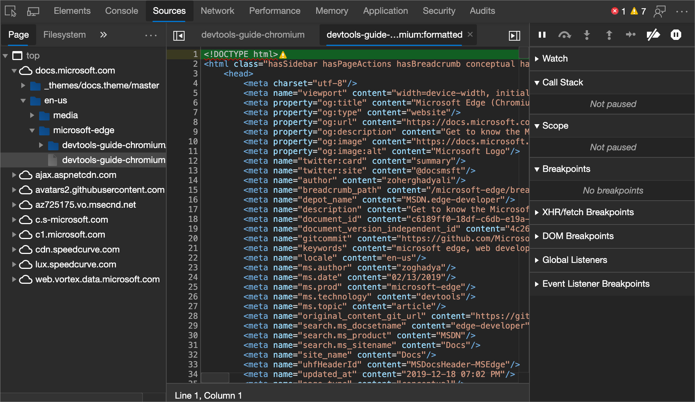


<!-- ====================================================================== -->
## Reformat a minified JavaScript file with pretty-print

To make a minified file human-readable, click the **Format** () button at the bottom of the **Editor** pane.

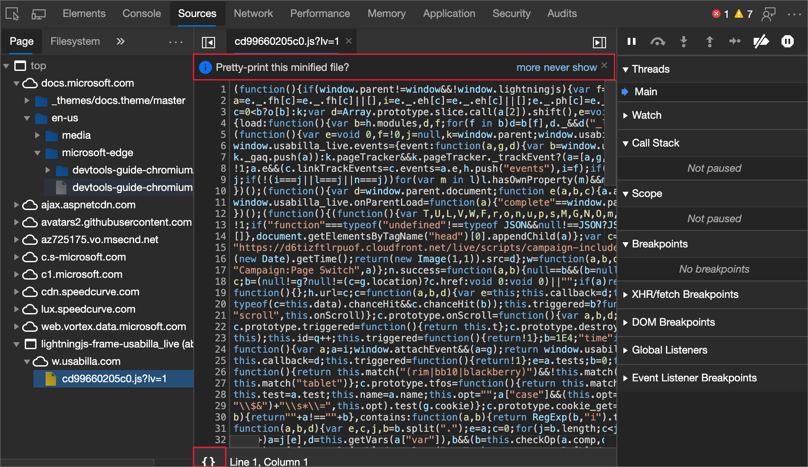


<!-- ====================================================================== -->
## Set a breakpoint, to pause code

To pause your code in the middle of the runtime, set a breakpoint.  The most basic and well-known type of breakpoint is a line-of-code breakpoint.

Use a line-of-code breakpoint when you know the exact region of code that you need to investigate.  DevTools always pauses at the specified line of code, before running it.

To set a line-of-code breakpoint:

1. Select the **Sources** tool.

1. Open the file that contains the line of code.

1. Click the area to the left of the line number for the line of code.  Or, right-click the line number and then select **Add breakpoint**.

   A red circle (or more recently, a blue rectangle) then appears next to the line number, indicating a breakpoint.

   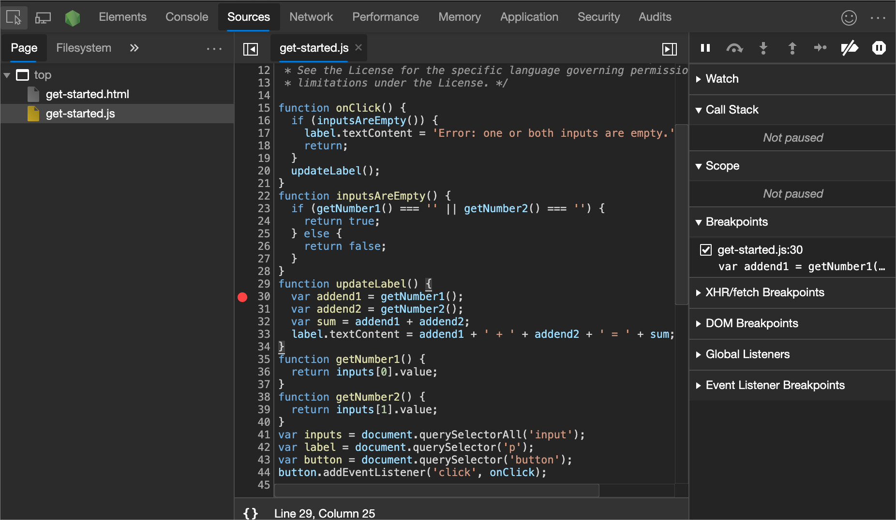

Line-of-code breakpoints may be inefficient to set, especially if you don't know exactly where to look, or if your codebase is large.  To save time when debugging, learn how and when to use the other types of breakpoints.  See [Pause your code with breakpoints](breakpoints.md).


<!-- ====================================================================== -->
## Step through code

After your code is paused at a breakpoint, step through the code, one line at a time, investigating control flow and property values along the way.


<!-- ------------------------------ -->
#### Step over line of code

When paused on a line of code containing a function that isn't relevant to the problem you are debugging, click the **Step over** () button to run the function without stepping into it.

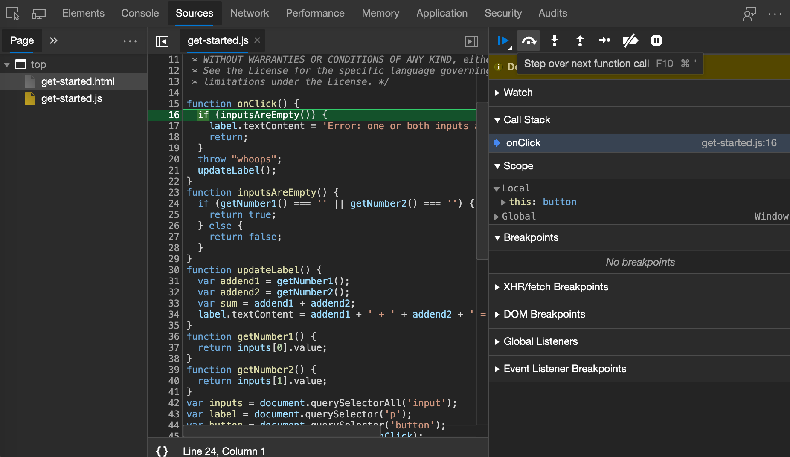

For example, suppose you are debugging the following code snippet.

```javascript
function updateHeader() {
    var day = new Date().getDay();
    var name = getName(); // A
    updateName(name); // D
}
function getName() {
    var name = app.first + ' ' + app.last; // B
    return name; // C
}
```

You are paused on `A`.  After you click **Step over**, DevTools runs all the code in the function that you are stepping over, which is `B` and `C`.  DevTools then pauses on `D`.


<!-- ------------------------------ -->
#### Step into line of code

When paused on a line of code containing a function call that is related to the problem you are debugging, click the **Step into** () button to investigate that function further.

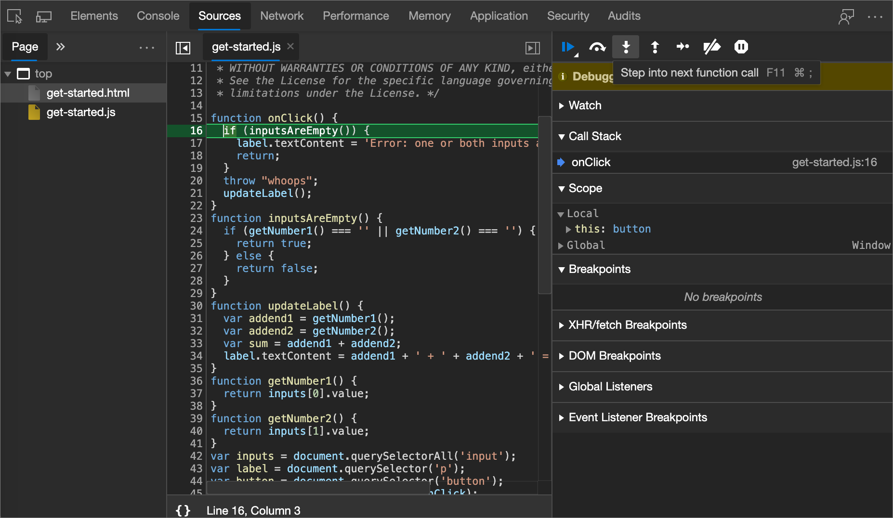

For example, suppose you're debugging the following code:

```javascript
function updateHeader() {
    var day = new Date().getDay();
    var name = getName(); // A
    updateName(name);
}
function getName() {
    var name = app.first + ' ' + app.last; // B
    return name;
}
```

You are paused on `A`.  After you click **Step into**, DevTools runs this line of code, then pauses on `B`.


<!-- ------------------------------ -->
#### Step out of line of code

When paused inside of a function that isn't related to the problem you are debugging, click the **Step out** () button to run the rest of the code of the function.

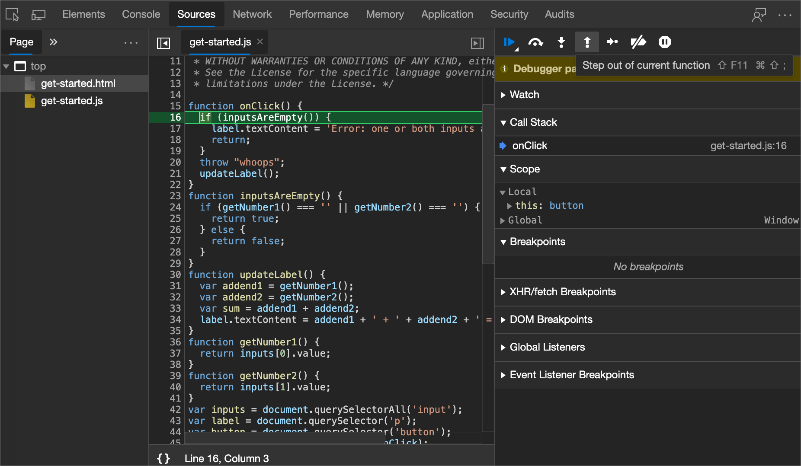

For example, suppose you're debugging the following code:

```javascript
function updateHeader() {
    var day = new Date().getDay();
    var name = getName();
    updateName(name); // C
}
function getName() {
    var name = app.first + ' ' + app.last; // A
    return name; // B
}
```

You are paused on `A`.  After you click **Step out**, DevTools runs the rest of the code in `getName()`, which is just `B` in this example, and then pauses on `C`.


<!-- ------------------------------ -->
#### Run all code up to a specific line

When debugging a long function, there may be a lot of code that isn't related to the problem you are debugging.

*  You can step through all the lines, but that's tedious.

*  Slightly better, you can set a line-of-code breakpoint on the line in which you are interested and then click the **Resume script execution** () button.

*  But there's a faster way: Right-click a the line of code, and then select **Continue to here**.  DevTools runs all of the code up to that point, and then pauses on that line.

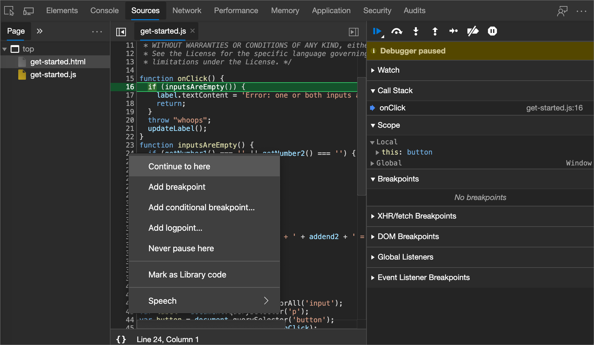


<!-- ------------------------------ -->
#### Restart the top function of the call stack

To pause on the first line of the top function in your call stack, while paused on a line of code, right-click the **Call Stack** pane, and then select **Restart frame**.  The top function is the last function that was run.

The following code is an example for you to step through:

```javascript
function factorial(n) {
    var product = 0; // B
    for (var i = 1; i <= n; i++) {
      product += i;
    }
    return product; // A
}
```

You are paused on `A`.  After selecting **Restart frame**, you should be paused on `B`, without ever setting a breakpoint or choosing **Resume script execution**.


<!-- ------------------------------ -->
#### Resume script runtime

To continue the runtime after a pause of your script, click the **Resume script execution** () button.  DevTools runs the script up until the next breakpoint, if any.

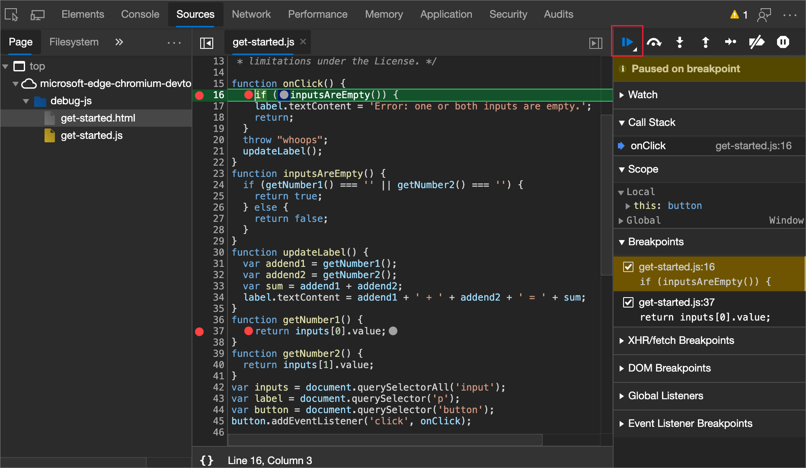


<!-- ------------------------------ -->
#### Force script runtime

To ignore all breakpoints and force your script to continue to run, click and hold the **Resume script execution** () button and then click the **Force script execution** () button.

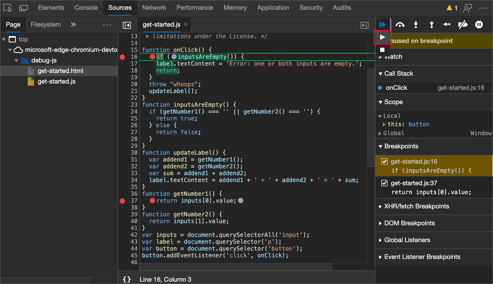


<!-- ------------------------------ -->
#### Change thread context

When working with web workers or service workers, click on a context listed in the **Threads** pane to switch to that context.  The blue arrow icon represents which context is currently selected.

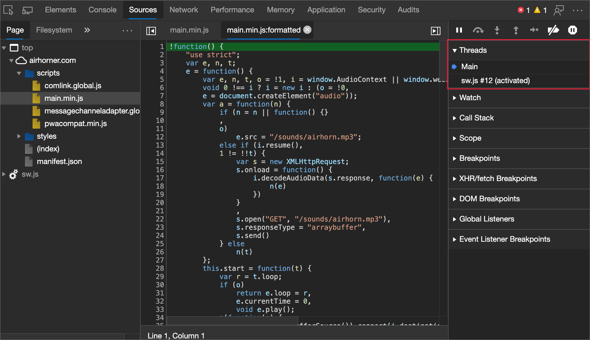

For example, suppose that you are paused on a breakpoint in both your main script and your service worker script.  You want to view the local and global properties for the service worker context, but the **Sources** tool is showing the main script context.  To switch to the service worker context, in the **Threads** pane, click the service worker entry.


<!-- ====================================================================== -->
## View and edit properties and variables

While paused on a line of code, use the **Scope** pane to view and edit the values of properties and variables in the local, closure, and global scopes.

*  Double-click a property value to change it.
*  Non-enumerable properties are greyed out.

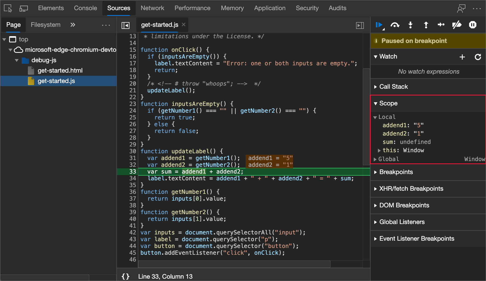


<!-- ====================================================================== -->
## Watch the values of JavaScript expressions

Use the **Watch** pane to watch the values of custom expressions.  You can watch any valid JavaScript expression.

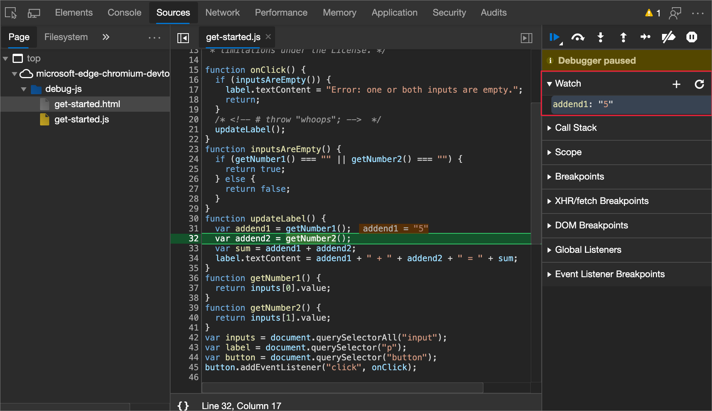

*  To create a new watch expression, click the **Add watch expression** () button.

*  To refresh the values of all existing expressions, click the **Refresh** () button.  Values automatically refresh while stepping through code.

*  To delete a watch expression, right-click the expression and then select **Delete watch expression** ().


<!-- ====================================================================== -->
## View the call stack

While paused on a line of code, use the **Call Stack** pane to view the call stack that got you to this point.

<!--If you are working with async code, check the **Async** checkbox to enable async call stacks.  -->

Click an entry to jump to the line of code where that function was called.  The blue arrow icon represents which function DevTools is currently highlighting.

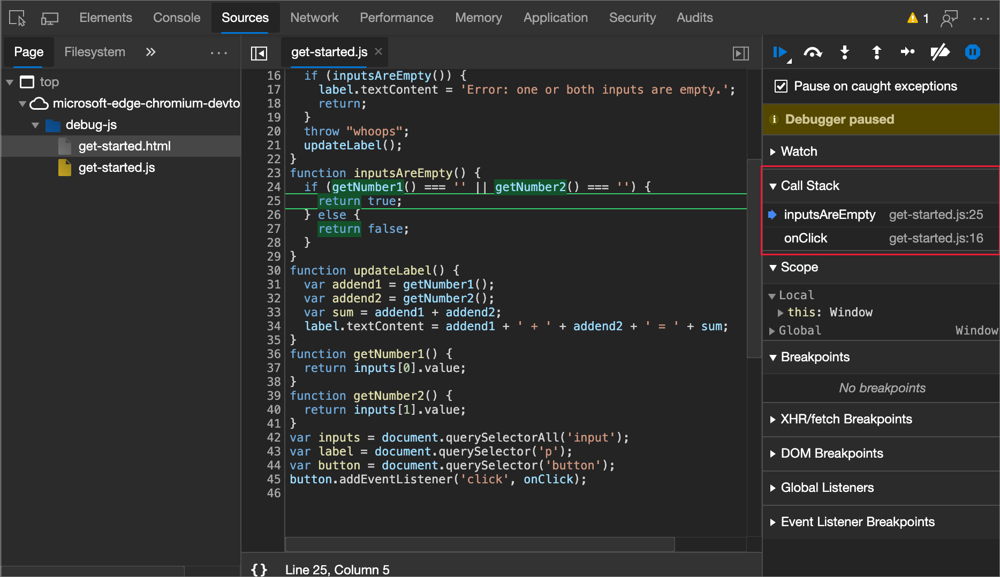

> [!NOTE]
> When not paused on a line of code, the **Call Stack** pane is empty.


<!-- ------------------------------ -->
#### Copy stack trace

<!--
This should be moved to an "Export debug data" H2 section when there is enough content for that, but there isn't right now, so it is here.
-->

To copy the current call stack to the clipboard, right-click the **Call Stack** pane, and then select **Copy stack trace**.


The following code is an example of the output:

```javascript
getNumber1 (get-started.js:35)
inputsAreEmpty (get-started.js:22)
onClick (get-started.js:15)
```


<!-- ====================================================================== -->
## Ignore a script or pattern of scripts

To ignore a script while debugging, add the script to the **Ignore List**.  When a script is included in the **Ignore List**, the script is obscured in the **Call Stack** pane, and you never step into the functions of the script when you step through your code.

For example, in the following code snippet, line `A` uses `lib`, which is a third-party library.  If you are confident that the problem you are debugging isn't related to that third-party library, then it makes sense to add the script to the **Ignore List**:

```javascript
function animate() {
    prepare();
    lib.doFancyStuff(); // A
    render();
}
```


<!-- ------------------------------ -->
#### Add a script to the **Ignore List** from the Editor pane

To add a script to the **Ignore List** from the **Editor** pane:

1. Open the file.

1. Right-click anywhere in the file and then select **Add script to ignore list**:

   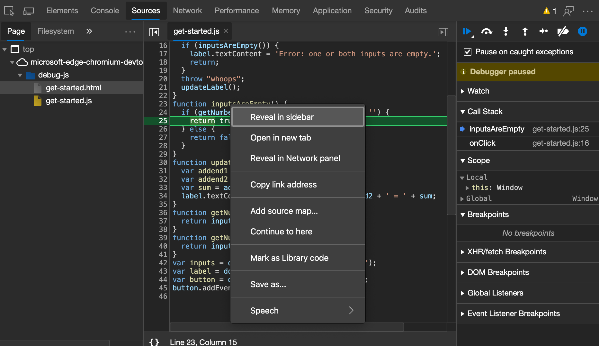


<!-- ------------------------------ -->
#### Add a script to the Ignore List from the Call Stack pane

To add a script to the **Ignore List** from the **Call Stack** pane:

*  Right-click a function in the script and then select **Add script to ignore list**:

   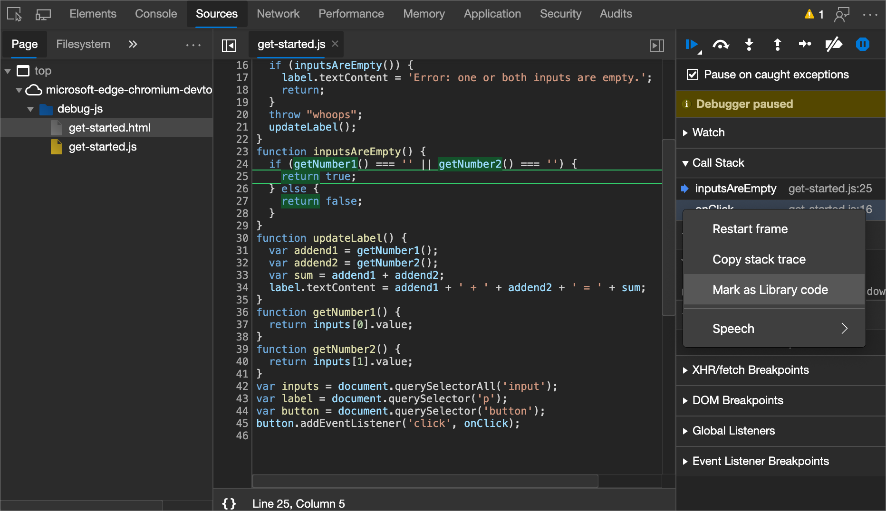


<!-- ------------------------------ -->
#### Add a script to the Ignore List from Settings

To mark a single script or pattern of scripts from **Settings**:

1. Open [Settings](../customize/index.md).

1. Navigate to the **Ignore List** page of settings.

   

1. Click the **Add pattern** button.  A suggested pattern is shown: `/framework\.js$`

1. Enter the script name or a regex pattern of script names to add to the **Ignore List**.

1. Click the **Add** button.


<!-- ====================================================================== -->
## Run snippets of debug code from any page

If you find yourself running the same debug code in the Console over and over, consider Snippets.  Snippets are runtime scripts that you author, store, and run within DevTools.

See [Run snippets of JavaScript on any webpage](snippets.md).


<!-- ====================================================================== -->
## See also

*  [Get started debugging JavaScript](index.md) - A simple, short tutorial using existing code, with screen captures.
*  [Sources tool overview](../sources/index.md) - The **Sources** tool includes the JavaScript debugger and editor.
*  [Disable JavaScript](disable.md).


<!-- ====================================================================== -->
> [!NOTE]
> Portions of this page are modifications based on work created and [shared by Google](https://developers.google.com/terms/site-policies) and used according to terms described in the [Creative Commons Attribution 4.0 International License](https://creativecommons.org/licenses/by/4.0).
> The original page is found [here](https://developer.chrome.com/docs/devtools/javascript/reference/) and is authored by [Kayce Basques](https://developers.google.com/web/resources/contributors#kayce-basques) (Technical Writer, Chrome DevTools \& Lighthouse).

[](https://creativecommons.org/licenses/by/4.0)
This work is licensed under a [Creative Commons Attribution 4.0 International License](https://creativecommons.org/licenses/by/4.0).
