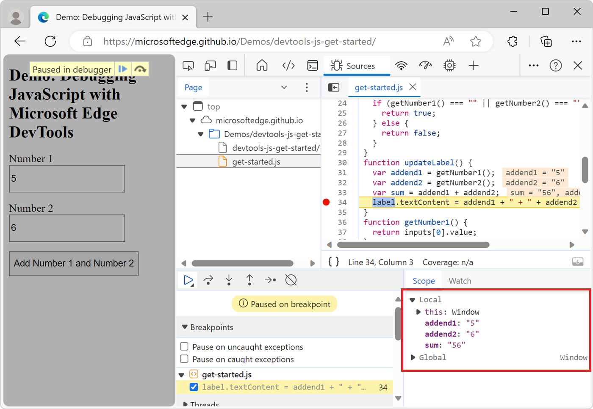
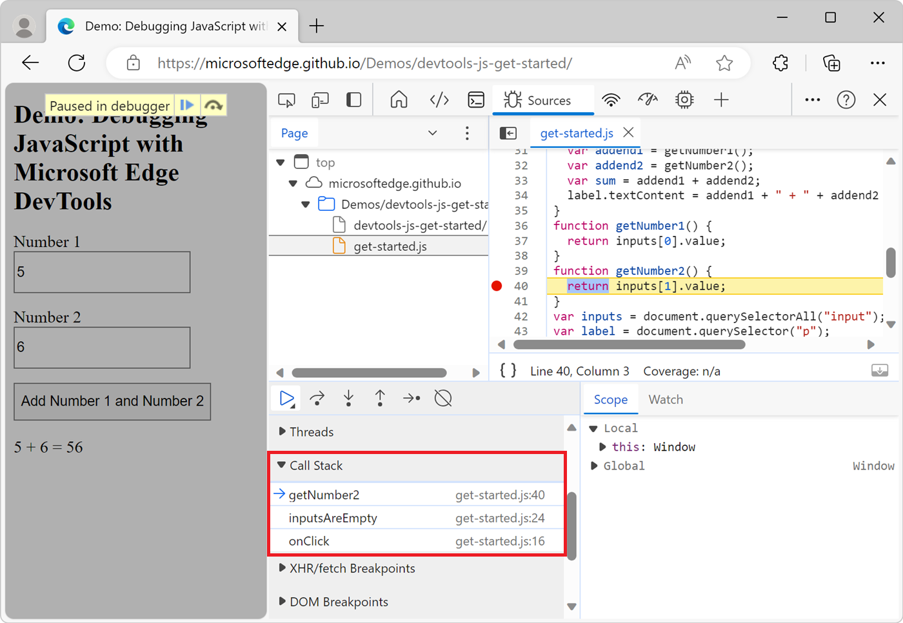
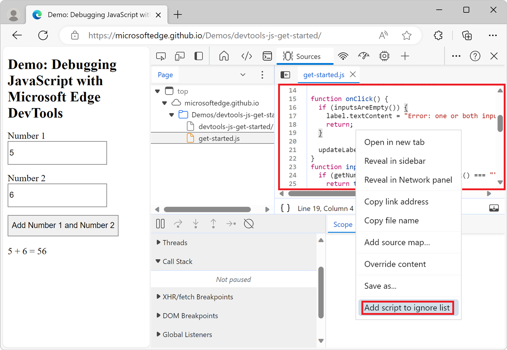

<!-- Copyright Kayce Basques

   Licensed under the Apache License, Version 2.0 (the "License");
   you may not use this file except in compliance with the License.
   You may obtain a copy of the License at

       https://www.apache.org/licenses/LICENSE-2.0

   Unless required by applicable law or agreed to in writing, software
   distributed under the License is distributed on an "AS IS" BASIS,
   WITHOUT WARRANTIES OR CONDITIONS OF ANY KIND, either express or implied.
   See the License for the specific language governing permissions and
   limitations under the License.  -->
# JavaScript debugging features

This article covers how to use the debugger features in Microsoft Edge DevTools, including how to set a line-of-code breakpoint.

See also:
* [Get started debugging JavaScript](index.md) - tutorial walkthrough.
* [Pause your code with breakpoints](breakpoints.md) - setting various types of breakpoints.

<!-- ====================================================================== -->
## View and edit JavaScript code

When fixing a bug, you often want to try out some changes to your JavaScript code.  You don't need to make the changes in an external editor or IDE, re-upload the file to the server, and then refresh the page; instead, to test changes, you can edit your JavaScript code directly in DevTools and see the result immediately.

To view and edit a JavaScript file:

1. Open the webpage you want to debug in a new window or tab. You can use the [Get Started Debugging JavaScript](https://microsoftedge.github.io/Demos/devtools-js-get-started/) demo page.

1. To open DevTools, right-click the webpage, and then select **Inspect**.  Or, press **Ctrl+Shift+I** (Windows, Linux) or **Command+Option+I** (macOS).  DevTools opens.

1. In DevTools, on the **Activity Bar**, select the **Sources** tab.  If that tab isn't visible, click the **More tools** () button.

1. In the **Navigator** pane, select the file you want to change, to open it in the **Editor** pane. If you're using the demo page, select **get-started.js**.

1. In the **Editor** pane, edit the file. For example, add `alert("The add button was clicked");` in the `onClick` function of the demo page.

1. Press **Ctrl+S** (Windows, Linux) or **Command+S** (macOS) to save.  DevTools then loads the JavaScript file into the JavaScript engine of Microsoft Edge, and the changes take effect immediately.

   

1. Test the change.  For example, click the **Add Number 1 and Number 2** button on the demo page.  The alert appears.

The change you made in DevTools is useful to quickly test a bug fix, but is temporary.  To make the change permanent, you need to make the change in your source code and then re-upload the file to the server.


<!-- ====================================================================== -->
## Explain source code using Copilot in Edge

When inspecting a webpage, you might want more information about the source code that's displayed in the **Sources** tool.  By using the **Explain these lines of code** feature, you get more information about the source code in Copilot in Edge:


To learn more about this feature, see [Explain source code using Copilot in Edge](./copilot-explain-source-code.md).


<!-- ====================================================================== -->
## Reformat a minified JavaScript file with pretty-print

To make a minified file human-readable, click the **Format** () button at the bottom of the **Editor** pane.


<!-- ====================================================================== -->
## Set a breakpoint, to pause code

To pause your code in the middle of the runtime, set a breakpoint.  The most basic and well-known type of breakpoint is a line-of-code breakpoint.

Use a line-of-code breakpoint when you know the exact region of code that you need to investigate.  DevTools always pauses at the specified line of code, before running it.

To set a line-of-code breakpoint:

1. Open the webpage you want to debug in a new window or tab. You can use the [Get Started Debugging JavaScript](https://microsoftedge.github.io/Demos/devtools-js-get-started/) demo page.

1. To open DevTools, right-click the webpage, and then select **Inspect**.  Or, press **Ctrl+Shift+I** (Windows, Linux) or **Command+Option+I** (macOS).  DevTools opens.

1. In DevTools, on the **Activity Bar**, select the **Sources** tab.  If that tab isn't visible, click the **More tools** () button.

1. In the **Navigator** pane, select the file that contains the line of code you want to debug. If you're using the demo page, select **get-started.js**.

1. Click the area to the left of the line number for the line of code.  Or, right-click the line number and then select **Add breakpoint**.

   A red circle then appears next to the line number, indicating a breakpoint:

   

Line-of-code breakpoints can sometimes be inefficient to set, especially if you don't know exactly where to look, or if your codebase is large.  To save time when debugging, learn how and when to use the other types of breakpoints.  See [Pause code with breakpoints](./breakpoints.md).


<!-- ====================================================================== -->
## Step through code

After your code is paused at a breakpoint, step through the code, one line at a time, investigating control flow and property values along the way. To learn how to pause at a breakpoint, see [Set a breakpoint, to pause code](#set-a-breakpoint-to-pause-code), above.


<!-- ------------------------------ -->
#### Step over a line of code

When paused on a line of code containing a function that isn't relevant to the problem you are debugging, click the **Step over** () button to run the function without stepping into it.


For example, suppose you are debugging the following code snippet:

```javascript
function updateLabel() {
    var addend1 = getNumber1(); // A
    var addend2 = getNumber2(); // B
    var sum = addend1 + addend2; // C
    label.textContent = addend1 + " + " + addend2 + " = " + sum;
}
function getNumber1() {
    return inputs[0].value;
}
function getNumber2() {
    return inputs[1].value;
}
```

You are paused on `A`.  After you click **Step over**, DevTools runs all the code in the `getNumber1()` function and then pauses on `B`. If you click **Step over** again, DevTools run all the code in the `getNumber2()` function and then pauses on `C`.


<!-- ------------------------------ -->
#### Step into a line of code

When paused on a line of code containing a function call that is related to the problem you are debugging, click the **Step into** () button to investigate that function further:


For example, suppose you're debugging the following code:

```javascript
function updateLabel() {
    var addend1 = getNumber1(); // A
    var addend2 = getNumber2();
    var sum = addend1 + addend2;
    label.textContent = addend1 + " + " + addend2 + " = " + sum;
}
function getNumber1() {
    return inputs[0].value; // B
}
function getNumber2() {
    return inputs[1].value;
}
```

You are paused on `A`.  After you click **Step into**, DevTools runs this line of code, then pauses on `B`.


<!-- ------------------------------ -->
#### Step out from a line of code

When paused inside of a function that isn't related to the problem you are debugging, click the **Step out** () button to run the rest of the code of the function.


For example, suppose you're debugging the following code:

```javascript
function onClick() {
  if (inputsAreEmpty()) {
    label.textContent = "Error: one or both inputs are empty."; // B
    return;
  }

  updateLabel(); // C
}
function inputsAreEmpty() {
  if (getNumber1() === "" || getNumber2() === "") { // A
    return true;
  } else {
    return false;
  }
}
```

You are paused on `A`.  After you click **Step out**, DevTools runs the rest of the code in `inputsAreEmpty()`, and then pauses on `B` if `inputsAreEmpty` returned `true`, or pauses on `C` otherwise.


<!-- ------------------------------ -->
#### Run all code up to a specific line

When debugging a long function, there may be a lot of code that isn't related to the problem you are debugging.

*  You can step through all the lines of the function, one by one, by clicking the **Step over** () button many times.

*  Slightly better, you can set a line-of-code breakpoint on the line in which you are interested and then click the **Resume script execution** () button.

*  But there's a faster way: Right-click the line of code, and then select **Continue to here**:

   

   DevTools runs all of the code up to that point, and then pauses on that line.


<!-- ------------------------------ -->
#### Restart the top function of the call stack

To pause on the first line of the top function in your call stack, while paused on a line of code, right-click the **Call Stack** pane, and then select **Restart frame**.  The top function is the last function that was run.

The following code is an example for you to step through:

```javascript
function updateLabel() {
  var addend1 = getNumber1(); // B
  var addend2 = getNumber2();
  var sum = addend1 + addend2;
  label.textContent = addend1 + " + " + addend2 + " = " + sum; // A
}
```

You are paused on `A`.  After selecting **Restart frame**, you're be paused on `B`, without having to set a breakpoint on that line and choosing **Resume script execution**.


<!-- ------------------------------ -->
#### Resume script execution

To continue the runtime after a pause of your script, click the **Resume script execution** () button.  DevTools runs the script up until the next breakpoint, if any.


<!-- ------------------------------ -->
#### Force script execution

To ignore all breakpoints and force your script to continue to run, click and hold the **Resume script execution** () button and then click the **Force script execution** () button.


<!-- ------------------------------ -->
#### Change the thread context

When working with web workers or service workers, click on a context listed in the **Threads** pane to switch to that context.  The blue arrow icon represents which context is currently selected:


For example, suppose that you are paused on a breakpoint in both your main script and your service worker script.  You want to view the local and global properties for the service worker context, but the **Sources** tool is showing the main script context.  To switch to the service worker context, in the **Threads** pane, click the service worker entry.


<!-- ====================================================================== -->
## View and edit properties and variables

While paused on a line of code, use the **Scope** pane to view and edit the values of properties and variables in the local, closure, and global scopes.

*  Double-click a property value to change it.
*  Non-enumerable properties are greyed out.




<!-- ====================================================================== -->
## Watch the values of JavaScript expressions

Use the **Watch** pane to watch the values of custom expressions.  You can watch any valid JavaScript expression.


*  To create a new watch expression, click the **Add watch expression** () button.

*  To refresh the values of all existing expressions, click the **Refresh** () button.  Values automatically refresh while stepping through code.

*  To delete a watch expression, right-click the expression and then select **Delete watch expression**.


<!-- ====================================================================== -->
## View the call stack

While paused on a line of code, use the **Call Stack** pane to view the call stack that got you to this point.

Click an entry to jump to the line of code where that function was called.  The blue arrow icon represents which function DevTools is currently highlighting:



> [!NOTE]
> When not paused on a line of code, the **Call Stack** pane is empty.


<!-- ------------------------------ -->
#### Copy a stack trace

<!--
This should be moved to an "Export debug data" H2 section when there is enough content for that, but there isn't right now, so it is here.
-->

To copy the current call stack to the clipboard, right-click the **Call Stack** pane, and then select **Copy stack trace**.


The following code is an example of the output:

```javascript
getNumber2 (get-started.js:40)
inputsAreEmpty (get-started.js:24)
onClick (get-started.js:16)
```


<!-- ====================================================================== -->
## Ignore a script or pattern of scripts

To ignore a script while debugging, add the script to the **Ignore List**.  When a script is included in the **Ignore List**, the script is obscured in the **Call Stack** pane, and you never step into the functions of the script when you step through your code.

For example, in the following code snippet, line `A` uses `lib`, which is a third-party library.  If you are confident that the problem you are debugging isn't related to that third-party library, then it makes sense to add the script to the **Ignore List**:

```javascript
function animate() {
    prepare();
    lib.doFancyStuff(); // A
    render();
}
```


<!-- ------------------------------ -->
#### Add a script to the **Ignore List** from the Editor pane

To add a script to the **Ignore List** from the **Editor** pane:

1. Open the file.

1. Right-click anywhere in the file and then select **Add script to ignore list**:

   


<!-- ------------------------------ -->
#### Add a script to the Ignore List from the Call Stack pane

To add a script to the **Ignore List** from the **Call Stack** pane:

*  Pause code at a breakpoint.

*  Right-click a function in the **Call Stack** pane and then select **Add script to ignore list**:

   


<!-- ------------------------------ -->
#### Add a script to the Ignore List from Settings

To add a single script or a pattern of scripts to the **Ignore List** from **Settings**:

1. To open Settings, in DevTools, click the **Customize and control DevTools** icon (), and then click **Settings** ().  Or, while DevTools has focus, press **F1**.

1. Navigate to the **Ignore List** page of **Settings**.

   

1. Click the **Add pattern** button.  A suggested pattern is shown: `/framework\.js$`

1. Enter the script name or a regex pattern of script names to add to the **Ignore List**.

1. Click the **Add** button.


<!-- ====================================================================== -->
## Run snippets of debug code from any page

If you find yourself running the same debug code in the **Console** tool over and over, consider using snippets. Snippets are runtime scripts that you author, store, and run within DevTools.

See [Run snippets of JavaScript on any webpage](./snippets.md).


<!-- ====================================================================== -->
## Use `# sourceURL` to name evaluated and inline code in DevTools

To make a code block that isn't a file have a file name throughout DevTools, including in the **Sources** tool, use the `# sourceURL` pragma in a comment.

Code blocks that aren't files include:

* JavaScript code that's run by using the `eval()` function.
* JavaScript code that's in a `<script>` tag.
* CSS code that's in a `<style>` tag.

When the browser runs the above kinds of code, DevTools doesn't have a file name to display these blocks of code, and the blocks of code are given generic names or don't appear at all.

File names are displayed throughout the DevTools UI, such as in the following locations:

* The **Navigator** pane of the **Sources** tool.
* The **Call Stack** in the **Debugger** pane of the **Sources** tool.
* The file's tab in the **Editor** pane of the **Sources** tool.
* Log, warning, and error messages in the **Console** tool.
* The flame chart in the **Performance** tool.

The `# sourceURL` pragma, with syntax `//# sourceURL=my-assigned-file-name.js` or `/*# sourceURL=my-assigned-file-name.css*/`, is a special comment that gives evaluated and inline code a virtual file name throughout DevTools.

Use the `# sourceURL` pragma to give a virtual file name to code blocks that aren't files, to display that file name in the **Sources** tool and throughout DevTools. For example:

* For JavaScript:

  ```javascript
  function sum(a, b) {
    return a + b;
  }

  console.log(sum(1, 2));
  
  //# sourceURL=math-utilities.js
  ```

* For CSS:

  ```css
  .card {
    padding: 1rem;
    border-radius: 0.5rem;
  }
  
  /*# sourceURL=card-styles.css*/
  ```

As a result, DevTools displays these code blocks, along with your specified virtual file names for them (`math-utilities.js` and `card-styles.css`):


<!-- ====================================================================== -->
## See also

*  [Get started debugging JavaScript](./index.md) - A simple, short tutorial using existing code, with screen captures.
*  [Sources tool overview](../sources/index.md) - The **Sources** tool includes the JavaScript debugger and editor.
*  [Disable JavaScript](./disable.md).


<!-- ====================================================================== -->
> [!NOTE]
> Portions of this page are modifications based on work created and [shared by Google](https://developers.google.com/terms/site-policies) and used according to terms described in the [Creative Commons Attribution 4.0 International License](https://creativecommons.org/licenses/by/4.0).
> The original page is found [here](https://developer.chrome.com/docs/devtools/javascript/reference/) and is authored by [Kayce Basques](https://developers.google.com/web/resources/contributors#kayce-basques) (Technical Writer, Chrome DevTools \& Lighthouse).

[](https://creativecommons.org/licenses/by/4.0)
This work is licensed under a [Creative Commons Attribution 4.0 International License](https://creativecommons.org/licenses/by/4.0).
