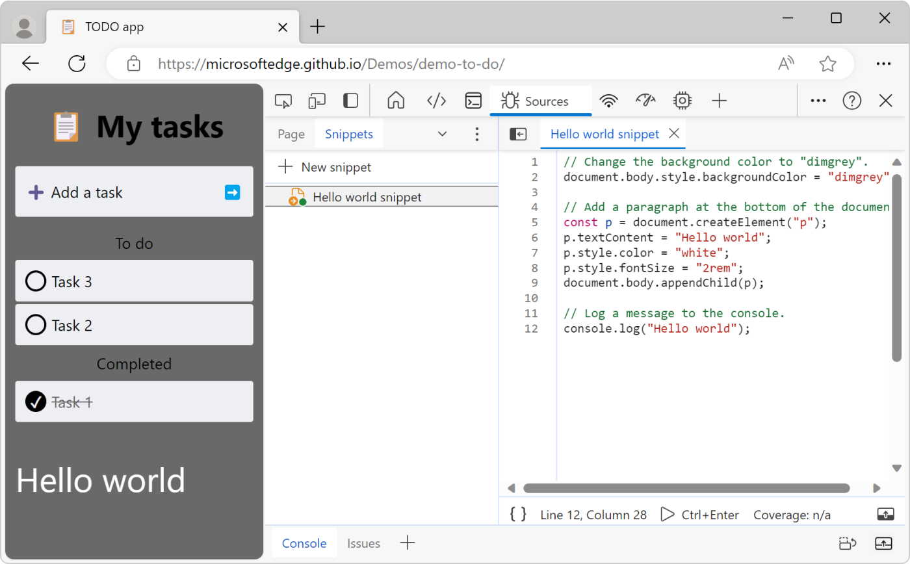
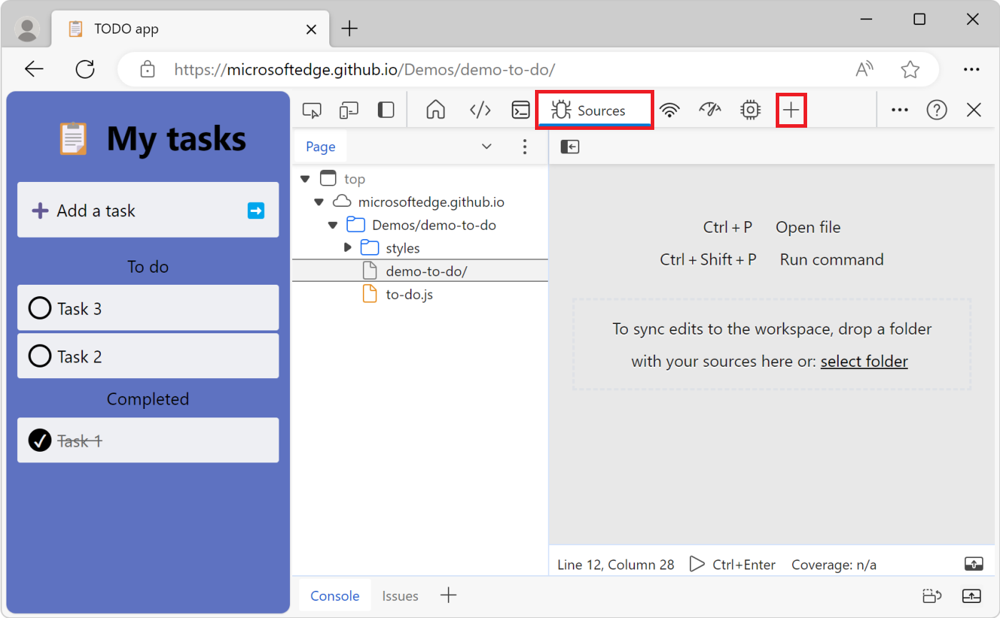
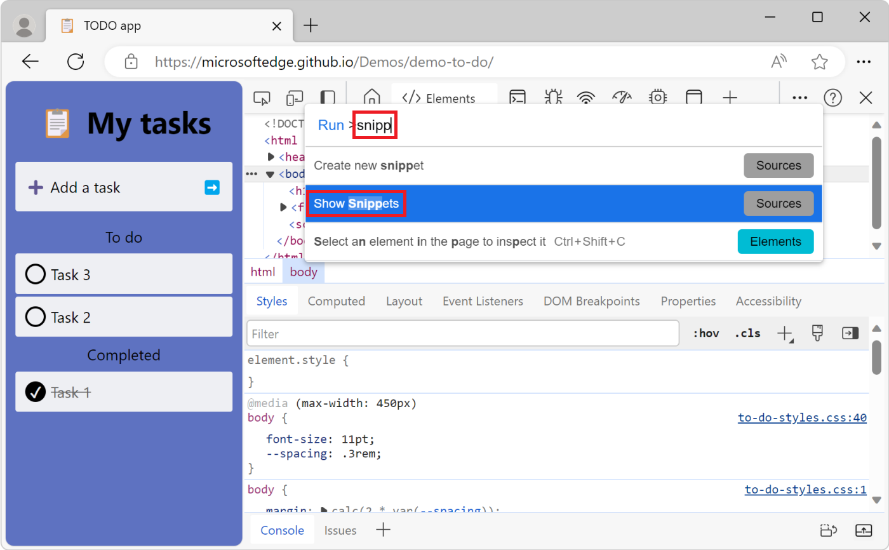
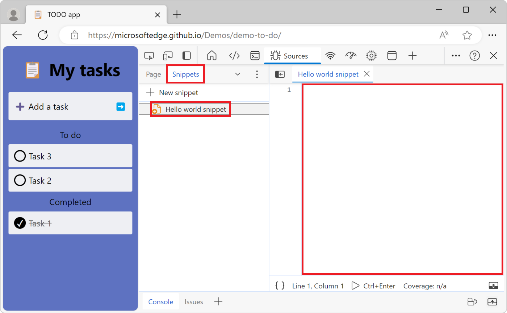
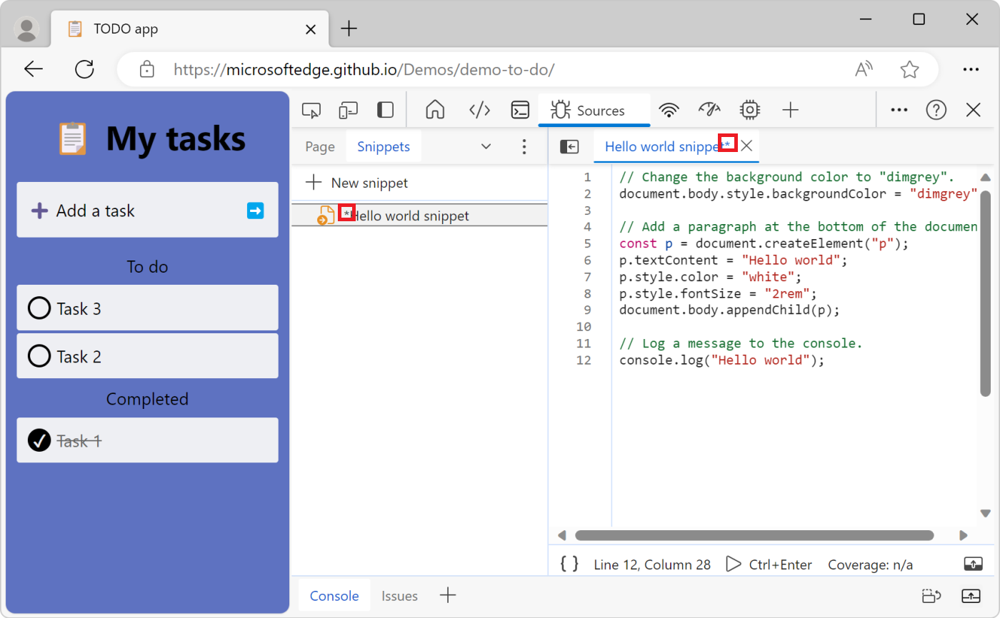

<!-- Copyright Kayce Basques

   Licensed under the Apache License, Version 2.0 (the "License");
   you may not use this file except in compliance with the License.
   You may obtain a copy of the License at

       https://www.apache.org/licenses/LICENSE-2.0

   Unless required by applicable law or agreed to in writing, software
   distributed under the License is distributed on an "AS IS" BASIS,
   WITHOUT WARRANTIES OR CONDITIONS OF ANY KIND, either express or implied.
   See the License for the specific language governing permissions and
   limitations under the License.  -->
# Run snippets of JavaScript on any webpage
<!-- https://developer.chrome.com/docs/devtools/javascript/snippets/ -->

If you're entering the same code into the **Console** tool repeatedly, consider saving the code as a snippet instead, and then running the snippet.  Snippets are scripts that you author in the **Sources** tool.  Snippets have access to the JavaScript context of the webpage, and you can run snippets on any webpage.  Snippets can be used to alter a webpage, such as to change its content or appearance, or to extract data.

The following screenshot shows Microsoft Edge with a webpage on the left and DevTools on the right. The **Sources** tool is open, displaying the source code of the snippet that's selected in the **Snippets** tab. The snippet code was run, making changes to the webpage:



The snippet source code is shown below:

```javascript
// Change the background color to "dimgrey".
document.body.style.backgroundColor = "dimgrey";

// Add a paragraph at the bottom of the document.
const p = document.createElement("p");
p.textContent = "Hello world";
p.style.color = "white";
p.style.fontSize = "2rem";
document.body.appendChild(p);

// Log a message to the console.
console.log("Hello world");
```

The code changes the background color of the webpage to dimgrey, adds a new line of text at the bottom of the webpage, and logs a message to the **Console** tool.

When you run a snippet on a webpage, the snippet's source code is added to the current webpage. For more information about changing the existing code of a webpage instead of adding new code, see [Override webpage resources with local copies (Overrides tab)](./overrides.md).


<!-- ------------------------------ -->
#### Include all your code in one file
<!-- not upstream -->

The security settings of most webpages block from loading other scripts in snippets. For this reason, you must include all your code in one file.


<!-- ====================================================================== -->
## Open the Snippets tab
<!-- Open the Snippets pane  https://developer.chrome.com/docs/devtools/javascript/snippets/#open -->

The **Snippets** tab is grouped with the **Page** tab in the **Navigator** pane, on the left of the **Sources** tool.

To open the **Snippets** tab:

1. To open DevTools, right-click the webpage, and then select **Inspect**. Or, press **Ctrl+Shift+I** (Windows, Linux) or **Command+Option+I** (macOS). DevTools opens.

1. In DevTools, on the **Activity Bar**, select the **Sources** tab. If that tab isn't visible, click the **More tools** () button.

   

1. In the **Navigator** pane (on the left), select the **Snippets** tab.  To access the **Snippets** option, you might need to click the **More tabs** () button.


<!-- ------------------------------ -->
#### Open the Snippets tab from the Command Menu
<!-- no separate heading upstream -->

You can also open the **Snippets** tab by using the **Command Menu**:

1. Select anything in DevTools, so that DevTools has focus.

1. Press **Ctrl+Shift+P** (Windows, Linux) or **Command+Shift+P** (macOS) to open the **Command Menu**.

1. Start typing "snippets", select **Show Snippets**, and then press **Enter** to run the command:

   


<!-- ====================================================================== -->
<!-- ## Create snippets -->
<!-- Create snippets  https://developer.chrome.com/docs/devtools/javascript/snippets/#create -->

<!-- You can create snippets in the **Snippets** pane, or by running the **Create new snippet** command from the **Command Menu** anywhere in DevTools. -->

<!-- The **Snippets** pane sorts your snippets in alphabetical order. -->


<!-- ====================================================================== -->
## Create a new snippet
<!-- Create a snippet in the Sources panel  https://developer.chrome.com/docs/devtools/javascript/snippets/#create-sources -->

To create a new snippet from the **Snippets** tab:

1. [Open the Snippets tab](#open-the-snippets-tab).

1. Click **New snippet** (**+**).

1. Enter a name for your snippet, and then press **Enter**:

   


<!-- ------------------------------ -->
#### Create a new snippet from the Command Menu
<!-- Create a snippet from the Command Menu  https://developer.chrome.com/docs/devtools/javascript/snippets/#create-command-menu -->

1. Focus your cursor somewhere in DevTools.

1. Press **Ctrl+Shift+P** (Windows, Linux) or **Command+Shift+P** (macOS) to open the **Command Menu**.

1. Start typing "snippet", select **Create new snippet**, and then press **Enter**:

   

To rename your new snippet, see [Rename a snippet](#rename-a-snippet), below.


<!-- ====================================================================== -->
## Edit a snippet
<!-- Edit snippets  https://developer.chrome.com/docs/devtools/javascript/snippets/#edit -->

To edit the source code of a snippet:

1. [Open the Snippets tab](#open-the-snippets-tab).

1. In the **Snippets** tab, click the name of the snippet that you want to edit.  The snippet opens in the **Code Editor**:

   

1. Use the **Code Editor** to add JavaScript to your snippet.

1. When an asterisk appears next to the name of your snippet, it means you have unsaved code.  Press **Ctrl+S** (Windows, Linux) or **Command+S** (macOS) to save:

   


<!-- ====================================================================== -->
## Run a snippet
<!-- Run snippets  https://developer.chrome.com/docs/devtools/javascript/snippets/#run -->


<!-- ------------------------------ -->
#### Run a snippet from the Sources tool
<!-- Run a snippet in the Sources panel  https://developer.chrome.com/docs/devtools/javascript/snippets/#run-sources -->

1. [Open the Snippets tab](#open-the-snippets-tab).

1. Click the name of the snippet that you want to run.  The snippet opens in the **Code Editor**:

1. Click the **Run snippet** () button, or press **Ctrl+Enter** (Windows, Linux) or **Command+Enter** (macOS):

   


<!-- ------------------------------ -->
#### Run a snippet from the Command Menu
<!-- https://developer.chrome.com/docs/devtools/javascript/snippets/#run-command-menu -->

1. Focus your cursor somewhere in DevTools.

1. Press **Ctrl+Shift+P** (Windows, Linux) or **Command+Shift+P** (macOS) to open the **Command Menu**.

1. Delete the **>** character and type the **!** character followed by the name of the snippet that you want to run:

   

1. Press **Enter** to run the snippet.


<!-- ====================================================================== -->
## Rename a snippet
<!-- Rename snippets  https://developer.chrome.com/docs/devtools/javascript/snippets/#rename -->

1. [Open the Snippets tab](#open-the-snippets-tab).

1. Right-click the snippet name, and then select **Rename**.


<!-- ====================================================================== -->
## Delete a snippet
<!-- Delete snippets  https://developer.chrome.com/docs/devtools/javascript/snippets/#delete -->

1. [Open the Snippets tab](#open-the-snippets-tab).

1. Right-click the snippet name, and then select **Remove**.


<!-- ====================================================================== -->
## Save a snippet to disk as a file
<!-- not upstream -->

By default, snippets are only available within DevTools, but you can also save snippets to disk.

1. [Open the Snippets tab](#open-the-snippets-tab).

1. Right-click the snippet name, and then select **Save as**.

   The **Save As** dialog opens.

1. Select a folder, enter a file name (such as `Script snippet #1.js`), and then click the **Save** button.


<!-- ====================================================================== -->
## Disable self-XSS warnings by typing "allow pasting"
<!-- not upstream -->

When you first try to paste content into the **Sources** tool > **Snippets** tab > **New snippet**, instead of pasting, a **Do you trust this code?** dialog is displayed, with the message: Don't paste code you do not understand or have not reviewed yourself into DevTools.  This could allow attackers to steal your identity or take control of your computer. Please type 'allow pasting' below to allow pasting."


This is a cross-site scripting (XSS) warning.  To paste code, for the current session, type **allow pasting** in the dialog, and then click the **Allow** button.  Then paste the content.  Or, start Edge with the flag below.


<!-- ------------------------------ -->
#### Console
<!-- not upstream -->

When you first try to paste content into the **Console** tool, instead of pasting, a message is displayed: "Warning: Don't paste code into the DevTools Console that you don't understand or haven't reviewed yourself. This could allow attackers to steal your identity or take control of your computer. Please type 'allow pasting' below and press Enter to allow pasting."


To paste code, for the current session, type **allow pasting** in the console, and then press **Enter**.  Then paste the content.  Or, start Edge with the flag below.


<!-- ====================================================================== -->
## Disable self-XSS warnings by starting Edge with a command-line flag
<!-- not upstream -->

To prevent the above warnings and immediately allow pasting, such as for automated testing, start Microsoft Edge from the command line, using the following flag: `--unsafely-disable-devtools-self-xss-warnings`.  The flag applies to a single session of Microsoft Edge.

For example, on Windows:

Edge Stable:

```shell
"C:\Users\localAccount\AppData\Local\Microsoft\Edge\Application\msedge.exe" --unsafely-disable-devtools-self-xss-warnings
```

Edge Beta:

```shell
"C:\Users\localAccount\AppData\Local\Microsoft\Edge Beta\Application\msedge.exe" --unsafely-disable-devtools-self-xss-warnings
```

Edge Dev:

```shell
"C:\Users\localAccount\AppData\Local\Microsoft\Edge Dev\Application\msedge.exe" --unsafely-disable-devtools-self-xss-warnings
```

Edge Canary:

```shell
"C:\Users\localAccount\AppData\Local\Microsoft\Edge SxS\Application\msedge.exe" --unsafely-disable-devtools-self-xss-warnings
```


<!-- ====================================================================== -->
> [!NOTE]
> Portions of this page are modifications based on work created and [shared by Google](https://developers.google.com/terms/site-policies) and used according to terms described in the [Creative Commons Attribution 4.0 International License](https://creativecommons.org/licenses/by/4.0).
> The original page is found [here](https://developer.chrome.com/docs/devtools/javascript/snippets/) and is authored by Kayce Basques.

[](https://creativecommons.org/licenses/by/4.0)
This work is licensed under a [Creative Commons Attribution 4.0 International License](https://creativecommons.org/licenses/by/4.0).
