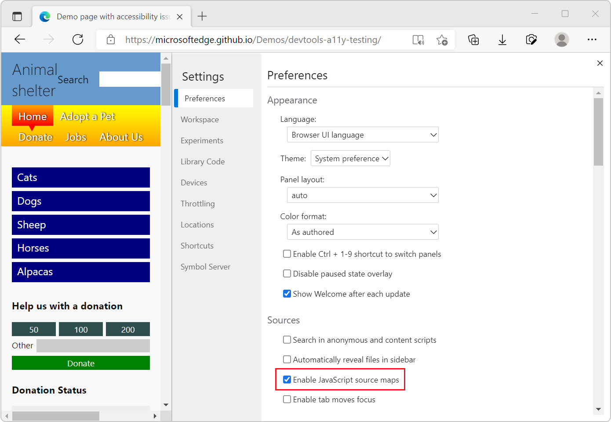

<!-- Copyright Meggin Kearney and Paul Bakaus

   Licensed under the Apache License, Version 2.0 (the "License");
   you may not use this file except in compliance with the License.
   You may obtain a copy of the License at

       https://www.apache.org/licenses/LICENSE-2.0

   Unless required by applicable law or agreed to in writing, software
   distributed under the License is distributed on an "AS IS" BASIS,
   WITHOUT WARRANTIES OR CONDITIONS OF ANY KIND, either express or implied.
   See the License for the specific language governing permissions and
   limitations under the License.  -->
# Map the processed code to your original source code, for debugging

To see and work with your original source code when you're debugging JavaScript in DevTools, rather than having to work with the compiled and minified version of your code that's returned by the web server, use source maps.

Source mapping keeps your client-side code readable and debuggable, even after your build process compiles and minifies your code and combines it into a single file.  Source maps map your compiled, minified code to your original source code files.  In DevTools, you can then read and debug your familiar, original source code, instead of the unrecognizable transformed and compiled code.

To use this source mapping technique, you must use pre-processors that can produce source maps.  Make sure your web server can serve source maps.

<!--
no longer in original file:
todo: add link to preprocessors capable of producing source maps when section is available
/web/tools/setup/setup-preprocessors?#supported_preprocessors
-->


<!-- ====================================================================== -->
## Get started with preprocessors

This article explains how to interact with JavaScript source maps in the **Sources** tool.  <!--For a first overview of what preprocessors are, how each may help, and how source maps work; see Set Up CSS & JS Preprocessors.  -->

<!--
no longer in original file:
todo: add link to Set Up CSS & JS Preprocessors when section is available
/web/tools/setup/setup-preprocessors#debugging-and-editing-preprocessed-content
-->


<!-- ====================================================================== -->
## Use a supported preprocessor

Use a minifier that is capable of creating source maps.  <!--For the most popular options, see the preprocessor support section.  -->  For an extended view, see the [Source maps: languages, tools and other info](https://github.com/ryanseddon/source-map/wiki/Source-maps:-languages,-tools-and-other-info) wiki page.

<!--
no longer in original file:
todo: add link to display the preprocessor support section when section is available
/web/tools/setup/setup-preprocessors?#supported_preprocessors
-->

The following types of preprocessors are commonly used in combination with source maps:

*  Transpilers ([Babel](https://babeljs.io), [Traceur](https://github.com/google/traceur-compiler/wiki/Getting-Started)).
*  Compilers ([Closure Compiler](https://github.com/google/closure-compiler), [TypeScript](https://www.typescriptlang.org), [CoffeeScript](https://coffeescript.org), [Dart](https://www.dartlang.org)).
*  Minifiers ([UglifyJS](https://github.com/mishoo/UglifyJS)).


<!-- ====================================================================== -->
## Source maps in the Sources tool

Source maps from preprocessors cause DevTools to load your original files in addition to your minified ones.  You then use the originals to set breakpoints and step through code.  Meanwhile, Microsoft Edge is actually running your minified code.  The running of the code gives you the illusion of running a development site in production.

When running source maps in DevTools, you should notice that the JavaScript isn't compiled, and all of the individual JavaScript files that it references are displayed.  Source maps in DevTools is using source mapping, but the underlying functionality actually runs the compiled code.

Any errors, logs, and breakpoints map to the original source code, for easier debugging.


### Enable source maps in Settings

Source maps are enabled by default.

To make sure that source maps are enabled:

1. To open DevTools, in Microsoft Edge, right-click a webpage, and then select **Inspect**.  Or, press `Ctrl`+`Shift`+`I` (Windows, Linux) or `Command`+`Option`+`I` (macOS).

1. In DevTools, click **Settings** () > **Preferences**.

1. In the **Preferences** page, in the **Sources** section, make sure the **Enable JavaScript source maps** checkbox and the **Enable CSS source maps** checkbox are selected:

   

1. In the upper right of **Settings**, click the **Close** (**x**) button.


### Debugging with source maps

When [debugging your code](index.md#step-4-step-through-the-code) and source maps are enabled, source maps are used in several places:

*  In the **Console** tool, links from log messages to source files go to the original files, not the compiled files.

*  When stepping through code in the **Sources** tool, the original files are displayed in the **Navigator** pane on the left.

*  In the **Sources** tool, the links to source files that appear in the **Call Stack** of the **Debugger** pane open the original source files.


<!-- ====================================================================== -->
## Use `//# sourceURL` to name evaluated files in the Sources tool

The `//# sourceURL` pragma, such as `// # sourceURL=myFileName`, is a convention that allows you to make development much easier when working with evaluated JavaScript files.  There can be space characters before or after the `#`.

When loading JavaScript files and evaluating them using the `eval()` function, the **Sources** tool doesn't have a file name to display these files in the **Navigator** pane. By including the following special comment in your code, you can name evaluated files, inline scripts, and styles, so that each one appears as a recognizable file name in the **Sources** tool.  For example:

```javascript
//# sourceURL=source.coffee
```

<!-- This pragma isn't part of the source map specification. -->


<!-- ====================================================================== -->
## See also

* [Securely debug original code by publishing source maps to the Azure Artifacts symbol server](publish-source-maps-to-azure.md)
* [Securely debug original code by using Azure Artifacts symbol server source maps](consume-source-maps-from-azure.md)
* [Source Maps Monitor tool](../source-maps-monitor/source-maps-monitor-tool.md)


<!-- ====================================================================== -->
> [!NOTE]
> Portions of this page are modifications based on work created and [shared by Google](https://developers.google.com/terms/site-policies) and used according to terms described in the [Creative Commons Attribution 4.0 International License](https://creativecommons.org/licenses/by/4.0).
> The original page is found [here](https://developer.chrome.com/docs/devtools/javascript/source-maps/) and is authored by [Meggin Kearney](https://developers.google.com/web/resources/contributors#meggin-kearney) (Technical Writer) and [Paul Bakaus](https://developers.google.com/web/resources/contributors#paul-bakaus) (Open Web Developer Advocate, Google: Tools, Performance, Animation, and UX).

[](https://creativecommons.org/licenses/by/4.0)
This work is licensed under a [Creative Commons Attribution 4.0 International License](https://creativecommons.org/licenses/by/4.0).
