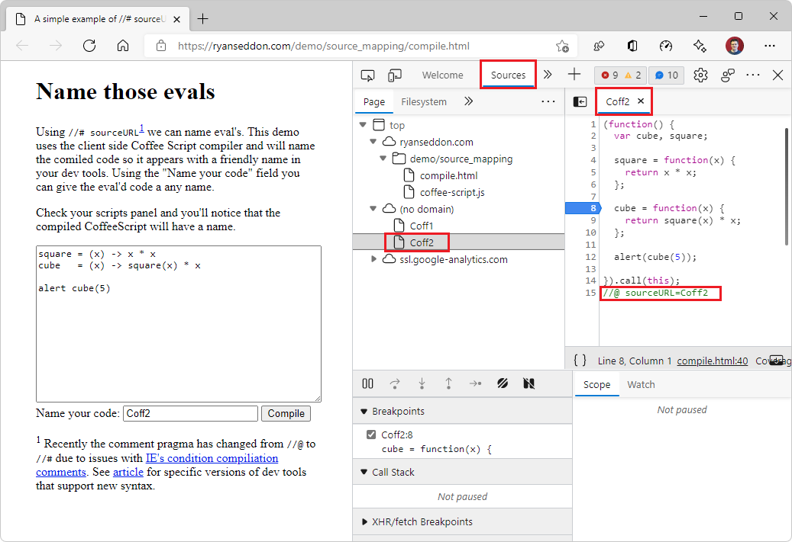

<!-- Copyright Meggin Kearney and Paul Bakaus

   Licensed under the Apache License, Version 2.0 (the "License");
   you may not use this file except in compliance with the License.
   You may obtain a copy of the License at

       https://www.apache.org/licenses/LICENSE-2.0

   Unless required by applicable law or agreed to in writing, software
   distributed under the License is distributed on an "AS IS" BASIS,
   WITHOUT WARRANTIES OR CONDITIONS OF ANY KIND, either express or implied.
   See the License for the specific language governing permissions and
   limitations under the License.  -->
# Map the processed code to your original source code, for debugging
<!-- orig title:
# Map Preprocessed Code to Source Code
-->

To see and work with your original source code when you're debugging your code in DevTools, rather than having to work with the compiled and minified version of your code that's returned by the web server, use source maps.

Source mapping keeps your client-side code readable and debuggable, even after your build process compiles and minifies your code and combines it into a single file.  Source maps map your compiled, minified code to your original source code files.  In DevTools, you can then read and debug your familiar, original source code, instead of the unrecognizable transformed and compiled code.

To use this source mapping technique, you must use pre-processors that can produce source maps.  Make sure your web server can serve source maps.


<!--
no longer in original file:
todo: add link to preprocessors capable of producing source maps when section is available
/web/tools/setup/setup-preprocessors?#supported_preprocessors
-->


<!-- ====================================================================== -->
## Get started with preprocessors

This article explains how to interact with JavaScript source maps in the **Sources** tool.  <!--For a first overview of what preprocessors are, how each may help, and how source maps work; see Set Up CSS & JS Preprocessors.  -->

<!--
no longer in original file:
todo: add link to Set Up CSS & JS Preprocessors when section is available
/web/tools/setup/setup-preprocessors#debugging-and-editing-preprocessed-content
-->


<!-- ====================================================================== -->
## Use a supported preprocessor

Use a minifier that is capable of creating source maps.  <!--For the most popular options, see the preprocessor support section.  -->  For an extended view, see the [Source maps: languages, tools and other info](https://github.com/ryanseddon/source-map/wiki/Source-maps:-languages,-tools-and-other-info) wiki page.

<!--
no longer in original file:
todo: add link to display the preprocessor support section when section is available
/web/tools/setup/setup-preprocessors?#supported_preprocessors
-->

The following types of preprocessors are commonly used in combination with source maps:

*  Transpilers ([Babel](https://babeljs.io), [Traceur](https://github.com/google/traceur-compiler/wiki/Getting-Started)).
*  Compilers ([Closure Compiler](https://github.com/google/closure-compiler), [TypeScript](https://www.typescriptlang.org), [CoffeeScript](https://coffeescript.org), [Dart](https://www.dartlang.org)).
*  Minifiers ([UglifyJS](https://github.com/mishoo/UglifyJS)).


<!-- ====================================================================== -->
## Source maps in the Sources tool

Source maps from preprocessors cause DevTools to load your original files in addition to your minified ones.  You then use the originals to set breakpoints and step through code.  Meanwhile, Microsoft Edge is actually running your minified code.  The running of the code gives you the illusion of running a development site in production.

When running source maps in DevTools, you should notice that the JavaScript isn't compiled, and all of the individual JavaScript files that it references are displayed.  Source maps in DevTools is using source mapping, but the underlying functionality actually runs the compiled code.

Any errors, logs, and breakpoints map to the dev code, for awesome debugging.  So in effect, it gives you the illusion that you are running a dev site in production.

### Enable source maps in Settings

Source maps are enabled by default.<!-- (as of Microsoft Edge 39)-->

To make sure that source maps are enabled:

1. To open DevTools, in Microsoft Edge, right-click a webpage, and then select **Inspect**.  Or, press `Ctrl`+`Shift`+`I` (Windows, Linux) or `Command`+`Option`+`I` (macOS).

1. In DevTools, click **Settings** () > **Preferences**.

1. In the **Preferences** page, in the **Sources** section, make sure the **Enable JavaScript source maps** checkbox and the **Enable CSS source maps** checkbox are selected:


1. In the upper right of **Settings**, click the **Close** (**x**) button.


### Debugging with source maps

When [debugging your code](index.md#step-4-step-through-the-code) and source maps are enabled, source maps are used in several places:

*  In the **Console** tool, links from log messages to source files go to the original files, not the compiled files.

*  When stepping through code in the **Sources** tool, the original files are displayed in the **Navigator** pane on the left.

*  In the **Sources** tool, the links to source files that appear in the **Call Stack** of the **Debugger** pane open the original source files.


<!-- ====================================================================== -->
## #sourceURL and displayName

<!-- this section doesn't mention displayName, why is `displayName` in the heading? -->

Although it's not part of the source map spec, the `#sourceURL` pragma allows you to make development much easier when working with evals.  The helper <!-- what does "the helper" mean?  where? what is the context?--> is displayed<!--where?--> similar to the `//# sourceMappingURL` property.  The `#sourceURL` pragma is mentioned in the source map V3 specifications.

As the demo page below says, the comment pragma has changed from `//@` to `//#` due to issues with Internet Explorer's conditional compilation comments.  See [Issues](http://www.html5rocks.com/en/tutorials/developertools/sourcemaps/#toc-issues) in _Introduction to JavaScript Source Maps_ for specific versions of dev tools that support the new, `#sourceURL` syntax.

By including the following special comment in your code, which is evaled,<!--legit industry/context term, "evaled"?--> you can name evals and inline scripts and styles so each appears as more logical names in your DevTools.  For example:

```javascript
//# sourceURL=source.coffee
```

To generate and see a `#sourceURL` pragma value:

1. Open the demo webpage [Name those evals](https://www.thecssninja.com/demo/source_mapping/compile.html) in a new browser window or tab.

1. To open DevTools, right-click the demo webpage, and then select **Inspect**.  Or, press `Ctrl`+`Shift`+`I` (Windows, Linux) or `Command`+`Option`+`I` (macOS).  DevTools opens, next to the demo webpage.

1. In DevTools, on the main toolbar, click the **Sources** tab.  If that tab isn't visible, click the **More tabs** () button.

1. In the rendered demo webpage, in the **Name your code:** text box, enter a filename.

1. Click the **Compile** button.

   An alert box appears, showing the evaluated sum from the CoffeeScript source:

   

1. In the alert box, click the **OK** button.

1. In the **Sources** tool, in the **Page** tab in the **Navigator** pane on the left, expand the node **top** > **(no domain)**.

1. Click the file that the demo page created with your name of your code, such as **Coff2**:

   

   The file contains the compiled JavaScript for the original source.  On the last line is an additional `// #sourceURL` comment (the `@` should be updated to `#`) that shows the name of the original source file.  This can help you with debugging while working with language abstractions.

   The code listing in your created file is produced by the file `coffee-script.js`.

1. In the **Page** tab, click **coffee-script.js** and scroll through the client-side Coffee Script code - it's long, yet line numbering stops at 8, and there are 9 hits on "@".

<!--
Is this demo page introducing 10x confusion as clarification?
Why use a demo page to demonstrate this?
Is this an outdated version of client-side Coffee Script in the .js file of the demo page?
Are we supposed to know what "coffee script" is?
Top of demo page claims "#" is produced; bottom explains the change of standard, why didn't the code of CoffeeScript get updated to output # instead of @, by the demo creator?
Lots of typos in demo page.
Where's the "bug" that produces @ when it should produce # instead?
How does this demo page support the lead-in above?  
Need to explain the png/ explain the demo to total newbies who have no idea what's going on here.  
What is the purpose of this demo page?
Where did the script code in the Coff2 listing in Devtools come from?  
Are we seeing all the code - which code caused the @sourceURL?  
Do you have to write a demo page like this to get //@ sourceURL?  
What's the point of this demonstration (which returns outdated @ instead of #)? -->


<!-- ====================================================================== -->
## See also

* [Debug original code using the Azure Artifacts symbol server](ado-symbol-server.md)
* [Source Maps Monitor tool](../source-maps-monitor/source-maps-monitor-tool.md)


<!-- ====================================================================== -->
> [!NOTE]
> Portions of this page are modifications based on work created and [shared by Google](https://developers.google.com/terms/site-policies) and used according to terms described in the [Creative Commons Attribution 4.0 International License](https://creativecommons.org/licenses/by/4.0).
> The original page is found [here](https://developers.google.com/web/tools/chrome-devtools/javascript/source-maps) and is authored by [Meggin Kearney](https://developers.google.com/web/resources/contributors#meggin-kearney) (Technical Writer) and [Paul Bakaus](https://developers.google.com/web/resources/contributors#paul-bakaus) (Open Web Developer Advocate, Google: Tools, Performance, Animation, and UX).

[](https://creativecommons.org/licenses/by/4.0)
This work is licensed under a [Creative Commons Attribution 4.0 International License](https://creativecommons.org/licenses/by/4.0).
