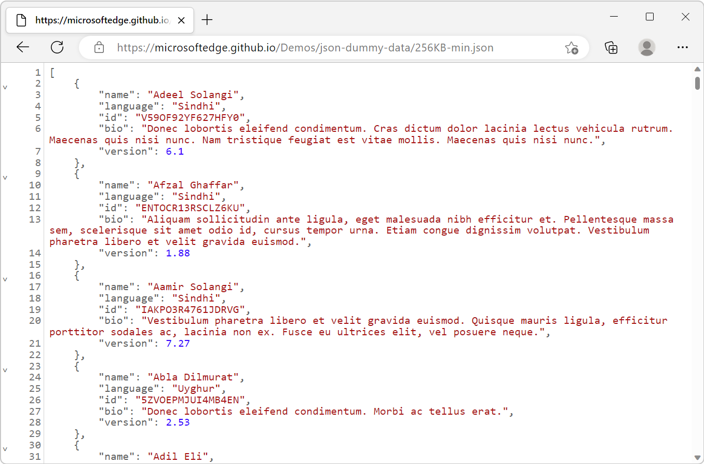
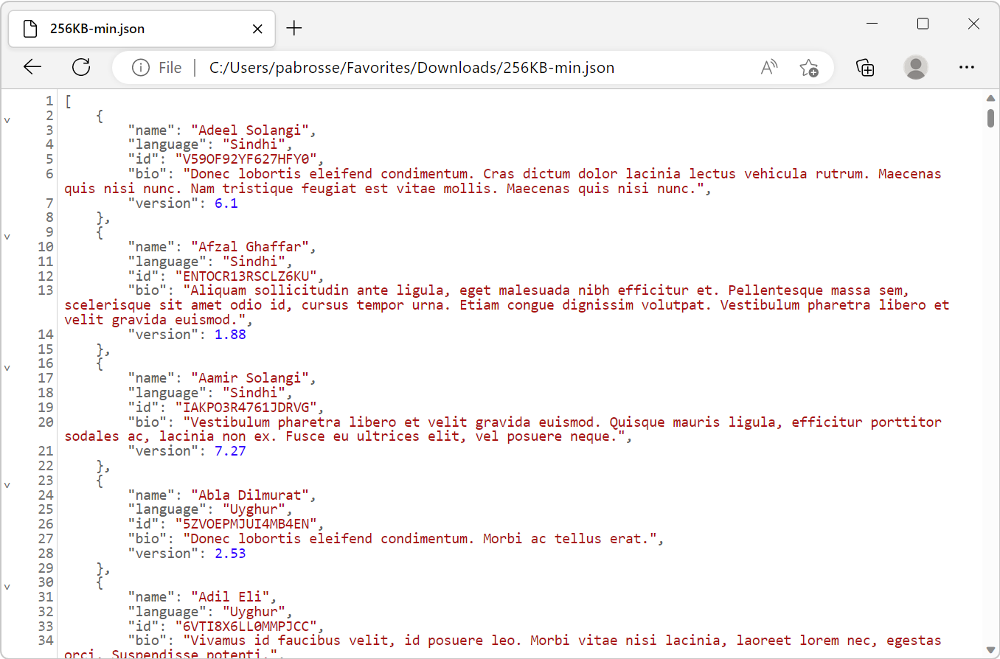
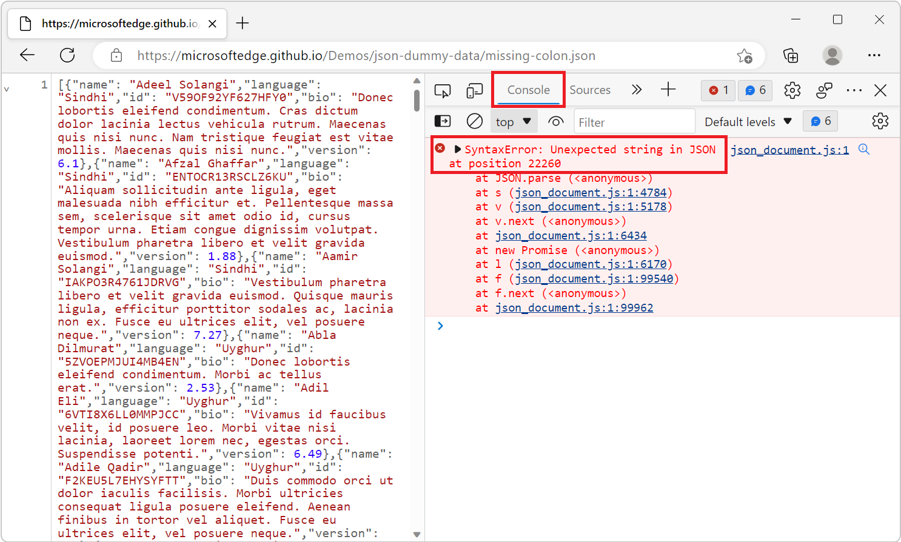
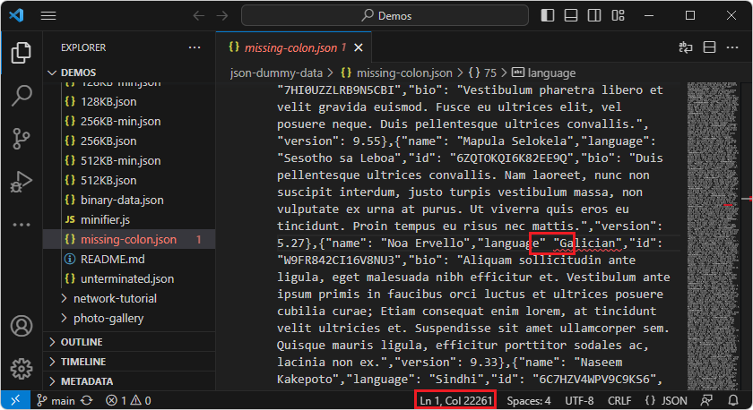

# View formatted JSON

Use the **JSON viewer** to automatically format and syntax highlight JSON responses and files in browser tabs.

The **JSON viewer** changes the returned JSON data to make it easier to read. Sometimes a web server responds to HTTP requests by returning data encoded as JSON.  JSON data can be difficult to read when it's formatted as a single long, concatenated line of text. The same can occur when opening a JSON file from disk.

The **JSON viewer** improves readability of JSON data in several ways:

*  The JSON syntax is highlighted with different colors.
*  Object properties are displayed on their own lines and indented.
*  Objects can be collapsed or expanded.
*  The JSON viewer matches your operating system's dark or light theme.

#### Supported scenarios

The **JSON viewer** is not supported in windows that are opened by using the `window.open` JavaScript method. In windows opened with `window.open`, JSON data is displayed as a single line of text, without formatting or syntax highlighting.

<!-- ====================================================================== -->
## View reformatted JSON server responses

To view a JSON response from a web server as reformatted JSON:

1. Open a new tab or window in Microsoft Edge.

1. Type a URL that returns JSON data in the address bar. For example, use this sample JSON response: [https://microsoftedge.github.io/Demos/json-dummy-data/256KB-min.json](https://microsoftedge.github.io/Demos/json-dummy-data/256KB-min.json).

   You can find more samples of JSON responses at [MicrosoftEdge / Demos > json-dummy-data](https://microsoftedge.github.io/Demos/json-dummy-data/).

1. Microsoft Edge detects that the returned data is JSON and formats it automatically:

   

<!-- ====================================================================== -->
## View reformatted JSON files

To view a JSON file stored on your device as reformatted JSON:

1. Open a new tab or window in Microsoft Edge.

1. Press **Ctrl+O** on Windows and Linux, or **Command+O** on macOS, and then select a JSON file.

1. Microsoft Edge detects that the file contains JSON data and formats it automatically:

   

<!-- ====================================================================== -->
## Detect invalid JSON data

JSON data can sometimes be invalid. For example, the following patterns are invalid in JSON:

*  Omitting double quotes around a key name.
*  Having a trailing comma after the last key/value pair.

The **JSON viewer** applies syntax highlighting to invalid JSON. However, the **JSON viewer** doesn't format the content, and you can't collapse or expand objects.

You can find information about the invalid syntax in the **Console** tool, where the **JSON viewer** reports errors.

To view invalid JSON data:

1. Open a new tab or window in Microsoft Edge.

1. In the Address bar, go to a URL that returns invalid JSON data.  For example, use this sample invalid JSON response: [https://microsoftedge.github.io/Demos/json-dummy-data/missing-colon.json](https://microsoftedge.github.io/Demos/json-dummy-data/missing-colon.json).

   You can find other invalid samples of JSON responses at [MicrosoftEdge / Demos > json-dummy-data](https://microsoftedge.github.io/Demos/json-dummy-data/#invalid-json).

1. Microsoft Edge detects that the file contains invalid JSON data, and colorizes the JSON listing, but doesn't wrap or otherwise reformat the JSON listing.  The fact that the JSON isn't wrapped indicates there's malformed JSON.

1. Open the **Console** tool by pressing **Ctrl+Shift+J** (Windows, Linux) or **Command+Option+J** (macOS).

   A JavaScript error indicates where the JSON syntax error is located:

   

1. In a code editor, such as Microsoft Visual Studio Code, go to the indicated column number to inspect the JSON:

   
