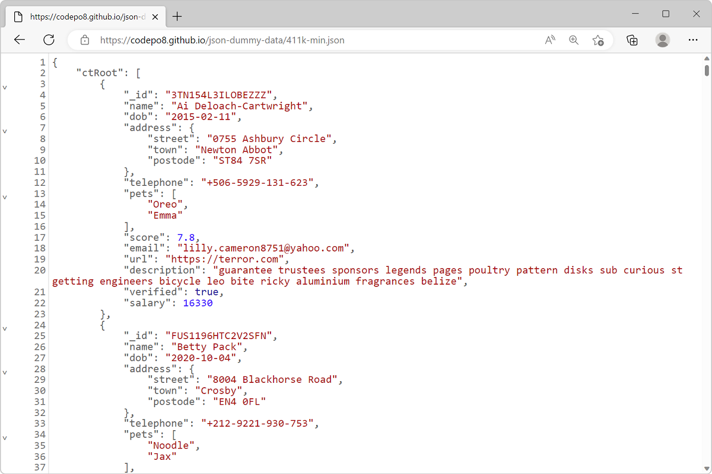
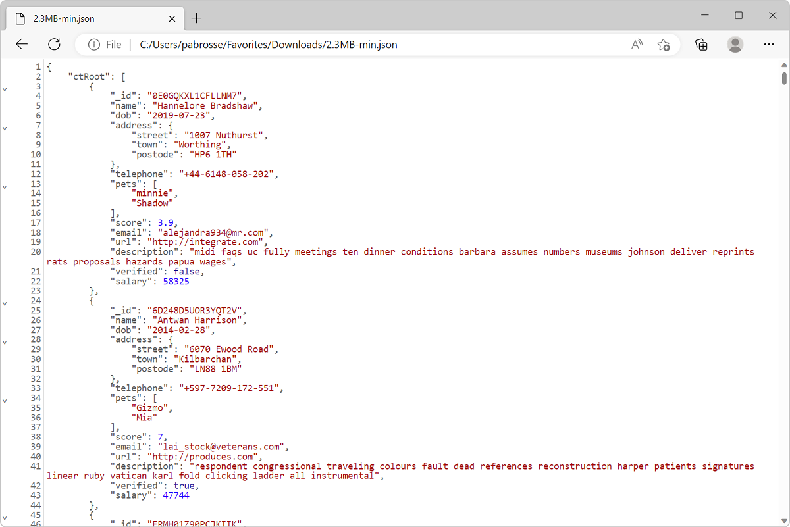
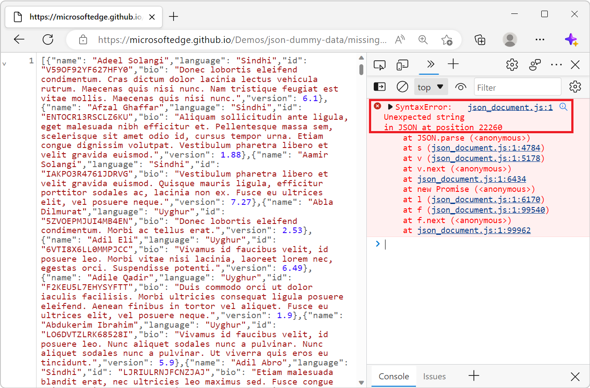

# View formatted JSON

Use the **JSON viewer** to automatically format and highlight JSON responses and files in browser tabs.

The **JSON viewer** changes the returned JSON data to make it easier to read. Sometimes a web server responds to HTTP requests by returning data encoded as JSON.  JSON data can be difficult to read when it's formatted as a single long, concatenated line of text. The same can occur when opening a JSON file from disk.

The **JSON viewer** improves readability of JSON data in several ways:

*  The JSON syntax is highlighted with different colors.
*  Object properties are displayed on their own lines and indented.
*  Objects can be collapsed or expanded.

The **JSON viewer** tool is included in Microsoft Edge starting with version 110.

<!-- ====================================================================== -->
## View reformatted JSON server responses

To view a JSON response from a web server as reformatted JSON:

1. Open a new tab or window in Microsoft Edge.

1. Type a URL that returns JSON data in the address bar. For example, use [this sample JSON response](https://microsoftedge.github.io/Demos/json-dummy-data/411k-min.json). You can find more samples JSON responses at [MicrosoftEdge / Demos > json-dummy-data](https://github.com/MicrosoftEdge/Demos/tree/main/json-dummy-data).

1. Microsoft Edge detects that the returned data is JSON and formats it automatically:

   

<!-- ====================================================================== -->
## View reformatted JSON files

To view a JSON file stored on your device as reformatted JSON:

1. Open a new tab or window in Microsoft Edge.

1. Press `Ctrl`+`O` on Windows and Linux, or `Cmd`+`O` on macOS and choose the JSON file you want to open.

1. Microsoft Edge detects that the file contains JSON and formats it automatically:

   

<!-- ====================================================================== -->
## Detect invalid JSON data

JSON data can sometimes be invalid. For example, the following JSON is invalid:

*  Omitting double quotes around a key name.
*  Having a trailing comma after the last key/value pair.

The **JSON viewer** applies syntax highlighting to invalid JSON. However, the **JSON viewer** doesn't format the content, and you can't collapse or expand objects.

You can find information about the invalid syntax in the **Console** tool, where the **JSON viewer** reports errors.

As seen below, invalid JSON responses are shown unformatted but highlighted, and an error is printed in the **Console** to help diagnose the syntax error:

