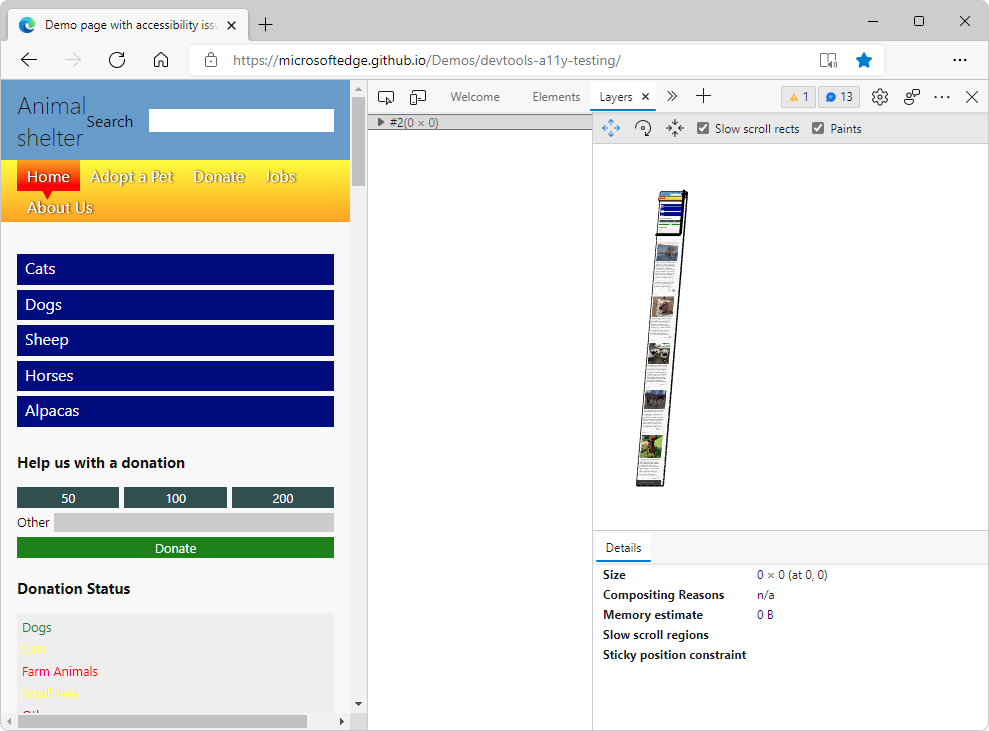

# Layers tool

The **Layers** tool represents the webpage in a 3D space, to help you improve the rendering performance of your webpage.  Use the **Layers** tool to analyze how many layers are created by your CSS code, how big they are, and how often they change.

The **Layers** tool shows the different layers that are created by the browser rendering engine, and then displays a composited image of the webpage in a 3D space that you can rotate.

The **Layers** tool is now largely superseded by the **Composited Layers** tab of the **3D View** tool.  See [Composited layers](../3d-view/index.md#composited-layers) in _Navigate z-index, DOM, and layers using the 3D View tool_.

