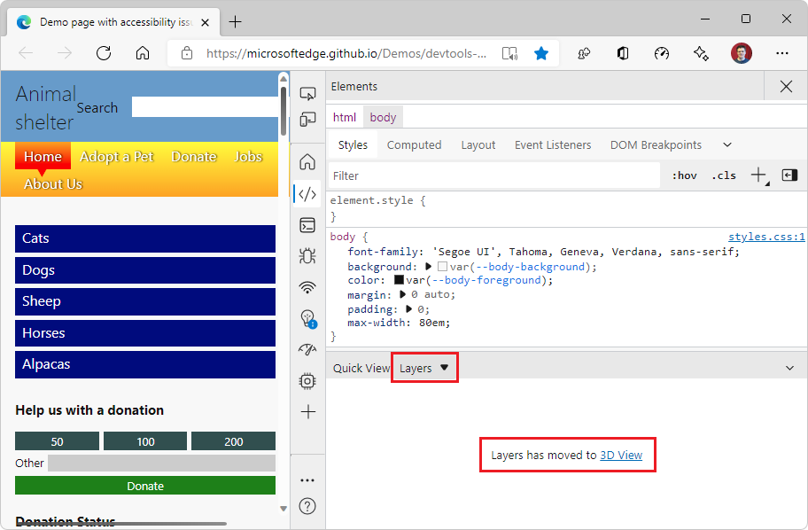

# Layers tool

Use the **3D View** tool instead; see [Navigate z-index, DOM, and layers using the 3D View tool](../3d-view/index.md).

The **Layers** tool (now the **3D View** tool) represents the webpage in a 3D space, to help you improve the rendering performance of your webpage.  Use the **Layers** tool to analyze how many layers are created by your CSS code, how big they are, and how often they change.  The **Layers** tool shows the different layers that are created by the browser rendering engine, and then displays a composited image of the webpage in a 3D space that you can rotate.

The **Layers** tool is now superseded by the **Composited Layers** tab of the **3D View** tool.  The following screenshot shows the **Layers** tool open in **Quick View** using **Focus Mode**, instead of in the Drawer:

The **Layers** tool previously showed the following:

