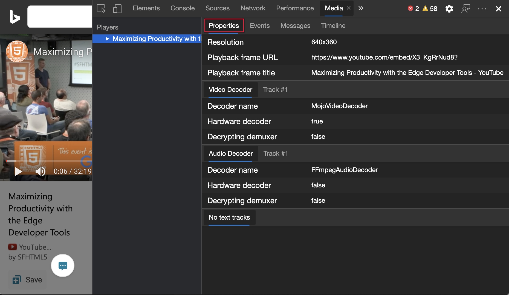
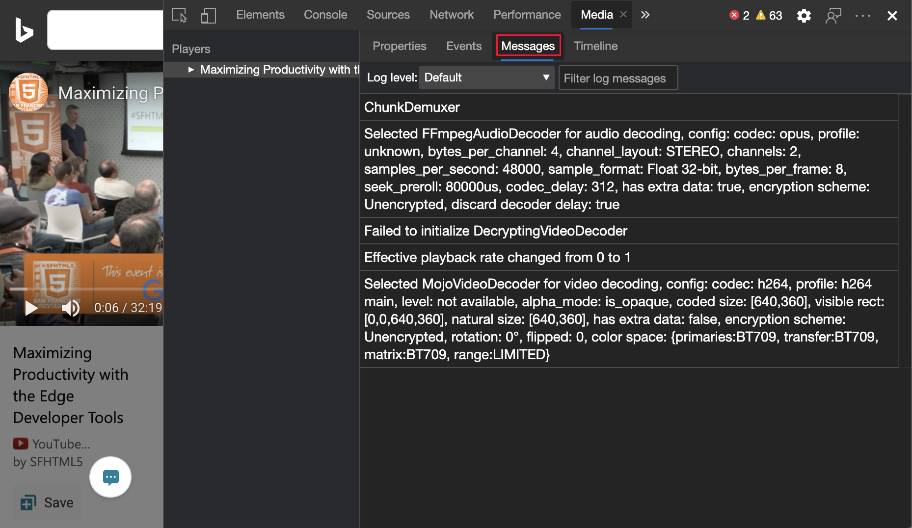
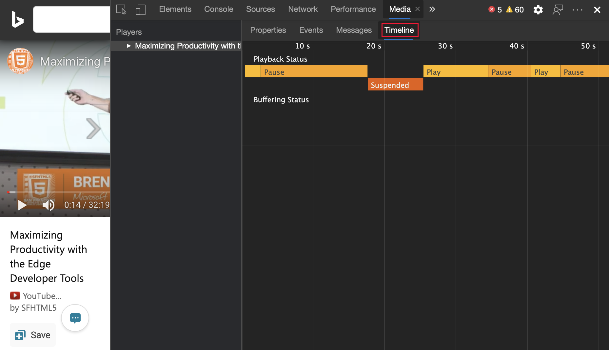
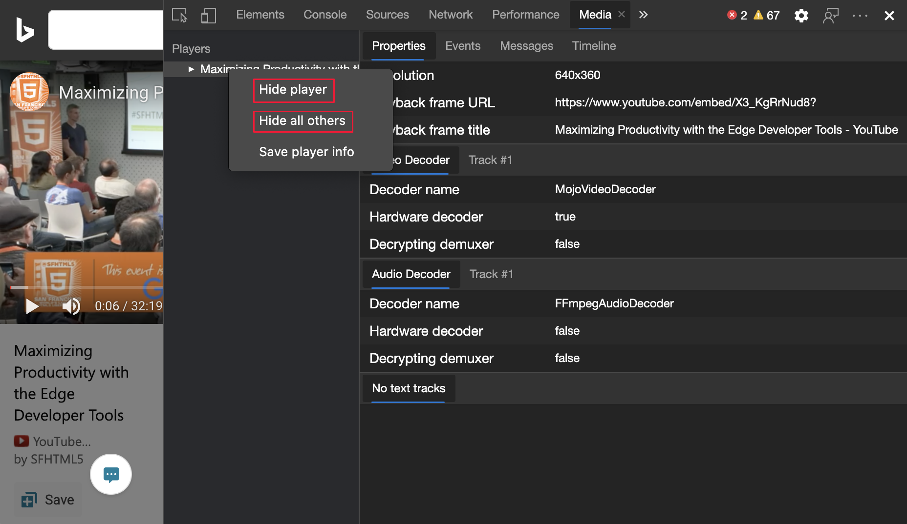
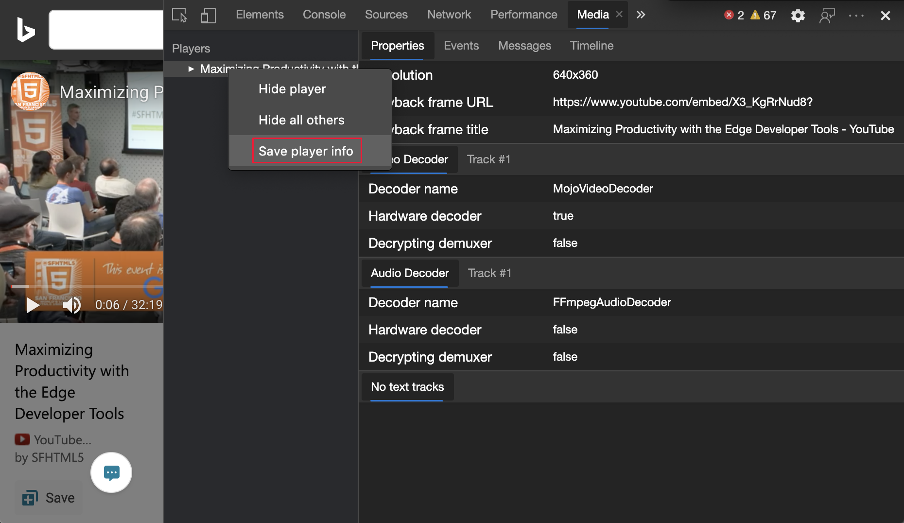

<!-- Copyright Jecelyn Yeen

   Licensed under the Apache License, Version 2.0 (the "License");
   you may not use this file except in compliance with the License.
   You may obtain a copy of the License at

       https://www.apache.org/licenses/LICENSE-2.0

   Unless required by applicable law or agreed to in writing, software
   distributed under the License is distributed on an "AS IS" BASIS,
   WITHOUT WARRANTIES OR CONDITIONS OF ANY KIND, either express or implied.
   See the License for the specific language governing permissions and
   limitations under the License.  -->
# View and debug media players information

Use the **Media** tool to view information and debug the media players per browser tab.

<!-- ====================================================================== -->
## Open the Media tool

The **Media** tool is the main place in DevTools for inspecting the media player of a webpage.

1. To open DevTools, right-click the webpage, and then select **Inspect**.  Or, press **Ctrl+Shift+I** (Windows, Linux) or **Command+Option+I** (macOS).  DevTools opens.

1. In DevTools, on the main toolbar, select the **Media** tab.  If that tab isn't visible, click the **More tabs** () button, or else the **More Tools** () button.

   

<!-- ====================================================================== -->
## View media players information

1. Navigate to a webpage with a media player, such as the following webpage.

    [Maximizing productivity with the Edge Developer Tools](https://www.bing.com/videos/search?view=detail&mid=DE0BA14EC0E0D18C06C8DE0BA14EC0E0D18C06C8)

1. Under the **Players** menu, a media player is displayed.

1. Click the player.  The **Properties** panel displays the properties of the media player.

   

1. To view all the media player events, click the **Events** panel.

   

1. To view the media player message logs, click the **Messages** panel.  You can filter the messages by log level or string.

   

1. On the **Timeline** panel, the media playback and buffer status is displayed live.

   

### Remote debugging

View the media players information on an Android device from your Windows or macOS computer.

1. To set up remote debugging, see [Get started with remote debugging Android devices](../remote-debugging/index.md).

1. View the media players information remotely.

    <!-- TODO: recreate image using an Android device -->
    <!--
   
    -->

<!-- ====================================================================== -->
## Hide and show media players

Sometimes you run more than one media player on a webpage, or use the same browser tab to browse different webpages, each with media players.

You can hide (or show) each media player, for an easier debugging experience:

1. Browse to several different video webpages using the same browser tab.

1. To hide media players:
    *  To hide a single media player, right-click a media player, and then select **Hide player**.
    *  To hide all of the other media players, right-click a media player, and then select **Hide all others**.

<!-- ====================================================================== -->
## Export media player information

*  To download the media player info as a JSON file, right-click a media player, and then select **Save player info**.

<!-- ====================================================================== -->
> [!NOTE]
> Portions of this page are modifications based on work created and [shared by Google](https://developers.google.com/terms/site-policies) and used according to terms described in the [Creative Commons Attribution 4.0 International License](https://creativecommons.org/licenses/by/4.0).
> The original page is found [here](https://developer.chrome.com/docs/devtools/media-panel/) and is authored by [Jecelyn Yeen](https://developers.google.com/web/resources/contributors#jecelyn-yeen) (Developer advocate, Chrome DevTools).

This work is licensed under a [Creative Commons Attribution 4.0 International License](https://creativecommons.org/licenses/by/4.0).
