<!-- Copyright Kim-Anh Tran

   Licensed under the Apache License, Version 2.0 (the "License");
   you may not use this file except in compliance with the License.
   You may obtain a copy of the License at

       https://www.apache.org/licenses/LICENSE-2.0

   Unless required by applicable law or agreed to in writing, software
   distributed under the License is distributed on an "AS IS" BASIS,
   WITHOUT WARRANTIES OR CONDITIONS OF ANY KIND, either express or implied.
   See the License for the specific language governing permissions and
   limitations under the License.  -->

# Inspect a JavaScript ArrayBuffer using Memory Inspector

Use **Memory Inspector** to view and interact with the following types of objects:

* [ArrayBuffer](https://developer.mozilla.org/docs/web/javascript/reference/global_objects/arraybuffer)
* [TypedArray](https://developer.mozilla.org/docs/Web/JavaScript/Reference/Global_Objects/TypedArray)
* [DataView](https://developer.mozilla.org/docs/Web/JavaScript/Reference/Global_Objects/DataView)
* [WebAssembly (Wasm) memory](https://developer.mozilla.org/docs/Web/JavaScript/Reference/Global_Objects/WebAssembly/Memory)

Using **Memory Inspector** you can view the different types of memory objects, navigate, and select the types to be used to interpret the values. It shows the ASCII values directly next to the bytes, and lets you select different endianness.

 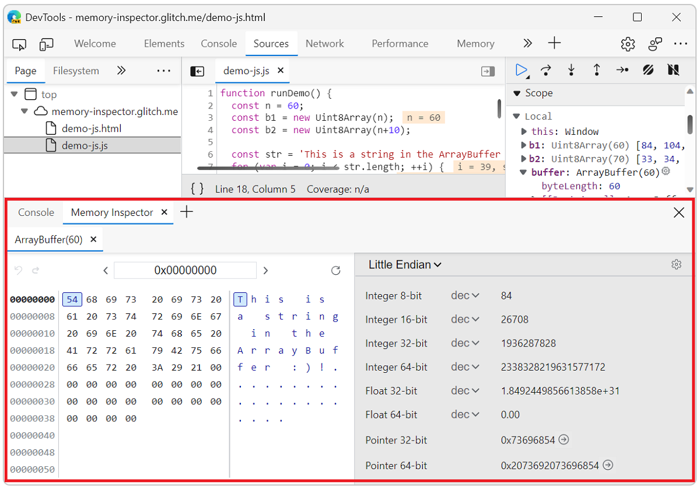

The **Memory Inspector** tool provides greater ability than the **Sources** tool to inspect `ArrayBuffers` when debugging. The **Scope** view in the Sources tool displays a list of single values within the array buffer, which makes it difficult to see all the data. Additionally, navigating to a certain range within the buffer requires you to scroll to a specific index and the values are always displayed as a single byte, even if you wanted to see them in another format, such as 32-bit integers.

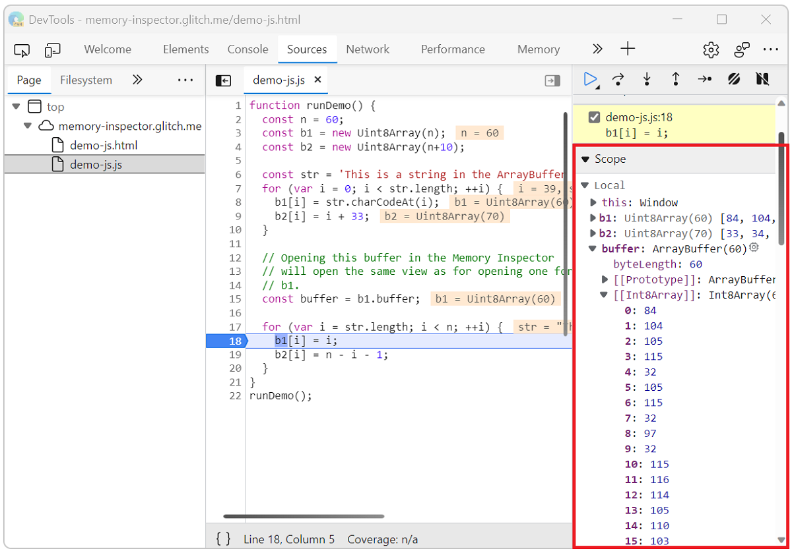

<!-- this page's initial content was from
https://learn.microsoft.com/microsoft-edge/devtools-guide-chromium/whats-new/2021/04/devtools#new-memory-inspector-tool
-->

<!-- ====================================================================== -->
## Open Memory Inspector while debugging

1. Start Microsoft Edge.

1. Open the test site [Inspect ArrayBuffers in JS (Memory in JS)](http://memory-inspector.glitch.me/demo-js.html). <!-- To do item: copy to Microsoft Repo and reference there -->

1. Open DevTools by pressing **F12** or **Ctrl+Shift+I** (Windows, Linux) or **Command+Option+I** (macOS).

1. Click **Sources** and open the `demo-js.js` file.

1. Set a breakpoint at line **18** as shown in the following image.

    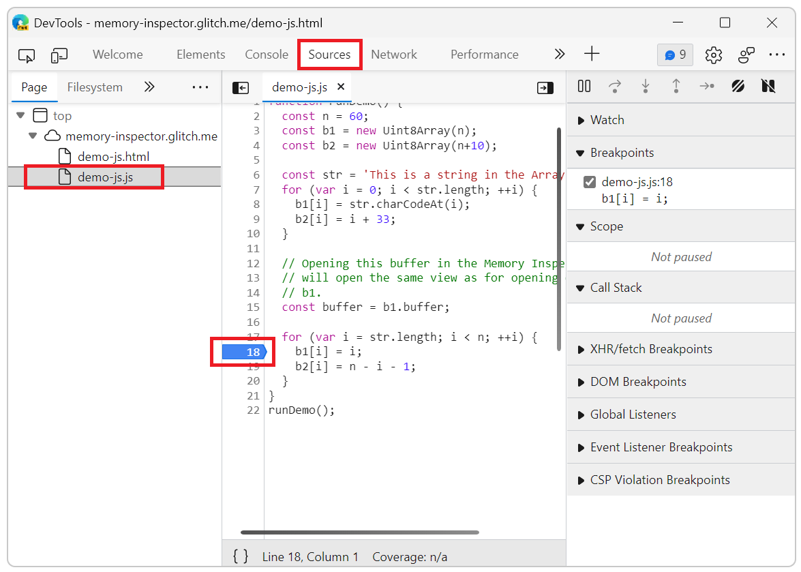

1. Refresh the webpage. It fails to display because the JavaScript pauses at the breakpoint.

1. In the right Debugger pane under **Scope**, find the `buffer` line.

1. From the `buffer` line you can open Memory Inspector using one of the following methods:

    * Click on the **Reveal in Memory Inspector panel** icon () at the end of the `buffer` property line, or
 
    * From the context menu. Right click the `buffer` property and select **Reveal in Memory Inspector panel**.

    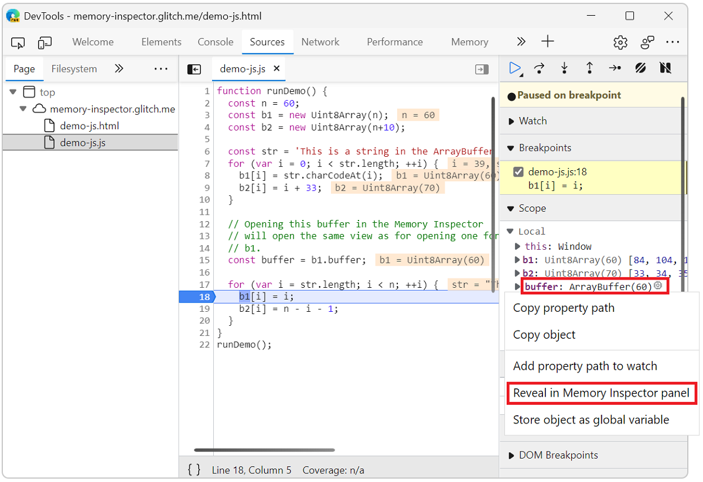

    The JavaScript ArrayBuffer opens in Memory Inspector.

    

### Inspect multiple objects

You can inspect multiple objects at the same time such as DataView and TypedArray.

With the demo webpage paused at the breakpoint, object `b2` in the **Scope** view is a TypedArray. Right click the `b2` object and select **Reveal in Memory Inspector panel**

A new tab for the `b2` object opens next to the first tab, which represents the `buffer` object in Memory Inspector.

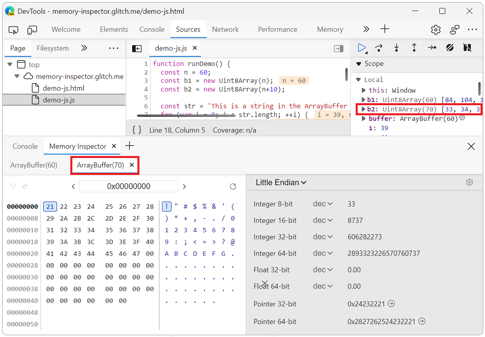

<!-- ====================================================================== -->
## Navigating in Memory Inspector

The Memory Inspector panel includes three types of content:

* [Navigation bar](#navigation-bar)
* [Memory buffer](#memory-buffer)
* [Value inspector](#value-inspector)

### Navigation bar

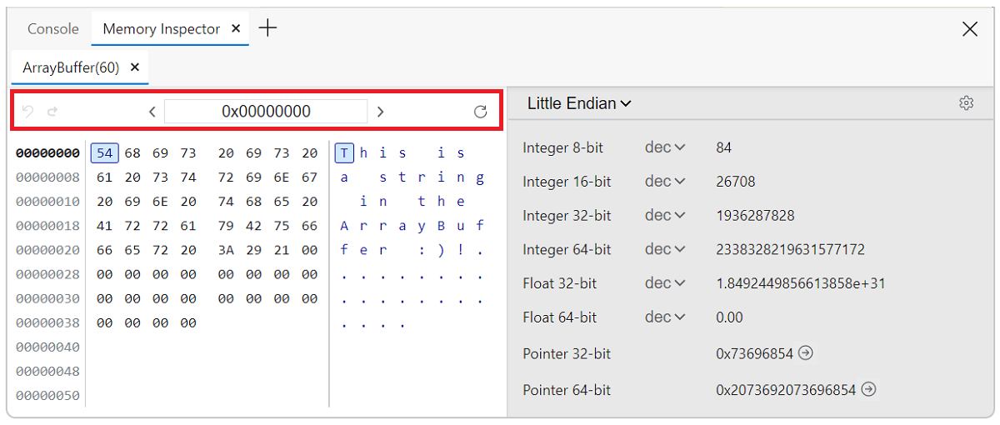
 
The **Enter address** text box shows the current byte address in hex format. You can change the value to jump to a new location in the memory buffer. Click in the text box and change the value to `0x00000008`. The Memory buffer immediately jumps to that byte address.

Memory buffers may be longer than one page. Use the left and right arrow buttons to navigate **Previous page** (**<**) and **Next page** (**>**), respectively. If there is only one page of memory buffer data, the arrows take you to the beginning and ending of the page.

Use the far-left history arrows to **Go back in address history** () and **Go forward in address history** ().

If the Memory buffer does not automatically update when stepping through values, click **Refresh** ().

### Memory buffer

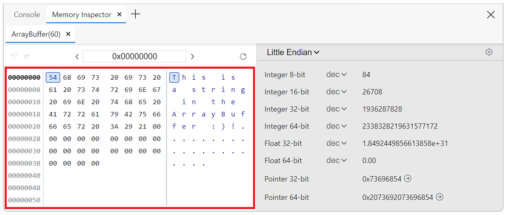
 
Reading from the left side of the panel, the **address** is displayed in hex format. The currently selected address is bold.

The **memory** is also shown in hex format, each byte separated by a space. The currently selected byte is highlighted. You can click on any byte or navigate using the arrow keys (left, right, up, and down).

The **ASCII representation** of the memory is shown on the right side of the panel. The highlighted character corresponds to the selected byte. You can click on any character or navigate using the arrow keys (left, right, up, and down).

### Value inspector

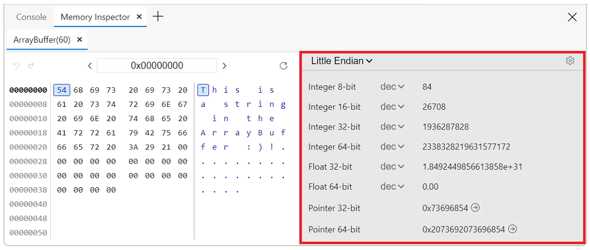
 
Click the current Endian type to switch between **Big endian** and **Little endian**.

The main area shows each value and interpretation based on the settings. By default, all values are shown.

Click **Toggle value type settings** () to select which value types to see in the inspector. This becomes the new default value type setting.

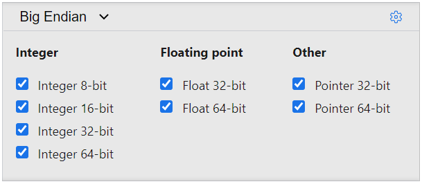

You can change the encoding view using the dropdown list. For integers you can choose from decimal `dec`, hexadecimal `hex`, and octal `oct`. For floats you can choose between decimal notation `dec` and scientific notation `sci`.

<!-- ====================================================================== -->
## Inspecting memory

Complete the following steps to debug a webpage in Memory Inspector.

1. In the **Navigation bar** change the address to `0x00000027`.

1. View the ASCII representation and the value interpretations. All values should be zero or empty.

    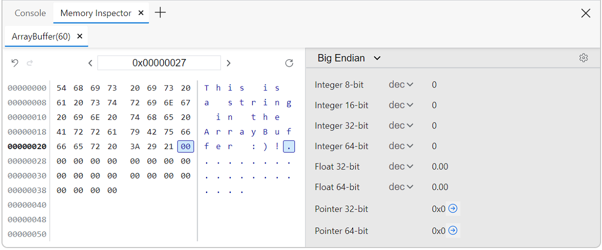

1. Click **Resume script execution** () or press **F8** or **Ctrl +\\** to step through the code.

    The ASCII representation and the value interpretations are updated.
    
    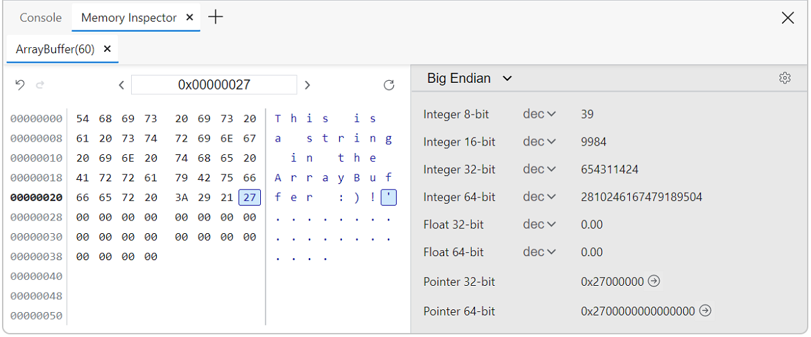

1. Click the **Jump to address** button () for **Pointer 32-bit** or **Pointer 64-bit** as needed to jump to the next active memory address. If next memory address is not available, the button is turned off () with the tooltip **Address out of memory range**.

1. Customize the **Value inspector** to show only floating point values. Click **Toggle value type settings** () and clear all checkboxes except the two **Floating point** values.
    
    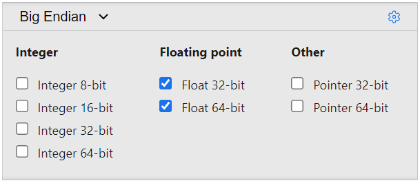

1. Click **Toggle value type settings** () to close the value type settings.

1. Use the dropdown lists to change the encoding from `dec` to `sci`. The value representations are updated.
    
    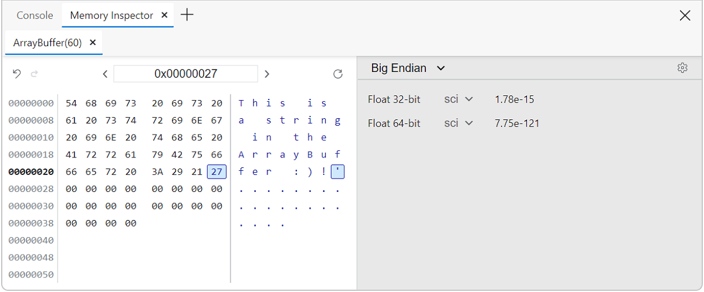
    
1. Explore the memory buffer using the keyboard or navigation bar.

1. Repeat steps **3** and **4** to observe value changes.

<!-- ====================================================================== -->
## WebAssembly memory inspection

For WebAssembly (Wasm) memory inspection, the process is similar to inspecting JavaScript memory.

1. Open the Wasm test site [Inspect Wasm memories (Memory in Wasm)](http://memory-inspector.glitch.me/demo-wasm.html). <!-- To do item: copy to Microsoft Repo and reference there -->

1. Open DevTools by pressing **F12** or **Ctrl+Shift+I** (Windows, Linux) or **Command+Option+I** (macOS).

1. Click **Sources** and open the `memory-write.wasm` file.

1. Set a breakpoint at the first line in the loop, hexadecimal value **0x03c**.

1. Refresh the page.

1. In the debugger pane under **Scope**, expand the **Module**.

    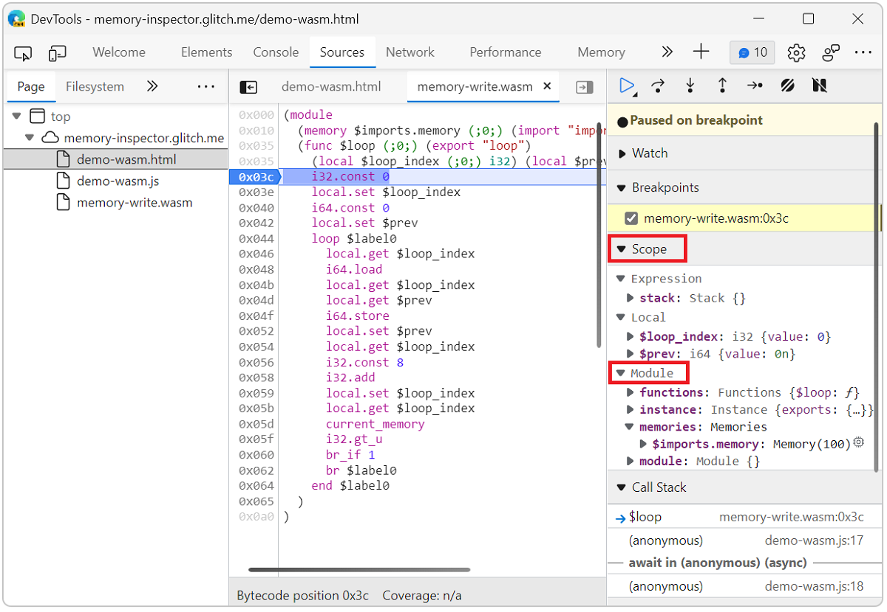

1. Click on the **Reveal in Memory Inspector panel** icon () at the end of the `$imports.memory` property line. 

    The Wasm ArrayBuffer opens in **Memory Inspector**.
    
    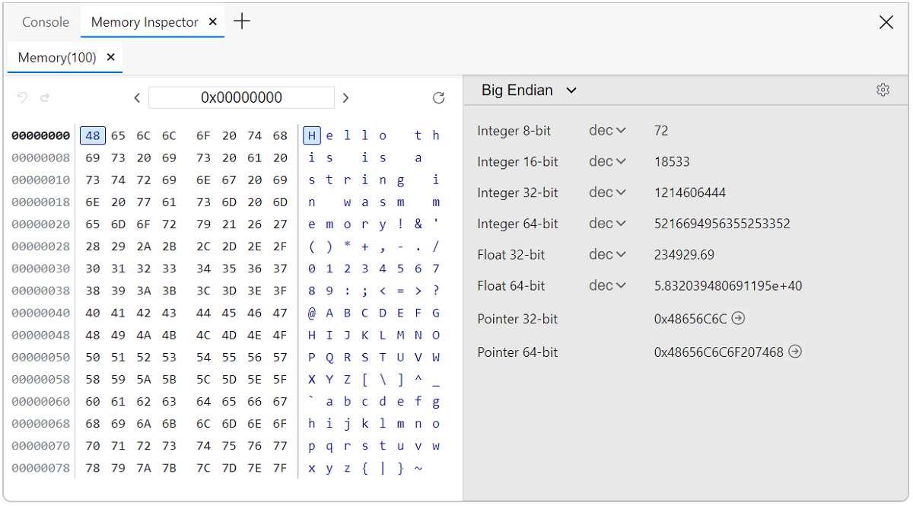

<!-- ====================================================================== -->
> [!NOTE]
> Portions of this page are modifications based on work created and [shared by Google](https://developers.google.com/terms/site-policies) and used according to terms described in the [Creative Commons Attribution 4.0 International License](https://creativecommons.org/licenses/by/4.0).
> The original page is found [here](https://developer.chrome.com/docs/devtools/memory-inspector/) and is authored by [Kim-Anh Tran](https://developer.chrome.com/authors/kimanh/) (Chrome DevTools).

This work is licensed under a [Creative Commons Attribution 4.0 International License](https://creativecommons.org/licenses/by/4.0).
