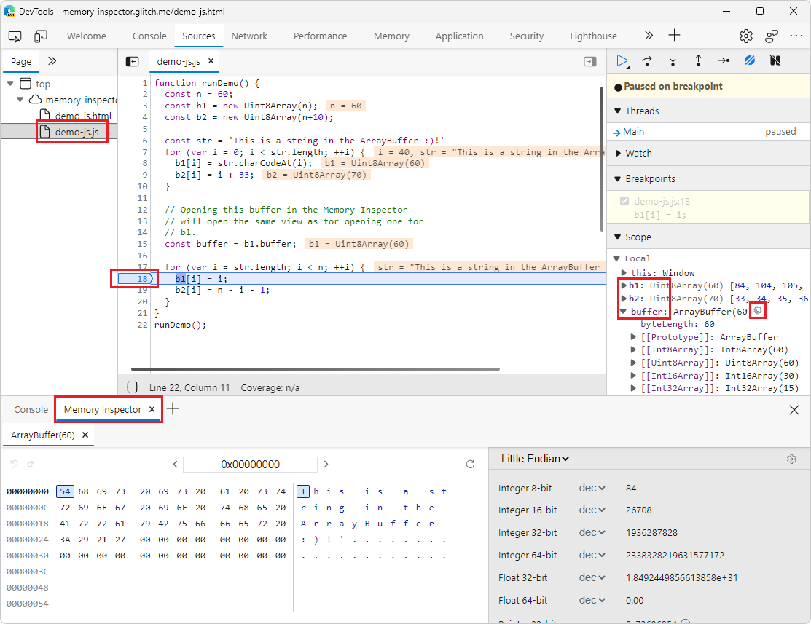

<!-- Copyright Kim-Anh Tran

   Licensed under the Apache License, Version 2.0 (the "License");
   you may not use this file except in compliance with the License.
   You may obtain a copy of the License at

       https://www.apache.org/licenses/LICENSE-2.0

   Unless required by applicable law or agreed to in writing, software
   distributed under the License is distributed on an "AS IS" BASIS,
   WITHOUT WARRANTIES OR CONDITIONS OF ANY KIND, either express or implied.
   See the License for the specific language governing permissions and
   limitations under the License.  -->

# Inspect a JavaScript ArrayBuffer using Memory Inspector

Use Memory Inspector to view a JavaScript ArrayBuffer and the resizable ArrayBuffer `WebAssembly.Memory`.<!-- OR should it say: WASM resizable `ArrayBuffer`. ? --> You can open Memory Inspector from the [DevTools menu](#open-memory-inspector-from-the-devtools-menu) or [while debugging](#open-memory-inspector-while-debugging).

<!-- ====================================================================== -->
## Open the test site in Microsoft Edge

1. Start Microsoft Edge.

1. Open the test site [https://microsoftedge.github.io/Demos/devtools-a11y-testing/](https://microsoftedge.github.io/Demos/devtools-a11y-testing/).

<!-- ====================================================================== -->
## Open Memory Inspector from the DevTools menu

1. To open DevTools press `F12` or `Ctrl`+`Shift`+`I`.

1. To open Memory Inspector select **More Tools** (**+**) > Memory Inspector

    

<!-- ====================================================================== -->
## Open Memory Inspector while debugging

1. Open the demo webpage [Inspect ArrayBuffers in JS (Memory in JS)](https://memory-inspector.glitch.me/demo-js.html). <!-- We need a microsoftedge.github.io with a JavaScript ArrayBuffer comparable to memory-inspector.glitch.me/demo-js.html -->

1. Open DevTools by pressing `F12` or `Ctrl`+`Shift`+`I`.

1. Click **Sources** and open the `demo-js.js` file.

1. Set a breakpoint at line **18** as shown in the following image.

    

1.	Refresh the webpage. It fails to display because the JavaScript stops processing at the breakpoint.

1.	In the right Debugger pane, click Scope.
6.	Open the Memory inspector using one of the following methods:
o	From the icon. Clicking on the icon next to the buffer property, or
o	From the context menu. Right click on the buffer property and select Reveal in Memory Inspector panel.

   The following list of steps is derived from the instructions on that webpage.

1. To open DevTools, right-click the webpage, and then select **Inspect**.  Or, press `Ctrl`+`Shift`+`I` (Windows, Linux) or `Command`+`Option`+`I` (macOS).  DevTools opens.

1. In DevTools, on the main toolbar, select the **Sources** tab.  If that tab isn't visible, click the **More tabs** () button, or else the **More Tools** () button.

1. In the **Page** tab on the left, select the file `demo-js.js`. <!-- `memory-write-wasm`-->

1. Set a breakpoint at line 18 in the loop body.

1. Refresh the webpage.

1. In the debugger, in the **Scope** section, expand **Local**.

   

1. Expand the **buffer** to reveal the **Module Scope**.

1. To the right of the **buffer** name, click the **Reveal in Memory Inspector panel** () icon.  Or, right-click the buffer, and then select **Reveal in Memory Inspector panel**.

1. The **Memory Inspector** tool opens in the Drawer.  In the **Memory Inspector** tool, examine the **buffer**.

1. To inspect **Uint8Array b2**, <!-- expand that node to see the buffer, and then select the **Memory** icon (or-->right-click **b2**, and then select **Reveal in Memory Inspector panel**.

1. To inspect **Uint8Array b1**, <!-- expand that node to see the buffer, and then select the **Memory** icon (or-->right-click **b1**, and then select **Reveal in Memory Inspector panel**.  That re-focuses on the **Memory** tab of the first buffer.

1. In the debugger, step, and see updates to buffers in the **Memory Inspector** tool.

<!-- ====================================================================== -->
> [!NOTE]
> Portions of this page are modifications based on work created and [shared by Google](https://developers.google.com/terms/site-policies) and used according to terms described in the [Creative Commons Attribution 4.0 International License](https://creativecommons.org/licenses/by/4.0).
> The original page is found [here](https://developer.chrome.com/blog/memory-inspector/) and is authored by [Kim-Anh Tran](https://developer.chrome.com/authors/kimanh/) (Chrome DevTools).

This work is licensed under a [Creative Commons Attribution 4.0 International License](https://creativecommons.org/licenses/by/4.0).
