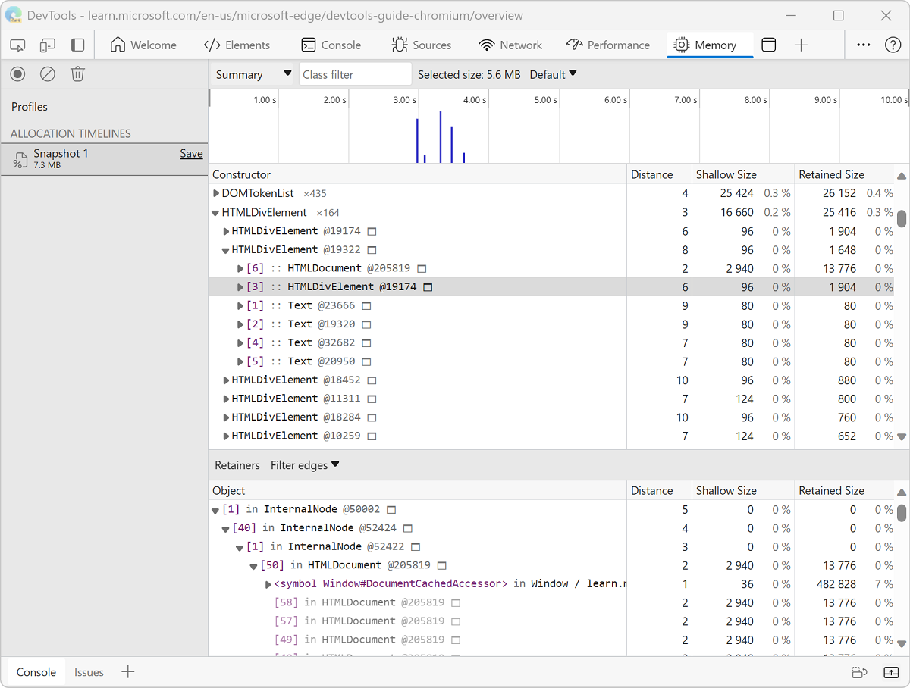

<!-- Copyright Meggin Kearney

   Licensed under the Apache License, Version 2.0 (the "License");
   you may not use this file except in compliance with the License.
   You may obtain a copy of the License at

       https://www.apache.org/licenses/LICENSE-2.0

   Unless required by applicable law or agreed to in writing, software
   distributed under the License is distributed on an "AS IS" BASIS,
   WITHOUT WARRANTIES OR CONDITIONS OF ANY KIND, either express or implied.
   See the License for the specific language governing permissions and
   limitations under the License. -->
# Use Allocation instrumentation on timeline ("Allocations on timeline" profiling type)

<!-- title in other repo:
How to Use the Allocation Profiler Tool -->

In the **Memory** tool, use the **Allocations on timeline** option button (profiling type) to find objects that aren't being properly garbage-collected, and continue to retain memory.

See also:
* [Identify JS heap memory leaks ("Allocations on timeline" profiling type)](./index.md#identify-js-heap-memory-leaks-allocations-on-timeline-profiling-type) in _Fix memory problems_.

<!-- ====================================================================== -->
## How Allocation instrumentation on timeline works

The **Memory** tool's **Allocations on timeline** option button (profiling type) combines the detailed snapshot information of the [heap profiler](heap-snapshots.md) with the incremental updating and tracking of the **Performance** tool.  Similarly, tracking heap allocation for objects involves starting a recording, performing a sequence of actions, and stopping the recording for analysis.

<!--todo: add profile memory problems (heap profiler) section when available  -->
<!--todo: add profile evaluate performance (Performance tool) section when available  -->

**Allocations on timeline** takes heap snapshots periodically throughout the recording (as frequently as every 50 ms) and one final snapshot at the end of the recording.

The number after the `@` is an object ID that persists across the multiple snapshots taken during the recording session.  The persistent object ID enables precise comparison between heap states.  Objects are moved during garbage collections, so displaying the address of an object makes no sense.

<!-- ====================================================================== -->
## Enable Allocation Instrumentation on Timeline

To begin using **Allocations on timeline**:

1. Open a webpage, such as the [Detached Elements demo webpage](https://microsoftedge.github.io/Demos/detached-elements/), in a new window or tab.

1. Right-click the webpage, and then select **Inspect**.  Or, press **Ctrl+Shift+I** (Windows, Linux) or **Command+Option+I** (macOS).

   DevTools opens.

1. In DevTools, in the **Activity Bar**, select the **Memory** () tool.

   If that tab isn't visible, click the **More Tools** () button, and then select **Memory**.  The **Memory** tool opens:

   

1. Select the **Allocations on timeline** option button (profiling type).

   If the **Allocations on timeline** option button (profiling type) isn't shown, because a profile is already displayed, in the upper left, click **Profiles** ().

1. At the bottom of the **Memory** tool, click the **Start** button.

1. Interact with the webpage; for example, click the **Fast traffic** button and then the **Stop** button in the demo webpage.  Depending on what you are trying to analyze, you can either refresh the page, interact with the page, or just let the page run.

1. In the upper left of the **Memory** tool, click the **Stop recording heap profile** () button.

   A new **Snapshot** is created in the **Allocation timelines** section of the **Profiles** list:

   

<!-- ====================================================================== -->
## Read a heap allocation timeline

The heap allocation timeline shows where objects are being created and identifies the retaining path.  In the following figure, the bars at the top indicate when new objects are found in the heap.

The height of each bar corresponds to the size of the recently allocated objects, and the color of the bars indicate whether or not those objects are still live in the final heap snapshot.  Blue bars indicate objects that are still live at the end of the timeline, Gray bars indicate objects that were allocated during the timeline, but have since been garbage collected.

<!-- In the following figure, an action was performed 3 times.  The sample program caches five objects, so the last five blue bars are expected.  But the left-most blue bar indicates a potential problem. -->
<!-- todo: redo figure 4 with multiple click actions -->

You can use the sliders in the timeline above to zoom into that particular snapshot and review the objects that were recently allocated at that point:

Clicking on a specific object in the heap shows the retaining tree in the bottom portion of the heap snapshot.  Examining the retaining path to the object should give you enough information to understand why the object was not collected, and you should make the necessary code changes to remove the unnecessary reference.

<!-- ====================================================================== -->
## View memory allocation by function

You can view memory allocation by JavaScript function.  See [Investigate memory allocation by function ("Allocation sampling" profiling type)](./index.md#investigate-memory-allocation-by-function-allocation-sampling-profiling-type).

<!-- ====================================================================== -->
> [!NOTE]
> Portions of this page are modifications based on work created and [shared by Google](https://developers.google.com/terms/site-policies) and used according to terms described in the [Creative Commons Attribution 4.0 International License](https://creativecommons.org/licenses/by/4.0).
> The original page is found [here](https://developer.chrome.com/docs/devtools/memory-problems/allocation-profiler/) and is authored by [Meggin Kearney](https://developers.google.com/web/resources/contributors#meggin-kearney) (Technical Writer).

This work is licensed under a [Creative Commons Attribution 4.0 International License](https://creativecommons.org/licenses/by/4.0).
