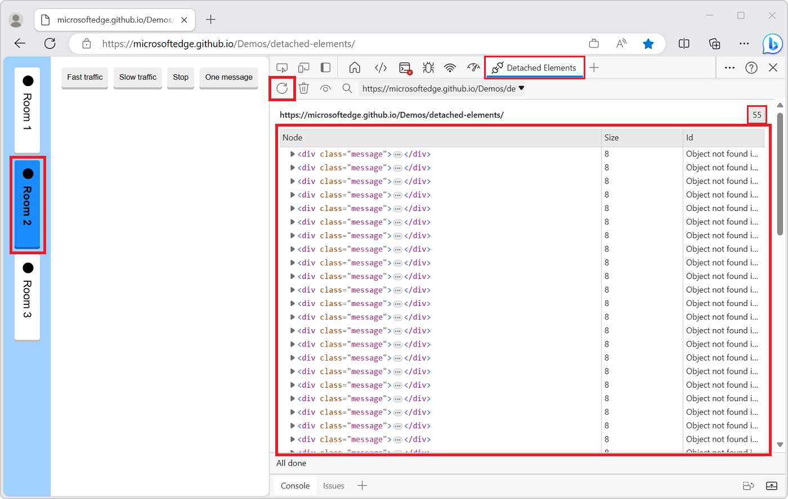
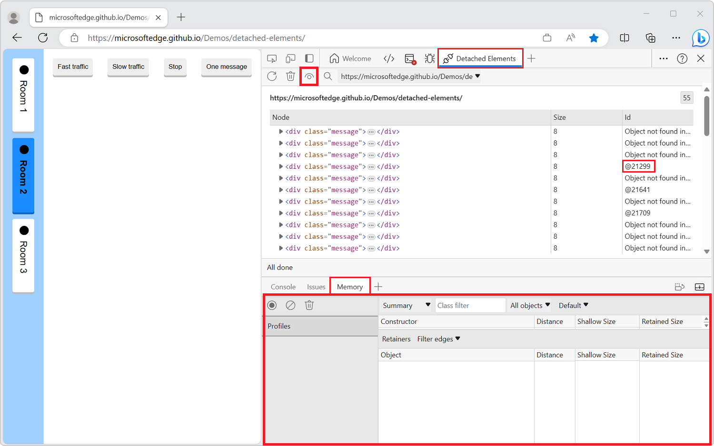
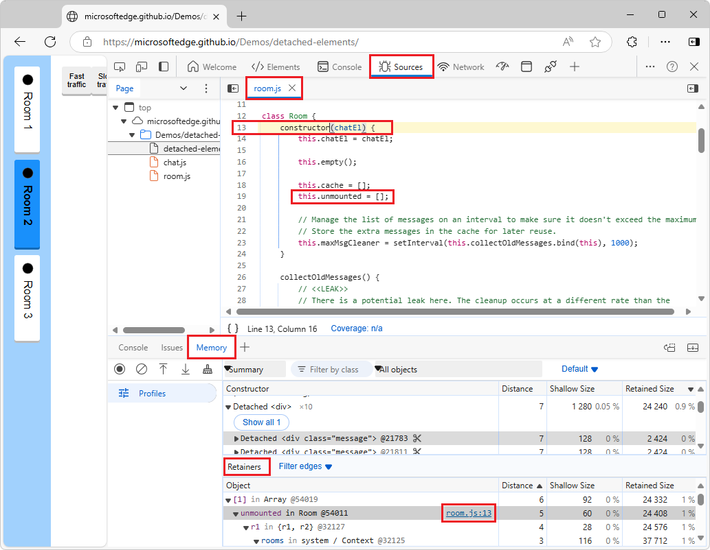

# Debug DOM memory leaks with the Detached Elements feature

<!-- article covers both tools during Oct 17, 2024 - Jan 15, 2025, then remove Detached Elements tool content & tabset -->

<!-- todo: global: red box on DE tab and Mem tab -->

The **Detached Elements** feature finds and displays all of the detached elements on a webpage.

To increase the performance of your webpage, use the **Detached elements** feature to find detached elements that the browser can't garbage-collect, and then locate the JavaScript object that's still referencing the detached element.  Then change your JavaScript to release the element, to reduce the number of detached elements on your webpage, increasing webpage performance and responsiveness.

A memory leak can occur in your application when an element is no longer attached to the Document Object Model (DOM) tree, but is still referenced by some JavaScript running on the webpage. These elements are called *detached elements*.  For the browser to garbage-collect (GC) the detached element, the element must not be referenced from the DOM tree or from JavaScript code.

Memory issues affect webpage performance, including memory leaks, memory bloat, and frequent garbage collections.  Symptoms for your users include:

*  The performance of a webpage gets progressively worse over time.
*  The performance of a webpage is consistently bad.
*  The performance of a webpage is delayed or appears to pause frequently.

See also:
* [Discover detached DOM tree memory leaks with Heap Snapshots](index.md#discover-detached-dom-tree-memory-leaks-with-heap-snapshots) in _Fix memory problems_.
* [Record heap snapshots using the Memory tool](./heap-snapshots.md)

<!-- ------------------------------ -->
#### High-level strategy

1. Open a webpage to analyze.
1. Open the **Detached Elements** feature.
1. Get detached elements.
1. Run GC.<!-- todo: why?  what's the difference between "getting detached elements" vs. "doing GC on that and getting a list of detached elements"?? -->
1. Analyze a particular detached element and its JavaScript, to identify the culprit node in a detached tree that is causing the entire tree to be retained.

After getting an initial list of detached elements, you'll trigger garbage collection (GC) in the browser, in order to see a detached element and then analyze it via heap snapshot and inspect JavaScript code that's still referencing the detached element.  You'll find a detached element that cannot be garbage-collected, so that you can analyze the element to identify the JavaScript code running on the webpage that is still referencing the detached element.  The analysis will take a heap snapshot and populate the **ID** of the detached element with its location in the heap.

When you select **Collect garbage**, the browser runs garbage collection.  When you select **Get Detached Elements**, the **Detached Elements** feature displays all detached elements that cannot be garbage collected.  These detached elements may be memory leaks if they aren't going to be reused by the application.

For the detached element that can't be garbage-collected, use the **Analyze** () button<!-- todo: check ui for both tools --> in the **Detached Elements** feature to identify the JavaScript code running on the webpage that is still referencing the detached element.  The **Analyze** button takes a heap snapshot and populates the **ID** of the detached element with its location in the heap.

After running GC, identify the DOM node causing others to be retained.  Because the DOM is a fully connected graph, when one DOM node is retained in memory by JavaScript it can cause other DOM nodes to be retained with it.  You identify the culprit node in a detached tree that is causing the entire tree to be retained.

<!-- ------------------------------ -->
#### Video: Debug memory leaks with the Microsoft Edge Detached Elements tool

<!-- ------------------------------ -->
#### Locations of the Detached Elements feature

The **Detached Elements** feature is located in two tools:
* The **Detached elements** profiling type option button in the **Memory** tool.
* The **Detached Elements** tool.  This tool will be removed.

The **Detached Elements** tool is being deprecated.  Starting with Microsoft Edge 130, the **Detached Elements** tool has a message stating that the tool is deprecated; instead, in the **Memory** tool, in the initial **Select profiling type** screen, select the **Detached elements** option button.  The Edge-only Chrome DevTools Protocol (CDP) function `EdgeDOMMemory.getDetachedNodesIds` continues to work, but use `DOM.getDetachedDomNodes` instead.

In Microsoft Edge 133, the **Detached Elements** tool will be removed; instead, in the **Memory** tool, in the initial **Select profiling type** screen, select the **Detached elements** option button.  The CDP function `EdgeDOMMemory.getDetachedNodesIds` will be removed; use `DOM.getDetachedDomNodes` instead.

<!-- ---------- -->
###### Differences between the Detached Elements feature in the two tools

<!-- ---------- -->
##### [Memory tool](#tab/memory-tool)

In the **Memory tool**, the detached element is not linked to the retainer path.

The workflow is simpler.  Doesn't need to do that linking, because it shows the detached node exactly as it's represented in the DOM.

<!-- ---------- -->
##### [Detached Elements tool](#tab/detached-elements-tool)

In the **Detached Elements** tool, the detached element is linked to the retainer path in the **Memory** tool.

Uses a complex workflow.  The **Detached Elements** tool shows detached nodes, but has to also take a heap snapshot, and then shows the **Memory** tool in the **Drawer**, and then links between the detached node in the **Detached Elements** tool and the detached node in the heap snapshot in the **Memory** tool in the **Drawer**,

---

<!-- ====================================================================== -->
## Open the demo and tool, get detached elements, and analyze a detached element

To analyze a detached element by using the **Detached Elements** demo webpage:

<!-- ---------- -->
##### [Memory tool](#tab/memory-tool)

<!-- todo: 2: rewrite ui steps for new tool/approach -->

1. Open the [Detached Elements demo application](https://microsoftedge.github.io/Demos/detached-elements/) in a new window or tab.

1. To open DevTools, right-click the webpage, and then select **Inspect**.  Or, press **Ctrl+Shift+I** (Windows, Linux) or **Command+Option+I** (macOS).  DevTools opens.

1. In DevTools, in the **Activity Bar**, click the **Memory** tab.  If that tab isn't visible, click the **More Tools** () button, and then select **Memory**.  The **Memory** tool opens:

   

1. Select the **Detached elements** option button.

1. Click the **Start** button.

1. Remaining steps. _rewrite the steps in the "Detached Elements tool" tab, copy to here, then modify for Memory tool_<!-- todo -->

<!-- ---------- -->
##### [Detached Elements tool](#tab/detached-elements-tool)

<!-- todo: 1: walk through these steps, clarify as needed, get familiar w old tool/steps - reduce wordcount in this numbered list -->

1. Open the [Detached Elements demo application](https://microsoftedge.github.io/Demos/detached-elements/) in a new window or tab.

1. To open DevTools, right-click the webpage, and then select **Inspect**.  Or, press **Ctrl+Shift+I** (Windows, Linux) or **Command+Option+I** (macOS).  DevTools opens.

1. In DevTools, in the **Activity Bar**, select the **Detached Elements** tab.  If that tab isn't visible, click the **More Tools** () button:

   

1. Click the **Get Detached Elements** () button.

1. In the demo application, make sure that the **Room 1** button is selected.

1. In the demo application, click the **Fast traffic** button.

1. After some messages are generated and displayed in the demo application, click the demo's **Stop** button:

   

1. Click the **Room 2** button:

1. In the **Detached Elements** feature, click the **Get Detached Elements** () icon.

   The **Detached Elements** feature displays all of the detached elements of the webpage.  When you switch to **Room 2** in the demo application, the messages that were generated in **Room 1** are no longer attached to the DOM, but they are still referenced by JavaScript:

   

   Next, trigger garbage collection, to analyze the JavaScript for a detached element, as follows.

1. In the **Detached Elements** feature, click the **Collect garbage** () icon.

1. Click the **Get Detached Elements** () icon.

   <!-- todo: what's the new, desired, beneficial state?  what have we accomplished now? -->
   You can now see XYZ.   Next, identify the JavaScript code that references a particular detached element, as follows.

1. In the **Detached Elements** feature, click the **Analyze** () icon.

   The **Memory** tool opens in the **Quick View** toolbar, at the bottom of DevTools:

   

1. In the **Detached Elements** tool, in the **Id** column, click **@21299**, which is the ID of one of the `
` elements.

   The **Memory** tool automatically selects the object in the heap that is referencing the detached element.  These objects are called _retainers_, and are listed in the **Retainers** tab:

   

1. In the **Memory** tool, in the **Retainers** tab, in the **[2] in Array @58525** retainer entry, in the **unmounted in Room @57707** retainer sub-entry, click the link **room.js:13**.

   The **Sources** tool opens in the **Activity Bar** and shows line 13 of the file **room.js**:

   <!-- todo: redo png to show line 13 -->

   Scroll down to line 49:<!-- todo: why? -->

   

   In the `hide()` function of **room.js**, the JavaScript code of the demo application adds each message in the room to an `unmounted` array. The `unmounted` array is the object that is referencing the detached element.

   In the JavaScript code, you have now identified the retainer that is preventing the detached element from being garbage-collected by the browser.  Next, identify the DOM node causing others to be retained, as follows.

1. Click the **Detach Elements** () icon to destroy the parent-child links inside the detached tree.

1. Click the **Collect garbage** () icon.

   Parent-child links are removed inside the detached tree:

   

---

You've found detached elements that the browser can't garbage-collect, and located the JavaScript object that's still referencing the detached element.  You can then change the JavaScript code to release the element, to reduce the number of detached elements on the webpage, increasing webpage performance and responsiveness.

<!-- ====================================================================== -->
## Change the selected target to a different origin
<!-- optional detailed UI after the above standard steps -->

To check for detached elements from different origins or frames by using the **Selected target** dropdown list:

<!-- ---------- -->
##### [Memory tool](#tab/memory-tool)

<!-- todo: rewrite after finalize DE tab content -->

1. Click the **Selected target** dropdown list:

   

1. Select a different origin.

<!-- ---------- -->
##### [Detached Elements tool](#tab/detached-elements-tool)

1. Click the **Selected target** dropdown list:

   

1. Select a different origin.

---

The new origin is displayed in the **Detached Elements** feature.

   
<!-- ====================================================================== -->
## Detached elements vs. memory leaks
<!-- todo: move to top?  -->

Detached elements aren't always an indication of a memory leak, and memory leaks aren't always caused by detached elements.  Memory leaks depend on the context of your application.

<!-- ------------------------------ -->
#### Re-attaching elements

To use the demo webpage, you find detached elements that can't be garbage-collected by the browser, and you identify the JavaScript that's retaining the detached elements.  However, in the context of the demo webpage, it makes sense to retain the list of chat messages, so that if a user switches back to **Room 1**, the message log is preserved.

The following image shows detached elements in the form of messages that are reattached when a user navigates from **Room 2** back to **Room 1**:

<!-- ---------- -->
##### [Memory tool](#tab/memory-tool)

<!-- ---------- -->
##### [Detached Elements tool](#tab/detached-elements-tool)

---

Similarly, a feed in social media might detach elements as users scroll past them, and reattach them to the DOM when users scroll back up.

<!-- ------------------------------ -->
#### Long-running apps and unmounting components

Be sure to unmount components.  For long-running apps, small memory leaks of only a few kilobytes can noticeably degrade performance over time.  For webpages that use the React framework, React maintains a virtualized copy of the DOM.  Failing to properly unmount components can potentially lead to an application leaking large parts of the virtual DOM.

<!-- ====================================================================== -->
## Reporting issues

If you find issues with how the **Detached Elements** feature works, [contact the Microsoft Edge DevTools team](../contact.md) to send feedback about the **Detached Elements** feature and memory leak debugging.

<!-- ====================================================================== -->
## See also
<!-- todo: all links in article -->

* [Discover detached DOM tree memory leaks with Heap Snapshots](index.md#discover-detached-dom-tree-memory-leaks-with-heap-snapshots) in _Fix memory problems_.
* [Record heap snapshots using the Memory tool](./heap-snapshots.md)

Demo:
* [Detached Elements demo application](https://microsoftedge.github.io/Demos/detached-elements/)
* [MicrosoftEdge/Demos > detached-elements](https://github.com/MicrosoftEdge/Demos/tree/main/detached-elements) repo folder, to view the source files for the Detached Elements demo.
