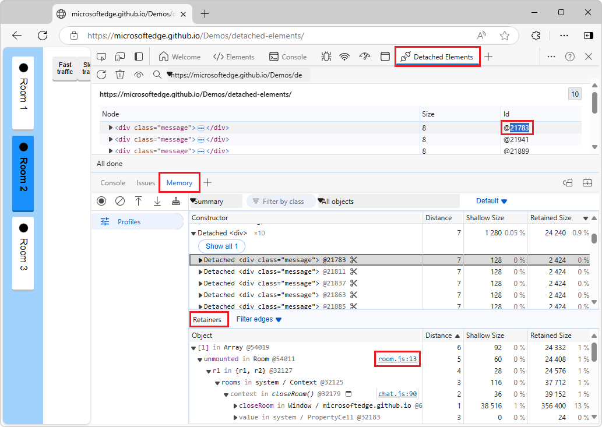
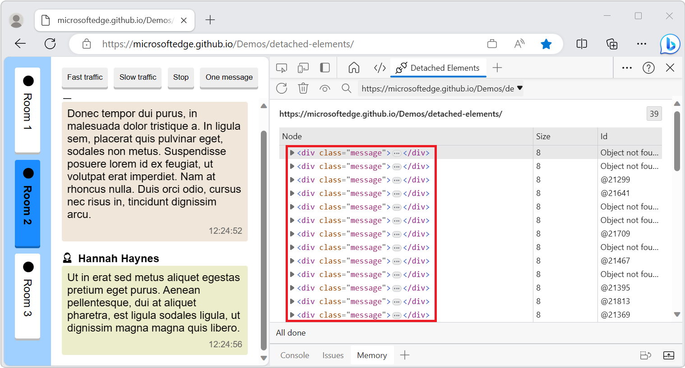

# Debug DOM memory leaks with the Detached Elements profiling type

<!-- article covers both tools during Oct 17, 2024 - Jan 15, 2025, then remove Detached Elements tool content & tabset -->

> [!IMPORTANT]
> The **Detached Elements** tool is being deprecated.  Starting with Microsoft Edge 130, the **Detached Elements** tool has a message stating that the tool is deprecated; instead, in the **Memory** tool, in the initial **Select profiling type** screen, select the **Detached elements** option button.  The Edge-only Chrome DevTools Protocol (CDP) function `EdgeDOMMemory.getDetachedNodesIds` continues to work, but use `DOM.getDetachedDomNodes` instead.
> 
> In Microsoft Edge 133, the **Detached Elements** tool will be removed; instead, in the **Memory** tool, in the initial **Select profiling type** screen, select the **Detached elements** option button.  The CDP function `EdgeDOMMemory.getDetachedNodesIds` will be removed; use `DOM.getDetachedDomNodes` instead.

Use the **Detached elements** profiling type in the **Memory** tool to find detached elements that the browser cannot garbage-collect, and locate the JavaScript object that is still referencing the detached element.  By changing your JavaScript to release the element, you reduce the number of detached elements on your page.

A memory leak can occur in your application when an element is no longer attached to the Document Object Model (DOM) tree, but is still referenced by some JavaScript running on the page. These elements are called *detached elements*.  For the browser to garbage-collect (GC) the detached element, the element must not be referenced from the DOM tree or from JavaScript code.

For more information about heap snapshots and detached elements, read [Discover detached DOM tree memory leaks with Heap Snapshots](index.md#discover-detached-dom-tree-memory-leaks-with-heap-snapshots).

As explained in [Fix memory problems](index.md), memory issues affect page performance, including memory leaks, memory bloat, and frequent garbage collections.  Symptoms for your users include:

*  The performance of a page gets progressively worse over time.
*  The performance of a page is consistently bad.
*  The performance of a page is delayed or appears to pause frequently.

<!-- ------------------------------ -->
#### Video: Debug memory leaks with the Microsoft Edge Detached Elements tool

<!-- ====================================================================== -->
## Differences between the Detached Elements feature in the two tools

##### [Memory tool](#tab/memory-tool)

In the **Memory tool**, the detached element is not linked to the retainer path.

The workflow is simpler.  Doesn't need to do that linking, because it shows the detached node exactly as it's represented in the DOM.

##### [Detached Elements tool](#tab/detached-elements-tool)

In the **Detached Elements** tool, the detached element is linked to the retainer path in the **Memory** tool.

Uses a complex workflow.  The **Detached Elements** tool shows detached nodes, but has to also take a heap snapshot, and then shows the **Memory** tool in the **Drawer**, and then links between the detached node in the **Detached Elements** tool and the detached node in the heap snapshot in the **Memory** tool in the **Drawer**,

---

<!-- ====================================================================== -->
## Open the Detached Elements feature

To open the demo page and view its detached elements:

##### [Memory tool](#tab/memory-tool)

1. Open the [Detached Elements demo application](https://microsoftedge.github.io/Demos/detached-elements/) in a new window or tab.

1. To open DevTools, right-click the webpage, and then select **Inspect**.  Or, press **Ctrl+Shift+I** (Windows, Linux) or **Command+Option+I** (macOS).  DevTools opens.

1. In DevTools, in the **Activity Bar**, click the **Memory** tab.  If that tab isn't visible, click the **More Tools** () button, and then select **Memory**.  The **Memory** tool opens:

   

1. Select the **Detached elements** option button.

1. Click the **Start** button.

##### [Detached Elements tool](#tab/detached-elements-tool)

1. Open the [Detached Elements demo application](https://microsoftedge.github.io/Demos/detached-elements/) in a new window or tab.

1. To open DevTools, right-click the webpage, and then select **Inspect**.  Or, press **Ctrl+Shift+I** (Windows, Linux) or **Command+Option+I** (macOS).  DevTools opens.

1. In DevTools, in the **Activity Bar**, select the **Detached Elements** tab.  If that tab isn't visible, click the **More Tools** () button:

   

---

<!-- ====================================================================== -->
## Get detached elements

The **Get Detached Elements** () button in the **Detached Elements** feature finds and displays all of the detached elements on a web page.

To find detached elements:

##### [Memory tool](#tab/memory-tool)

1. In the demo application, make sure that the **Room 1** button is selected.

1. In the demo application, click the **Fast traffic** button.

1. After some messages are generated and displayed in the demo application, click the demo's **Stop** button:

   

1. Click the **Room 2** button:

1. In the **Detached Elements** feature, click the **Get Detached Elements** () icon.

   The **Detached Elements** feature displays all of the detached elements of the page.  When you switch to **Room 2** in the demo application, the messages that were generated in **Room 1** are no longer attached to the DOM, but they are still referenced by JavaScript:

   

##### [Detached Elements tool](#tab/detached-elements-tool)

1. In the demo application, make sure that the **Room 1** button is selected.

1. In the demo application, click the **Fast traffic** button.

1. After some messages are generated and displayed in the demo application, click the demo's **Stop** button:

   

1. Click the **Room 2** button:

1. In the **Detached Elements** feature, click the **Get Detached Elements** () icon.

   The **Detached Elements** feature displays all of the detached elements of the page.  When you switch to **Room 2** in the demo application, the messages that were generated in **Room 1** are no longer attached to the DOM, but they are still referenced by JavaScript:

   

---

<!-- ====================================================================== -->
## Trigger garbage collection

Next, trigger garbage collection (GC) in the browser:

##### [Memory tool](#tab/memory-tool)

1. In the **Detached Elements** feature, click the **Collect garbage** () icon.

1. Click the **Get Detached Elements** () icon.

##### [Detached Elements tool](#tab/detached-elements-tool)

1. In the **Detached Elements** feature, click the **Collect garbage** () icon.

1. Click the **Get Detached Elements** () icon.

---

When you select **Collect garbage**, the browser runs garbage collection. When you select **Get Detached Elements**, the **Detached Elements** feature displays all detached elements that cannot be garbage collected. These detached elements may be memory leaks if they aren't going to be reused by the application.

<!-- ====================================================================== -->
## Identify the JavaScript code that retains detached elements

Once you have found a detached element that cannot be garbage-collected, you can use the **Analyze** () button in the **Detached Elements** feature to identify the JavaScript code running on the page that is still referencing the detached element. The **Analyze** button takes a heap snapshot and populates the **ID** of the detached element with its location in the heap.

For more information about heap snapshots, read [Record heap snapshots using the Memory tool](heap-snapshots.md).

To identify the JavaScript code that references a detached element:

##### [Memory tool](#tab/memory-tool)

1. In the **Detached Elements** feature, click the **Analyze** () icon.

   The **Memory** tool opens in the **Quick View** toolbar, at the bottom of DevTools:

   

1. From the **Detached Elements** feature, select the **Id** field of a detached element.

   The **Memory** tool automatically selects the object in the heap that is referencing the detached element. We call these objects **Retainers**:

   

1. In the **Memory** tool, select the link **room.js:13**.

   The **Sources** tool opens in the **Activity Bar** and shows line 13 of the file **room.js**.

1. In the `hide()` function of **room.js**, the JavaScript code of the demo application adds each message in the room to an `unmounted` array. The `unmounted` array is the object that is referencing the detached element:

   

##### [Detached Elements tool](#tab/detached-elements-tool)

1. In the **Detached Elements** feature, click the **Analyze** () icon.

   The **Memory** tool opens in the **Quick View** toolbar, at the bottom of DevTools:

   

1. From the **Detached Elements** feature, select the **Id** field of a detached element.

   The **Memory** tool automatically selects the object in the heap that is referencing the detached element. We call these objects **Retainers**:

   

1. In the **Memory** tool, select the link **room.js:13**.

   The **Sources** tool opens in the **Activity Bar** and shows line 13 of the file **room.js**.

1. In the `hide()` function of **room.js**, the JavaScript code of the demo application adds each message in the room to an `unmounted` array. The `unmounted` array is the object that is referencing the detached element:

   

---

You have now identified the retainer that is preventing the detached element from being garbage-collected by the browser.

<!-- ====================================================================== -->
## Identify the DOM node causing others to be retained

Because the DOM is a fully connected graph, when one DOM node is retained in memory by JavaScript it can cause other DOM nodes to be retained with it.

To identify the culprit node in a detached tree that is causing the entire tree to be retained:

##### [Memory tool](#tab/memory-tool)

1. Click the **Detach Elements** () icon to destroy the parent-child links inside the detached tree.

1. Click the **Collect garbage** () icon.

   Parent-child links are removed inside the detached tree:

   

##### [Detached Elements tool](#tab/detached-elements-tool)

1. Click the **Detach Elements** () icon to destroy the parent-child links inside the detached tree.

1. Click the **Collect garbage** () icon.

   Parent-child links are removed inside the detached tree:

   

---

<!-- ====================================================================== -->
## Change the selected target to a different origin

To check for detached elements from different origins or frames by using the **Selected target** dropdown list:

##### [Memory tool](#tab/memory-tool)

1. Click the **Selected target** dropdown list:

   

1. Select a different origin.

##### [Detached Elements tool](#tab/detached-elements-tool)

1. Click the **Selected target** dropdown list:

   

1. Select a different origin.

---

The new origin is displayed in the **Detached Elements** feature.

   
<!-- ====================================================================== -->
## Additional considerations

When looking for memory leaks, remember that leaks can depend on the context of your application. For the demo application, you found detached elements that could not be garbage collected by the browser, and you identified the JavaScript that's retaining the detached elements. However, in the context of the demo application, it makes sense to retain the list of chat messages, so that if a user switches back to **Room 1**, the message log is preserved.

The following image shows detached elements in the form of messages that are reattached when a user navigates from **Room 2** back to **Room 1**:

##### [Memory tool](#tab/memory-tool)

##### [Detached Elements tool](#tab/detached-elements-tool)

---

Similarly, a feed in social media might detach elements as users scroll past them, and reattach them to the DOM when users scroll back up. Detached elements aren't always an indication of a memory leak, and memory leaks aren't always caused by detached elements.

For long-running apps, small memory leaks of only a few kilobytes can noticeably degrade performance over time. Web developers who use the React framework know that React maintains a virtualized copy of the DOM. Failing to properly unmount components can potentially lead to an application leaking large parts of the virtual DOM.

This demo app and its leaks are artificial. Test the Detached Elements tool on your production website or app. If you find potential problems with the Detached Elements tool, [contact the Microsoft Edge DevTools team](../contact.md) to send feedback about the **Detached Elements** feature and memory leak debugging.

<!-- ====================================================================== -->
## See also
<!-- todo: all links in article -->

* [Detached Elements demo application](https://microsoftedge.github.io/Demos/detached-elements/)
* [MicrosoftEdge/Demos > detached-elements](https://github.com/MicrosoftEdge/Demos/tree/main/detached-elements) repo folder, to view the source files for the Detached Elements demo.
