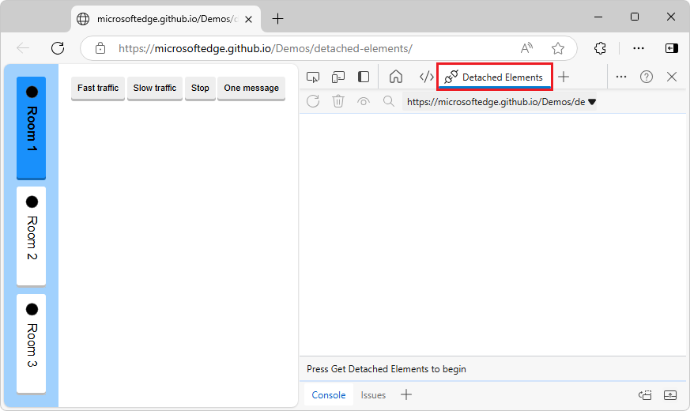

# Debug DOM memory leaks by using the Detached Elements tool

The **Detached Elements** tool is one way to find and display all of the detached elements on a webpage.  For additional ways to assess memory leaks, see, see [Tools for investigating detached elements](./index.md#tools-for-investigating-detached-elements) in _Fix memory problems_.

To increase the performance of your webpage, find detached elements that the browser can't garbage-collect, and then locate the JavaScript object that's still referencing the detached element.  Then change your JavaScript to release the element, to reduce the number of detached elements on your webpage, increasing webpage performance and responsiveness.

The **Detached Elements** tool, showing retainers in the **Memory** tool, with links to open the JavaScript code in the **Sources** tool:

<!-- ------------------------------ -->
#### The Detached Elements tool is being deprecated

The **Detached Elements** tool is being deprecated.  Starting with Microsoft Edge 130, the **Detached Elements** tool has a message stating that the tool is deprecated; instead, in the **Memory** tool, in the initial **Select profiling type** screen, select the **Detached elements** option button.  The Edge-only Chrome DevTools Protocol (CDP) function `EdgeDOMMemory.getDetachedNodesIds` continues to work, but use `DOM.getDetachedDomNodes` instead.

In Microsoft Edge 133, the **Detached Elements** tool will be removed; instead, in the **Memory** tool, in the initial **Select profiling type** screen, select the **Detached elements** option button.  The CDP function `EdgeDOMMemory.getDetachedNodesIds` will be removed; use `DOM.getDetachedDomNodes` instead.

See also:
* [Tools for investigating detached elements](./index.md#tools-for-investigating-detached-elements) in _Fix memory problems_ - comparison of tools to view detached elements.
   * [Find DOM tree memory leaks ("Detached elements" profiling type)](./index.md#find-dom-tree-memory-leaks-detached-elements-profiling-type) in _Fix memory problems_.
   * [Find DOM tree memory leaks ("Heap snapshot" profiling type > Detached)](./index.md#find-dom-tree-memory-leaks-heap-snapshot-profiling-type--detached) in _Fix memory problems_.
   * [Record heap snapshots using the Memory tool](./heap-snapshots.md)

<!-- ------------------------------ -->
#### Video: Debug memory leaks with the Microsoft Edge Detached Elements tool

<!-- ------------------------------ -->
#### Strategy to fix memory leaks

1. Open a webpage to analyze.
1. Open the **Detached Elements** tool.
1. Run garbage collection, removing all nodes that are no longer referenced by a JavaScript object.
1. Get all detached elements, which couldn't be garbage-collected.
1. Analyze a particular detached element and its JavaScript, to identify the culprit node in a detached tree that is causing the entire tree to be retained.

<!-- ====================================================================== -->
## Get detached elements and analyze a detached element's JavaScript

To analyze a detached element by using the **Detached Elements** demo webpage:

1. Open the [Detached Elements demo webpage](https://microsoftedge.github.io/Demos/detached-elements/) in a new window or tab.

   The **Room 1** button is initially selected, corresponding to the Room 1 instance of the `Room` class.

1. Right-click the webpage, and then select **Inspect**.  Or, press **Ctrl+Shift+I** (Windows, Linux) or **Command+Option+I** (macOS).

   DevTools opens.

1. In DevTools, in the **Activity Bar**, select the **Detached Elements** () tab.  If that tab isn't visible, click the **More Tools** () button, or make DevTools wider.  The **Detached Elements** tool opens:

   

   <!-- ------------------------------ -->
   **Generate elements used by an instance of the Room class:**

1. In the demo webpage, click the **Fast traffic** button.

   The demo webpage begins generating messages and displaying them in the webpage:

   

1. After some messages are displayed, click the **Stop** button in the demo webpage.

   Each message is a `
` element that's referenced by the Room 1 instance of the `Room` class.  There are no detached elements in the webpage DOM tree, because all of the message elements are attached to the present, Room 1 instance of the **Room** class.

   <!-- ------------------------------ -->
   **Change to a different instance of the Room class, so elements become detached:**

1. In the demo webpage, click the **Room 2** button, which corresponds to the Room 2 instance of the `Room` class.

   In the webpage, the messages disappear:

   

   The messages that were generated for the Room 1 instance of the **Room** class (`
` elements) are no longer attached to the DOM, but they're still referenced by the Room 1 instance of the **Room** class.  They are detached elements, which are a memory leak, unless they are going to be used again by the webpage.

   <!-- ------------------------------ -->
   **Get the list of detached elements:**

1. In DevTools, in the **Detached Elements** tool, click the **Collect garbage** () icon.

   The browser runs garbage collection, removing any nodes that are no longer referenced by a JavaScript object.

1. In the **Detached Elements** tool, click the **Get Detached Elements** () button.

   The detached elements that can't be garbage-collected are displayed:

   

   These detached elements are memory leaks, if they aren't going to be reused by the application.

   <!-- ------------------------------ -->
   **Identify the JavaScript code that references a particular detached element:**

1. In the **Detached Elements** tool, click the **Analyze** () button.

   A message is briefly displayed at the bottom of the **Detached Elements** tool, **Taking a memory heap snapshot...**, and then the message **All done**.  The **Memory** tool opens in the **Quick View** panel at the bottom of DevTools:

   

   If **Profiling type** option buttons are displayed in the **Memory** tool instead of a **Summary** and **Retainers** UI, click the **Analyze** () button again.

1. In the **Detached Elements** tool, in the **Id** column, double-click an ID, such as **@21299** or **@21783**.

   This is the ID of one of the `
` elements.  The **Memory** tool displays retainers in the **Retainers** tab:

   

   The **Memory** tool automatically selects the object in the heap that is referencing the detached element.  Such an object is called a _retainer_.

1. In the **Retainers** tab, in a retainer sub-entry about the `unmounted` member, such as **unmounted in Room @54011**, click the link **room.js:13**.

   The **Sources** tool opens in the **Activity Bar** and shows line 13 of the file **room.js** (the `Room` constructor):

   

   `unmounted` is an array member of the `Room` class, defined in line 19 in the constructor: `this.unmounted = [];`.

1. Scroll down to line 49, `this.unmounted.push(el);` within the `hide` method of the `Room` class:

   

   The code adds each message in the room to the `unmounted` array.  The `unmounted` array is the object that is referencing the detached element.

In the JavaScript code, you have now identified the retainer object (the `unmounted` array) that's preventing the detached element from being garbage-collected by the browser.

You've found detached elements that the browser can't garbage-collect, and located the JavaScript object that's still referencing the detached element.  You can then change the JavaScript code to release the element, to reduce the number of detached elements on the webpage, increasing webpage performance and responsiveness.

<!-- ------------------------------ -->
#### Fixing the JavaScript code to prevent detached elements that can't be garbage-collected

The `collectOldMessages` method of the `Room` class (on line 26) contains comments about a potential leak, and recommends making a single cache for all `Room` instances, instead of a cache for each `Room` instance, and then monitoring how many elements get into that cache over time.

There is a potential leak in the existing code, because the cleanup in this method occurs at a different rate than the addition of new messages.  We can easily find ourselves in a situation where we have messages in the cache that don't need (or can't) be reused right away.  This is not likely to become too much, but the cache is per-room, which multiplies the problem.

<!-- ====================================================================== -->
## Identify the DOM node that's causing other DOM nodes to be retained
<!-- optional detailed UI after the above standard steps -->

Because the DOM is a fully connected graph, when one DOM node is retained in memory by JavaScript it can cause other DOM nodes to be retained with it.

To identify the culprit node in a detached tree that is causing the entire tree to be retained:

1. Click the **Detach Elements** () icon to destroy the parent-child links inside the detached tree.

1. Click the **Collect garbage** () icon.

   Parent-child links are removed inside the detached tree, and the remaining item is the DOM node that caused other DOM nodes to be retained:

   

<!-- ====================================================================== -->
## Change the selected target to a different origin
<!-- optional detailed UI after the above standard steps -->

To check for detached elements from different origins or frames by using the **Selected target** dropdown list:

1. Click the **Selected target** dropdown list:

   

1. Select a different origin.

The new origin is displayed in the **Detached Elements** tool.

   
<!-- ====================================================================== -->
## About detached elements and memory leaks

Detached elements aren't always an indication of a memory leak, and memory leaks aren't always caused by detached elements.  Memory leaks depend on the context of your application.

A memory leak can occur in your application when an element is no longer attached to the Document Object Model (DOM) tree, but is still referenced by some JavaScript running on the webpage. These elements are called *detached elements*.  For the browser to garbage-collect (GC) the detached element, the element must not be referenced from the DOM tree or from JavaScript code.

Memory issues affect webpage performance, including memory leaks, memory bloat, and frequent garbage collections.  Symptoms for your users include:

*  The performance of a webpage gets progressively worse over time.
*  The performance of a webpage is consistently bad.
*  The performance of a webpage is delayed or appears to pause frequently.

After getting an initial list of detached elements, you'll trigger garbage collection (GC) in the browser, in order to see a detached element and then analyze it via heap snapshot and inspect JavaScript code that's still referencing the detached element.  You find a detached element that cannot be garbage-collected, so that you can analyze the element to identify the JavaScript code running on the webpage that is still referencing the detached element.  The analysis will take a heap snapshot and populate the **ID** of the detached element with its location in the heap.

When you click the **Collect garbage** button, the browser runs garbage collection.  When you subsequently click the **Get Detached Elements** button, the **Detached Elements** tool displays all detached elements that cannot be garbage-collected.  These detached elements are memory leaks, if they aren't going to be reused by the application.

For the detached element that can't be garbage-collected, use the **Analyze** () button in the **Detached Elements** tool to identify the JavaScript code running on the webpage that is still referencing the detached element.  The **Analyze** button takes a heap snapshot and populates the **ID** of the detached element with its location in the heap.

After running GC, identify the DOM node causing others to be retained.  Because the DOM is a fully connected graph, when one DOM node is retained in memory by JavaScript it can cause other DOM nodes to be retained with it.  You identify the culprit node in a detached tree that is causing the entire tree to be retained.

The detached element is linked to the retainer path in the **Memory** tool.  The **Detached Elements** tool shows detached nodes, but also takes a heap snapshot, shows the **Memory** tool in the **Quick View** panel at the bottom of DevTools, and then links from the detached node in the **Detached Elements** tool to the detached node in the heap snapshot in the **Memory** tool.

See also:
* [Tools for investigating detached elements](./index.md#tools-for-investigating-detached-elements) in _Fix memory problems_ - comparison of tools to view detached elements.
   * [Find DOM tree memory leaks ("Detached elements" profiling type)](./index.md#find-dom-tree-memory-leaks-detached-elements-profiling-type) in _Fix memory problems_.
   * [Find DOM tree memory leaks ("Heap snapshot" profiling type > Detached)](./index.md#find-dom-tree-memory-leaks-heap-snapshot-profiling-type--detached) in _Fix memory problems_.
   * [Record heap snapshots using the Memory tool](./heap-snapshots.md)

<!-- ====================================================================== -->
## Run GC before getting detached elements, to show only elements that can't be GC'd

There isn't a single button that both runs GC and then gets detached elements.  To see the needed list of detached elements, showing only the elements that can't be GC'd, you could either: 
* Click **Collect Garbage**, and then click **Get Detached Elements** (recommended).
* Click **Get Detached Elements**, click **Collect Garbage**, and then click **Get Detached Elements** again (for demonstration purposes).

The latter approach is only done to demonstrate why you must force GC to run, in order to see only the detached elements that can't be GC'd.  Otherwise, you may end up with a list that shows too many elements - some that can be GC'd, and some that can't.  In practice, you only need to click **Collect Garbage**, and then click **Get Detached Elements**.

Even though some elements might appear as detached at one point in time, you won't know whether they are actually memory leaks until you run GC.  When switching between chat rooms in the demo app, the web page removes the elements that are used to display messages from the DOM.  But switching to a different instance of the `Room` class doesn't delete these elements entirely, so, these elements stay in memory.  Then, when GC runs, GC might delete some of these elements, because such an element is no longer an object in the JavaScript code of the page that references them.  So GC can safely reclaim that memory.

When the user uses the webpage, without DevTools, the user has no control over when GC runs.

<!-- ====================================================================== -->
## Re-attaching elements

To use the demo webpage, you find detached elements that can't be garbage-collected by the browser, and you identify the JavaScript that's retaining the detached elements.  However, in the context of the demo webpage, it makes sense to retain the list of chat messages, so that if a user switches back to **Room 1**, the message log is preserved.

The following image shows detached elements in the form of messages that are reattached when a user navigates from **Room 2** back to **Room 1**:

Similarly, a feed in social media might detach elements as users scroll past them, and reattach them to the DOM when users scroll back up.

<!-- ====================================================================== -->
## Long-running apps and unmounting components

Be sure to unmount components.  For long-running apps, small memory leaks of only a few kilobytes can noticeably degrade performance over time.  For webpages that use the React framework, React maintains a virtualized copy of the DOM.  Failing to properly unmount components can potentially lead to an application leaking large parts of the virtual DOM.

<!-- ====================================================================== -->
## Reporting issues

If you find issues with how the **Detached Elements** feature works, [contact the Microsoft Edge DevTools team](../contact.md) to send feedback about the **Detached Elements** feature and memory leak debugging.

<!-- ====================================================================== -->
## See also
<!-- todo: all links in article -->

* [Tools for investigating detached elements](./index.md#tools-for-investigating-detached-elements) in _Fix memory problems_ - comparison of tools to view detached elements.
   * [Find DOM tree memory leaks ("Detached elements" profiling type)](./index.md#find-dom-tree-memory-leaks-detached-elements-profiling-type) in _Fix memory problems_.
   * [Find DOM tree memory leaks ("Heap snapshot" profiling type > Detached)](./index.md#find-dom-tree-memory-leaks-heap-snapshot-profiling-type--detached) in _Fix memory problems_.
   * [Record heap snapshots using the Memory tool](./heap-snapshots.md)

Demo:
* [Detached Elements demo webpage](https://microsoftedge.github.io/Demos/detached-elements/)
* [MicrosoftEdge/Demos > detached-elements](https://github.com/MicrosoftEdge/Demos/tree/main/detached-elements) repo folder, to view the source files for the Detached Elements demo.
