<!-- Copyright Meggin Kearney

   Licensed under the Apache License, Version 2.0 (the "License");
   you may not use this file except in compliance with the License.
   You may obtain a copy of the License at

       https://www.apache.org/licenses/LICENSE-2.0

   Unless required by applicable law or agreed to in writing, software
   distributed under the License is distributed on an "AS IS" BASIS,
   WITHOUT WARRANTIES OR CONDITIONS OF ANY KIND, either express or implied.
   See the License for the specific language governing permissions and
   limitations under the License.  -->
# Record heap snapshots using the Memory tool

Use the heap profiler in the **Memory** tool to do the following:
*  Record JavaScript heap (JS heap) snapshots.
*  Analyze memory graphs.
*  Compare snapshots.
*  Find memory leaks.

The DevTools heap profiler shows memory distribution used by your page's JavaScript objects and related DOM nodes.  See also [Objects retaining tree](memory-101.md#objects-retaining-tree)) in _Memory terminology_.

<!-- You can view the source files for the Heap Snapshots demo pages at the [MicrosoftEdge/Demos > devtools-memory-heap-snapshot](https://github.com/MicrosoftEdge/Demos/tree/main/devtools-memory-heap-snapshot) repo folder.

This article uses five demo webpages, all sourced at https://github.com/MicrosoftEdge/Demos/tree/main/devtools-memory-heap-snapshot -
*  [Example 3: Scattered objects](https://microsoftedge.github.io/Demos/devtools-memory-heap-snapshot/example-03.html)
*  [Example 7: Eval is evil](https://microsoftedge.github.io/Demos/devtools-memory-heap-snapshot/example-07.html)
*  [Example 8: Recording heap allocations](https://microsoftedge.github.io/Demos/devtools-memory-heap-snapshot/example-08.html)
*  [Example 6: Leaking DOM nodes](https://microsoftedge.github.io/Demos/devtools-memory-heap-snapshot/example-06.html)
*  [Example 9: DOM leaks bigger than expected](https://microsoftedge.github.io/Demos/devtools-memory-heap-snapshot/example-09.html)
-->


<!-- ====================================================================== -->
## Take a snapshot

<!--
1. Open the __ demo page in a new tab or window.
-->

1. In DevTools, open the **Memory** tool.

1. In the **Select profiling type** section, select the **Heap snapshot** option button.

1. Click the **Take snapshot** button, and then click **Start**.  Or, press **Ctrl+E** (Windows, Linux) or **Command+E** (macOS).

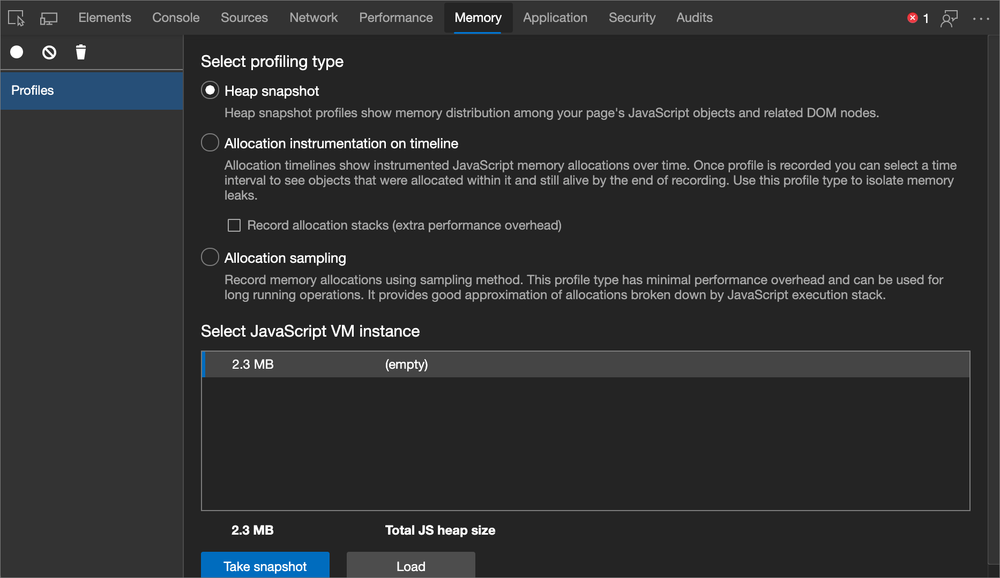

**Snapshots** are initially stored in the renderer process memory.  Snapshots are transferred to the DevTools on demand, when you click the snapshot icon to view it.

After the snapshot has been loaded into DevTools and has been parsed, the number below the snapshot title appears and shows the [total size of the reachable JavaScript objects](memory-101.md#object-sizes).

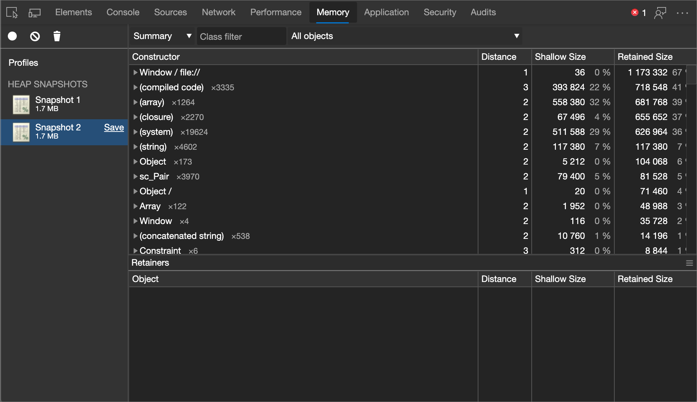

> [!NOTE]
> Only reachable objects are included in snapshots.  Also, taking a snapshot always starts with a garbage collection.


<!-- ====================================================================== -->
## Clear snapshots

Click the **Clear all profiles** icon to remove snapshots (both from DevTools and any memory associated with the renderer process).

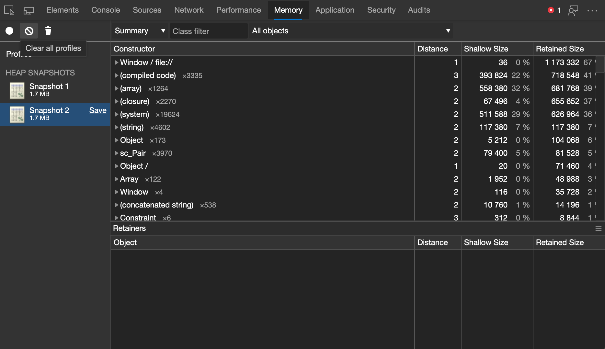

Closing the DevTools window doesn't delete profiles from the memory associated with the renderer process.  When reopening DevTools, all previously taken snapshots reappear in the list of snapshots.


## Demo webpage: Example 3: Scattered objects

*  Open this demo example webpage: [Example 3: Scattered objects](https://microsoftedge.github.io/Demos/devtools-memory-heap-snapshot/example-03.html) in a new window or tab.  Profile it using the Heap Profiler.  A number of (object) item allocations are displayed.

<!-- You can view the source files for the Heap Snapshots demo pages at the [MicrosoftEdge/Demos > devtools-memory-heap-snapshot](https://github.com/MicrosoftEdge/Demos/tree/main/devtools-memory-heap-snapshot) repo folder. -->


<!-- ====================================================================== -->
## View snapshots

View snapshots from different perspectives for different tasks.

**Summary view** shows objects grouped by the constructor name.  Use it to hunt down objects (and the memory use) based on type grouped by constructor name.  **Summary view** is particularly helpful for **tracking down DOM leaks**.

<!--todo: add profile memory problems memory diagnosis (tracking down DOM leaks) section when available  -->

**Comparison view**.  Displays the difference between two snapshots.  Use it to compare two (or more) memory snapshots from before and after an operation.  Inspecting the delta in freed memory and reference count lets you confirm the presence and cause of a memory leak.

**Containment view**.  Allows exploration of heap contents.  **Containment view** provides a better view of object structure, helping analyze objects referenced in the global namespace (window) to find out what is keeping objects around.  Use it to analyze closures and dive into your objects at a low level.

To switch between views, use the selector at the top of the view.

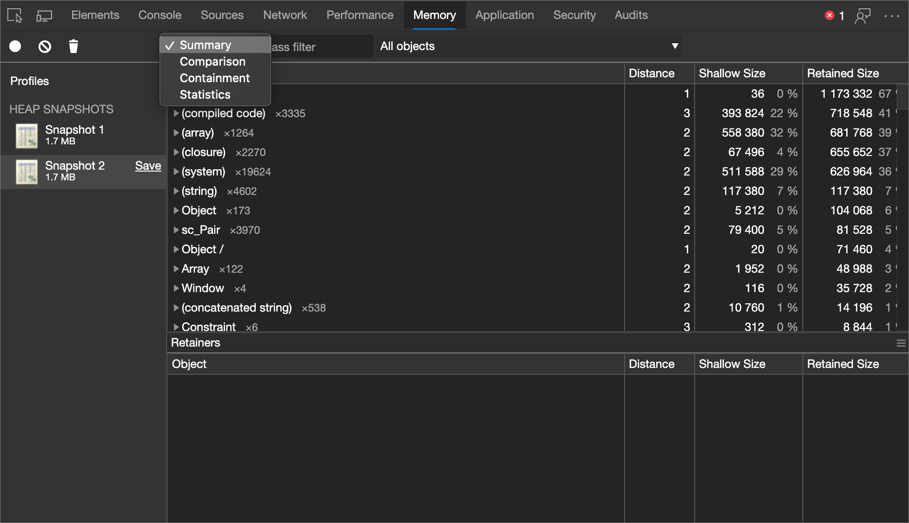

> [!NOTE]
> Not all properties are stored on the JavaScript heap.  Properties implemented using getters that run native code aren't captured.  Also, non-string values such as numbers aren't captured.

### Summary view

Initially, a snapshot opens in the Summary view, displaying object totals, which can be expanded to show instances:

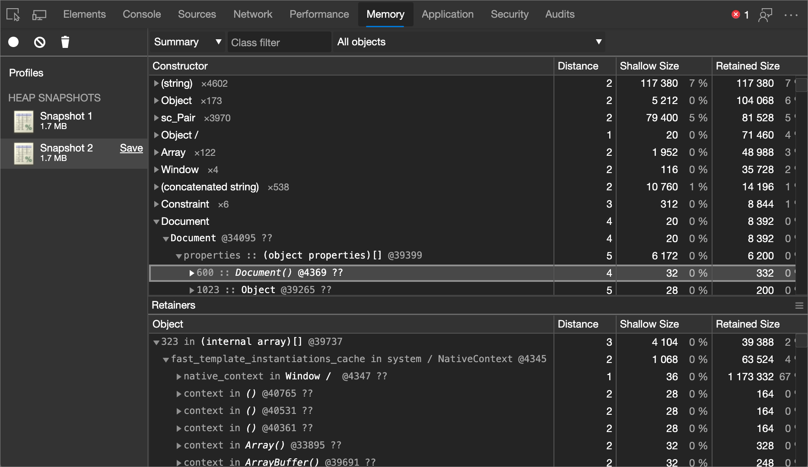

Top-level entries are "total" lines.

| Top-level entries | Description |
|:--- |:--- |
| **Constructor** | Represents all objects created using this constructor.  |
| **Distance** | Displays the distance to the root using the shortest simple path of nodes.  |
| **Shallow size** | Displays the sum of shallow sizes of all objects created by a certain constructor function.  The shallow size is the size of memory held by an object (generally, arrays and strings have larger shallow sizes).  See [Object sizes](memory-101.md#object-sizes).  |
| **Retained size** | Displays the maximum retained size among the same set of objects.  The size of memory that you can free after an object is deleted (and the dependents are made no longer reachable) is called the retained size.  See [Object sizes](memory-101.md#object-sizes).  |

<!--| **Number of object instances** | Displayed in the # column.  |  -->

After expanding a total line in the upper view, all of the instances are displayed.  For each instance, the shallow and retained sizes are displayed in the corresponding columns.  The number after the `@` character is the unique ID of the object, allowing you to compare heap snapshots on per-object basis.

* Yellow objects have JavaScript references.
* Red objects are detached nodes.  A detached node is referenced from a node that has a yellow background.

### Constructor (group) entries in the heap profiler

The various constructor (group) entries in the heap profiler correspond to the following types of objects.

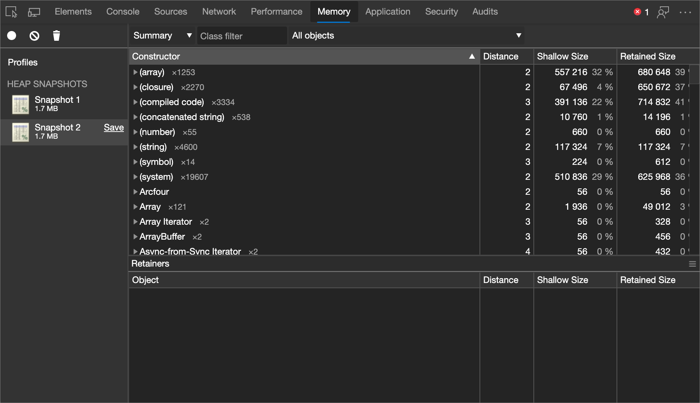

| Constructor (group) entry | Description |
|:--- |:--- |
| **(global property)** | The intermediate objects between a global object (like `window`) and an object referenced by it.  If an object is created using a constructor `Person` and is held by a global object, the retaining path would be represented as `[global] > (global property) > Person`.  This contrasts with the norm, where objects directly reference each other.  Intermediate objects exist for performance.  Globals are modified regularly and property access optimizations do a good job for non-global objects aren't applicable for globals.  |
| **(roots)** | The root entries in the retaining tree view are the entities that have references to the selected object.  These can also be references created by the engine for its own purposes.  The engine has caches which reference objects, but all such references are weak and don't prevent an object from being collected, given that there are no truly strong references.  |
| **(closure)** | A count of references to a group of objects through function closures. |
| **(array, string, number, regexp)** | A list of object types with properties which reference an Array, String, Number, or regular expression. |
| **(compiled code)** | Everything related to compiled code.  Script is similar to a function, but corresponds to a `<script>` body.  SharedFunctionInfos (SFI) are objects standing between functions and compiled code.  Functions usually have a context, while SFIs do not. |
| **HTMLDivElement**, **HTMLAnchorElement**, **DocumentFragment**, and so on.  | References to elements or document objects of a particular type referenced by your code. |
| **(object shape)** | References to the hidden classes and descriptor arrays that V8 (the JavaScript engine of Microsoft Edge) uses to understand and index the properties in objects.  See [HiddenClasses and DescriptorArrays](https://v8.dev/blog/fast-properties#hiddenclasses-and-descriptorarrays). |
| **(BigInt)** | References to the **BigInt** object, which is used to represent and manipulate values that are too large to be represented by the **Number** object.  See [BigInt](https://developer.mozilla.org/docs/Web/JavaScript/Reference/Global_Objects/BigInt). |


<!--
### Heap profiling summary
todo: add heap profiling summary section when available
-->


### Comparison view

Find leaked objects by comparing multiple snapshots to each other.  Usually, a pair of direct and reverse operations, such as opening a document and then closing it, shouldn't leave any garbage.

To verify that a certain application operation doesn't create leaks:

1. Take a heap snapshot before performing an operation.

1. Perform an operation.  That is, interact with a page in some way that might be causing a leak.

1. Perform a reverse operation.  That is, do the opposite interaction and repeat it a few times.

1. Take a second heap snapshot and change the view of this one to **Comparison**, comparing it to **Snapshot 1**.

In the **Comparison** view, the difference between two snapshots is displayed.  When expanding a total entry, added and deleted object instances are shown.

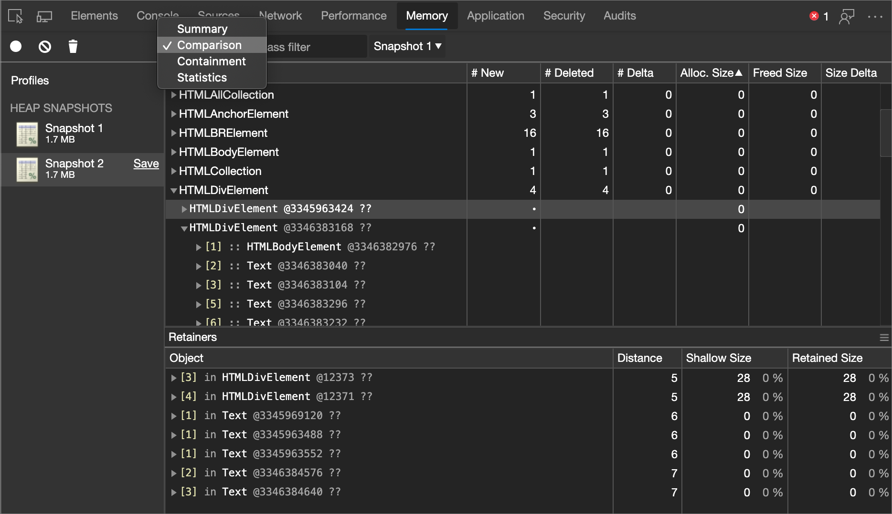

<!--todo: add HeapProfilingComparison section when available  -->

### Containment view

The **Containment** view is essentially a "bird's eye view" of the objects structure of your application.  It allows you to peek inside function closures, to observe virtual machine (VM) internal objects that together make up your JavaScript objects, and to understand how much memory your application uses at a very low level.

| Containment view entry points | Description |
|:--- |:--- |
| **DOMWindow objects** | Global objects for JavaScript code.  |
| **GC roots** | The actual GC roots used by the garbage of the VM.  GC roots are comprised of built-in object maps, symbol tables, VM thread stacks, compilation caches, handle scopes, and global handles.  |
| **Native objects** | Browser objects "pushed" inside the JavaScript virtual machine (JavaScript VM) to allow automation, for example, DOM nodes, CSS rules.  |

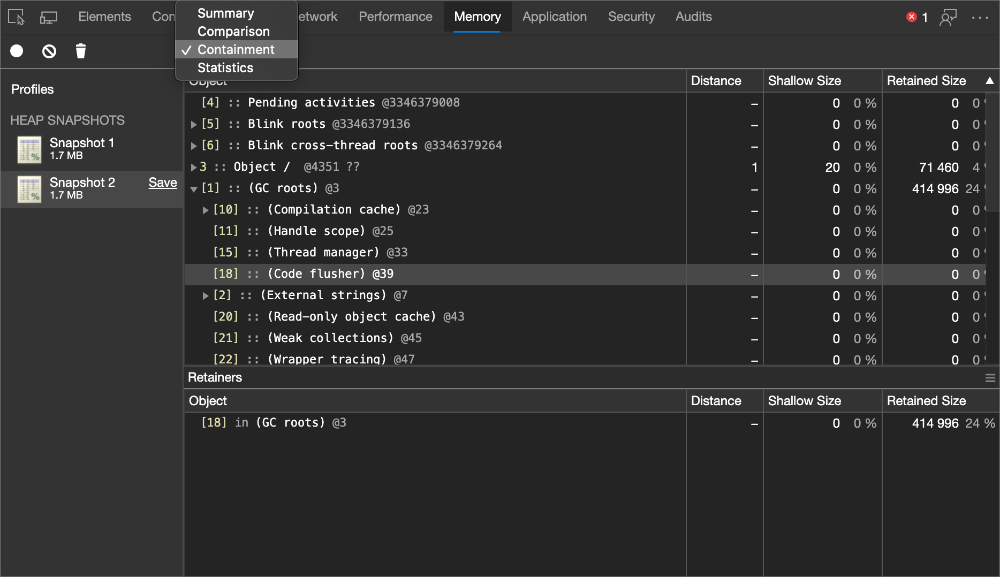

<!--todo: add heap profiling containment section when available  -->

### Naming functions to differentiate between closures in the snapshot

Name the functions, so that you can easily distinguish between closures in the snapshot.  For example, this example doesn't use named functions:

```javascript
function createLargeClosure() {
    var largeStr = new Array(1000000).join('x');
    var lC = function() { // this is NOT a named function
        return largeStr;
    };
    return lC;
}
```

The following code uses named functions, to easily distinguish between closures in the snapshot:

```javascript
function createLargeClosure() {
    var largeStr = new Array(1000000).join('x');
    var lC = function lC() { // this IS a named function
        return largeStr;
    };
    return lC;
}
```

#### Demo webpage: Example 7: Eval is evil

To analyze the impact of closures on memory, try out this example: open the demo webpage [Example 7: Eval is evil](https://microsoftedge.github.io/Demos/devtools-memory-heap-snapshot/example-07.html) in a new window or tab.

<!-- You can view the source files for the Heap Snapshots demo pages in the [MicrosoftEdge/Demos > devtools-memory-heap-snapshot](https://github.com/MicrosoftEdge/Demos/tree/main/devtools-memory-heap-snapshot) repo folder. -->

#### Demo webpage: Example 8: Recording heap allocations

You may also be interested in following up the above demo with this example that takes you through recording heap allocations: open the demo webpage [Example 8: Recording heap allocations](https://microsoftedge.github.io/Demos/devtools-memory-heap-snapshot/example-08.html) in a new window or tab.

<!-- You can view the source files for the Heap Snapshots demo pages in the [MicrosoftEdge/Demos > devtools-memory-heap-snapshot](https://github.com/MicrosoftEdge/Demos/tree/main/devtools-memory-heap-snapshot) repo folder. -->

<!--

-->


<!-- ====================================================================== -->
## Filter a heap snapshot by node type

Use filters to focus on specific parts of a heap snapshot.  You can filter by node type if, for example, you're only interested in the strings or arrays from the heap.

When looking at all the objects in a heap snapshot in the **Memory** tool, it can be difficult to focus on specific objects or retaining paths.  Use the **Node Types** filter when looking at a heap snapshot, to focus on only specific types of nodes.  For example, to see only the arrays and string objects that are in the heap, select the **Array** and **String** entries in the **Node Types** filter.

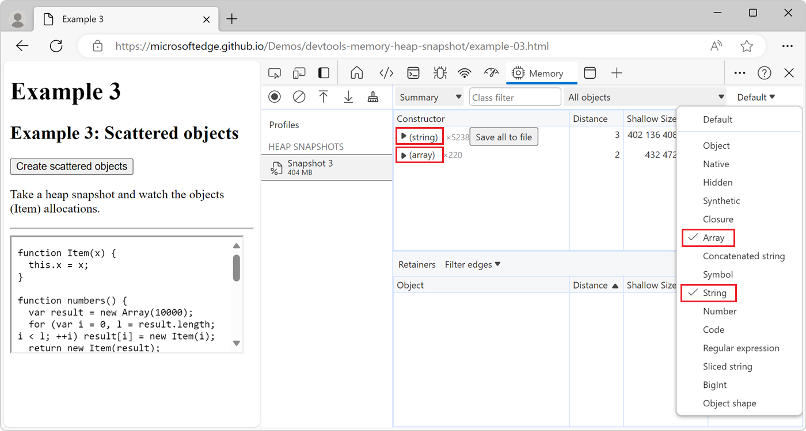


<!-- ====================================================================== -->
## Look up color coding

Properties and property values of objects have different types and are colored accordingly.  Each property has one of four types:

| Property Type | Description |
|:--- |:--- |
| **a: property** | A regular property with a name, accessed via the `.` (dot) operator, or via `[` `]` (brackets) notation, for example `["foo bar"]`.  |
| **0: element** | A regular property with a numeric index, accessed via `[` `]` (brackets) notation.  |
| **a: context var** |  A variable in a function context, accessible by the variable name from inside a function closure.  |
| **a: system prop** | A property added by the JavaScript VM, not accessible from JavaScript code.  |

Objects designated as `System` don't have a corresponding JavaScript type.  Each is part of the object system implementation of the Javascript VM.  V8 allocates most of the internal objects in the same heap as the user's JS objects.  So these are just V8 internals.


<!-- ====================================================================== -->
## Find a specific object

To find an object in the collected heap, you can search using **Ctrl+F** and give the object ID.


<!-- ====================================================================== -->
## Uncover DOM leaks

The heap profiler has the ability to reflect bidirectional dependencies between browser native objects (DOM nodes, CSS rules) and JavaScript objects.  This helps to discover otherwise invisible leaks happening due to forgotten detached DOM subtrees floating around.

DOM leaks may be bigger than you think.  Consider the following sample.  When is the `#tree` garbage-collected?

```javascript
var select = document.querySelector;
var treeRef = select("#tree");
var leafRef = select("#leaf");
var body = select("body");

body.removeChild(treeRef);

//#tree in not GC yet due to treeRef
treeRef = null;

//#tree is not GC yet due to indirect reference from leafRef

leafRef = null;
//#NOW can be #tree GC
```

The `#leaf` maintains a reference to the relevant parent (parentNode) and recursively up to `#tree`, so only when `leafRef` is nullified is the WHOLE tree under `#tree` a candidate for garbage-collection (GC).

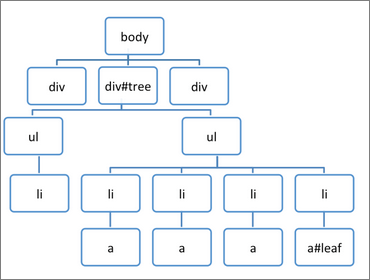


### Demo webpage: Example 6: Leaking DOM nodes

Open the example webpage [Example 6: Leaking DOM nodes](https://microsoftedge.github.io/Demos/devtools-memory-heap-snapshot/example-06.html) in a new window or tab, to understand where DOM nodes might leak, and how to detect such leakage.

<!-- You can view the source files for the Heap Snapshots demo pages at the [MicrosoftEdge/Demos > devtools-memory-heap-snapshot](https://github.com/MicrosoftEdge/Demos/tree/main/devtools-memory-heap-snapshot) repo folder. -->


### Demo webpage: Example 9: DOM leaks bigger than expected

Open the example webpage [Example 9: DOM leaks bigger than expected](https://microsoftedge.github.io/Demos/devtools-memory-heap-snapshot/example-09.html) in a new window or tab.

<!-- You can view the source files for the Heap Snapshots demo pages at the [MicrosoftEdge/Demos > devtools-memory-heap-snapshot](https://github.com/MicrosoftEdge/Demos/tree/main/devtools-memory-heap-snapshot) repo folder. -->


To read more about DOM leaks and memory analysis fundamentals, check out [Finding and debugging memory leaks with the Microsoft Edge DevTools](https://slid.es/gruizdevilla/memory) by Gonzalo Ruiz de Villa.

<!-- Example: Try this **demo** to play with detached DOM trees. -->

<!-- todo: add heap profiling dom leaks section when available -->


<!-- ====================================================================== -->
<!--[heap profiling comparison](https://developer.alphabet.com/devtools/docs/heap-profiling-comparison) -->
<!--[heap profiling containment](https://developer.alphabet.com/devtools/docs/heap-profiling-containment) -->
<!--[heap profiling DOM leaks](https://developer.alphabet.com/devtools/docs/heap-profiling-dom-leaks) -->
<!--[heap profiling summary](https://developer.alphabet.com/devtools/docs/heap-profiling-summary) -->
<!--[narrow down causes of memory leaks](../profile/memory-problems/memory-diagnosis#narrow-down-causes-of-memory-leaks) -->


<!-- ====================================================================== -->
## Save and export strings from a heap snapshot to JSON

When taking a heap snapshot in the **Memory** tool, you can export all string objects from the snapshot to a JSON file.  In the **Memory** tool, in the **Constructor** section, click the **Save all to file** button next to the `(string)` entry:

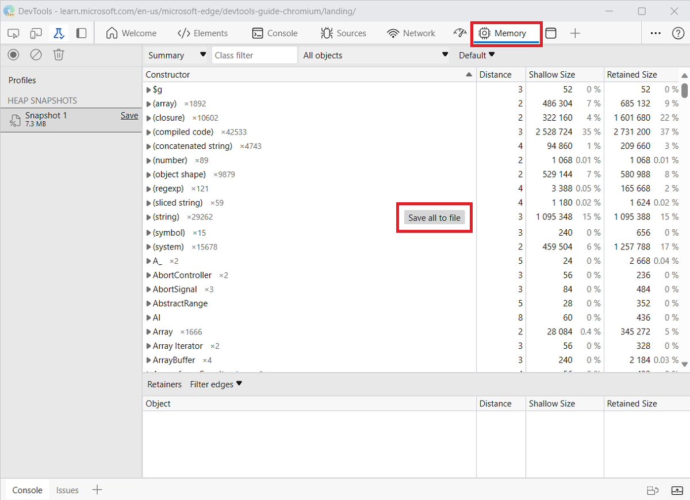

The **Memory** tool exports a JSON file that contains all of the string objects from the heap snapshot:

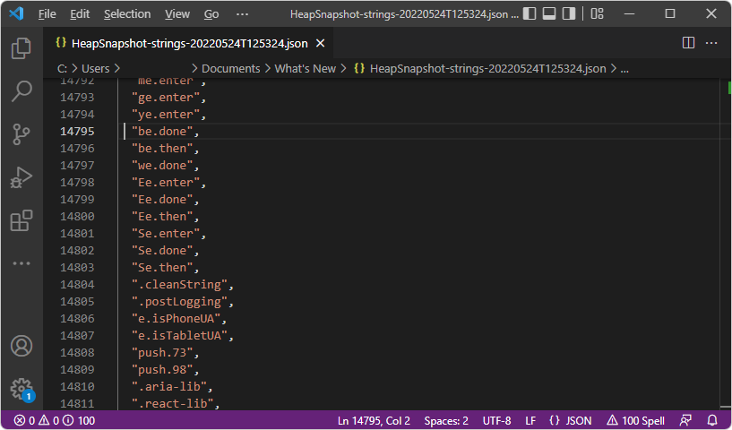


<!-- ====================================================================== -->
> [!NOTE]
> Portions of this page are modifications based on work created and [shared by Google](https://developers.google.com/terms/site-policies) and used according to terms described in the [Creative Commons Attribution 4.0 International License](https://creativecommons.org/licenses/by/4.0).
> The original page is found [here](https://developer.chrome.com/docs/devtools/memory-problems/heap-snapshots/) and is authored by [Meggin Kearney](https://developers.google.com/web/resources/contributors#meggin-kearney) (Technical Writer).

[](https://creativecommons.org/licenses/by/4.0)
This work is licensed under a [Creative Commons Attribution 4.0 International License](https://creativecommons.org/licenses/by/4.0).
