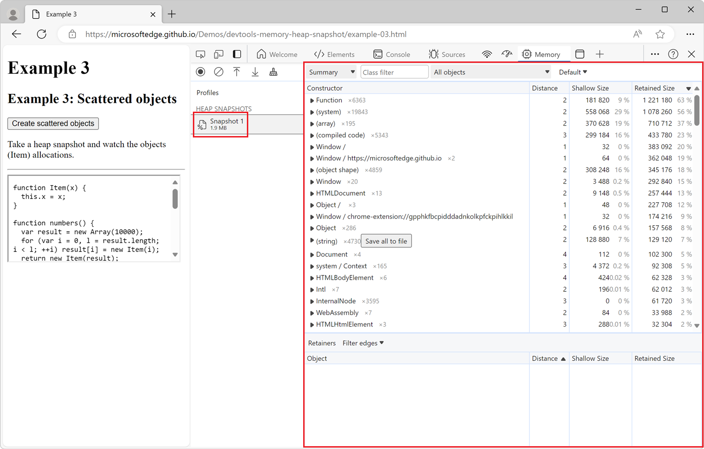
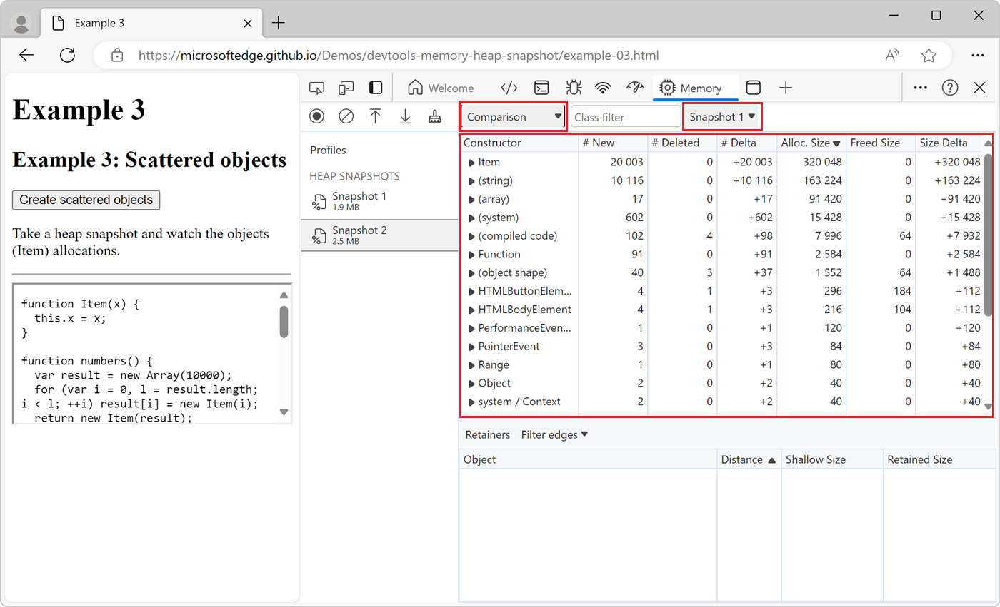
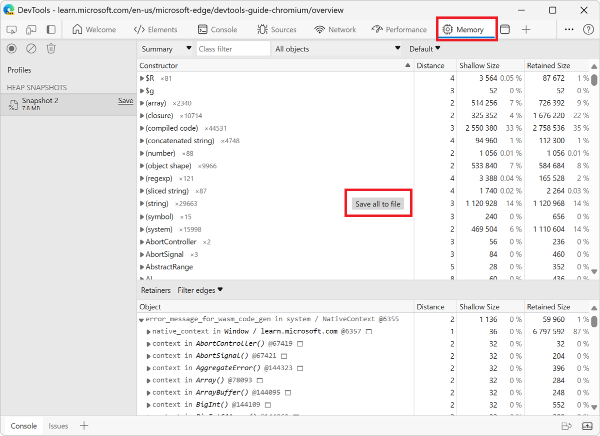

<!-- Copyright Meggin Kearney

   Licensed under the Apache License, Version 2.0 (the "License");
   you may not use this file except in compliance with the License.
   You may obtain a copy of the License at

       https://www.apache.org/licenses/LICENSE-2.0

   Unless required by applicable law or agreed to in writing, software
   distributed under the License is distributed on an "AS IS" BASIS,
   WITHOUT WARRANTIES OR CONDITIONS OF ANY KIND, either express or implied.
   See the License for the specific language governing permissions and
   limitations under the License.  -->
# Record heap snapshots using the Memory tool

Use the heap profiler in the **Memory** tool to do the following:

*  Record JavaScript heap (JS heap) snapshots.
*  Analyze memory graphs.
*  Compare snapshots.
*  Find memory leaks.

The DevTools heap profiler shows memory distribution used by the JavaScript objects and related DOM nodes on the rendered webpage.

<!-- You can view the source files for the Heap Snapshots demo pages at the [MicrosoftEdge/Demos > devtools-memory-heap-snapshot](https://github.com/MicrosoftEdge/Demos/tree/main/devtools-memory-heap-snapshot) repo folder.

This article uses five demo webpages, all sourced at https://github.com/MicrosoftEdge/Demos/tree/main/devtools-memory-heap-snapshot -
*  [Example 3: Scattered objects](https://microsoftedge.github.io/Demos/devtools-memory-heap-snapshot/example-03.html)
*  [Example 7: Eval is evil](https://microsoftedge.github.io/Demos/devtools-memory-heap-snapshot/example-07.html)
*  [Example 8: Recording heap allocations](https://microsoftedge.github.io/Demos/devtools-memory-heap-snapshot/example-08.html)
*  [Example 6: Leaking DOM nodes](https://microsoftedge.github.io/Demos/devtools-memory-heap-snapshot/example-06.html)
*  [Example 9: DOM leaks bigger than expected](https://microsoftedge.github.io/Demos/devtools-memory-heap-snapshot/example-09.html)
-->


<!-- ====================================================================== -->
## Take a snapshot

<!--
1. Open the __ demo page in a new tab or window.
-->

1. In DevTools, open the **Memory** tool.

1. In the **Select profiling type** section, select the **Heap snapshot** option button.

1. Under **Select JavaScript VM instance**, select the process that you want to profile.

1. Click the **Take snapshot** button.


After the newly recorded heap snapshot has been loaded into DevTools and has been parsed, the snapshot is displayed and a new entry appears in the **Profiles** sidebar under **HEAP SNAPSHOTS**. The number below the new sidebar item shows the total size of the reachable JavaScript objects. To learn more about object sizes in the heap snapshot, see [Object sizes and distances](./memory-101.md#object-sizes-and-distances) in _Memory terminology_.



The snapshot only displays the objects from the memory graph that are reachable from the global object. Taking a snapshot always starts with a garbage collection.


<!-- ====================================================================== -->
## Clear snapshots

To clear all snapshots from the **Memory** tool, click the **Clear all profiles** () icon:


<!-- ------------------------------ -->
#### Demo webpage: Example 3: Scattered objects

*  Open this demo example webpage: [Example 3: Scattered objects](https://microsoftedge.github.io/Demos/devtools-memory-heap-snapshot/example-03.html) in a new window or tab.  Profile it using the Heap Profiler.  A number of (object) item allocations are displayed.

<!-- You can view the source files for the Heap Snapshots demo pages at the [MicrosoftEdge/Demos > devtools-memory-heap-snapshot](https://github.com/MicrosoftEdge/Demos/tree/main/devtools-memory-heap-snapshot) repo folder. -->


<!-- ====================================================================== -->
## View snapshots

Heap snapshots can be viewed in multiple different ways in the **Memory** tool. Each way corresponds to a different task:

* The **Summary** view shows objects grouped by their constructor name.  Use it to find objects, and the memory they use, based on types grouped by constructor name. The **Summary** view is particularly helpful for **tracking down DOM leaks**.

<!--todo: add profile memory problems memory diagnosis (tracking down DOM leaks) section when available  -->

* The **Comparison** view displays the differences between two snapshots. Use it to compare two (or more) memory snapshots from before and after an operation.  Inspecting the delta in freed memory and reference count lets you confirm the presence and cause of a memory leak.

* The **Containment** view allows the exploration of the heap contents.  The **Containment** view provides a better view of object structure, helping analyze objects referenced in the global namespace (window) to find out what is keeping objects around.  Use it to analyze closures and dive into your objects at a low level.

To switch between views, use the dropdown list at the top of the **Memory** tool:


> [!NOTE]
> Not all properties are stored on the JavaScript heap.  Properties implemented using getters that run native code aren't captured.  Also, non-string values such as numbers aren't captured.

<!-- ------------------------------ -->
#### Summary view

Initially, a heap snapshot opens in the **Summary** view, which displays a list of constructors. Each constructor in the list can be expanded to show the objects that were instantiated using that constructor:


Top-level entries in the list of constructors are _total lines_.

| Top-level entries | Description |
|:--- |:--- |
| **Constructor** | Represents all objects created using this constructor. |
| **Distance** | Displays the distance to the root using the shortest simple path of nodes.  See [Distance](./memory-101.md#distance) in _Memory terminology_. |
| **Shallow size** | Displays the sum of shallow sizes of all objects created by a certain constructor function.  The shallow size is the size of memory held by an object (generally, arrays and strings have larger shallow sizes).  See [Shallow size](./memory-101.md#shallow-size) in _Memory terminology_. |
| **Retained size** | Displays the maximum retained size among the same set of objects.  The size of memory that you can free after an object is deleted (and the dependents are made no longer reachable) is called the retained size.  See [Retained size](./memory-101.md#retained-size) in _Memory terminology_. |

After expanding a total line in the **Summary** view, all of the instances are displayed.  For each instance, the shallow and retained sizes are displayed in the corresponding columns.  The number after the `@` character is the unique ID of the object, allowing you to compare heap snapshots on per-object basis.

* Yellow objects have JavaScript references.
* Red objects are detached nodes.  A detached node is referenced from a node that has a yellow background.

<!-- ------------------------------ -->
#### Constructor (group) entries in the heap profiler

The **Memory** tool's heap profiler has a **Constructor** section that lists expandable groups of constructors, such as an expandable group of **(array)** constructors:


The various constructor (group) entries in the heap profiler correspond to the following types of objects:

| Constructor (group) entry | Description |
|:--- |:--- |
| **(global property)** | The intermediate objects between a global object (like `window`) and an object referenced by it.  If an object is created using a constructor `Person` and is held by a global object, the retaining path would be represented as `[global] > (global property) > Person`.  This contrasts with the norm, where objects directly reference each other.  Intermediate objects exist for performance.  Globals are modified regularly and property access optimizations do a good job for non-global objects aren't applicable for globals.  |
| **(roots)** | The root entries in the retaining tree view are the entities that have references to the selected object.  These can also be references created by the engine for its own purposes.  The engine has caches which reference objects, but all such references are weak and don't prevent an object from being collected, given that there are no truly strong references.  |
| **(closure)** | A count of references to a group of objects through function closures. |
| **(array, string, number, regexp)** | A list of object types with properties which reference an Array, String, Number, or regular expression. |
| **(compiled code)** | Everything related to compiled code.  Script is similar to a function, but corresponds to a `<script>` body.  SharedFunctionInfos (SFI) are objects standing between functions and compiled code.  Functions usually have a context, while SFIs do not. |
| **HTMLDivElement**, **HTMLAnchorElement**, **DocumentFragment**, and so on.  | References to elements or document objects of a particular type referenced by your code. |
| **(object shape)** | References to the hidden classes and descriptor arrays that V8 (the JavaScript engine of Microsoft Edge) uses to understand and index the properties in objects.  See [HiddenClasses and DescriptorArrays](https://v8.dev/blog/fast-properties#hiddenclasses-and-descriptorarrays). |
| **(BigInt)** | References to the **BigInt** object, which is used to represent and manipulate values that are too large to be represented by the **Number** object.  See [BigInt](https://developer.mozilla.org/docs/Web/JavaScript/Reference/Global_Objects/BigInt). |

<!--
#### Heap profiling summary
todo: add heap profiling summary section when available
-->

<!-- ------------------------------ -->
#### Comparison view

To find leaked objects, compare multiple snapshots to each other.  In a web application, usually, doing an action and then the reverse action shouldn't lead to more objects in memory. For example, when opening a document and then closing it, the number of objects in memory should be the same as before opening the document.

To verify that certain operations don't create leaks:

1. Take a heap snapshot before performing an operation.

1. Perform the operation.  That is, interact with the page in some way that might be causing a leak.

1. Perform the reverse operation.  That is, do the opposite interaction and repeat it a few times.

1. Take a second heap snapshot.

1. In the second heap snapshot, change the view to **Comparison**, comparing it to **Snapshot 1**.

In the **Comparison** view, the difference between two snapshots is displayed.  When expanding a total entry, added and deleted object instances are shown.



<!--todo: add HeapProfilingComparison section when available  -->

<!-- ------------------------------ -->
#### Containment view

The **Containment** view is essentially a "bird's eye view" of the objects structure of your application.  It allows you to peek inside function closures, to observe virtual machine (VM) internal objects that together make up your JavaScript objects, and to understand how much memory your application uses at a very low level. <!-- Low level makes little sense since we just said it provided a bird's eye view. -->

| Containment view entry points | Description |
|:--- |:--- |
| **DOMWindow objects** | Global objects for JavaScript code.  |
| **GC roots** | The actual GC roots used by the garbage of the VM.  GC roots are comprised of built-in object maps, symbol tables, VM thread stacks, compilation caches, handle scopes, and global handles.  |
| **Native objects** | Browser objects "pushed" inside the JavaScript virtual machine (JavaScript VM) to allow automation, for example, DOM nodes, CSS rules.  |


<!--todo: add heap profiling containment section when available  -->

<!-- ------------------------------ -->
#### Naming functions to differentiate between closures in the snapshot

Name the functions, so that you can easily distinguish between closures in the snapshot.  For example, this example doesn't use named functions:

```javascript
function createLargeClosure() {
    var largeStr = 'x'.repeat(1000000).toLowerCase();
    var lC = function() { // This is not a named function
        return largeStr;
    };
    return lC;
}
```

The following code uses named functions, to easily distinguish between closures in the snapshot:

```javascript
function createLargeClosure() {
    var largeStr = 'x'.repeat(1000000).toLowerCase();
    var lC = function lC() { // This is a named function
        return largeStr;
    };
    return lC;
}
```

###### Demo webpage: Example 7: Eval is evil

To analyze the impact of closures on memory, try out this example: open the demo webpage [Example 7: Eval is evil](https://microsoftedge.github.io/Demos/devtools-memory-heap-snapshot/example-07.html) in a new window or tab.

<!-- You can view the source files for the Heap Snapshots demo pages in the [MicrosoftEdge/Demos > devtools-memory-heap-snapshot](https://github.com/MicrosoftEdge/Demos/tree/main/devtools-memory-heap-snapshot) repo folder. -->

###### Demo webpage: Example 8: Recording heap allocations

You may also be interested in following up the above demo with this example that takes you through recording heap allocations: open the demo webpage [Example 8: Recording heap allocations](https://microsoftedge.github.io/Demos/devtools-memory-heap-snapshot/example-08.html) in a new window or tab.

<!-- You can view the source files for the Heap Snapshots demo pages in the [MicrosoftEdge/Demos > devtools-memory-heap-snapshot](https://github.com/MicrosoftEdge/Demos/tree/main/devtools-memory-heap-snapshot) repo folder. -->

<!--

-->


<!-- ====================================================================== -->
## Filter a heap snapshot by node type

Use filters to focus on specific parts of a heap snapshot.

When looking at all the objects in a heap snapshot in the **Memory** tool, it can be difficult to focus on specific objects or retaining paths.  Use the **Node Types** filter when looking at a heap snapshot, to focus on only specific types of nodes.  For example, to see only the arrays and string objects that are in the heap, select the **Array** and **String** entries in the **Node Types** filter.


<!-- ====================================================================== -->
## Look up color coding

Properties and property values of objects have different types and are colored accordingly.  Each property has one of four types:

| Property Type | Description |
|:--- |:--- |
| **a: property** | A regular property with a name, accessed via the `.` (dot) operator, or via `[` `]` (brackets) notation, for example `["foo bar"]`.  |
| **0: element** | A regular property with a numeric index, accessed via `[` `]` (brackets) notation.  |
| **a: context var** |  A variable in a function context, accessible by the variable name from inside a function closure.  |
| **a: system prop** | A property added by the JavaScript VM, not accessible from JavaScript code.  |

Objects designated as `System` don't have a corresponding JavaScript type.  Each is part of the object system implementation of the Javascript VM.  V8 allocates most of the internal objects in the same heap as the user's JS objects.  So these are just V8 internals.


<!-- ====================================================================== -->
## Find a specific object

To find an object in the collected heap, you can search using **Ctrl+F** and give the object ID.


<!-- ====================================================================== -->
## Uncover DOM leaks

The heap profiler has the ability to reflect bidirectional dependencies between browser native objects (DOM nodes, CSS rules) and JavaScript objects.  This helps to discover otherwise invisible leaks that happen because of forgotten detached DOM subtrees that remain in memory.

Consider the following code sample.  When is the element with ID `tree` garbage-collected?

```javascript
// Getting a reference to the #tree element.
var treeRef = document.querySelector("#tree");

// Getting a reference to the #leaf element,
// which is a descendant of the #tree element.
var leafRef = document.querySelector("#leaf");

// Removing the #tree element from the DOM.
document.body.removeChild(treeRef);

// The #tree element can't be garbage-collected yet
// because the treeRef variable still exists.

// Removing the treeRef variable.
treeRef = null;

// The #tree element is still not garbage-collected
// because of the indirect reference from the leafRef variable.

// Removing the leafRef variable.
leafRef = null;

// Now the #tree element can be garbage-collected.
```

The element with ID `leaf` maintains a reference to its ancestor nodes in the DOM, which includes the element with ID `tree`. Both `treeRef` and `leafRef` must be nullified for the whole DOM tree under the element with ID `tree` to be garbage-collected.


<!-- ------------------------------ -->
#### Demo webpage: Example 6: Leaking DOM nodes

Open the example webpage [Example 6: Leaking DOM nodes](https://microsoftedge.github.io/Demos/devtools-memory-heap-snapshot/example-06.html) in a new window or tab, to understand where DOM nodes might leak, and how to detect such leakage.

<!-- You can view the source files for the Heap Snapshots demo pages at the [MicrosoftEdge/Demos > devtools-memory-heap-snapshot](https://github.com/MicrosoftEdge/Demos/tree/main/devtools-memory-heap-snapshot) repo folder. -->

<!-- ------------------------------ -->
#### Demo webpage: Example 9: DOM leaks bigger than expected

Open the example webpage [Example 9: DOM leaks bigger than expected](https://microsoftedge.github.io/Demos/devtools-memory-heap-snapshot/example-09.html) in a new window or tab.

<!-- You can view the source files for the Heap Snapshots demo pages at the [MicrosoftEdge/Demos > devtools-memory-heap-snapshot](https://github.com/MicrosoftEdge/Demos/tree/main/devtools-memory-heap-snapshot) repo folder. -->

<!-- Example: Try this **demo** to play with detached DOM trees. -->

<!-- todo: add heap profiling dom leaks section when available -->


<!-- ====================================================================== -->
<!--[heap profiling comparison](https://developer.alphabet.com/devtools/docs/heap-profiling-comparison) -->
<!--[heap profiling containment](https://developer.alphabet.com/devtools/docs/heap-profiling-containment) -->
<!--[heap profiling DOM leaks](https://developer.alphabet.com/devtools/docs/heap-profiling-dom-leaks) -->
<!--[heap profiling summary](https://developer.alphabet.com/devtools/docs/heap-profiling-summary) -->
<!--[narrow down causes of memory leaks](../profile/memory-problems/memory-diagnosis#narrow-down-causes-of-memory-leaks) -->


<!-- ====================================================================== -->
## Save and export strings from a heap snapshot to JSON

When taking a heap snapshot in the **Memory** tool, you can export all string objects from the snapshot to a JSON file.  In the **Memory** tool, in the **Constructor** section, click the **Save all to file** button next to the `(string)` entry:



The **Memory** tool exports a JSON file that contains all of the string objects from the heap snapshot:


<!-- ====================================================================== -->
## See also

* [Memory terminology](./memory-101.md).
* [Finding and debugging memory leaks in JavaScript with Chrome DevTools](https://slid.es/gruizdevilla/memory) by Gonzalo Ruiz de Villa, which also applies to Microsoft Edge DevTools.


<!-- ====================================================================== -->
> [!NOTE]
> Portions of this page are modifications based on work created and [shared by Google](https://developers.google.com/terms/site-policies) and used according to terms described in the [Creative Commons Attribution 4.0 International License](https://creativecommons.org/licenses/by/4.0).
> The original page is found [here](https://developer.chrome.com/docs/devtools/memory-problems/heap-snapshots/) and is authored by [Meggin Kearney](https://developers.google.com/web/resources/contributors#meggin-kearney) (Technical Writer).

[](https://creativecommons.org/licenses/by/4.0)
This work is licensed under a [Creative Commons Attribution 4.0 International License](https://creativecommons.org/licenses/by/4.0).
