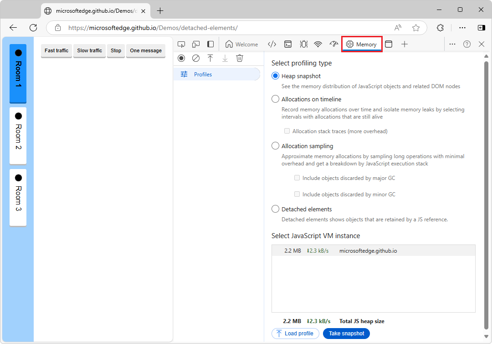
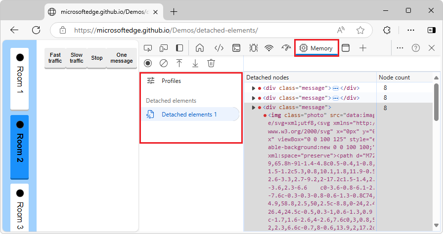

<!-- Copyright Kayce Basques

   Licensed under the Apache License, Version 2.0 (the "License");
   you may not use this file except in compliance with the License.
   You may obtain a copy of the License at

       https://www.apache.org/licenses/LICENSE-2.0

   Unless required by applicable law or agreed to in writing, software
   distributed under the License is distributed on an "AS IS" BASIS,
   WITHOUT WARRANTIES OR CONDITIONS OF ANY KIND, either express or implied.
   See the License for the specific language governing permissions and
   limitations under the License.  -->
# Fix memory problems

To find memory issues that affect page performance, including memory leaks, memory bloat, and frequent garbage collections, use the following tools:
* Microsoft Edge Browser Task Manager.
* The **Performance** tool's **Memory** checkbox.
* The **Memory** tool's various profiling types.

<!-- ------------------------------ -->
#### Tools for investigating memory usage

| Use case | Tool | Article |
|---|---|---|
| Monitor how much memory a webpage uses, in realtime. | Microsoft Edge Browser Task Manager | [Monitor memory use in realtime (Microsoft Edge Browser Task Manager)](./microsoft-edge-browser-task-manager.md) |
| Visualize the memory usage of a webpage over a period of time. | **Performance** tool > **Memory** checkbox | [Visualize memory leaks (Performance tool: Memory checkbox)](../evaluate-performance/reference.md#visualize-memory-leaks-performance-tool-memory-checkbox) in _Performance features reference_. |
| Spot frequent garbage collections. | Microsoft Edge Browser Task Manager, or **Performance** tool > **Memory** checkbox | [Spot frequent garbage collections (Microsoft Edge Browser Task Manager, Performance tool's Memory checkbox)](#spot-frequent-garbage-collections-microsoft-edge-browser-task-manager-performance-tools-memory-checkbox), below. |
| Inspect the contents of the memory used by a webpage. | **Memory** tool > **Heap snapshot** | [Record heap snapshots using the Memory tool ("Heap snapshot" profiling type)](./heap-snapshots.md) |
| Find out which JavaScript objects get created over a period of time, to isolate memory leaks. | **Memory** tool > **Allocations on timeline** | [Use Allocation instrumentation on timeline ("Allocations on timeline" profiling type)](./allocation-profiler.md) |
| Find out which JavaScript functions allocate memory over a period of time. This profile type has minimal performance overhead and can be used for long-running operations. | **Memory** tool > **Allocation sampling** | [Speed up JavaScript runtime ("Allocation sampling" profiling type)](../rendering-tools/js-runtime.md) |
| Find DOM tree memory leaks. | **Memory** tool > **Detached elements** | [Debug DOM memory leaks ("Detached elements" profiling type)](./dom-leaks-memory-tool-detached-elements.md) |

<!-- ------------------------------ -->
#### The Memory tool

The main tool for investigating memory issues is the **Memory** tool:

A Detached Elements profile in the **Memory** tool:

To return to the list of option buttons for profiling types, in the upper left of the **Memory** tool, click **Profiles** ().

<!-- ====================================================================== -->
## Overview of fixing memory problems

In the spirit of the **RAIL**<!-- [RAIL](/profile/evaluate-performance/rail) --> performance model, the focus of your performance efforts should be your users.

<!--todo old: add RAIL section when available  -->

Memory issues are important because they are often perceivable by users.  Users may perceive memory issues in the following ways:

*  **The performance of a page gets progressively worse over time**.  This is possibly a symptom of a memory leak.  A memory leak is when a bug in the page causes the page to progressively use more and more memory over time.

*  **The performance of a page is consistently bad**.  This is possibly a symptom of memory bloat.  Memory bloat is when a page uses more memory than is necessary for optimal page speed.

*  **The performance of a page is delayed or appears to pause frequently**.  This is possibly a symptom of frequent garbage collections.  Garbage collection is when the browser reclaims memory.  The browser decides when this happens.  During collections, all script running is paused.  So if the browser is garbage collecting a lot, script runtime is going to get paused a lot.

<!-- ------------------------------ -->
#### Memory bloat: How much is "too much"?

A memory leak is easy to define.  If a site is progressively using more and more memory, then you have a leak.  But memory bloat is a bit harder to pin down.  What qualifies as "using too much memory"?

There are no hard numbers here, because different devices and browsers have different capabilities.  The same page that runs smoothly on a high-end smartphone may crash on a low-end smartphone.

The key here is to use the RAIL model and focus on your users.  Find out what devices are popular with your users, and then test out your page on those devices.  If the experience is consistently bad, the page may be exceeding the memory capabilities of those devices.

<!-- ====================================================================== -->
## Spot frequent garbage collections (Microsoft Edge Browser Task Manager, Performance tool's Memory checkbox)

If your page appears to pause frequently, then you may have garbage collection issues.  To spot frequent garbage collection, you can use either:

* Microsoft Edge Browser Task Manager.  Frequently rising and falling **Memory** or **JavaScript Memory** values represent frequent garbage collection.  See [Monitor memory use in realtime (Microsoft Edge Browser Task Manager)](./microsoft-edge-browser-task-manager.md).

* The **Performance** tool's **Memory** checkbox.  In Performance memory recordings, frequent changes (rising and falling) to the JS heap or node count graphs indicate frequent garbage collection.  See [View memory metrics](../evaluate-performance/reference.md#view-memory-metrics) in _Performance features reference_.

After you have identified the problem by using either of those tool, you can then use the **Memory** tool's **Allocations on timeline** profiling type to find out where memory is being allocated, and which functions are causing the allocations.  See [Use Allocation instrumentation on timeline ("Allocations on timeline" profiling type)](./allocation-profiler.md).

<!-- ====================================================================== -->
## Find DOM tree memory leaks from detached elements

A DOM node is only garbage-collected by the browser when there are no references to the node from either the DOM tree or JavaScript code running on the page.  A node is said to be "detached" when it is removed from the DOM tree but some JavaScript still references it.  Detached DOM nodes are a common cause of memory leaks.

<!-- ------------------------------ -->
#### Tools for investigating detached elements

| Use case | Tool | Article |
|---|---|---|
| Show detached elements only, as DOM tree nodes. | **Memory** tool > **Detached elements** profiling type | [Debug DOM memory leaks ("Detached elements" profiling type)](./dom-leaks-memory-tool-detached-elements.md) |
| Show all objects in memory, filtered to display detached elements, with links to the JavaScript source code. | **Memory** tool > **Heap snapshot** profiling type > **Detached** | [Find DOM tree memory leaks ("Heap snapshot" profiling type > Detached)](./heap-snapshots.md#find-dom-tree-memory-leaks-heap-snapshot-profiling-type--detached) in _Record heap snapshots using the Memory tool ("Heap snapshot" profiling type)_. |
| Show detached elements only, as DOM tree nodes, with links to the JavaScript source code. | **Detached Elements** tool | [Debug DOM memory leaks by using the Detached Elements tool](./dom-leaks.md) |

<!-- ====================================================================== -->
## See also
<!-- todo: all links in article -->

* [Use Allocation instrumentation on timeline ("Allocations on timeline" profiling type)](./allocation-profiler.md)
* [Debug DOM memory leaks by using the Detached Elements tool](./dom-leaks.md)
* [Record heap snapshots using the Memory tool ("Heap snapshot" profiling type)](./heap-snapshots.md)
<!--
* [Detached Elements profiling type in Memory tool](../whats-new/2024/10/devtools-130.md#detached-elements-profiling-type-in-memory-tool) in _What's New in DevTools (Microsoft Edge 130)_.
-->

External:
* [Finding and debugging memory leaks in JavaScript with Chrome DevTools](https://slid.es/gruizdevilla/memory) - slide deck (by Gonzalo Ruiz de Villa), which also applies to Microsoft Edge DevTools.

<!-- ====================================================================== -->
> [!NOTE]
> Portions of this page are modifications based on work created and [shared by Google](https://developers.google.com/terms/site-policies) and used according to terms described in the [Creative Commons Attribution 4.0 International License](https://creativecommons.org/licenses/by/4.0).
> The original page is found [here](https://developer.chrome.com/docs/devtools/memory-problems/) and is authored by Kayce Basques.

This work is licensed under a [Creative Commons Attribution 4.0 International License](https://creativecommons.org/licenses/by/4.0).

<!-- [recording](/profile/evaluate-performance/timeline-tool#make-a-recording) -->
<!-- [hngd](https://jsfiddle.net/kaycebasques/tmtbw8ef/) -->
