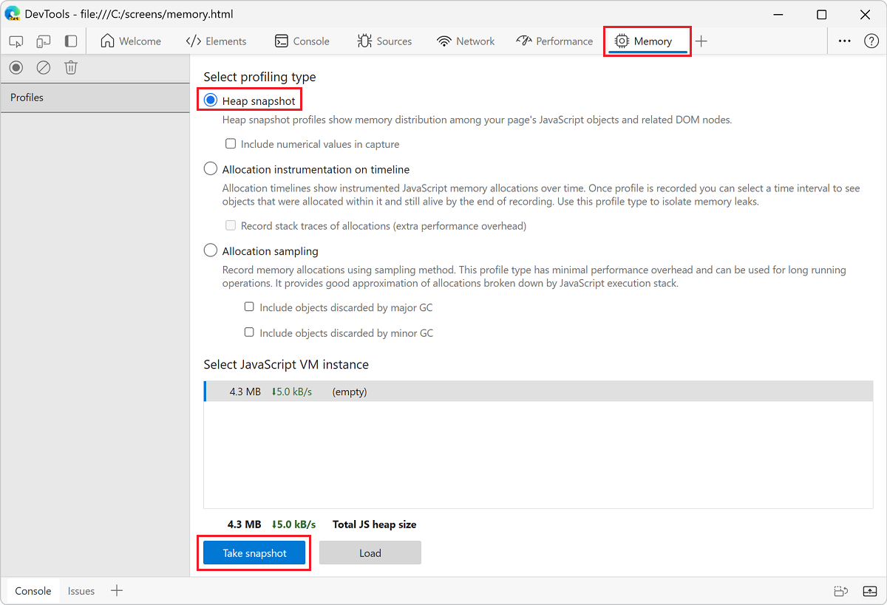
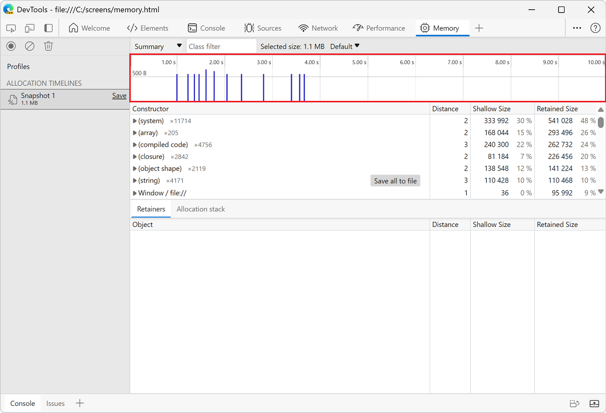
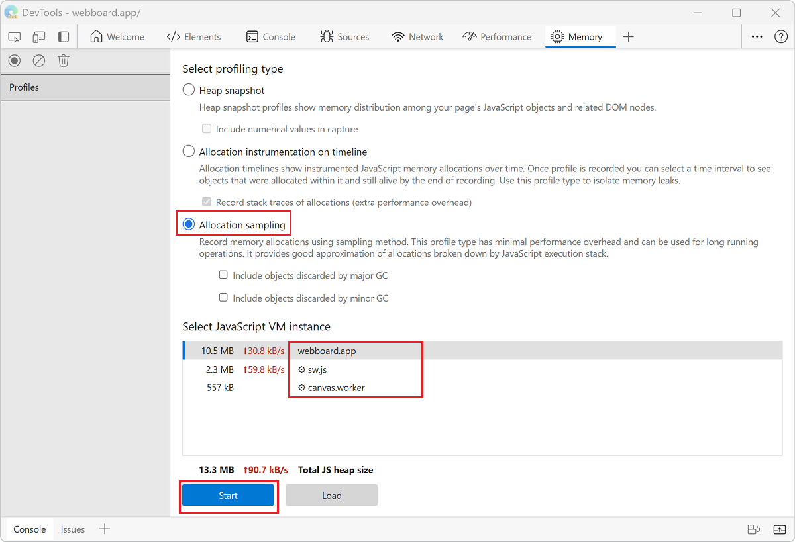
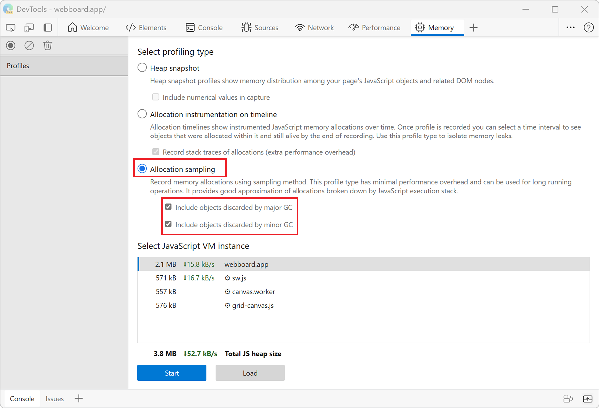

<!-- Copyright Kayce Basques

   Licensed under the Apache License, Version 2.0 (the "License");
   you may not use this file except in compliance with the License.
   You may obtain a copy of the License at

       https://www.apache.org/licenses/LICENSE-2.0

   Unless required by applicable law or agreed to in writing, software
   distributed under the License is distributed on an "AS IS" BASIS,
   WITHOUT WARRANTIES OR CONDITIONS OF ANY KIND, either express or implied.
   See the License for the specific language governing permissions and
   limitations under the License.  -->
# Fix memory problems

Learn how to use Microsoft Edge and DevTools to find memory issues that affect page performance, including memory leaks, memory bloat, and frequent garbage collections.

*  Find out how much memory your page is currently using with the Microsoft Edge Browser Task Manager.
*  Visualize memory usage over time with the **Memory** tool.
*  Identify detached DOM trees (a common cause of memory leaks) with **Heap snapshot**.
*  Find out when new memory is being allocated in your JavaScript heap (JS heap) with **Allocation instrumentation on timeline**.

See also [Debug DOM memory leaks with the Detached Elements tool](dom-leaks.md).


<!-- ====================================================================== -->
## Overview

In the spirit of the **RAIL**<!-- [RAIL](/profile/evaluate-performance/rail) --> performance model, the focus of your performance efforts should be your users.

<!--todo: add RAIL section when available  -->

Memory issues are important because they are often perceivable by users.  Users may perceive memory issues in the following ways:

*  **The performance of a page gets progressively worse over time**.  This is possibly a symptom of a memory leak.  A memory leak is when a bug in the page causes the page to progressively use more and more memory over time.

*  **The performance of a page is consistently bad**.  This is possibly a symptom of memory bloat.  Memory bloat is when a page uses more memory than is necessary for optimal page speed.

*  **The performance of a page is delayed or appears to pause frequently**.  This is possibly a symptom of frequent garbage collections.  Garbage collection is when the browser reclaims memory.  The browser decides when this happens.  During collections, all script running is paused.  So if the browser is garbage collecting a lot, script runtime is going to get paused a lot.

### Memory bloat: how much is "too much"?

A memory leak is easy to define.  If a site is progressively using more and more memory, then you have a leak.  But memory bloat is a bit harder to pin down.  What qualifies as "using too much memory"?

There are no hard numbers here, because different devices and browsers have different capabilities.  The same page that runs smoothly on a high-end smartphone may crash on a low-end smartphone.

The key here is to use the RAIL model and focus on your users.  Find out what devices are popular with your users, and then test out your page on those devices.  If the experience is consistently bad, the page may be exceeding the memory capabilities of those devices.


<!-- ====================================================================== -->
## Monitor memory use in realtime with the Microsoft Edge Browser Task Manager

Use the Microsoft Edge Browser Task Manager as a starting point to your memory issue investigation.  The Microsoft Edge Browser Task Manager is a realtime monitor that tells you how much memory a page is currently using.

1. Press **Shift+Esc** or go to the Microsoft Edge main menu and select **More tools** > **Browser Task Manager** to open the Microsoft Edge Browser Task Manager.

   

1. Right-click the table header of the Microsoft Edge Browser Task Manager, and then enable **JavaScript memory**.

   

These two columns tell you different things about how your page is using memory:

*  The **Memory** column represents native memory.  DOM nodes are stored in native memory.  If this value is increasing, DOM nodes are getting created.

*  The **JavaScript Memory** column represents the JS heap.  This column contains two values.  The value you are interested in is the live number (the number in parentheses).  The live number represents how much memory the reachable objects on your page are using.  If this number is increasing, either new objects are being created, or the existing objects are growing.

<!--*  live number reference: https://groups.google.com/d/msg/google-chrome-developer-tools/aTMVGoNM0VY/bLmf3l2CpJ8J  -->


<!-- ====================================================================== -->
## Visualize memory leaks with Performance tool

You can also use the **Performance** tool as another starting point in your investigation.  The **Performance** tool helps you visualize the memory use of a page over time.

1. In DevTools, open the **Performance** tool.

1. Select the **Memory** checkbox.

1. [Make a recording](../evaluate-performance/reference.md#record-performance).

It's a good practice to start and end your recording with a forced garbage collection.  To force garbage collection, click the **collect garbage**  button while recording.

To demonstrate memory recordings, consider the following code:

```javascript
var x = [];
function grow() {
    for (var i = 0; i < 10000; i++) {
        document.body.appendChild(document.createElement('div'));
    }
    x.push(new Array(1000000).join('x'));
}
document.getElementById('grow').addEventListener('click', grow);
```

Every time that the button referenced in the code is clicked, 10,000 `div` nodes are appended to the document body, and a string of 1,000,000 `x` characters is pushed onto the `x` array.  Running the previous code sample produces a recording in the **Performance** tool like the following figure:


First, an explanation of the user interface.  The **HEAP** graph in the **Overview** pane (below **NET**) represents the JS heap.  Below the **Overview** pane is the **Counter** pane.  The memory usage is broken down by JS heap (same as **HEAP** graph in the **Overview** pane), documents, DOM nodes, listeners, and GPU memory.  Clear a checkbox to hide it from the graph.

Now, an analysis of the code compared with the previous figure.  If you review the node counter (the green graph), it matches up cleanly with the code.  The node count increases in discrete steps.  You can presume that each increase in the node count is a call to `grow()`.

The JS heap graph (the blue graph) is not as straightforward.  In keeping with best practices, the first dip is actually a forced garbage collection (click the  **collect garbage**  button).

As the recording progresses, the JS heap size spikes are displayed.  This is natural and expected: the JavaScript code is creating the DOM nodes on every button you click, and is doing a lot of work when it creates the string of one million characters.

The key thing here is the fact that the JS heap ends higher than it began (the "beginning" here being the point after the forced garbage collection).  In the real world, if you saw this pattern of increasing JS heap size or node size, it would potentially indicate a memory leak.

<!--todo: the Heap snapshots and Profiles panel aren't found in Edge  -->


<!-- ====================================================================== -->
## Discover detached DOM tree memory leaks with Heap Snapshots

<!-- do not change the heading wording; that would break the link from the DevTools > Memory tool > Help-mode tooltip to this section; would default to top of article instead of this section anchor -->

A DOM node is only garbage collected when there are no references to the node from either the DOM tree or JavaScript code running on the page.  A node is said to be "detached" when it is removed from the DOM tree but some JavaScript still references it.  Detached DOM nodes are a common cause of memory leaks.

This section teaches you how to use the heap profilers in DevTools to identify detached nodes.

Here's a simple example of detached DOM nodes:

```javascript
var detachedTree;

function create() {
    var ul = document.createElement('ul');
    for (var i = 0; i < 10; i++) {
        var li = document.createElement('li');
        ul.appendChild(li);
    }
    detachedTree = ul;
}
document.getElementById('create').addEventListener('click', create);
```

Clicking the button referenced in the code creates a `ul` node with ten `li` children.  The nodes are referenced by the code, but they don't exist in the DOM tree, so each node is detached.

Heap snapshots are one way to identify detached nodes.  As the name implies, heap snapshots show you how memory is distributed among the JS objects and DOM nodes for your page at the point of time of the snapshot.

To create a snapshot:

1. Open DevTools and go to the **Memory** tool.

1. Click the **Heap snapshot** radio button, and then click the **Take snapshot** button at the bottom of the tool.

   

   The snapshot may take some time to process and load.

1. After the snapshot is finished, select it from the left-hand panel (it's named **HEAP SNAPSHOTS**).

1. In the **Class filter** text box, type `Detached`, to search for detached DOM trees:

   

1. Expand the carats to investigate a detached tree:

   

   <!--
   Nodes that are highlighted yellow have direct references to them from the JavaScript code.  Nodes that are highlighted in red don't have direct references.  They are only alive because they are part of the tree for the yellow node.  In general, you want to focus on the yellow nodes.  Fix your code so that the yellow node isn't alive for longer than it needs to be, and you also get rid of the red nodes that are part of the tree for the yellow node.
   -->

1. Click a node to investigate it further.

   In the **Objects** pane, you can see more information about the code that is referencing the node.  For example, in the following figure, the `detachedTree` variable is referencing the node.

1. To fix the particular memory leak, study the code that uses the `detachedTree` variable and make sure that the reference to the node is removed when it is no longer needed.


<!--todo: the allocation timeline doesn't appear in the DevTools in Edge  -->


<!-- ====================================================================== -->
## Identify JS heap memory leaks with Allocation instrumentation on timeline

**Allocation instrumentation on timeline** is another tool that can help you track down memory leaks in your JS heap.

Demonstrate **Allocation instrumentation on timeline**  using the following code:

```javascript
var x = [];
function grow() {
    x.push(new Array(1000000).join('x'));
}
document.getElementById('grow').addEventListener('click', grow);
```

Every time that the button referenced in the code is clicked, a string of one million characters is added to the `x` array.

To record an Allocation instrumentation on timeline:

1. Open DevTools, and select the **Memory** tool.

1. Click the **Allocation instrumentation on timeline** radio button, then click the **Start** button.

1. Perform the action that you suspect is causing the memory leak.

1. When you are done, click the **Stop recording heap profile**  button.

1. As you are recording, notice whether any blue bars show up on the Allocation instrumentation on the timeline, like in the following figure:

   

   Those blue bars represent new memory allocations.  Those new memory allocations are your candidates for memory leaks.

1. Zoom on a bar to filter the **Constructor** pane to only show objects that were allocated during the specified timeframe.

   

1. Expand the object and select the value to view more details in the **Object** pane.

   For example, in the following figure, in the details of the newly allocated object indicates that it was allocated to the `x` variable in the `Window` scope:


<!-- ====================================================================== -->
## Investigate memory allocation by function

Use the **Allocation sampling** profiling type to view memory allocation by JavaScript function.



1. Click the **Allocation sampling** radio button.

1. If there is a worker on the page, you can select that as the profiling target, by using the dropdown menu next to the **Start** button.

1. Click the **Start** button.

1. On the webpage, perform actions that you want to investigate.

1. Click the **Stop** button when you have finished all of your actions.

DevTools shows you a breakdown of memory allocation by function.  The default view is **Heavy (Bottom Up)**, which displays the functions that allocated the most memory at the top.


<!-- ====================================================================== -->
## Reduce garbage with additional settings for allocation sampling

By default, the **Allocation sampling** profiling type only reports allocations that are still alive at the end of the recording session.  Objects that are created, removed, and then garbage collected (GC'd) aren't displayed in the **Memory** tool when profiling using the **Allocation sampling** or **Allocation instrumentation on timeline** types.

You can trust the browser to clean up garbage from your code.  However, it is important to consider that GC itself is an expensive operation and multiple GCs can slow down your user's experience of your website or app.  When recording in the **Performance** tool with the **Memory** checkbox turned on, you can see the GC operation happen at the steep cliffs (sudden decreases) in the heap chart.


By reducing the amount of garbage your code is creating, you can reduce the cost of each individual GC and the number of GC operations.  To track objects that are discarded by GC, configure the **Allocation sampling** profiling type with settings.

1. Click the **Allocation sampling** option button.

1. Click the **Include objects discarded by major GC** and **Include objects discarded by minor GC** settings.

   

1. Click the **Start** button.

1. On the webpage, perform actions that you want to investigate.

1. Click the **Stop** button when you have finished all of your actions.

DevTools now tracks all of the objects that were GC'd during the recording.  Use these settings to understand how much garbage your website or app is generating.  The data reported by **Allocation sampling** will help you identify the functions that are generating the most garbage.  

If you are investigating objects that were only GC'd during specific major or minor GC operations, configure the settings appropriately to track the operation you care about. To learn more about the differences between major and minor GC, see [Trash talk: the Orinoco garbage collector | V8 JavaScript engine developer blog](https://v8.dev/blog/trash-talk).

<!-- ====================================================================== -->
## Spot frequent garbage collections

If your page appears to pause frequently, then you may have garbage collection issues.

You can use either the Microsoft Edge Browser Task Manager or Performance memory recordings to spot frequent garbage collection.

*  In the Microsoft Edge Browser Task Manager, frequently rising and falling **Memory** or **JavaScript Memory** values represent frequent garbage collection.

*  In Performance recordings, frequent changes (rising and falling) to the JS heap or node count graphs indicate frequent garbage collection.

After you have identified the problem, you can use an **Allocation instrumentation on timeline** recording to find out where memory is being allocated and which functions are causing the allocations.


<!-- ====================================================================== -->
> [!NOTE]
> Portions of this page are modifications based on work created and [shared by Google](https://developers.google.com/terms/site-policies) and used according to terms described in the [Creative Commons Attribution 4.0 International License](https://creativecommons.org/licenses/by/4.0).
> The original page is found [here](https://developer.chrome.com/docs/devtools/memory-problems/) and is authored by [Kayce Basques](https://developers.google.com/web/resources/contributors#kayce-basques) (Technical Writer, Chrome DevTools \& Lighthouse).

[](https://creativecommons.org/licenses/by/4.0)
This work is licensed under a [Creative Commons Attribution 4.0 International License](https://creativecommons.org/licenses/by/4.0).

<!-- [recording](/profile/evaluate-performance/timeline-tool#make-a-recording) -->
<!-- [hngd](https://jsfiddle.net/kaycebasques/tmtbw8ef/) -->
