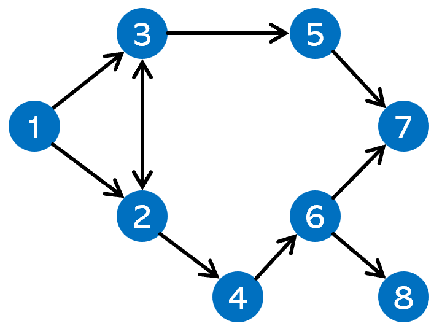
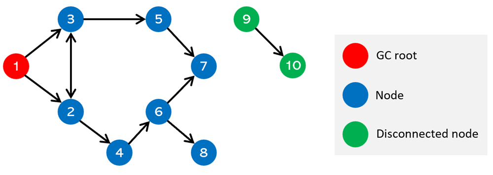
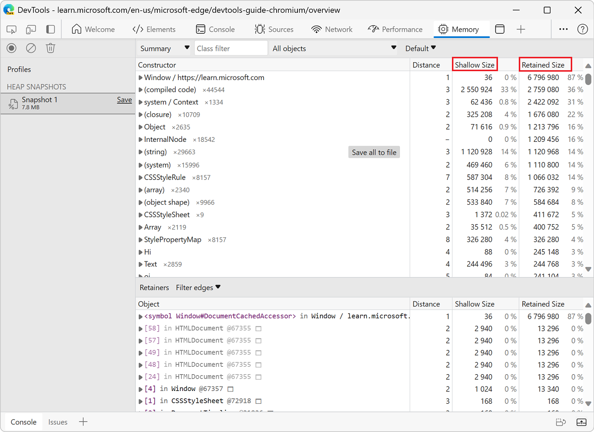

<!-- Copyright Meggin Kearney

   Licensed under the Apache License, Version 2.0 (the "License");
   you may not use this file except in compliance with the License.
   You may obtain a copy of the License at

       https://www.apache.org/licenses/LICENSE-2.0

   Unless required by applicable law or agreed to in writing, software
   distributed under the License is distributed on an "AS IS" BASIS,
   WITHOUT WARRANTIES OR CONDITIONS OF ANY KIND, either express or implied.
   See the License for the specific language governing permissions and
   limitations under the License. -->
# Memory terminology

The following terms are used in the **Memory** tool, which is for investigating memory issues.  These memory terms are applicable to memory analysis in general, as well as memory profiling tools for languages such as Java or .NET.

To learn more about using the **Memory** tool, see [Record heap snapshots using the Memory tool](./heap-snapshots.md).

<!-- ====================================================================== -->
## The memory graph

Think of the memory that's used by a webpage as a graph: a structure that contains _nodes_ that are connected together by _edges_:

The nodes in the memory graph represent the objects used by the page, including primitive types such as JavaScript numbers or strings, and objects such as associative arrays. Nodes and edges in the memory graph are given the following labels:

*  _Nodes_ (or _objects_) are labelled using the name of the _constructor_ function that was used to build them.

*  _Edges_ are labelled using the names of _properties_.

A node in the graph can hold memory in two ways:

*  Directly; the memory is held by the object itself.

*  Implicitly, by holding references to other objects. An object that's holding references to other objects prevents those objects from being automatically disposed of by garbage collection (GC).

<!-- ====================================================================== -->
## JavaScript heap and renderer memory

The JavaScript heap is a memory region in the browser process where all the JavaScript and WebAssembly objects live. The JavaScript heap is also called the _V8 memory_ (after the V8 JavaScript engine that powers Microsoft Edge).

The JavaScript heap is part of the renderer memory. The renderer memory is the memory used by the browser process where the webpage is rendered. The renderer memory is comprised of the following:

* Native memory, such as the memory that's used by C++ objects that represent the DOM nodes.
* JavaScript heap memory of the page.
* JavaScript heap memory of all dedicated workers that are started by the page.

The **Memory** tool shows both:
* The V8 memory.
* The objects allocated in the native memory that are relevant to the rendered webpage.

<!-- ====================================================================== -->
## Garbage-collection roots

_Garbage-collection roots_ (_GC roots_) are created by the browser when a reference is made from the browser's native code to a JavaScript object that's outside of the V8 virtual machine. These references are called _handles_.

There are many internal GC roots, most of which aren't interesting for web developers. From the webpage's standpoint, the following types of GC roots exist:

*  Window global objects (one in each iframe).

*  Sometimes objects are retained by the debugging context that's set by the **Sources** or the **Console** tool, such as when evaluating a JavaScript expression in the **Console** tool. To remove these objects from the **Memory** tool, before recording a heap snapshot, clear the **Console** tool and deactivate breakpoints in the **Sources** tool.

The memory graph starts with a GC root, which may be the `window` object of the browser or the `Global` object of a Node.js module. You don't control how the root object is garbage-collected:

Nodes that aren't reachable from the root can get garbage-collected.

<!-- ====================================================================== -->
## Object sizes and distances

When working with the **Memory** tool, you will likely find yourself looking at the following columns of information:

* **Distance**
* **Shallow Size**
* **Retained Size**

The numbers in the **Shallow Size** and **Retained Size** columns are the number of bytes.

<!-- ------------------------------ -->
#### Distance

The _distance_ of an object in the JavaScript heap is the number of nodes on the shortest path between the object and the GC root. The shorter the distance, the more likely it is that this object plays an important role in the memory usage of the webpage.

<!-- ------------------------------ -->
#### Shallow size

The _shallow size_ is the size of the JavaScript heap that's _directly_ held by an object. The shallow size of an object is usually small, because a JavaScript object often only stores its description of the object, not the values, in the object's directly held memory. Most JavaScript objects store their values in a _backing store_ that's elsewhere in the JavaScript heap, and only expose a small wrapper object on the portion of the JavaScript heap that's directly owned by the object.

Starting with Microsoft Edge 123, the **Memory** tool can be configured to report the total memory size of objects instead of only the memory size they directly hold. To learn more, see [Configure the Shallow Size column to include an entire object's size](./heap-snapshots.md#configure-the-shallow-size-column-to-include-an-entire-objects-size) in _Record heap snapshots using the Memory tool_.

Nevertheless, even a small object can hold a large amount of memory _indirectly_, by preventing other objects from being disposed of by the garbage collection process.

<!-- ------------------------------ -->
#### Retained size

The _retained size_ is the size of the memory that's implicitly held by an object and that could be freed once the object and other existing retainers are deleted along with all the dependent objects that were made unreachable from GC roots.

That is, the retained size of an object is the amount of memory that would be regained if the object and all of its dependent objects were removed from the memory graph.

The retained size can't be smaller than the shallow size.

When an object is retained by multiple nodes, the object's size appears in the retained size of the retainer node that has the shortest path to the GC root.

<!-- ====================================================================== -->
## Retainers

An object's _retainers_ are the other objects that hold references to the object. The **Retainers** section of the **Memory** tool shows the objects that hold references to the object selected in the **Summary** view.

The **Retainers** section of the **Memory** tool is sorted by distance by default, which means that the simplest retaining paths for an object are shown first.

Any object with no retainers can be discarded by the browser's garbage collector, which reduces memory usage.

<!-- ====================================================================== -->
## V8 specifics

When profiling memory, it's helpful to understand why heap snapshots look a certain way. This section describes how some objects are stored in memory by the _V8 JavaScript virtual machine_ (abbreviated here as _V8 VM_, or just _VM_), which can help you when analyzing heap snapshots in the **Memory** tool.

<!-- ------------------------------ -->
#### JavaScript primitives

In JavaScript, there are several primitive types, such as:

*  Numbers (such as `3.14159`).
*  Booleans (`true` or `false`).
*  Strings (such as `"Werner Heisenberg"`).

Primitives cannot reference other values, and are always leaf nodes (also called _terminating nodes_) in the memory graph.

**Numbers** can be stored as either:

*  Immediate 31-bit integer values that are called **small integers** (_SMIs_).

*  Heap objects, which are referred to as _heap numbers_. Heap numbers are used for storing values that don't fit into the small-integer (SMI) form, such as values of type `double`, or when a value needs to be boxed, such as setting properties on it.

**Strings** can be stored in either:

*  The **VM heap**.

*  Externally in the **renderer's memory**. A _wrapper object_ is created and used for accessing external storage where, for example, script sources and other content that's received from the Web is stored, rather than copied onto the VM heap.

<!-- ------------------------------ -->
#### JavaScript objects

Memory for new JavaScript objects is allocated from a dedicated JavaScript heap (or _VM heap_). These objects are managed by V8 VM's garbage collector, and therefore, these objects stay alive as long as there is at least one reference to them.

<!-- ------------------------------ -->
#### Other objects

* **Native objects**: Anything that's not stored in the JavaScript heap is called a _native object_. A native object, in contrast to a heap object, isn't managed by the V8 garbage collector throughout its lifetime, and can only be accessed from JavaScript by using its JavaScript wrapper object.

* **Concatenated strings**: Strings that are stored and then joined together, as a result of a string concatenation in JavaScript, are stored as _concatenated strings_ in V8. The joining of the string contents occurs only as needed, such as when a substring of a joined string needs to be constructed.

  For example, if you concatenate `a` and `b`, you get a concatenated string `(a, b)` which represents the result of concatenation. If you later concatenate `c` with that result, you get another concatenated string: `((a, b), c)`.

* **Arrays**: An _array_ is an object that has numeric keys. Arrays are used extensively in the V8 VM for storing large amounts of data. Sets of key-value pairs that are used like dictionaries are implemented as arrays.

  A typical JavaScript object is stored as only one of two array types:
  
  * An array for storing named properties.
  * An array for storing numeric elements.

  When there are a small number of properties, the properties are stored internally in the JavaScript object.

* **system / Map**: an object that describes both the kind of object it is and the layout. For example, **system / Map** objects are used to describe implicit object hierarchies for fast property access. See [Fast properties in V8](https://v8.dev/blog/fast-properties).

<!-- ====================================================================== -->
> [!NOTE]
> Portions of this page are modifications based on work created and [shared by Google](https://developers.google.com/terms/site-policies) and used according to terms described in the [Creative Commons Attribution 4.0 International License](https://creativecommons.org/licenses/by/4.0).
> The original page is found [here](https://developer.chrome.com/docs/devtools/memory-problems/get-started) and is authored by [Meggin Kearney](https://developers.google.com/web/resources/contributors#meggin-kearney) (Technical Writer).

This work is licensed under a [Creative Commons Attribution 4.0 International License](https://creativecommons.org/licenses/by/4.0).
