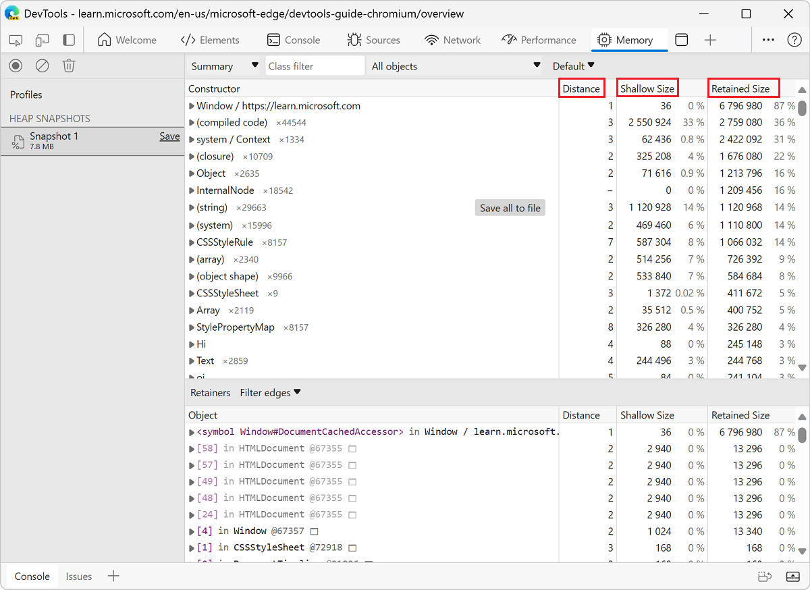

<!-- Copyright Meggin Kearney

   Licensed under the Apache License, Version 2.0 (the "License");
   you may not use this file except in compliance with the License.
   You may obtain a copy of the License at

       https://www.apache.org/licenses/LICENSE-2.0

   Unless required by applicable law or agreed to in writing, software
   distributed under the License is distributed on an "AS IS" BASIS,
   WITHOUT WARRANTIES OR CONDITIONS OF ANY KIND, either express or implied.
   See the License for the specific language governing permissions and
   limitations under the License. -->
# Memory terminology

This article describes common terms used in the **Memory** tool, a tool for investigating memory issues, but is applicable to memory analysis in general and to various memory profiling tools for different languages. If you've worked with memory profilers for languages such as Java or .NET, this article may be a refresher.

To learn more about using the **Memory** tool, see [Record heap snapshots using the Memory tool](./heap-snapshots.md).

<!-- ====================================================================== -->
## The memory graph

Think of the memory used by a webpage as a graph: a structure that contains nodes that are connected together by edges. The nodes in the memory graph represent the objects used by the page, such as primitive types like JavaScript numbers or strings, or objects like associative arrays.

Nodes and edges in the memory graph are given the following labels:

*  _Nodes_ (or _objects_) are labelled using the name of the _constructor_ function that was used to build them.

*  _Edges_ are labelled using the names of _properties_.

A node in the graph can hold memory in two ways:

*  Directly; the memory is held by the object itself.

*  Implicitly, by holding references to other objects. An object holding references to other objects prevents those objects from being automatically disposed by a garbage collector (GC).

<!-- ====================================================================== -->
## JavaScript heap and renderer memory

The JavaScript heap is a memory region in the browser process where all the JavaScript objects live. The JavaScript heap is what the **Memory** tool displays when you take a heap snapshot. The JavaScript heap is also called the _V8 heap_ (after the V8 JavaScript engine that powers Microsoft Edge).

The JavaScript heap is part of the renderer memory. The renderer memory is the memory used by the browser process where the webpage is rendered. The renderer memory is comprised of the following:

* Native memory (such as the one used by the C++ objects that represent the DOM nodes).
* JavaScript heap memory of the page.
* JavaScript heap memory of all dedicated workers started by the page.

<!-- ====================================================================== -->
## Garbage-collection roots

_Garbage-collection roots_, or GC roots, are created by the browser when a reference from the browser's native code to a JavaScript object outside of the V8 virtual machine is made. These references are called _handles_. You can find these handles in the **Memory** tool under **GC roots** > **Handle scope** and **GC roots** > **Global handles**.<!-- Can't find this in the Memory tool. Where is it? -->

There are many internal GC roots, most of which aren't interesting for web developers. From the webpage's standpoint, the following types of GC roots exist:

*  Window global object (in each iframe). In a heap snapshot displayed in the **Memory** tool, the `distance` field for a window global object indicates the number of property references that on the shortest retaining path from the window.<!-- If this is useful, this needs clarification: what window? The top-level one? Does retaining path mean the path through the graph from the iframe window to the top-level window? -->

*  The document DOM tree, consisting of all native DOM nodes that are reachable by traversing the document. Not all of the nodes have JavaScript wrappers, but if a node has a wrapper, the node is alive while the document is alive.

*  Sometimes objects are retained by the debugging context set by the **Sources** or the **Console** tool, for example when evaluating a JavaScript expression in the **Console** tool. To remove these objects from the **Memory** tool, clear the **Console** tool and deactivate breakpoints in the **Sources** tool before recording a heap snapshot.

The memory graph starts with a GC root, which may be the `window` object of the browser or the `Global` object of a Node.js module. You don't control how the root object is garbage-collected.

Nodes that aren't reachable from the root can get garbage-collected.

<!-- ====================================================================== -->
## Object sizes and distances

When working with the **Memory** tool, you will likely find yourself looking at the following columns of information:

* **Shallow Size**
* **Retained Size**
* **Distance**

The numbers that are shown in the **Shallow size** and **Retained size** columns are the number of bytes.

<!-- ------------------------------ -->
#### Shallow size

The _shallow size_ is the size of the memory that is held by the object directly.

The shallow size of an object is usually small because JavaScript objects often just store their own descriptions only in memory. Arrays and strings are exceptions to this and can have a significant shallow size. Most JavaScript objects store their values elsewhere in the renderer memory, and only expose a small wrapper object on the JavaScript heap.

Nevertheless, even a small object can hold a large amount of memory indirectly, by preventing other objects from being disposed of by the automatic garbage collection process.

<!-- ------------------------------ -->
#### Retained size

The _retained size_ is the size of memory that is implicitly held by an object and that is freed once the object is deleted along with all the dependent objects that were made unreachable from GC roots.

Said another way, the retained size of an object is the amount of memory that would be regained if the object and all of its dependent objects were removed from the memory graph.

The retained size can't be smaller than the shallow size.

<!-- ------------------------------ -->
#### Distance

The _distance_ of an object in the JavaScript heap is the number of nodes on the shortest path between the object and the GC root. The shorter the distance, the more likely it is that this object plays an important role in the memory usage of the webpage.

If almost all the objects of the same type are at the same distance, and a few are at a bigger distance, that's something worth investigating.<!-- WHY? -->

<!-- ====================================================================== -->
## Retainers

An object's retainers are the others objects that hold references to it. The **Retainers** section of the **Memory** tool shows the objects that hold references to the selected object. Any object with no retainers can be discarded by the browser’s garbage collector, which reduces memory usage.

<!-- ====================================================================== -->
## V8 specifics

When profiling memory, it is helpful to understand why heap snapshots look a certain way. This section describes some memory-related topics specifically corresponding to the _V8 JavaScript virtual machine_ (abbreviated here as _V8 VM_, or just _VM_).

<!-- ------------------------------ -->
#### JavaScript object representation

In JavaScript, there are three primitive types:

*  Numbers (such as `3.14159...`).
*  Booleans (`true` or `false`).
*  Strings (such as `"Werner Heisenberg"`).

Primitives cannot reference other values, and are always leaf nodes in the memory graph (also called _terminating nodes_).

**Numbers** can be stored as either:

*  Immediate 31-bit integer values that are called **small integers** (_SMIs_).

*  Heap objects, referred to as **heap numbers**. Heap numbers are used for storing values that don't fit into the SMI form, such as **doubles**, or when a value needs to be **boxed**, such as setting properties on it.

**Strings** can be stored in either:

*  The **VM heap**.

*  Externally in the **renderer's memory**. A _wrapper object_ is created and used for accessing external storage where, for example, script sources and other content that is received from the Web is stored, rather than copied onto the VM heap.

Memory for new JavaScript objects is allocated from a dedicated JavaScript heap (or _VM heap_). These objects are managed by V8 VM's garbage collector, and therefore, these objects stay alive as long as there is at least one strong reference<!-- undefined term --> to them.

**Native objects** - Anything not in the JavaScript heap is called a _native object_. A native object, in contrast to a heap object, isn't managed by the V8 garbage collector throughout its lifetime, and can only be accessed from JavaScript by using its JavaScript wrapper object.

A **cons string** (concatenation string) is an object that consists of pairs of strings that are stored and then joined, and is a result of concatenation. The joining of the **cons string** contents occurs only as needed. For example, when a substring of a joined string needs to be constructed.

For example, if you concatenate `a` and `b`, you get a string `(a, b)` which represents the result of concatenation, and is a cons string. If you later concatenated `d` with that result, you get another cons string: `((a, b, d)`.

**Arrays** - An _array_ is an object that has numeric keys. Arrays are used extensively in the V8 VM for storing large amounts of data. Sets of key-value pairs that are used like dictionaries are implemented as **arrays**.

A typical JavaScript object is stored as only one of two **array** types:

A typical JavaScript object can be one of two array types:

* An array for storing named properties.
* An array for storing numeric elements.

When there are a small number of properties, the properties are stored internally in the JavaScript object.

**Map** is an object that describes both the kind of object it is and the layout. For example, maps are used to describe implicit object hierarchies for [fast property access](https://v8.dev/blog/fast-properties).

<!-- ------------------------------ -->
#### Object groups
<!-- This doesn't seem very actionable to users. We describe groups, but don't say where they appear in the tool and what's interesting about them. We then talk about native objects, seemingly out of the blue. -->
Each _native object group_ is made up of objects that hold mutual references to each other. Consider, for example, a DOM subtree where every node has a link to the relative parent and links to the next child and next sibling, thus forming a connected graph.

Note that native objects aren't represented in the JavaScript heap. The lack of representation is why native objects have zero size. Instead, wrapper objects are created.

Each wrapper object holds a reference to the corresponding native object, for redirecting commands to it. In turn, an object group holds wrapper objects. This doesn't create an uncollectable cycle, because garbage collection is smart enough to release object groups whose wrappers are no longer referenced. But forgetting to release a single wrapper will hold references to the whole group and to any associated wrappers.

<!-- ====================================================================== -->
## Cycles
<!-- This needs a concrete example, not sure what earlier and later mean. And why is removing the earlier instance important? -->
_Cycles_ are nodes that appear at least twice in a retainer path.
One appearance of a node is earlier in the retainer path, and other appearances of that node are later in the retainer path.

To free up memory, it's most important to remove the occurrence of the node which appears first in the retainer path.
The second and potentially subsequent appearances of the node are still displayed in the **Retainers** section.

<!-- ------------------------------ -->
#### Using filters to hide cycles

Cycles are displayed in the **Retainers** section of a heap snapshot. To help simplify the retainer path, the **Retainers** section in the **Memory** tool has filters to hide cycles.

In the **Retainers** section, a cycled node is indicated by being grayed out.

In the following image, in the **Filter edges** dropdown menu, **Hide cycled** is not selected, so a cycled node (grayed out) is displayed:

In the **Filter edges** dropdown menu, **Hide cycled** is selected, so the cycled node is not displayed:

<!-- ------------------------------ -->
#### Using filters to hide internal nodes

To filter out the display of internal nodes so that they aren't displayed in the **Retainers** section, in the **Filter edges** dropdown menu, select **Hide internal**.

_Internal nodes_ are objects that are specific to V8 (the JavaScript engine in Microsoft Edge).

<!-- ====================================================================== -->
> [!NOTE]
> Portions of this page are modifications based on work created and [shared by Google](https://developers.google.com/terms/site-policies) and used according to terms described in the [Creative Commons Attribution 4.0 International License](https://creativecommons.org/licenses/by/4.0).
> The original page is found [here](https://developer.chrome.com/docs/devtools/memory-problems/memory-101/) and is authored by [Meggin Kearney](https://developers.google.com/web/resources/contributors#meggin-kearney) (Technical Writer).

This work is licensed under a [Creative Commons Attribution 4.0 International License](https://creativecommons.org/licenses/by/4.0).
